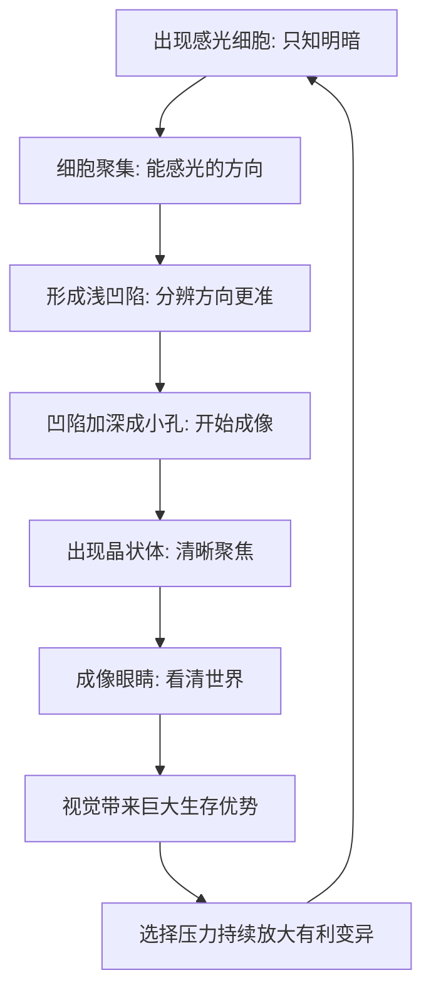

# 10｜眼睛是怎么被“发明”出来的？

> 如此精密的器官，怎么可能“自然形成”？

---

## 一、先说结论

莱恩认为，眼睛是“看似的设计”最经典的例子。

它精密得像一台被工程师反复调校过的光学仪器，却没有设计者。从一颗只能感知明暗的感光细胞开始，经过一系列微小、每一步都有用的中间形态，最终形成了能成像的复杂眼睛。更关键的是：这条路径并非只走了一次——眼睛在不同谱系中独立演化过很多次。

莱恩据此主张：只要选择压力足够稳定，再复杂的感知系统也可以被一步一步累积出来。

---

## 二、我们先理解一个问题

先看一个直观的困难。

眼睛要成像，需要角膜、晶状体、虹膜、视网膜、视神经……任何一个零件单独拿出来，都很难说“有用”，可它们凑在一起才能看清世界。于是问题来了：

> 如果复杂器官只有整体才有用，那么它的“中间形态”是怎么活下来的？

这正是当年达尔文自己都承认的难题。他在《物种起源》里坦承，想到眼睛就“不寒而栗”，但他随即指出：只要我们能找到从简单到复杂的一连串中间形态，而且每一步都对拥有者有点好处，这个难题就能被化解。

莱恩所做的，正是把这条“一连串中间形态”讲清楚。

---

## 三、作者到底提出了什么观点？

莱恩的核心主张有两条。

第一，眼睛不是一次成型的奇迹，而是一条渐进路径的终点。从一片能感光的细胞，到能分辨方向的凹陷，再到能聚焦的晶状体，每一步都只比上一步多一点点能力，而每一点点能力都带来生存好处——哪怕只是早一点发现阴影里的捕食者。

第二，眼睛在多个谱系中独立演化过很多次。莱恩强调，这不是同一套设计被继承下来，而是在亲缘关系很远的类群里，各自沿着相似的路径，独立地“长”出了眼睛。这种重复性说明：眼睛并不是极小概率的偶然，而是在稳定选择压力下可以预期的产物。

这里要区分：具体演化步序是科学事实的描述，而“重复出现证明它可预期”则是莱恩赋予这一事实的解释。

---

## 四、把这个观点翻译成人话

把眼睛想象成一款从“古董”一路升级到“旗舰”的设备。

最初，它只是一张能感觉“有光还是没光”的膜——相当于一个光敏开关，只能判断天有没有亮。升级一步，细胞聚成一小片凹陷，能大致分辨光从哪个方向来——这就足够让动物躲开身后的影子。再升级，凹陷加深成小孔，成像开始有了轮廓。再加一层透明组织（晶状体），像给针孔相机装上镜头，画面才清晰起来。

没有任何一步是“先造好整台相机再开机”的。每一步都单独可用、单独能提高存活率，于是被保留；下一步变异叠加上来，再被保留。眼睛的“设计感”，来自这套层层筛选的累积，而不是来自某个设计师。

---

## 五、为什么会这样？

为什么渐进路径能走通，而且被反复走通？

关键在于这条链上的每一环都“自足”：A 有用，A 变成 B 也有用，而不是要等到 F 才第一次有用。正是这种“每一步都划算”，让自然选择有了可以累积的台阶。

而 G → H 这一环解释了重复性：当“看得更清楚”能直接换来捕食、避敌、求偶上的优势时，环境就会持续把种群往这个方向推。于是不同谱系在相似压力下，反复走到相似的终点——这正是莱恩所说、眼睛在不同类群中独立出现的理由。

---

## 六、举一个现实生活中的例子

就用“从感到光，到看清世界”这条路径本身。

设想两类生活在同一片水域的动物。一类只有一层感光细胞，只能判断上面亮、下面暗；另一类的细胞聚成了凹陷，能判断“光是从左边来还是右边来”。当捕食者从一侧逼近时，前者只能整体躲藏，后者却能朝相反方向逃走，多出一线生机。

再看另一片大陆上、亲缘关系很远的一支类群：它们并没有继承前者的眼睛，却同样从感光斑块开始，同样走向凹陷、小孔、晶状体。两边互不通气，却走到了相似的结构。莱恩用这种“异曲同工”的现象说明：眼睛不是某一次的侥幸，而是选择压力下反复出现的答案。

这里需要注意：独立演化意味着起点和路径各自独立，只是结果相似，并不代表它们共用同一套“图纸”。

---

## 七、回到书中重新理解

回到莱恩的整本书，眼睛的意义就清楚了。

它不是一节孤立的“视觉器官介绍”，而是“看似的设计”这个主题最有力的证据。前面讲过进化没有设计师，可“没有设计师”听上去还是很抽象；眼睛则给出一个具体到可以一步步拆解的案例：一个看起来非设计不可的精密结构，原来真的可以被无设计的过程累积出来。

所以莱恩讲眼睛，真正要回答的是那个更大的问题：**复杂，究竟是怎么在没有人规划的情况下冒出来的？** 眼睛是他的答案，也是他论证的样板。

---

## 八、这个观点背后还有什么？

第一，它把“精密”与“被设计”彻底解绑。精密不等于有设计者，只等于经历了足够长、足够稳定的筛选。

第二，它揭示了“趋同”的力量。不同谱系独立走到相似结构，说明环境与物理规律对“什么有用”有相当强的约束——这种约束会让演化反复收敛到相似的答案。

第三，它说明了视觉为什么是生命史的关键跃升。视觉把感知从化学信号的近距接触，扩展成远距离、大范围的信息获取，直接改写了捕食与避敌的规则。

第四，它把“累积”这个词具体化了。自然选择并不需要一次造出整只眼睛，它只需要在每一个当下，把稍微好一点点的那一个留下来。

---

## 九、这个观点有问题吗？

有，主要集中在“渐进路径”的可验证程度与叙事方式上。

第一，这条路径是否就是真实发生过的那一条，学界仍有讨论。保存下来的中间形态化石有限，很多环节是靠现存类群的比较来推断的，而不是直接观测到的历史。

第二，不同谱系的眼睛里，并非所有结构都同源。有的类群走的是单眼路径，有的是复眼，细节差别很大。所以“独立演化出眼睛”这个结论，在“功能趋同”上很扎实，在“路径细节一致”上则需要小心——它们相似，但不等同。

第三，渐进叙事容易被讲成一条“必然通向清晰视觉”的直线，这可能让人误以为演化有目标。莱恩本人反对目的论，但“眼睛一路升级”的讲法，确实容易给人这种感觉。

关于这一问题，学界存在不同解释：有人更强调选择压力的稳定累积，有人更强调关键调控基因的复用与偶然性。但就“复杂眼睛可以在无设计者的情况下逐步形成、并多次独立出现”这一点，证据是相当充分的。

---

## 十、今天再看这个观点

以下部分是眼睛演化研究的现代延伸，不是莱恩的原话。

今天的发育生物学与基因组学，让莱恩式的论证变得更具体了。研究发现，从果蝇到小鼠再到人，控制眼睛发育的某些核心调控基因高度相似——把其中关键的“开关基因”放到本来不长眼的部位，甚至能诱导出异位的感光结构。

这给“趋同”提供了一个分子层面的注脚：不同谱系未必共用同一只眼睛的图纸，却常常复用同一套“造眼”的开关。这让“独立演化却相似”不再只是形态学上的印象，而有了机制上的线索。

当然，这不等于说所有眼睛都源自同一个祖先结构。它更像是：演化在不同的起点上，反复调用了同一些古老的分子工具。

---

## 十一、这一篇真正应该记住什么？

1. **眼睛是“看似的设计”最经典的例子**：精密得像被设计，却没有设计者。
2. **关键在于渐进路径上的每一步都有用**，而不是要等到整体成型才第一次有用。
3. **眼睛在不同谱系中独立演化过很多次**，这种重复说明它并非极小概率的侥幸。
4. **趋同意味着选择压力与物理规律对“什么有用”有强约束。**
5. **“独立出现”不等于“完全相同”**，相似与同源要分开理解。

---

## 十二、留一个问题

> 如果一个器官的精密程度，已经不再需要设计者来解释，
> 那么我们对“设计”的直觉，
> 究竟是在描述这个世界，
> 还是只是在描述我们自己造物的经验？

---

**下一篇**：眼睛让动物看得更远，可看清世界之后，还有一个更耗能的问题——为什么恒温动物宁可烧掉大量能量来维持体温，也不愿随环境起伏？温血凭什么成为关键的跃升？

下一篇我们就来拆开这个问题——**温血为什么是关键的跃升？**
