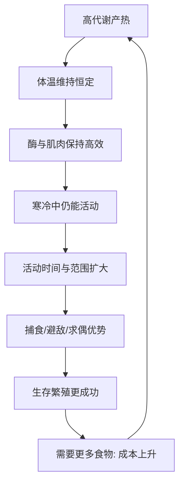

# 11｜温血为什么是关键的跃升？

> 恒温耗能巨大，为什么反而带来了巨大优势？

---

## 一、先说结论

莱恩认为，温血是生命史上一次代价高昂、却回报巨大的跃升。

恒温动物必须不断“烧”能量来维持体温，这意味着要大量进食、承受更高的饥饿风险。但换来的是：无论外界冷暖，身体内部始终维持在一个适合高效运转的温度。鸟类与哺乳类的成功，与这次跃升密切相关——它们因此能在寒冷中保持活跃、扩大活动范围，在夜间与高纬度地区也能立足。

---

## 二、我们先理解一个问题

先看一个矛盾。

能量对生命极其宝贵，按理说，生物应该尽量省着用。可怎么会有动物主动把能量当作燃料烧掉，只为维持一个恒定的体温？更奇怪的是，这种“奢侈”的动物——鸟类和哺乳类——恰恰是今天地球上活动能力最强、分布最广的类群之一。

于是问题来了：

> 一项看起来如此浪费的能力，为什么会被演化保留下来，甚至成为关键优势？

---

## 三、作者到底提出了什么观点？

莱恩的核心主张是：温血不是为了“舒服”，而是为了“随时都能干活”。

第一，恒温让身体的生化反应维持在接近最优的温度区间。酶与肌肉的效率对温度敏感，温度一降，反应就慢、力量就弱。恒温动物把内部温度稳定住，等于给所有生理过程提供了一个“恒温车间”。

第二，稳定的体温换来了稳定的活动能力。变温动物在寒冷时往往行动迟缓、只能蛰伏；恒温动物却能在清晨、夜间、寒冬照常捕食和逃跑。活动时间与活动范围被显著扩大，这在生态竞争中往往是决定性的。

第三，代价是真实且巨大的。维持体温要靠高代谢率，就要大量进食、频繁觅食，一旦食物短缺就面临高风险。莱恩的意思是：这是一笔高成本、高回报的交易——回报高到足以让演化反复选择它。

---

## 四、把这个观点翻译成人话

把身体想象成一台必须恒温才能满负荷运转的机器。

温度合适时，它运转顺畅；温度一低，各部分都拖着走，反应变慢、力量变弱。变温动物就像一台随环境温度起伏的机器：天暖时性能不错，天冷时几乎停摆。恒温动物则自带“暖气和空调”，不论外部多冷多热，内部始终维持在工作温度。

好处显而易见：它可以“开机即用”。坏处也同样显而易见：维持这套系统得一直烧燃料。所以恒温动物必须像一台耗油量很大的机器那样，持续补充能量——这就是它们为什么总在吃、总得吃。

---

## 五、为什么会这样？

为什么“烧能量换恒温”这笔生意能做得成？

关键在 B → F 这一环：恒温不是目的，它只是手段。真正被选择放大的，是“随时能动”所带来的生存优势。

而 H → A 这一环揭示了它的脆弱：这条回路一旦断粮，代价立刻显现。所以温血动物往往需要更发达的觅食能力、更精细的能量管理，甚至用冬眠或迁徙来平衡收支。莱恩想说的是：跃升从不免费，它只是把成本换到了另一个地方去支付。

---

## 六、举一个现实生活中的例子

就用鸟类和哺乳类自己来说。

先看羽毛与毛发。它们本身并不产热，却能显著减少热量散失——相当于给恒温这套系统套上保温层。有了保温层，同样的代谢投入就能维持更稳定的体温，羽毛在鸟类、毛发在哺乳类中各自扮演着这个角色。

再看高代谢与大量进食。恒温动物普遍吃得比同体型的变温动物多得多，因为相当一部分能量被用于产热，而非生长。小型鸟类尤其明显，它们一天要吃下与体重相当可观比例的食物，才扛得过寒冷的夜晚；饥荒对它们的威胁也格外直接。

莱恩用这一组事实说明：鸟类与哺乳类之所以能在夜间、寒冬、高纬度生存并繁盛，正是这套“高耗能 + 高活动力”的组合在起作用。代价是真的，优势也是真的。

---

## 七、回到书中重新理解

回到莱恩对整条演化线的叙述，温血的位置就清楚了。

它紧接在运动与视觉之后：先有了主动行动的能力，再有了远距离感知的能力，接下来要解决的问题是——能不能不挑时间、不挑地点地行动？温血正是对这个问题的回答。它把动物从“看天吃饭”的活动模式里部分解放了出来。

所以莱恩讲温血，不只是讲一种生理特性，而是在讲一次“能量投入”如何换来了“生态位扩张”。这仍然是全书那条主线：更高效地获取与使用能量，会打开新的可能性。

---

## 八、这个观点背后还有什么？

第一，它把“恒温”理解成一笔经济账，而不是一种天然的优点。收益是活动自由，代价是食物需求，二者必须一起看。

第二，它让人注意到：稳定的高代谢与稳定的活动能力，也为复杂行为提供了条件（这是一种相关性的观察，而不是简单的因果定论）。

第三，它说明了生态位与能量策略的绑定。夜间、寒冷、高纬度这些对变温动物近乎禁区的时段与地带，对恒温动物却是可以开发的资源。

第四，它再次印证了“跃升”的共同结构：任何一项能力提升，背后都有一笔必须支付的账单。

---

## 九、这个观点有问题吗？

有，主要在“温血 = 优势”这种简化说法上。

第一，“温血”与“冷血”不是非黑即白。现实中存在大量中间状态：有的动物能阶段性产热，有的靠行为调节体温，有的在特定器官局部升温。把它分成两类，是便于讲述的简化。

第二，恒温的收益并非在所有环境下都成立。在食物稀少的环境中，高代谢反而可能是致命的负担；一些恒温动物因此演化出冬眠等降低支出的策略。优势是“有条件的”，不是普适的。

第三，具体是哪些选择压力推动了恒温的起源，学界仍有争论。是夜间活动，是耐力捕食，是体温对酶效率的要求，还是别的因素，研究者给出的解释并不一致。

关于这一问题，学界存在不同解释：有人更强调恒温带来的活动自由与生态扩张，有人更强调它在维持生理效率与抗病方面的作用。莱恩的叙述偏向“活动能力与生态优势”这条线，但它并非唯一答案。

---

## 十、今天再看这个观点

以下部分是能量代谢与生理生态学的现代延伸，不是莱恩的原话。

今天我们对“高代谢”有了更细的认识。研究者可以用间接测热等方法估算动物的能量消耗，比较不同类群在静止与活动状态下的产出与损耗。越来越多的证据显示，恒温动物在单位时间内的能量投入，确实远高于体型相近的变温动物。

同时，鸟类与哺乳类在恒温策略上也有明显差别：有的体温更高、波动更小，有的会季节性下调。恒温不是单一方案，而是一族各自权衡的方案。这恰好延续了莱恩的视角：跃升不是终点，而是一组需要不断维持的平衡。

---

## 十一、这一篇真正应该记住什么？

1. **恒温的核心收益是稳定的活动能力**，而不是“更暖和”。
2. **代价真实且巨大**：高代谢意味着大量进食与更高的饥饿风险。
3. **恒温把动物从时间与气候的限制中部分解放出来**，扩大了生态位。
4. **鸟类与哺乳类的成功，与这套高耗能、高活动力的组合密切相关。**
5. **温血不是普适优势**，它在食物匮乏时也可能成为负担。

---

## 十二、留一个问题

> 如果每一次跃升，都是“用一笔更大的开销，换取一种更大的自由”，
> 那么在你自己的选择里——
> 你愿意为哪一种自由，
> 持续支付那份账单？

---

**下一篇**：温血让动物获得了稳定而强大的行动能力。可行动、感知、生存之外，还有一个问题整个科学至今没能回答：我们为什么会有“感觉”？大脑里的一堆神经元，是怎么变成主观体验的？

下一篇我们就来拆开这个问题——**意识是怎么产生的？**
