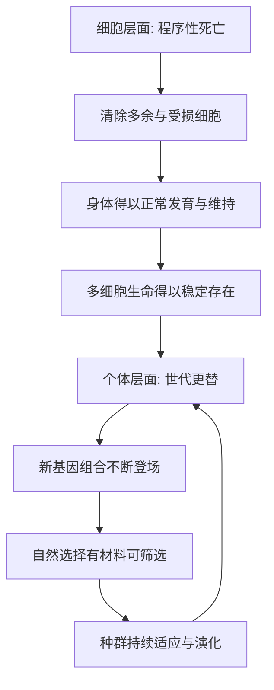

# 13｜死亡：为什么进化“需要”死亡？

> 死亡看起来是失败，为什么它可能是进化的必要条件？

---

## 一、先说结论

我们习惯把死亡看作生命的对立面：活着就是一切，死亡就是彻底的失败。但莱恩给出了一个相反的看法：**死亡并不是生命系统之外的敌人，它很可能就写在生命系统内部。**

他认为，死亡至少有两个层次。第一个层次是细胞层面的“程序性死亡”——细胞会在特定时刻主动启动自我毁灭程序，这被称为细胞凋亡。它不是意外，而是发育与维持身体的关键机制。第二个层次是个体的死亡：正因为个体有生有死，世代才能更替，而世代更替正是演化得以发生的基本条件。

换句话说：**没有细胞层面的死亡，身体根本长不起来、也维持不住；没有个体层面的死亡，演化几乎无法想象。**

---

## 二、我们先理解一个问题

先抛开“怕死”的情绪，问一个冷静的问题。

如果活得更久、复制得更多，通常对生存有利，那么为什么多细胞生命没有演化出“永生不死”的身体？为什么我们的细胞会被预设好“到期自毁”的程序？

更奇怪的是：**有些细胞的死亡，对整体竟然是好事。** 一个正在发育的胚胎，需要去掉一些细胞，才能长出正常的手指、形成正常的器官。这说明死亡不是“系统崩溃”，而是系统**主动执行**的操作。

于是就产生了本文要回答的问题：

> 死亡既然削减个体，为什么反而可能被进化“需要”？

---

## 三、作者到底提出了什么观点？

莱恩的观点可以概括为一句：**死亡是生命的一种功能，而不只是它的终结。**

具体有两层。

第一层，是细胞凋亡。莱恩认为，多细胞身体能维持秩序，靠的不仅是细胞生长，还有细胞死亡。多余的、受损的、位置不对的细胞，会被主动清除。这是身体自我组织的一部分。研究表明，细胞凋亡在发育、组织更新和清除异常细胞中普遍存在，是一种被基因精密调控的过程，而不是被动的耗损。

第二层，是个体的死亡。莱恩强调，演化依赖世代更替。只有老个体退出、新个体带着新的基因组合登场，自然选择才有材料可筛选。若个体永生且几乎不变，演化就失去了“更新”的通道。

因此，死亡在这里不是反生命的，而是**让生命能够持续变化的机制**。关于死亡究竟是“被选择出来的适应”还是“机制运转的副产品”，学界存在不同解释；但“死亡对演化不可或缺”这一点，是莱恩反复强调的。

---

## 四、把这个观点翻译成人话

把身体想象成一座一直在运转的城市。

城市里每天都在拆旧楼、清废墟、更新道路——不是为了破坏，而是为了让城市继续正常生活。如果只建不拆，城市很快就会堵死、塌掉。细胞的程序性死亡，就是身体里的“有序拆除”：该消失的细胞按时消失，整体才能保持健康。

再看世代更替。把一个物种想象成一支需要不断换血的队伍。老队员一直不下场，新队员就无法上场；而新队员带来的，正是新的组合与新的可能。**个体的退出，换来了种群整体持续的更新能力。**

所以莱恩的意思是：死亡不是生命的“漏洞”，而更像生命为了**长期存活和持续演化**而付出的一种结构性代价。

---

## 五、为什么会这样？

为什么“死亡”会和“演化”绑在一起？可以用下面这张图来理解。

关键在于两条链的交汇。

上面一条说明：**没有细胞凋亡，就没有稳定而复杂的身体。** 下面一条说明：**没有个体死亡，就没有持续更新的世代。** 前者让复杂生命“站得住”，后者让复杂生命“走得远”。

换句话说，死亡同时解决了两个问题：怎么把身体组织好，怎么让演化跑下去。这就是莱恩说进化“需要”死亡的含义——不是因为死亡好，而是因为**舍不掉它**。

---

## 六、举一个现实生活中的例子

最直观的例子，就在我们自己的成长过程里。

在胚胎发育的早期，人的手最初并不是五根分明的指头，而更像一块连在一起的组织。后来，指间那些“多余”的细胞按程序死亡，才把手指分离出来。如果这套程序不执行，手就无法正常成形。类似的“先造出来、再修掉一部分”的策略，在器官发育中反复出现。

这恰好印证了莱恩的看法：**死亡在这里不是失败，而是雕刻。** 身体通过让一部分细胞死去，换来了整体精确的形状与功能。

再看更大的尺度：正因为每一代生命都会退出，新的基因组合才有机会被摆上桌面，接受环境的检验。个体的死亡，让整个谱系得以不断“重新抽牌”。这就是程序性死亡与世代更替这同一个道理在两个尺度上的体现。

---

## 七、回到书中重新理解

现在再回头看莱恩把“死亡”放进十大发明，就顺了。

他不是在说“死亡是好事”，而是在说：**死亡是一种被生命系统内化的机制。** 从细胞层面的自毁程序，到个体层面的世代更替，死亡参与了生命如何组装自己、如何延续自己。

这也解释了为什么死亡偏偏和复杂生命绑得这么紧。单细胞可以不断分裂、看似“不死”；而一旦生命要组成多细胞的身体，就必须有“让某些细胞去死”的规则，否则整体无法成形。死亡，是复杂性的入场券之一。

所以，死亡并不是生命史的一个意外插曲，而是贯穿其中、支撑秩序的一条暗线。理解了它，也就更容易理解：为什么那些看似彼此独立的“发明”，其实都在回答同一类问题。

---

## 八、这个观点背后还有什么？

第一，**“需要”要加引号。** 进化不会“想要”死亡，也没有谁在规划。莱恩说的是功能上的必要性，不是目的论。死亡不是被“追求”来的，而是无法被淘汰掉。

第二，**细胞死亡和个体死亡是两种不同的事。** 前者是精密调控的主动过程，后者更多是机制长期运行的结果。把它们混为一谈，会误读莱恩。

第三，**死亡让演化“可更新”。** 只有世代更替，突变与重组才有机会被反复筛选。没有死亡，演化会失去时间维度上的抓手。

第四，**它揭示了一个反直觉的规律：** 在生命系统里，“个体的消失”可以是“整体的延续”得以实现的代价，甚至是条件。

---

## 九、这个观点有问题吗？

有，而且争议不小。

第一，**“死亡是适应”可能被过度解读。** 一些生物学家认为，个体死亡更像是身体机制无法无限维持的副产品，而不是被自然选择专门“保留”的适应。衰老与死亡是否具有适应性意义，学界至今存在不同解释。

第二，**程序性死亡与个体死亡不能简单类比。** 细胞凋亡有明确的分子调控通路，而“个体层面的死亡有利于演化”是一种更高层次的叙述，两者逻辑并不完全等同。

第三，**“没有死亡就没有演化”说重了。** 严格说，只要存在繁殖和变异，即使个体不衰老，演化仍可能以某种形式发生；死亡更像是一种极其普遍的实现方式，而不是唯一前提。

第四，**但它作为视角极有价值。** 把死亡从“失败”重新框定为“机制”，确实帮助我们看到：生命之所以能延续，恰恰因为它的组成部分并不追求永恒。

所以更准确的说法是：**死亡很可能不是被进化“发明”出来的目标，而是复杂生命绕不开的结构性条件。**

---

## 十、今天再看这个观点

以下部分是基于莱恩思想的现代延伸，不是他的原话。

莱恩关于“死亡是系统功能”的思路，在今天的生物学与医学里有了新的回响。

比如，细胞凋亡的失衡被广泛认为与癌症等疾病相关：该死的细胞不死，可能变成失控增殖的肿瘤；不该死的细胞过早死去，又会造成组织损伤。研究者正试图利用“诱导程序性死亡”的思路来设计疗法。

在社会层面，“世代更替”也常被借用来说明组织与制度的更新：如果旧的持续不退场，新的就很难被筛选出来。当然，这只是类比——社会的运行机制与生物演化并不相同，不能直接套用。

但它至少说明：莱恩把死亡看作“功能”的视角，不只解释了生命，也提醒我们重新审视“消失”与“延续”的关系。

---

## 十一、这一篇真正应该记住什么？

1. **死亡可能是生命系统内部的机制，而不是外部敌人。**
2. **细胞凋亡是发育与维持身体的关键**：多余与受损的细胞会被主动清除。
3. **个体死亡让世代更替成为可能**，而世代更替是演化的基本条件。
4. **“需要”是功能意义上的说法**，进化没有目的，死亡也没有被谁追求。
5. **这个观点极具启发性，但“死亡即适应”仍有争议，需要谨慎表述。**

---

## 十二、留一个问题

> 如果复杂生命的稳定，依赖于“让一部分自己去死”的规则，
> 那么一个系统越是复杂，是否就越需要某种形式的“主动退出”来维持秩序？
> 而我们又该如何分辨——哪些消失是必要的更新，哪些只是无法承受的损失？

---

**下一篇**：讲完了死亡，全系列的十项“发明”就都登场了。它们看起来彼此毫不相干：从光合作用到意识，从 DNA 到温血。可莱恩反复暗示，它们背后似乎藏着同一条线索。这十项发明之间，究竟有没有共同的规律？

下一篇我们就来把这条线索找出来——**这十大发明有什么共同规律**。
