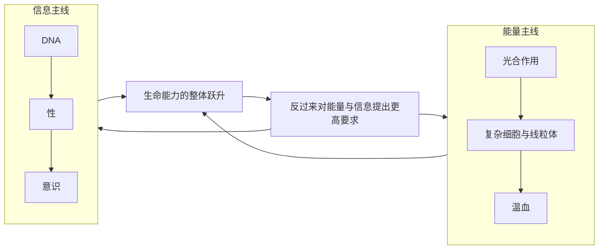

# 14｜这十大发明有什么共同规律？

> 跨越大相径庭的十个“发明”，是否共享某种底层逻辑？

---

## 一、先说结论

莱恩把十大发明拆开讲，但它们从来不是十个孤立的故事。在他看来，这些看似风马牛不相及的跃升，背后反复出现两条主线：**能量**和**信息**。

从光合作用到复杂细胞，再到温血，每一次跃升都和“更高效地获取、转化、使用能量”有关；从 DNA 到性，再到意识，每一次跃升又都和“更好地存储、重组、处理信息”有关。

所以莱恩真正想说的，或许不是“有十次发明”，而是：**生命的历史，可以被压缩成能量与信息这两条线的互相纠缠。**

---

## 二、我们先理解一个问题

先面对一个疑问：为什么是“能量”和“信息”，而不是别的？

因为生命无论多复杂，都同时受着两重约束。第一重是能量约束：任何生命活动——生长、运动、思考——都要消耗能量，能量不足，一切无从谈起。第二重是信息约束：生命必须把“自己是什么、怎么活下去”记下来，并且能在世代之间传递、并且能够被修改。

于是任何一个“跃升”，要么是解决了能量问题，要么是解决了信息问题，要么两者兼有。这不是硬凑，而是**生命本身的两大底层需求。**

问题因此变成：

> 十大发明当中，哪一些主要属于能量线，哪一些主要属于信息线？它们又是如何交织在一起的？

---

## 三、作者到底提出了什么观点？

莱恩反复强调两条主线。

**能量主线：** 光合作用，第一次给生命开出一个几乎用之不竭的能量来源；复杂细胞通过内共生获得线粒体，等于给细胞装上了高效“发电厂”，让每个细胞能支配的能量大幅提升；温血则把代谢推向极致，用大量能量换取稳定的体温与持久的活动能力。莱恩认为，能量的获取与利用效率，决定了生命“能长多大、能走多远、能有多复杂”。

**信息主线：** DNA 建立起可存储、可复制、可传递的遗传语言；性通过基因重组，让信息可以被快速打乱、重新组合，产生大量变异；意识则把生命对信息的处理，推进到“能形成主观体验”的层面。莱恩认为，信息处理的层级，决定了生命“能感知多少、能应对多复杂的世界”。

需要说明的是，这种归类是**理解的工具**，不是莱恩给出的严格分类。多数发明其实跨越两条线——比如复杂细胞既关乎能量，也关乎信息的整合。

---

## 四、把这个观点翻译成人话

可以把生命想象成一家不断升级的公司。

公司要活下去，必须解决两件事：一是**现金流**（能量），二是**信息流**（记录、决策、传承）。现金流不足，公司撑不下去；信息流混乱，公司就会做错决策、传错命令。

- 光合作用，相当于找到了一个稳定的大客户，现金流突然充足；
- 复杂细胞，相当于升级了财务系统，让每一分钱都用得更有效率；
- 温血，相当于把运营成本推高，换来了全天候的运转能力；
- DNA，相当于建立了一套标准的档案与传承制度；
- 性，相当于定期打乱并重组人才与方案，保持灵活性；
- 意识，相当于给公司配上了能实时感知环境、做出判断的决策中枢。

**能量决定你能不能活，信息决定你活得准不准。** 这十个“发明”，本质上都是在这两个方向上的一次关键升级。

---

## 五、为什么会这样？

图里有两点值得注意。

第一，两条线不是平行的，而是**互相供养**。更强的信息处理（比如意识）需要更多能量支撑；更充足的能量，又让更复杂的信息系统成为可能。温血与意识就是这样互相成就的。

第二，它形成正反馈。每一次跃升都会抬高门槛，逼出对能量和信息的更高要求，从而为下一次跃升埋下伏笔。这就是生命史呈现“台阶式”上升的一个深层原因。

---

## 六、举一个现实生活中的例子

一个足够直观的对照，是**运动**这种能力。

运动要消耗巨大的能量，所以它天然属于能量问题；但要让运动精准、协调、有方向，又必须有神经系统对信息的快速处理，所以它同时也是信息问题。莱恩在讲运动时，其实同时在讲两条线：**肌肉与分子马达提供能量转化，神经回路提供信息控制。**

不过在这个框架里，恰好能划入两条主线的例子更清楚：

- 光合作用、复杂细胞、温血，主要回答“能量从哪来、怎么用得更好”；
- DNA、性、意识，主要回答“信息怎么存、怎么变、怎么用”。

把这两组放在一起看，你会发现一个惊人的一致性：**生命史上那些最重要的突破，几乎都能被这两句话覆盖。**

---

## 七、回到书中重新理解

现在再回头看这十大发明，它们就不再是一个个孤立的奇迹，而是一张互相牵连的网络。

莱恩为什么反复强调能量？因为他发现，生命的复杂度往往被能量的供给能力卡住；为什么反复强调信息？因为生命要延续、要适应、要感知世界，就必须有足够强的信息能力。

这也解释了为什么有些发明必须“等”很久才出现——不是它们多么艰难，而是**前置条件（能量或信息）还没到位**。

换句话说：**十大发明共享的底层逻辑，是能量与信息两条线的持续升级与彼此驱动。** 这条线索，正是莱恩给整本书埋下的骨架。

---

## 八、这个观点背后还有什么？

第一，**它是解释框架，不是严格分类。** 能量与信息是理解工具，具体发明大多两者兼有。

第二，**它和“进化没有设计师”完全一致。** 两条主线的升级同样没有规划者，只是能量效率更高、信息处理更强者更容易被保留。

第三，**它让生命史变得可比较。** 不同的谱系、不同的时代，都可以放在同一把尺子上衡量：它在能量上更进一步，还是在信息上更进一步？

第四，**它把“偶然”和“必然”接在了一起。** 哪一次突破先出现是偶然的，但“能量与信息会持续被推向更高水平”又有其必然性。

---

## 九、这个观点有问题吗？

有，需要保持警惕。

第一，**“两条主线”可能过度简化。** 一些生物学家认为，把四十亿年的历史压进能量和信息两个词，会丢掉生态、环境、随机偶然等大量重要因素。

第二，**归类带有主观性。** 把某项发明归入能量线还是信息线，往往取决于你怎么定义，界线并不总是清晰。

第三，**“升级”一词容易滑向目的论。** 能量利用更高效不等于更“进步”，信息处理更强也不等于更“高级”，演化没有方向。

第四，**但它确实提供了一种强大的统一视角。** 一个好的框架不必解释一切，只要能让你在纷杂现象中看到秩序，就已经很有价值。

所以更准确的说法是：**“能量与信息”是理解十大发明的一种极有启发性的压缩方式，而不是生命的终极公式。**

---

## 十、今天再看这个观点

以下部分是基于莱恩思想的现代延伸，不是他的原话。

莱恩的“能量 + 信息”框架，在今天的人类世界里格外有现实感。

回看人类史，几乎每一次大的跃升都同时推进这两条线：农业与工业革命，本质上是能量获取方式的革命；文字、印刷术、计算与人工智能，本质上是信息存储与处理方式的革命。

有意思的是，这两条线在今天正以前所未有的方式交织在一起：大规模计算本身消耗着巨额能量，而更高的算力又在帮助我们更高效地管理能量。

当然，这只是类比。文明演化与生物演化的机制并不相同，不能简单等同。但它至少说明：莱恩用来理解生命的这把钥匙，也能帮助我们理解自己身处的位置。

---

## 十一、这一篇真正应该记住什么？

1. **十大发明共享两条主线：能量与信息。**
2. **能量线**（光合作用、复杂细胞、温血）关乎生命能获取和使用多少能量。
3. **信息线**（DNA、性、意识）关乎生命能存储、重组和处理多少信息。
4. **两条线互相供养、彼此驱动**，形成推动生命升级的正反馈。
5. **这是一个强大的解释框架，但也是简化，需要警惕目的论。**

---

## 十二、留一个问题

> 如果生命的历史可以被能量与信息两条线概括，
> 那么今天人类拼命追逐的“更多能量、更强算力”，
> 究竟是在延续生命史的老剧本，
> 还是正在把演化推向一个我们尚未命名的方向？

---

**下一篇**：到这里，我们已经把十大发明逐一拆开，也找到了它们背后的两条主线。可还有最后一个问题没有回答：读懂这一切之后，我们到底该如何理解生命，以及我们自己在这棵树上的位置？

下一篇是这个系列的收束——**生命史给了我们什么启示**。
