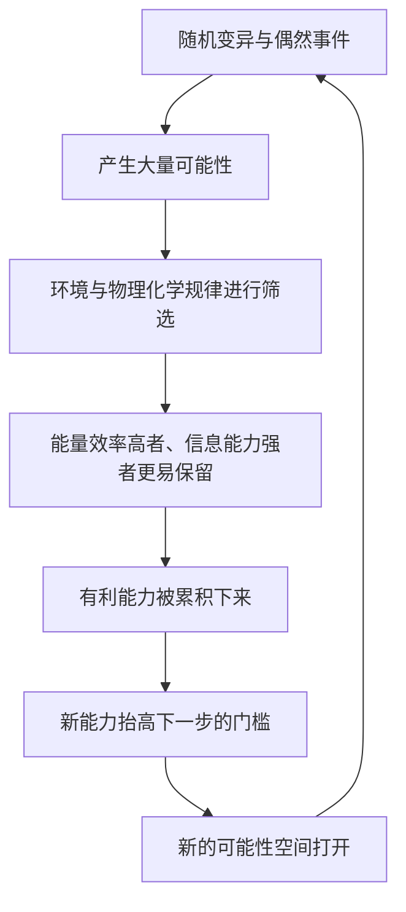

# 15｜生命史给了我们什么启示？

> 读懂这十次跃升之后，我们该如何理解生命与我们自己？

---

## 一、先说结论

走完整本书，莱恩并没有给出一条“生命注定走向人类”的大道。恰恰相反，他让我们看到的是三重特征交织的历史：**偶然**、**必然**和**累积**。

偶然：没有预设的路线，哪一次突破、哪一个谱系成功，都带有极大的随机性。

必然：能量与物理化学规律始终在起作用，效率更高者更容易被保留。

累积：每一次跃升都站在前一次的肩膀上，能力可以层层叠加。

理解这三重特征，也就能理解我们自己的位置：**人类不是生命的终点，而是其中一次跃升的产物。**

---

## 二、我们先理解一个问题

先问一个我们很少认真问的问题：**读完生命史，我们该感到渺小，还是感到特殊？**

一种流行的直觉是：生命一路从简单走向复杂，最终“进化出了人类”，所以人类是进化的目的、是巅峰。这种叙事很动人，但它恰恰是莱恩要破除的。

另一种直觉则相反：既然一切都是偶然，那么人类毫无意义。

这两种看法，可能都太极端。要看清我们的真实位置，需要同时握住偶然、必然与累积这三个坐标。

于是本文要回答的是：

> 把十大发明连起来看，生命史呈现出怎样的整体特征？这对我们理解自身意味着什么？

---

## 三、作者到底提出了什么观点？

莱恩的立场可以概括为：**生命史没有预设的方向，但它也不是纯粹混乱；在偶然的外表下，能量与物理化学规律构成了稳定的“必然性”。**

具体有三层。

第一层是偶然。莱恩反复强调，演化没有蓝图。哪一次突变发生、哪个谱系恰好跨过门槛，都带有随机性。生命能走到今天，不是因为它“被安排好了”。

第二层是必然。但只要存在能量梯度、化学规律和选择压力，某些结果就会反复趋向出现：能量效率更高的结构更可能被保留，信息处理更强的方式更可能扩散。这就是为什么有些能力会在不同谱系中被独立“发明”多次。

第三层是累积。每一次跃升都建立在已有能力之上：没有光合作用带来的氧气，就没有后来的复杂生命；没有复杂细胞带来的能量优势，就没有大型多细胞生命。**生命不是一次次重来，而是一层层加高。**

莱恩由此得出一个大判断：能量与信息两条线会持续把生命推向更高的复杂度，但**推往哪个方向、由谁去把它实现，并没有答案**。

---

## 四、把这个观点翻译成人话

可以用一句话来记：**生命史既有运气的成分，也有规律的成分，而且它一直在“复利”。**

- 偶然，像抽牌：你抽到什么牌，多少靠运气。
- 必然，像牌局的规则：无论谁抽牌，某些组合就是更强。
- 累积，像复利：每一局的收益，都会成为下一局的本钱。

单看一次抽牌，几乎全凭运气；但把很多局连起来看，规律就会显现出来。生命史正是这样：**短期看是偶然，长期看有必然，全程都在累积。**

而我们人类，只是这条漫长累积链条上比较晚出现的一环——重要，但不是终点。

---

## 五、为什么会这样？

为什么生命史会同时呈现偶然、必然与累积？可以用下面这张图来理解。

这张图里有三个要点。

第一，**偶然负责“产生可能”**：没有变异，就没有可筛选的素材。

第二，**必然负责“决定方向”**：能量与规律让筛选不是纯随机。

第三，**累积负责“不断加高”**：每一次成功的突破都会成为下一次的起点，循环往复。

三者缺一不可。只有偶然，生命会一直打转；只有必然，生命会僵化成一条直线；只有累积而没有偶然，生命就不会有意外与新方向。

---

## 六、举一个现实生活中的例子

把这三重特征放到**我们自己**身上，最容易看清。

我们的存在，是三件事叠在一起的结果。

**偶然的一面**：如果某次关键突变没有发生，如果某个谱系没有恰好躲过灭绝，今天的我们就不会存在。我们的出现，带着极大的运气成分。

**必然的一面**：一旦生命要变大、要变快、要变聪明，就必然受能量与物理化学规律的限制。人类的大脑、恒温、运动能力，都不是“想有就有”，而是在这些硬约束下被筛选出来的。

**累积的一面**：我们身上几乎每一套系统，都是历史的遗产——从细胞里的能量机制，到神经系统处理信息的方式，都能在实际演化中找到层层叠加的痕迹。我们站在漫长累积的肩膀上。

**偶然、必然、累积，这三重特征不只适用于生命史，也适用于我们每个人的来历。** 正因为如此，说“人类是进化的终点”是站不住的：我们只是累积链条上的一次跃升，而这次跃升，还远没有结束。

---

## 七、回到书中重新理解

现在再把整本书收拢起来看，就清楚了。

莱恩从“十大发明”出发，一路追问每一项“在物理化学上究竟是怎么可能的”。走到最后，他没有给出一个“生命终将走向某处”的结论，而是给了我们一副看清历史的眼镜：**用偶然、必然、累积这三个词，去理解每一次跃升。**

他还给了一个耐人寻味的暗示：能量与信息这两条线如果继续被推进，生命很可能会走向更高的复杂度——但那会是什么样子，由谁来实现，无人能够预言。因为在生命史里，“会变得更复杂”或许有某种必然性，而“变成什么”，永远是开放的问题。

这就是这本书最深的启示：**它不告诉你终点在哪，它教你如何理解过程。**

---

## 八、这个观点背后还有什么？

第一，**它反对“人类中心”的目的论。** 生命史不是为人类铺路，人类只是其中一环。

第二，**它也不支持虚无主义。** 偶然并不意味着没有规律，恰恰相反，偶然与必然共同构成了一种可理解、可追问的历史。

第三，**它把谦逊和好奇同时交给我们。** 谦逊是因为我们并非中心；好奇是因为历史仍在继续，未来没有写定。

第四，**它让“进化”这个词回归本意。** 进化不是“从低级到高级”的必然上升，而是“在有约束的条件下，不断打开新可能”的过程。

---

## 九、这个观点有问题吗？

有，而且这正是全系列最该谨慎处理的地方。

第一，**“越来越复杂”未必是普遍趋势。** 一些生物学家指出，生命史上绝大多数时间、绝大多数谱系，其实都以单细胞或简单形式存在；复杂度上升是局部现象，而非全局定律。

第二，**“必然性”的边界难以划清。** 哪些结果真的是规律使然，哪些只是事后的叙述，往往难以区分。幸存者偏差会让我们把“已经发生的”误当成“必然发生的”。

第三，**“启示”容易被过度引申。** 用生命史去论证社会、道德或人生意义，是很多人爱做的事，但生物演化并不直接回答价值问题，这种引申需要非常克制。

第四，**但这个框架依然极具价值。** 它既不神化人类，也不抹杀规律，恰好在“我们很特殊”和“我们毫无意义”之间，给出一个更诚实的位置。

所以更准确的说法是：**偶然、必然、累积，是理解生命史的一种深刻视角，但它是一副眼镜，不是一条定律。**

---

## 十、今天再看这个观点

以下部分是基于莱恩思想的现代延伸，不是他的原话。

莱恩的视角，在今天尤其值得重读。

当技术让我们产生“人类正在掌控一切”的错觉时，生命史提醒我们：**我们也是被筛选出来的产物，而不是规则的制定者。** 当人们热衷于用演化论去证明某种社会主张时，生命史提醒我们：偶然与必然交织，远没有那么简单。

与此同时，人类确实第一次拥有了主动改变自身演化条件的能力——从改变环境，到直接干预遗传信息。这在整个生命史上是前所未有的。

这是不是又一次“跃升”？还是只是一个需要被打破的旧层级？没有人能提前给出答案。但莱恩的框架至少给了我们一种态度：**带着谦逊去好奇，承认偶然，尊重必然，理解累积。**

---

## 十一、这一篇真正应该记住什么？

1. **生命史由三重特征交织而成：偶然、必然、累积。**
2. **偶然意味着没有预设路线；必然意味着能量与规律始终起作用；累积意味着每一次跃升都站在前一次的肩膀上。**
3. **人类不是生命的终点，而是其中一次跃升的产物。**
4. **“越来越复杂”并非全局定律，只是局部可能，需警惕夸大。**
5. **这本书不给你终点，而是给你一副理解过程、也理解自己的眼镜。**

---

## 十二、留一个问题

> 如果生命的每一次跃升，都是偶然中带有必然、并不断累积的结果，
> 那么今天能主动改写自身演化条件的我们，
> 究竟是这条链条上注定的一环，
> 还是第一次有机会，成为某种意义上的“选择者”？
> 而这份能力，我们又该如何使用？

---

到这里，这个系列就走完了。我们从“什么是生命进化的十大发明”出发，把生命、DNA、光合作用、复杂细胞、性、运动、视觉、温血、意识一直到死亡，逐一拆开，也试着找到了它们背后的能量与信息两条主线。

莱恩给我们的，不是一份标准答案，而是一套理解生命史的方法：**没有设计师，只有偶然、必然与累积的长期交织；没有终点，只有一次次打开新可能的跃升。**

所以，也许最好的读法，不是记住那十项发明，而是带着它们重新去看一眼身边的世界——看一阵风、一棵树、一只飞鸟，看清它和我们一样，都是这条四十几亿年累积之路上的产物。**至于这套方法在你心里最终拼出怎样的图景，这个系列能做的，是把它交还给你。**
