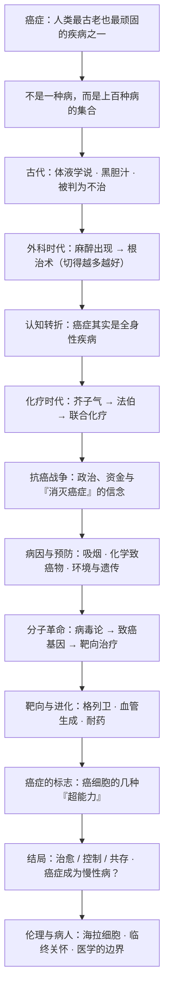

# 《众病之王：癌症传》深度解读系列

## 系列简介

癌症是什么？这个问题听起来简单，却困扰了人类两千多年。

悉达多·穆克吉是一位肿瘤科医生。他的一位病人在治疗中问他：我得的到底是什么？这个问题最终变成了一本书——一部为癌症写的「传记」。穆克吉把它当作一个有生命、有历史、有性格的角色来写：它如何在古埃及的纸草上第一次被记下，如何被希腊人命名为「蟹」，如何在体液学说里被误解了一千四百年，又如何在外科手术、化学药物、放射线和基因技术的一次次进攻中存活、变形、卷土重来。

这本书最重要的主张是：**癌症不是一种病，而是一类病；它不是外来的敌人，而是我们自己身体的一部分——是我们生长与修复的机制出了错。** 正因如此，它极难被彻底「消灭」，却可能被「控制」。

本系列不按原书章节复述，而是重建一条认知链：先弄清「癌症是什么、人类如何误解了它」，再走进「手术—化疗—预防—分子革命—靶向治疗」的历史，最后讨论这本普利策奖之作真正想说的：我们该如何与癌症共处。

---

## 全书核心问题

| 层次 | 问题 |
|---|---|
| 定义问题 | 癌症到底是一种什么病？为什么不能把它当成一个单一的敌人？ |
| 历史问题 | 人类用两千年才逐渐理解癌症，为什么这么难？ |
| 治疗问题 | 从手术到化疗到靶向药，每一条路为什么都「先成功、后受挫」？ |
| 因果问题 | 癌症是环境造成的，还是命中注定？它为什么是「我们自己的病」？ |
| 伦理问题 | 在追求「治愈」的过程中，病人、实验与代价该如何被对待？ |
| 终极问题 | 癌症会被彻底消灭吗？「治愈」「控制」与「共存」意味着什么？ |

一句话版本：

> **当敌人就是我们自己时，我们该如何理解癌症、又该如何与它相处？**

---

## 全书知识地图



再压缩成一句话：

```text
癌症 = 我们自身细胞的失控
     → 古人不解 → 外科强切 → 化疗毒杀 → 预防拦截 → 分子靶向
     → 每一次『胜利』都被耐药与进化反扑
     → 最终答案不是『消灭』，而是『理解与控制』
```

---

## 全系列目录

### 第一部分：认识「众病之王」

#### 01｜为什么我们至今没有「治愈」癌症？

核心问题：如果医学已经如此发达，为什么癌症依然是那个最令人恐惧的诊断？

核心观点：穆克吉的答案藏在书名里——癌症是「众病之王」。它不是一场可以宣布胜利的战争，而是一个与我们共存了四千年的对手。要理解为什么治不好它，首先要理解它不是一种病，而是一类病，且根本上是我们自己身体的一部分。

理解难度：★★☆☆☆

关键词：众病之王、传记式写法、治愈的幻觉

---

#### 02｜癌症究竟是一种病，还是一百种病？

核心问题：为什么把癌症当成「一个敌人」来打，从一开始就是错的？

核心观点：癌症是一大类疾病的统称：乳腺癌、白血病、肺癌、淋巴瘤……它们在病因、行为和治疗反应上差别巨大。用同一种逻辑对付所有癌症，就像用一种药治所有感染。穆克吉反复强调：**「癌症」是一个复数词。**

理解难度：★★☆☆☆

关键词：癌症的异质性、白血病与实体瘤、分类的困难

---

#### 03｜人类第一次「看见」癌症，是什么时候？

核心问题：人类究竟从什么时候开始认识癌症？最早的记录告诉了我们什么？

核心观点：早在古埃及的医学纸草中，就有对乳房肿块的描述，并写下了近乎绝望的结论——「无法治疗」。这提醒我们：癌症不是现代文明的产物，它和文明本身一样古老；现代医学面对的，是一个远古就存在的难题。

理解难度：★★☆☆☆

关键词：艾德温·史密斯纸草、古埃及医学、乳腺癌的记载

---

#### 04｜为什么人类误解了癌症两千年？

核心问题：从希波克拉底到盖伦，古人为什么会把癌症解释成「黑胆汁过多」？

核心观点：古希腊医学用「四种体液」解释一切疾病，癌症被视为黑胆汁淤积。这个理论自洽、优雅，却没有解剖学依据，却统治了西方医学一千多年。穆克吉借此说明：**错误的框架一旦被权威固化，就会长期阻挡正确的观察。**

理解难度：★★★☆☆

关键词：希波克拉底、盖伦、体液学说、黑胆汁、癌症的命名

---

#### 05｜癌症到底是什么？——一个细胞的「叛变」

核心问题：在细胞的层面上，癌症究竟发生了什么？

核心观点：十九世纪的病理学家魏尔啸确立了「细胞来自细胞」，把癌症拉回细胞层面：它是细胞不受控制地增殖、侵入与转移。癌症不是外来的怪物，而是**正常的生长机制失控后的产物**——这是我们身体为「多细胞」付出的代价。

理解难度：★★★☆☆

关键词：魏尔啸、细胞病理学、增殖失控、转移

---

### 第二部分：手术的年代

#### 06｜为什么最早的抗癌疗法是「切得越多越好」？

核心问题：在没有化疗和放疗的年代，外科医生为什么会相信「切得越干净，治愈机会越大」？

核心观点：十九世纪末，霍尔斯特德提出「根治性乳房切除术」，主张连同乳房、胸肌和淋巴结一并切除。在当时「癌症先局部扩散、再沿淋巴蔓延」的理论下，这个逻辑无懈可击，并统治了半个多世纪的外科实践。

理解难度：★★★☆☆

关键词：霍尔斯特德、根治术、局部扩散理论、麻醉与外科进步

---

#### 07｜「根治术」为什么统治了半个多世纪，又为什么被推翻？

核心问题：如果切得越多越好，为什么更彻底的手术并没有带来更高的治愈率？

核心观点：更大范围的手术并未显著改善生存，反而带来巨大创伤。费舍尔等人用**随机对照试验**证明，局部切除加放疗与根治术效果相当，从而把「癌症是局部病」的旧观念，转向「癌症从一开始就是全身性疾病」。这是医学从权威走向证据的转折。

理解难度：★★★★☆

关键词：随机对照试验、费舍尔、局部 vs 全身、循证医学

---

### 第三部分：化学治疗的诞生

#### 08｜战争如何意外催生了化疗？

核心问题：第一种真正意义上的抗癌药，为什么竟然来自化学武器？

核心观点：二战期间对芥子气的研究发现，它会特异性地破坏骨髓和淋巴组织。古德曼与吉尔曼据此把氮芥用于淋巴瘤，第一次证明——药物可以缩小人体内的肿瘤。化学治疗由此诞生，一段「以毒攻毒」的历史开始了。

理解难度：★★★☆☆

关键词：芥子气、氮芥、淋巴瘤、以毒攻毒

---

#### 09｜一个儿科医生，如何让儿童白血病第一次「退却」？

核心问题：为什么现代化疗的真正起点，是一个几乎无药可救的儿童病房？

核心观点：法伯用叶酸的「拮抗剂」治疗儿童急性白血病，让原本迅速死亡的孩子出现短暂缓解。这在当时几乎是奇迹。他不只是发现了一种药，更确立了一种信念：**药物能够系统性攻击全身扩散的癌症**，哪怕过程凶险。

理解难度：★★★☆☆

关键词：法伯、儿童白血病、叶酸拮抗剂、缓解

---

#### 10｜为什么一种药治不好癌症？——联合化疗的诞生

核心问题：为什么单靠一种药，总是先有效、后失效？

核心观点：癌细胞会不断产生耐药性。研究者借鉴结核病联合用药的思路，用作用机制不同的多种药物同时攻击，既减少耐药，也提高杀灭率。联合化疗让儿童白血病、霍奇金淋巴瘤等第一次真正被「治愈」，也确立了「根治」这一雄心。

理解难度：★★★★☆

关键词：耐药、联合化疗、霍奇金淋巴瘤、细胞全杀模型

---

#### 11｜「向癌症宣战」：尼克松、拉斯克与一个未兑现的承诺

核心问题：为什么 1971 年美国要发起一场「抗癌战争」？它成功了吗？

核心观点：在社会活动家拉斯克等人的推动下，尼克松签署《国家癌症法案》，投入巨额资金，承诺在几年内攻克癌症。它极大推动了研究与治疗，却也暴露了「按下按钮就能消灭癌症」这一想象的幼稚——**科学的进展不是政治意志可以压缩的。**

理解难度：★★★☆☆

关键词：国家癌症法案、拉斯克、政治与科学、期望管理

---

### 第四部分：病因与预防

#### 12｜癌症是可以预防的吗？——从扫烟囱工人到吸烟

核心问题：如果癌症这么难治，我们能不能在它发生之前就阻止它？

核心观点：从帕特发现扫烟囱工人的阴囊癌与煤灰有关，到多尔与希尔证明吸烟导致肺癌，流行病学一次次证明：相当一部分癌症与环境暴露有关，因而可以预防。这让「预防」成为与「治疗」同等重要的战场。

理解难度：★★★☆☆

关键词：帕特、职业致癌物、多尔与希尔、吸烟与肺癌

---

#### 13｜烟草公司是如何「制造怀疑」的？

核心问题：证据都那么清楚了，为什么烟草行业还能拖延几十年？

核心观点：面对吸烟致癌的铁证，烟草公司没有正面反驳，而是系统性地「制造不确定」——质疑统计方法、资助有利研究、强调「相关性不等于因果」。这是科学证据与商业利益博弈的经典案例，也解释了为什么科学共识并不自动转化为公共政策。

理解难度：★★★☆☆

关键词：烟草业、制造怀疑、科学证据、公共政策

---

#### 14｜癌症是「命中注定」，还是「环境所致」？

核心问题：为什么同一种暴露，有人得癌、有人不得？癌症到底有多少来自遗传、多少来自环境？

核心观点：癌症既不是纯粹的宿命，也不是纯粹的环境问题。它通常是基因、环境与随机突变的共同结果。理解这一点，才能同时避免两种极端——把癌症全归咎于个人生活方式，或把一切推给无法改变的命运。

理解难度：★★★★☆

关键词：遗传易感性、环境暴露、随机突变、多因素

---

### 第五部分：分子革命

#### 15｜癌症是病毒引起的吗？——一场持续半个世纪的争论

核心问题：为什么会有一代科学家坚信「癌症会传染」？

核心观点：劳斯发现鸡肉瘤可以由病毒传递，这开启了「肿瘤病毒」之路。此后数十年，病毒论与化学致癌论、遗传论反复拉锯。虽然病毒只解释了少数癌症（如宫颈癌与 HPV），但这条线索最终意外地通向了癌症最核心的秘密——基因。

理解难度：★★★★☆

关键词：劳斯、肿瘤病毒、逆转录病毒、HPV

---

#### 16｜致癌基因：癌症为什么是「我们自己的基因」出了错？

核心问题：癌基因究竟从哪里来？它为什么不是外来入侵，而是「内鬼」？

核心观点：毕晓普与瓦尔缪斯发现，病毒里的致癌基因其实来自宿主自身的正常基因——「原癌基因」。当这些调控生长的基因发生突变或被异常激活，细胞就会失控。这一发现彻底改变了癌症的图景：**癌，是我们的基因在特定条件下的背叛。**

理解难度：★★★★★

关键词：原癌基因、src、毕晓普与瓦尔缪斯、突变

---

#### 17｜费城染色体：靶向治疗的黎明

核心问题：一种特定的染色体异常，为什么能带来第一种精准抗癌药？

核心观点：慢性粒细胞白血病患者体内有一条异常的「费城染色体」，它把两个基因拼成一个持续发出增殖信号的「开关」。既然病因如此明确，理论上就可以设计一把只针对这个开关的钥匙。这为「靶向治疗」奠定了概念基础。

理解难度：★★★★☆

关键词：费城染色体、染色体易位、BCR-ABL、精准打击

---

### 第六部分：靶向与进化

#### 18｜癌细胞有哪些「超能力」？——《癌症的标志》

核心问题：形形色色的癌症，有没有共同的底层特征？

核心观点：汉纳汉与温伯格提出的「癌症的标志」框架，把癌症的共同能力归纳为若干条：无限增殖、逃避生长抑制、抵抗凋亡、诱导血管生成、侵袭与转移、获得复制永生化等。它像一张地图，把纷乱的癌症研究收拢成一个可理解的系统。

理解难度：★★★★☆

关键词：癌症的标志、汉纳汉与温伯格、共性与系统

---

#### 19｜格列卫：一颗「魔弹」如何改写癌症治疗？

核心问题：为什么格列卫被视为癌症治疗史上的分水岭？

核心观点：针对慢性粒细胞白血病的关键分子异常，格列卫实现了近乎「点射」的效果：患者获得极高的缓解率，副作用远小于传统化疗。「魔弹」的梦想似乎成真了——但它也很快遭遇了癌症最顽强的武器：耐药。

理解难度：★★★★☆

关键词：格列卫、伊马替尼、魔弹、分子靶向治疗

---

#### 20｜能不能「饿死」肿瘤？——福克曼与血管生成

核心问题：肿瘤长大需要血液供应吗？切断它的血管能否成为新的疗法？

核心观点：福克曼提出，肿瘤必须诱导新血管生成才能持续生长，因此「抗血管生成」可能是一种广谱策略。这一思路充满想象力，却在临床中屡经波折。它说明：癌症治疗的每一个「巧妙点子」，都要经过漫长而残酷的验证。

理解难度：★★★★☆

关键词：福克曼、血管生成、抗血管生成、临床验证

---

#### 21｜为什么治好的癌症还会复发？——癌症是一台进化机器

核心问题：靶向药明明有效，为什么癌细胞总能「卷土重来」？

核心观点：肿瘤内部并非单一，而是由无数略有差异的细胞组成；药物杀死了大多数，却留下了耐药的少数，它们迅速繁殖，形成新的优势群体。**癌症本质上是一场发生在体内的达尔文式进化。** 这也意味着，任何单一疗法都难以取得永久胜利。

理解难度：★★★★☆

关键词：肿瘤异质性、耐药、达尔文式进化、联合策略

---

### 第七部分：病人、伦理与未来

#### 22｜当医学无法治愈时，我们还能做什么？

核心问题：如果癌症无法根治，医学的意义是否就崩塌了？

核心观点：穆克吉在书中不断回到这个问题：治疗的目标不只是「延长生命」，也包括减轻痛苦、维护尊严、陪伴病人。临终关怀不是放弃，而是把「治愈」的执念，换成对「人」的关注。这是全书最柔软、也最深刻的部分。

理解难度：★★★☆☆

关键词：临终关怀、治愈与照护、生命质量、医学的边界

---

#### 23｜海拉细胞：医学进步的背面，是谁的代价？

核心问题：一项拯救了无数人的医学成果，如果来自未经同意的取材，它该如何被评价？

核心观点：海拉细胞来自一位普通黑人女性，却在未经她知情同意的情况下被广泛用于研究，惠及全人类，而她的家人长期被蒙在鼓里。这个案例迫使医学面对一个根本问题：**科学的进步与个体的权利，边界在哪里？**

理解难度：★★★★☆

关键词：海拉细胞、知情同意、医学伦理、纽伦堡法典

---

#### 24｜癌症会被彻底消灭吗？——「治愈」「控制」与「共存」

核心问题：穆克吉这本「癌症传记」的结论，究竟是悲观还是乐观？

核心观点：癌症源于我们自身的生物学，不可能像天花或小儿麻痹那样被「根除」。更现实的未来是：一部分癌症可以治愈，一部分可以长期控制，像高血压、糖尿病一样与患者共存。真正的进步，或许是放下「战争」的隐喻，学会更聪明、更有耐心地与它相处。

理解难度：★★★★☆

关键词：慢性病化、控制而非根除、战争隐喻、共存

---

## 推荐阅读顺序

```text
第一板块｜先认识对手
  01 为什么治不好
  02 不是一种病
  03 最早的记录
  04 两千年的误解
  05 细胞层面的真相

第二板块｜外科的幻想
  06 切得越多越好
  07 根治术为何被推翻

第三板块｜化学治疗
  08 战争与化疗
  09 法伯与儿童白血病
  10 联合化疗
  11 抗癌战争

第四板块｜病因与预防
  12 可以预防吗
  13 烟草公司的怀疑术
  14 命还是环境

第五板块｜分子革命
  15 病毒论之争
  16 致癌基因
  17 费城染色体

第六板块｜靶向与进化
  18 癌症的标志
  19 格列卫
  20 血管生成
  21 耐药与进化

第七板块｜病人与未来
  22 临终关怀
  23 海拉细胞
  24 消灭还是共存
```

优先关系：

> 03、04、05 是理解后面一切治疗史的地基（先知道癌症是什么、为什么难）；
> 07 依赖 06 建立的外科逻辑；10 依赖 08、09 讲清的化疗原理；
> 15、16、17 是分子革命的三级台阶，18 的「标志」框架需建立在 16 之后；
> 19、20、21 依赖 17、18；22、23、24 属于反思与价值层，须在理解完整段历史之后才有分量。

---

## 与原书结构的对照

| 原书脉络 | 对应文章 |
|---|---|
| 序言：为癌症写一本传记 | 01、24 |
| 第一部分 疾病的面貌（古代到魏尔啸） | 02、03、04、05 |
| 第二部分 外科时代（霍尔斯特德到费舍尔） | 06、07 |
| 第三部分 化疗的诞生与抗癌战争 | 08、09、10、11 |
| 第四部分 病因、致癌物与预防 | 12、13、14 |
| 第五部分 分子革命（病毒、癌基因、靶向） | 15、16、17、18 |
| 第六部分 靶向治疗、血管生成与耐药 | 19、20、21 |
| 尾声 治愈、照护与伦理（含海拉细胞） | 22、23、24 |
