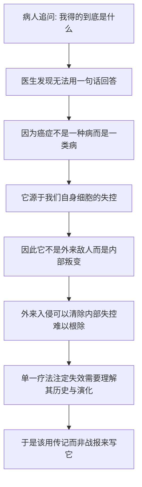

# 01｜为什么我们至今没有「治愈」癌症？

> 如果医学已经如此发达，为什么癌症依然是那个最令人恐惧的诊断？

---

## 一、先说结论

穆克吉的答案，就藏在书名里：**癌症是「众病之王」。**

它不是一场可以宣布胜利、然后敲锣收兵的战争，而是一个和人类共存了数千年的对手。我们至今没能「治愈」癌症，不是因为我们不够努力，也不是医学太落后，而是因为「治愈癌症」这个说法本身，就假设了它只有一个敌人、一个战场、一个终点。

穆克吉想说：癌症不是一种病，而是一类病；它不是外来的侵略者，而是我们自己身体的一部分。正因为它来自我们自身，彻底「消灭」才如此困难。要理解为什么治不好，第一步是换一个提问方式——不问「怎么打赢它」，而问「它到底是什么」。

---

## 二、我们先理解一个问题

穆克吉是一位肿瘤科医生，在哥伦比亚大学工作，每天都在和癌症打交道。

按理说，这样的人应该能脱口而出「癌症是什么」。但真正让他写下这本书的，恰恰是一个他答不好的问题。据他在序言中提到，一位患白血病的病人曾追问他：**我得的到底是什么？**

这个问题听起来简单，却极其锋利。

一个每天查房、开药、下诊断的专家，为什么没法用两三句话回答「癌症是什么」？因为一旦认真回答，你就会发现：它没有一条简单的定义。它不是细菌那样可以被指认的入侵者，不是骨折那样能画在片子上的损伤，甚至不是「一种」病。

于是真正的问题浮出来了：

> **如果连肿瘤科医生都难以说清「癌症是什么」，我们对自己正在对抗的对手，究竟了解多少？**

穆克吉发现，医学界擅长回答「怎么治」，却很少认真回答「它是什么、它从哪来、它经历过什么」。而这，正是他决定为癌症写一部「传记」的起点。

---

## 三、作者到底提出了什么观点？

穆克吉提出的，首先不是一种新疗法，而是一种新的**写法**和**看法**。

他不把癌症当成一个静止的、等着被消灭的靶子，而是把它当成一个**有历史的角色**来写——像给一个人立传那样，写它如何在古埃及的纸草上第一次被记录，如何被希腊人命名为「蟹」，如何在体液学说里被误解了一千多年，又如何在手术、化疗、放疗和基因技术的一次次围剿中存活、变形、卷土重来。

换句话说，穆克吉认为：

> **癌症不是一场战役，而是一段关系。** 它不是突然出现的灾难，而是伴随人类文明一路走来的老对手。

在此基础上，他给出了那个最关键、也最容易被忽略的判断：**癌症不是外来的敌人，而是我们自身生长与修复机制出了错。** 它不是一种病，而是一大类病的统称。也正因为如此，谈论「消灭癌症」远不如谈论「理解它、控制它」来得诚实。

---

## 四、把这个观点翻译成人话

假设你要介绍一个人。

你有两种写法。

第一种是**写简历**：姓名、年龄、职业、几条关键经历，一页纸讲完。清楚、干脆、便于分类。如果癌症是一种「单一疾病」，我们完全可以这样给它写简历——病因是什么，症状是什么，怎么治，清清楚楚。

第二种是**写传记**：从他出生写起，写他的家庭、他的转折、他的挣扎、他与时代的关系。传记承认主人公有性格、会变化，一句「他是好人」根本概括不了。

穆克吉选择的，是第二种。

他反复提醒读者：**「癌症」其实是个复数词。** 说「人类还没有治愈癌症」，就像说「人类还没有治好发烧」——听起来是一件事，实际上是一千件不同的事。乳腺癌和白血病，从细胞来源到生长速度、从对药物的反应到预后，几乎没有多少共同点。

所以，当我们谈论「战胜癌症」时，我们其实是在用一个单数词，描述一场由几百个不同对手组成的、漫长而复杂的战争。

---

## 五、为什么会这样？

把穆克吉的逻辑整理成链条，是这样：

这条链里，**C 是最关键的一环。**

我们习惯把癌症想成一个「东西」——一个长在身体里的肿块、一群坏掉的细胞。但穆克吉指出，它更像一个「过程」：原本该在正确时间生长、分裂、衰老、死亡的细胞，某个环节失灵了，于是开始不受控制地增殖。

你可以这样理解：如果癌症是外来细菌，那么「找到它、杀死它」是一条清晰的路，就像抗生素对付感染。但癌症不是外来者，它就是我们自己的细胞。**你没法用毒药毒死它，却不伤到「自己」。** 这就是为什么「根治」如此之难，也是为什么任何疗法都必须在「杀伤肿瘤」和「伤及病人」之间走钢丝。

---

## 六、举一个现实生活中的例子

想象一座大型图书馆。

如果图书馆里混进了几本外面来的违禁书，管理员的任务很简单：找到它们，下架，销毁。目标明确，边界清晰。

但如果问题不是「混进了外来书」，而是**图书馆自己的编目系统出了问题**呢？

新书进来后被错误分类，期刊被当成图书，参考书被放进流通区，目录卡片越编越乱。这时候你不能指望「把坏书全部拿走」——因为坏的不是某一本书，而是整个分类和生长规则。你想清理它，却发现每一本「坏」书看起来都像正常的书，因为它们本来就是按正常流程进来的。

更麻烦的是，这个系统还在持续运转。你每修好一处，别处又冒出新问题。

穆克吉笔下的癌症，就更接近第二种情况：**不是一个可以被移除的外物，而是一套失控的规则。** 治疗之所以棘手，正因为我们对付的常常是「系统本身」，而不是某个可以一刀切掉的敌人。

---

## 七、回到书中重新理解

现在再回头看穆克吉的写法，就比较清楚了。

他之所以要用传记体，不是因为文学家式的浪漫，而是因为**只有传记这种形式，才装得下癌症的复杂**。一份简历装不下一个活了数千年、不断变身、和无数人周旋的角色；战报也装不下——战报只记录胜败，不记录对手的来历。

书里那句「众病之王」的称呼，也因此有了分量。这里的「王」，不是因为它最凶残，而是因为它在众多疾病中地位特殊：它古老、顽固、几乎渗透进现代医学的每一个角落，并且始终没能被真正推翻。

穆克吉真正想纠正的，是那种「再过几年就能消灭癌症」的乐观想象。他并不是在宣告失败，而是在提醒：**在一个错误的框架里，胜利永远显得近在眼前；可一旦换成正确的框架，你会发现这是一场需要耐心、而非口号的长期相处。**

---

## 八、这个观点背后还有什么？

这个观点背后，藏着两个更深的问题。

第一个是**语言的力量**。我们一直用「战争」「宣战」「攻克」来描述抗癌。这些词塑造了公众的期待：既然是一场战争，就该有一个投降日。可穆克吉暗示，战争隐喻也许从一开始就误导了我们——它让人以为，只要投入足够多的资源、足够强的意志，就必然能赢。但科学不是这样运作的，生物学也不听从口号。

第二个是**「治愈」这个词本身的含义**。在癌症语境里，「治愈」从来不是一个非黑即白的状态。有些癌症可以被长期控制，患者带瘤生存很多年；有些在若干年后仍可能复发。穆克吉认为，真正专业的判断，往往不是「治好了」或「没治好」，而是「在一段时间内控制得如何」。

---

## 九、这个观点有问题吗？

有几个地方值得保持警惕。

第一，**「传记」的写法本身有争议。** 把一种疾病拟人化，写成有性格、有意志的「角色」，确实能让读者理解得更深，但也可能带来误导：癌症并没有「意图」，不会「蓄谋」也不会「反扑」。赋予它拟人化的动机，是文学手法，不是生物学事实。穆克吉作为一个好的写作者，在这两者之间走得比较小心，但普通读者未必都能分清。

第二，**对「战争隐喻」的反思并不全是穆克吉的原创。** 多年来，医学界和患者群体中一直有人批评「抗癌战争」这类说法，认为它把病人变成了「战斗失败者」，给本已痛苦的人增加了道德压力。穆克吉借用了这种反思，但他并没有给出一个能被所有人接受的替代框架。

第三，**「不追求治愈」可能被误读。** 有人说既然无法根除，那不如放弃。这显然不是穆克吉的意思。他要区分的是「不现实的根治幻想」和「现实的长期控制」，二者完全不同。把「共存」听成「躺平」，是对他观点最大的误解。

---

## 十、今天再看这个观点

（以下为现代延伸，非穆克吉原文）

穆克吉写这本书时（原书出版于 2010 年，次年获普利策非虚构类奖），癌症治疗正从「无差别化疗」走向分子靶向和免疫治疗。此后十多年，这个方向愈演愈烈：越来越多的癌症被拆分成分子亚型，治疗越来越像在给不同的锁配不同的钥匙。

这恰好印证了他「癌症是一类病」的判断——**分类越细，治疗越准。** 今天医学界常说的「精准医学」，本质上就是先承认「癌症不是一件事」，然后再一件一件去处理。

同时，「慢性病化」也越来越成为现实：对一部分癌症，目标不再是「清零」，而是像控制高血压、糖尿病那样，让患者长期稳定地带病生活。这和穆克吉「从战争转向共存」的思路一脉相承。当然，这只是部分癌症的现状，远不是全部——许多癌症依然凶险。所以更准确的读法是：**方向在变，但距离「普遍控制」还有很长的路。**

---

## 十一、这一篇真正应该记住什么？

1. **「治愈癌症」这个说法本身就值得怀疑。** 它假设癌症是一个单一的、可被终结的敌人，而事实并非如此。

2. **癌症不是外来的，而是我们自身机制出了错。** 正因如此，彻底「消灭」它极难，治疗必须始终在杀伤与伤害之间权衡。

3. **穆克吉用传记体写作，是一种认知选择。** 只有传记这种形式，才装得下癌症数千年、不断变形的历史。

4. **战争隐喻给了我们虚假的期待。** 科学的进展无法被口号和意志压缩，抗癌更像长期相处，而非速决战。

5. **区分「不现实的根治」与「现实的长期控制」。** 后者不是放弃，而是更成熟的目标。

---

## 十二、留一个问题

如果我们承认癌症不是「一个敌人」，而是「一大类病」，那么一个新的问题就出现了：

> **乳腺癌、白血病、肺癌、淋巴瘤……它们在多大程度上其实是同一种病，又在多大程度上根本是几十种不同的病？**

如果连「癌症」这个词都可能是误导，那医学又该如何给它们分类？

下一篇，我们就来认真拆开这个问题：**癌症究竟是一种病，还是一百种病？**
