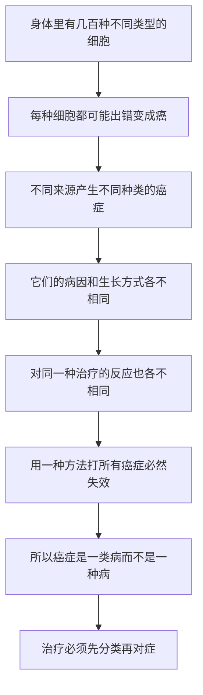

# 02｜癌症究竟是一种病，还是一百种病？

> 为什么把癌症当成「一个敌人」来打，从一开始就是错的？

---

## 一、先说结论

癌症不是一种病，而是一大类疾病的统称。

乳腺癌、白血病、肺癌、淋巴瘤……它们在细胞来源、生长速度、扩散方式、对药物的反应上，差别之大，几乎像不同的物种。穆克吉反复强调：**「癌症」是一个复数词。**

把癌症当成一个敌人，用一种逻辑、一种药去对付所有癌症，就像用一种抗生素去治所有感染——从一开始就注定受挫。真正理解癌症的第一步，就是放弃「癌症＝一种病」这个直觉。这不是文字游戏，而是一个会直接决定治疗成败的判断。

---

## 二、我们先理解一个问题

当一个人说「我得了癌症」，这句话到底传递了什么信息？

仔细想想，它给出的信息量几乎是零。它没有告诉你病灶在哪里、恶性程度多高、进展多快、对什么治疗会敏感。它和「我生病了」差不多——只说明了一个极宽泛的类别。

可在日常对话里，我们却习惯像谈论一种具体疾病那样谈论它：得了癌症，就去找「治癌症的药」；说攻克癌症，就好像在说攻克小儿麻痹。

> **同一个词，为什么能装下差别如此巨大的疾病？**

要回答这个问题，得先看清楚：癌症到底是什么层面的东西。

---

## 三、作者到底提出了什么观点？

穆克吉的观点很明确：**癌症是一类病，不是一种病。** 它更像一个集合名词，而不是一个单一的病理实体。

他提醒读者，我们身体的细胞有几百种类型：血液里的、乳腺的、肺里的、淋巴系统的、皮肤上的……理论上，几乎每一种细胞都可能出错，变成癌。来源不同，这些癌症的行为就天差地别。

- 有的癌症生长极快，几周内就能威胁生命；
- 有的可以缓慢存在很多年；
- 有的对药物敏感，一治就退；
- 有的天生顽固，怎么打都无动于衷。

所以穆克吉反复要求读者注意用词：说「癌症」，其实是在说「癌症们」。当医学把它当成一个整体来对付时，失败往往不是因为技术不够，而是因为**分类错了**。

---

## 四、把这个观点翻译成人话

想象你在水果摊前说：「我要买水果。」

摊主会立刻反问你：什么水果？苹果、榴莲、西瓜，还是柠檬？因为「水果」这个词几乎不包含任何有效信息——它们的甜度、价格、保存方式、吃法完全不同。你会为了解渴买西瓜，为了送人挑果篮，绝不会说「给我拿一个最优水果」。

「癌症」就是这样一个词。

它更像是「水果」这个总称，而不是「苹果」这种具体的东西。当我们用「抗癌」来描述一切时，就像在说「我要解决所有水果问题」——听起来雄心万丈，实际上无从下手。

一个更贴近工程的比喻是：**「车坏了」。**

刹车坏了、轮胎爆了、电瓶没电了、发动机拉缸了，都可以叫「车坏了」。但如果你只知道「车坏了」，你根本不知道该找谁、修哪里、花多少钱。癌症也一样：不给它分门别类，治疗就无从谈起。

---

## 五、为什么会这样？

把穆克吉的逻辑整理成链条，是这样：

这条链里，**B 是起点，G 是结论。**

关键的一跳在于：既然癌症来自不同种类的细胞，那它就不可能是「同一种东西」。它们共享的，只是一些底层的「坏习惯」——比如不受控地增殖、到处乱窜；但具体到每一种，节奏、脾气、软肋都不同。

这也解释了一个反直觉的现象：医学史上很多「抗癌突破」，刚出现时都宣称能治「癌症」，可一进入临床就迅速缩水——只在某几种癌症上有效。**不是研究者撒谎，而是「癌症」这个词太笼统，把虚假的整体性安到了本来分散的疾病上。**

---

## 六、举一个现实生活中的例子

想一想「感冒」这个词。

我们平时说「我感冒了」「最近感冒的人多」，好像感冒就是一种病。可实际上，被叫做感冒的，是一大堆病因完全不同的疾病：有的是鼻病毒感染，有的是流感病毒，有的是别的呼吸道病毒；它们症状相似，本质却不同。

更关键的是，人们曾长期把各种「感染」混为一谈。在抗生素出现之前，「感染」几乎是一个笼统的坏运气。直到人类学会区分细菌和病毒、区分不同的菌种，才明白：**对一种感染有效的药，对另一种可能完全无效。** 用治细菌的办法去治病毒，不但没用，还会因为滥用而带来耐药问题。

癌症与「感冒」「感染」的相似之处就在这里：**表面相似，底层完全不同。** 把乳腺癌和白血病当成一回事来治，本质上就是重演「一种药治所有感染」的旧错误——只是这次，代价发生在更严肃的场合。

---

## 七、回到书中重新理解

现在再回头看穆克吉为什么要在书里花大量篇幅，去讲一个又一个具体的癌症，就明白了。

他写儿童白血病、写乳腺癌、写淋巴瘤，不是为了讲一堆病例，而是为了让你亲眼看见：**每一种癌症，都有自己的来历和性格。** 法伯面对的急性淋巴细胞白血病，和外科医生面对的乳腺癌，几乎活在两个世界。

他也提醒我们，「分类」这件事本身就是一门艰难的学问。医生既要按器官分（乳房、肺、血液），又要按细胞类型分，后来还要按分子特征分。每一次分类方式的变化，都会改变治疗的思路，也会重新划分哪些病人是「同一类」。

所以穆克吉真正要纠正的，是一种语言习惯带来的思维错觉：**我们把一个词当成了一个敌人。**

---

## 八、这个观点背后还有什么？

这里藏着两个更深的东西。

第一个是**异质性的层次**。癌症之间的差异只是第一层。更要命的是，同一个肿瘤内部，细胞之间也不完全一样——它们各自带着不同的突变，对药物的反应也不同。这意味着，即便你精确诊断了「哪一种癌症」，你面对的仍不是一个整齐划一的敌人。这个伏笔，会在后面讲「耐药」和「进化」时爆发出来。

第二个是**分类即理论**。你怎么给疾病分类，暴露了你对它的理解程度。古人按症状分类，于是把所有肿块都叫「癌」；现代人按细胞和基因分类，才发现里面藏着完全不同的东西。**分类不是整理抽屉，而是认识世界的骨架。** 骨架错了，后面的研究都会歪。

---

## 九、这个观点有问题吗？

穆克吉的判断很有说服力，但也有几处需要小心。

第一，**「癌症是一类病」并不等于「它们毫无共同点」。** 后来的研究确实发现，形形色色的癌症共享一些底层能力——无限增殖、逃避死亡、诱导血管、侵袭转移等等。换句话说，癌症既是「很多种」，也是「一家人」。过分强调差异性，同样会让人忽略那些可以被广谱利用的共性。

第二，**分类的边界本身是模糊的。** 有些病变介于良性增生和恶性之间，很难一刀切开；有些肿瘤按器官看是一类，按基因看却属于另一类。医学界对「什么算癌症」「按什么标准分类」至今仍有不同意见。这不是理论不成熟，而是生物本身就不那么整齐。

第三，**把「差异大」当成「治不好」的理由，也有风险。** 差异性说明了为什么单一方案会失败，却不能证明多样化治疗一定成功。它解释困难，但不等于替困难开脱。这中间的分寸，需要读者自己把握。

---

## 十、今天再看这个观点

（以下为现代延伸，非穆克吉原文）

穆克吉写这本书的时期，恰好是「按分子给癌症重新分类」开始加速的年代。此后，这一趋势变成了主流。

今天的肿瘤学有一个重要变化：过去按「长在哪个器官」分组（乳腺癌、肺癌、结肠癌），现在越来越多地按「带着哪个基因突变」分组。有些药物甚至不看肿瘤长在哪里，只看它有没有某个特定的分子开关——这被称为「篮子试验」式的思路，即把不同器官、同一分子特征的癌症装进同一个篮子来治。

这在某种意义上，是对穆克吉判断的延伸和修正：**癌症确实是一类病，但分类的维度可以不按器官，而按机制。** 分类越接近机制，治疗就越接近精准。

当然，这也带来新的难题：分子检测的普及、药物可及性、以及「同一种突变在不同器官里表现不同」等复杂情况。差异这件事，被认识得越细，越显得深不见底。

---

## 十一、这一篇真正应该记住什么？

1. **癌症是「复数词」。** 它是一个集合名词，而不是一种具体的疾病；用单数思维对付它，从一开始就错了。

2. **来源不同，行为就不同。** 不同细胞出错，产生的癌症在生长速度、扩散和对药反应上差别巨大。

3. **「一种药治所有感染」的教训正在重演。** 把癌症当整体来治，就像用抗生素打病毒，注定低效。

4. **分类方式的改变，就是认识的进步。** 从症状分类到细胞分类，再到分子分类，每一次都在重新定义「同一类病人」。

5. **共性与差异都要看。** 癌症既是许多种病，也共享一些底层能力；只强调一边，都会看偏。

---

## 十二、留一个问题

既然癌症是来自我们自己细胞的疾病，那它究竟是从什么时候开始被人类注意到的？

> **在显微镜和基因出现之前，古人看到的「肿块」，他们是怎么理解的？**

或者说，人类第一次在历史的记录里「看见」癌症时，看到的到底是什么？

下一篇，我们回到时间的起点：**人类第一次「看见」癌症，是什么时候？**
