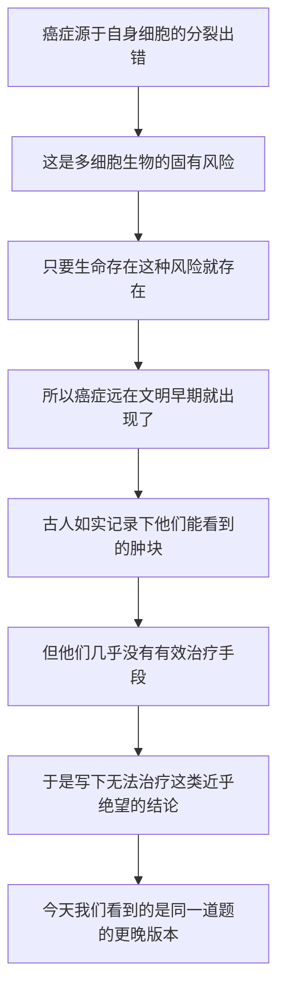

# 03｜人类第一次「看见」癌症，是什么时候？

> 癌症是现代文明的产物，还是一个和我们一样古老的对手？

---

## 一、先说结论

癌症不是现代文明的产物。

据记载，早在古埃及的医学文献中，就有对乳房肿块的描述，并写下了近乎绝望的结论——「无法治疗」。这份记录提醒我们：**癌症和文明本身一样古老。** 它不是工业污染或现代生活方式凭空造出来的，而是人类在很早以前就已经面对、却长期束手无策的难题。

穆克吉把这段历史放在全书开头，用意很深：现代医学面对的，不是一个新问题，而是一道延续了数千年的老题。看不懂这道题的古老，就很容易把「治不好」归咎于今天，而忽略了它背后更深的原因。

---

## 二、我们先理解一个问题

很多人对癌症有一个直觉：它是现代的。

工厂、尾气、加工食品、久坐、熬夜——我们下意识地认为，是这些现代因素制造了癌症，好像只要回到「从前」，癌症就会消失。

这个直觉对不对？如果癌症真的是现代的，那它应该有一个「突然出现」的时间点。可如果它在一两千年前就被记录下来，那说明什么？

> **如果古人也得癌症、也描述过它，那我们今天面对的，究竟是新问题，还是老问题？**

要回答这个问题，就得去看人类最早的医学记录里，到底写了什么。

---

## 三、作者到底提出了什么观点？

穆克吉的观点是：**癌症不是现代病，它古老得和文明差不多。**

他反复强调，癌症的根源在于细胞自身的失控——而只要一个生命体由大量细胞组成、只要细胞会不断分裂，就永远存在分裂出错的可能。这种可能性不会因为时代不同而消失。

所以，古埃及的医生、古希腊的医生、中世纪的医生，面对的都是同一种基本的生物学现实。他们的问题不在于「没有病人」，而在于**看得见病，却几乎无能为力**。

穆克吉要建立的，正是这种时间尺度上的谦卑感：我们不是第一批被癌症困扰的人，大概率也不是最后一批。

---

## 四、把这个观点翻译成人话

想象你在整理一间老屋的阁楼，翻出一本几十年前的旧病历。

纸已经发黄，字迹潦草，上面记着某个人身上摸到一个「硬块」，医生在下面写了几行字，语气很无奈。你把病历合上，忽然意识到：原来在几十年前，在那些今天看来已经过时的医学条件下，人们也在面对同样的事情，也在困惑、也在尝试。

再往前推，如果这本病历不是几十年前的，而是几千年前的呢？

据记载，人类的医书里确实存在这样的记录。这就带来一个冲击：**我们今天自以为在上的那道新课，其实古人早就坐在同一个教室里了。** 他们手里的工具远不如我们，但他们看到的难题，和我们并没有本质区别。

癌症就是这样一道老题。区别只在于，古人的答案更少。

---

## 五、为什么会这样？

把穆克吉的逻辑整理成链条，是这样：

这条链里，**B 是最关键的一环。**

癌症不是外界丢进身体的某个东西，而是身体自己运转时出错的产物。既然我们的细胞必须不断分裂、更新、修复，那么分裂过程出错的可能性就无法归零。**时代变了，细胞没变。** 这就是为什么癌症不会只属于某一个世纪。

理解这一点，你就能明白：现代人觉得癌症「变多了」，不能简单推断成「现代生活制造了癌症」——还需要区分，到底是它真的更多了，还是我们活得更久、看得更清楚了。

---

## 六、举一个现实生活中的例子

考古学家有时会在古代遗骸上发现骨骼的异常痕迹，比如某些骨头的破坏性病变。研究者会谨慎地推断：这可能是当年某种肿瘤留下的印记。

想象这样一个场景：一位古埃及的医生，被请去看一位妇女。她胸前有一个隆起的肿块，摸上去坚硬，甚至可能已经破溃。医生没有显微镜，没有麻醉，也没有任何能真正根治的办法。他能做的，是把病情记录下来，判断它是否可控，然后写下自己的结论。

据记载，面对某些乳房肿块，古埃及的文献给出了非常直白的判断：**没有治疗方法。**

这不是冷漠，而是一种极其诚实的悲凉。一个几千年前的医生，用手触摸、用眼观察，得出了和今天肿瘤学最基础的认识相通的结论——有些肿块，靠当时的手段无解。他唯一能做的，是把它写下来，留给后来的人。

我们和他之间隔了数千年，隔了无数工具，却站在同一条认知起跑线上：**先看见，再记录，然后一点一点往前走。**

---

## 七、回到书中重新理解

现在再回头看穆克吉为什么用古老记录开篇，就比较清楚了。

他并不是在炫耀「癌症有多古老」，而是想借这段历史建立三个判断：

第一，癌症的根源在我们自身，因此它必然古老；第二，古人并不是完全无知，他们已经能观察到、并能区分不同类型的肿块；第三，真正卡住人类的，不是「看见」，而是「解释」和「治疗」。

这也解释了为什么**「看见」这个词要加引号**。古人其实很早就看见了，但他们看见的是一个摸得到的肿块，而不是一个细胞层面的过程。真正的难题，是如何从「看见肿块」走到「理解它为什么发生」——这一步，人类走了很久。

穆克吉用这段开头，其实是在为后面漫长的误解史做铺垫。

---

## 八、这个观点背后还有什么？

这里有一个非常重要、也很容易被忽略的方法论问题。

**「古老记录里有癌症」和「古代癌症很常见」是两回事。**

一方面，医学文献能保存下来本身就很不容易，能写进书里的，往往是极少数被注意到的病例。另一方面，古代人的平均寿命短，很多人还没活到癌症高发的年纪，就因为传染病、饥荒或战乱去世了。所以，我们不能从「文献记录不多」直接推断「古人很少得癌」，也不能从「古人记录了它」直接推断「古今发病率一样」。

此外还有一层：**诊断能力本身会影响统计。** 在没有显微镜、没有影像技术的年代，很多癌症根本不会被识别，而是被归成「肿块」「疮」或者「衰老而死」。看不见，不代表不存在。

穆克吉的观点之所以有分量，正是因为他把人放在生物学的长河里，而不是只盯着某一份文献。

---

## 九、这个观点有问题吗？

有几处争议值得点出。

第一，**「癌症同样古老」与「现代癌症增多」并不矛盾。** 说它古老，是在讲它的生物学根源；说它今天更多，可能是在讲人口寿命、吸烟、环境暴露、筛查普及等现实因素。把这两句话对立起来，是一种偷换。

第二，**古代癌症的真实规模仍有争议。** 一些研究者认为，受寿命和诊断所限，古代癌症的发生率确实可能低于现代某些人群；也有研究者提醒，不要高估古人「少癌」的程度，因为漏诊和记录缺失同样严重。关于古代癌症的流行病学，学界至今没有完全一致的结论。

第三，**「无法治疗」这句话的适用范围要小心。** 古文献对某些病例写下了无解，并不代表对所有肿块都束手无策。不同部位、不同表现，处理方式并不相同。把个别记载泛化成「古人认为所有癌症都无法治疗」，可能会过度戏剧化。

所以更稳妥的读法是：**古人确实很早遇见了癌症，也确实长期缺乏有效手段；至于它到底多常见，我们需要对数字保持谨慎。**

---

## 十、今天再看这个观点

（以下为现代延伸，非穆克吉原文）

今天的医学里，出现了一个专门的交叉领域，研究古代遗骸和文献中的肿瘤痕迹，有时被称作古病理学或古肿瘤学。研究者用影像、分子检测等手段，在木乃伊、骨骼和古代绘画中寻找癌症的蛛丝马迹，试图回答「它在历史上究竟有多常见」。

与此同时，一个和穆克吉观点呼应的问题越来越突出：**我们今天看到的「癌症变多」，有多少是真实增长，有多少是「看得更清楚」的结果？**

当筛查普及、影像技术普及，很多以前一生都不会被发现的病变被找了出来；当人均寿命延长，更多人活到了癌症高发的年纪。这些都会改变统计数字。把它们全部归因于「环境变差」，或者全部归因于「检查过度」，都是过度简化。更接近真相的答案往往是：多种因素叠加，各有贡献。

穆克吉的提醒在这里依然有效：**面对癌症，先分清「疾病本身」和「我们看它的方式」。**

---

## 十一、这一篇真正应该记住什么？

1. **癌症不是现代文明的产物。** 据记载，古老的医学文献里就有对肿块的描述，它和文明一样古老。

2. **根源在于细胞，所以它注定古老。** 只要细胞会分裂，分裂出错的风险就存在，时代改变不了这一点。

3. **古人看见了，但基础手段有限。** 他们能观察、能记录，却常常只能写下「无法治疗」这类无奈的结论。

4. **「古老」与「变多」是两件事。** 寿命、诊断、筛查和环境都在影响统计，不能混为一谈。

5. **这段历史的价值在于尺度。** 它让我们把自己放进一条数千年的长线里，而不是以为癌症是今天才有的新问题。

---

## 十二、留一个问题

古人既然那么早就看见了癌症，为什么接下来的一千多年里，人类对它的理解几乎没有实质进展？

> **他们是观察得不够吗？还是因为，他们手里的那套解释世界的理论，从一开始就把方向指错了？**

下一篇，我们就来揭开这段漫长的误解史：**为什么人类误解了癌症两千年？**
