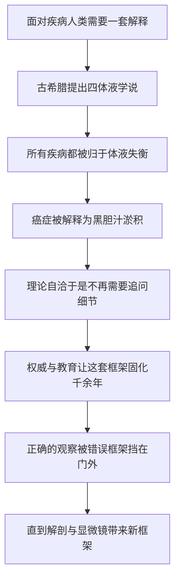

# 04｜为什么人类误解了癌症两千年？

> 一个优雅却错误的医学理论，如何统治了西方一千多年？

---

## 一、先说结论

因为古人用了一套**看似完美、实则没有解剖依据**的理论来解释一切疾病：四种体液。

按这套学说，人体由血液、黏液、黄胆汁、黑胆汁四种体液构成，健康是它们的平衡，疾病是它们的失衡。癌症，则被解释成黑胆汁淤积。这个说法自洽、优雅、能解释很多现象，于是被反复引用，在权威的加持下统治西方医学一千多年。

穆克吉借此说明一个深刻的道理：**错误的框架一旦被固化，就会长期阻挡正确的观察。** 让人停滞不前的，往往不是不够聪明，而是一个「太像对的」错误答案。

---

## 二、我们先理解一个问题

从古埃及到十九世纪，中间隔了数千年。

在这漫长的时间里，人类并不是没有见过癌症。医生们明明摸得到肿块，看得到溃疡，也知道有些病人会因此衰弱、死去。观察一直存在。

可问题是：**看见了同一个现象几千年，为什么对它的解释几乎原地踏步？**

> **阻碍认知的，究竟是观察能力不足，还是用来解释观察的理论本身错了？**

穆克吉在书里给出的回答，指向后者。他讲古希腊医学的那一段，其实是在讲一个更普遍的问题：理论如何塑造——或者说，如何扭曲——我们的眼睛。

---

## 三、作者到底提出了什么观点？

穆克吉的观点是：**人类误解癌症的时间之所以那么长，关键不在观察，而在解释框架。**

古希腊医学的核心是「四体液学说」。它不是胡编乱造，而是一套有内在逻辑的系统：四种体液对应四种性质，平衡即健康，失衡即生病。这个模型简单、统一，能把发烧、疼痛、情绪、体质全都装进去。

在这种框架下，癌症被归因为**黑胆汁过多或淤积**——一种偏冷、偏干、偏「沉滞」的体液聚集在身体某处，形成了硬块。

穆克吉强调，这套理论最大的问题不在于「错」，而在于它**错得让人满意**：

- 它能自圆其说，不需要再做进一步验证；
- 它足够普遍，可以解释任何疾病；
- 它被权威（尤其是盖伦）系统化、教条化，成了医学教育的标准答案。

于是，一代代医生在这套框架里勤奋工作，却始终没有真正逼近癌症的真相。

---

## 四、把这个观点翻译成人话

想象你开车出门，用的是手机导航。

如果地图数据是错的——比如一条路明明已经封了，它却还让你走——起初你可能察觉不到，因为它给出的指引依然「像模像样」：该左转左转，该直行直行，语气笃定，路线清晰。你甚至会觉得它很可靠。

直到你一次次撞进死路，才发现：**问题不在你的驾驶技术，而在地图本身。**

体液学说之于古代医学，就像一张错误的旧地图。它覆盖了所有道路，路线看起来合情合理，所以没人急着去质疑它。医生们在这张地图上走了一千多年，偶尔撞墙，也多半归因于「病人体质特殊」或者「病情太重」，而不是「地图错了」。

更麻烦的是，地图一旦被权威和教材固定下来，质疑它就要付出巨大代价——因为那意味着否定整个知识体系。

---

## 五、为什么会这样？

把穆克吉讲这段历史的逻辑整理成链条，是这样：

这条链里，**E 是最关键的一环。**

一个理论最危险的时候，不是它明显站不住脚的时候，而是它「太好用」的时候。当一套说法能解释一切，人们就不再需要去验证它——因为看起来没有验证的必要。这就是体液学说能维持这么久的心理机制。

穆克吉想说的，其实是一种认知陷阱：**一个包罗万象的框架，常常比一个局部的错误更顽固。** 因为它不是某一条知识错了，而是你看世界的镜片本身就偏了色。

---

## 六、举一个现实生活中的例子

有一个典型的类比是「地心说」。

在很长一段时间里，人们相信太阳绕着地球转。这个模型符合日常直觉——你每天确实看到太阳东升西落。它也能用来推算季节、指导农时，所以看起来相当有用。要推翻它，需要的不是更仔细地看天，而是**换一个参照系**。这个转变并不容易，因为它动摇了整个宇宙观。

医学史上也有类似的例子。建立在体液学说之上的**放血疗法**，据记载被广泛使用了很久，被用来治疗从发热到炎症的多种病症。医生们相信，把「多余的」血液放掉，就能恢复体液平衡。这个逻辑在当时的框架内是无懈可击的——问题在于，框架本身错了。

癌症的遭遇是同一个故事。只要你还相信疾病是体液失衡，那么治疗思路就只能是「调节体液」「排出黑胆汁」，而不是「研究细胞」「找到失控的增殖」。**方向错了，越努力越远。**

---

## 七、回到书中重新理解

现在再回看穆克吉讲的那两个名字，就容易理解了。

**希波克拉底**（大约公元前 400 年）用「karkinos」这个词来形容肿瘤。「karkinos」在希腊语里是「蟹」的意思——据推测，是因为某些肿瘤摸起来坚硬，周围有扩张的血管，像蟹一样伸出脚来抓住组织。通常认为，正是这一类比喻，经由拉丁语「cancer」，最终变成了今天全世界共用的这个词。

**盖伦**（大约公元 2 世纪）则把癌症系统化为「黑胆汁过剩」的结果。他的学说后来成为西方医学的权威，被沿用、被注释、被教授，长达一千多年。

穆克吉讲这些，并不是为了嘲笑古人。他真正想指出的是：**给一个东西命名，和真正理解它，是完全不同的两件事。** 我们至今还在用「蟹」这个比喻，但我们对它的理解，早已超越了那个形象。

---

## 八、这个观点背后还有什么？

这段历史背后，藏着两个更普遍的道理。

第一是**观察与理论的关系**。我们常以为「眼见为实」，可实际上，你看见什么，很大程度上取决于你带着什么理论去看。带着体液学说去看病人，你看到的是「黑胆汁淤积」；带着细胞学说去看，你看到的是「增殖失控」。**没有框架，你甚至不知道该观察什么。** 这就是为什么换框架比堆数据更重要。

第二是**权威的代价**。一个好的知识体系需要传承，但传承一旦变成教条，就会反过来压制质疑。盖伦本人的学说或许只是他那个时代的合理产物，真正让问题变严重的，是后来者把他当成不容置疑的标准答案。这种「权威化」的机制，在任何领域都存在。

---

## 九、这个观点有问题吗？

有几点需要保持清醒。

第一，**把体液学说一笔抹成「纯粹的迷信」，可能过于简单。** 它里面确实包含了一些后来被吸收的观察，比如对慢性刺激、炎症与病变关系的模糊直觉。它在当时是一个统一的解释尝试，而不是全然的胡说。用今天的标准去嘲弄古人，是一种「以今度古」的偏见。

第二，**「权威阻碍进步」这个说法容易过头。** 医学史上对盖伦的教条化，在很大程度上是后世机构（教育、宗教、行会）的选择，不完全是盖伦本人的责任。把两千年停滞全部怪到一个古人头上，会简化复杂的历史。

第三，**框架错误是否真的能解释「两千年没进展」，也有不同看法。** 有研究者认为，古代医学在解剖、外科技术、药物经验上也有不少积累，只是癌症这个特定问题太难。**说「方向全错了」是一种戏剧化概括，真实历史可能更接近「在错误的大框架里，也做了许多有限但真实的积累」。**

所以更准确的表述是：体液学说确实长期禁锢了理解，但它不是唯一原因，也不是一段可以被简单定性的历史。

---

## 十、今天再看这个观点

（以下为现代延伸，非穆克吉原文）

「错误框架阻挡观察」这件事，并不是古代才有的问题。

现代医学里同样存在范式之争。当一个疾病已被主流解释（比如某种「单一机制」的理论），不符合这个解释的证据，往往会被忽略、被当成例外、被延迟接受。科学史上反复出现这样的情形：新证据早就在那里，但直到旧框架崩解，人们才真正「看见」它。

这一点对今天同样有警示意义。在生物医学研究中，一个流行的假设可能主导很多年的方向和资源分配；在更广的领域也一样——商业、技术、公共政策中，都可能有各自版本的「体液学说」，既能自圆其说，又会挡住别的东西。

穆克吉这段历史的现实价值，或许不在医学，而在思维：**定期追问「我们正在用的框架，会不会本身就有问题」，比埋头在框架里努力更重要。**

---

## 十一、这一篇真正应该记住什么？

1. **障碍不是「没看见」，而是「解释错了」。** 人类很早就观察到癌症，却长期用错误的框架去理解它。

2. **四体液学说是优雅但无解剖依据的理论。** 它把疾病归为体液失衡，把癌症归为黑胆汁淤积，却能自圆其说。

3. **「能解释一切」恰恰是最危险的特征。** 当一套理论看起来无所不能，人们往往就不再去做验证。

4. **命名不等于理解。** 「癌」来自希腊语的「蟹」，这个比喻流传至今，但真正的理解要靠后来的科学。

5. **框架会塑造你看见什么。** 换框架往往比堆证据更重要，这一点在医学之外同样成立。

---

## 十二、留一个问题

既然「黑胆汁」从头到尾都是错的，那么，人类究竟要到什么时候，才能真正在正确的层面上看清癌症？

> **不是把它当成一种「体液」，也不是把它当成一个「肿块」，而是看见它真正的身份——一个出错的细胞。**

要走到这一步，需要一件工具，也需要一次观念革命。

下一篇，我们就来看看十九世纪的魏尔啸，是如何把癌症拉回到细胞层面的：**癌症到底是什么？——一个细胞的「叛变」。**
