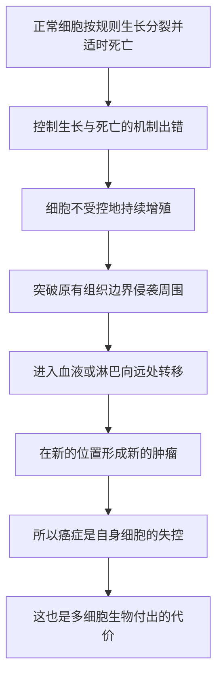

# 05｜癌症到底是什么？——一个细胞的「叛变」

> 如果癌症不是黑胆汁，也不是外来怪物，那它在最底层究竟发生了什么？

---

## 一、先说结论

十九世纪的病理学家魏尔啸，把癌症从「体液」和「肿块」的层面，拉回到了**细胞**层面。

他确立了细胞病理学的核心原则：**细胞来自细胞**。所有细胞都来自已有的细胞，所以肿瘤细胞也不例外——它来自病人自己的身体。癌症的本质，是细胞不受控制地增殖、侵入周围组织、并经由血液或淋巴转移到远处。

穆克吉由此得出全书最重要的判断之一：**癌症不是外来的怪物，而是正常生长机制失控后的产物**——这是多细胞生物为「协作」付出的代价。

---

## 二、我们先理解一个问题

在显微镜和细胞学说出现之前，没有人真正「看见」癌症的最小单位。

古人摸到的是肿块，看到的是溃疡，推断出的是「黑胆汁」。这些都是肉眼层面的现象。可癌症在肉眼之下的那层真相，一直藏在视野之外。

> **当医学终于能看见细胞时，它看见了什么？**

这个问题的答案，不仅回答「癌症是什么」，也解释了一个更根本的困惑：为什么这个病如此难以根治。因为答案很可能是——**它就是我们自己。**

---

## 三、作者到底提出了什么观点？

穆克吉借魏尔啸的观点指出：**癌症是细胞层面的疾病。**

十九世纪，魏尔啸提出细胞病理学，并留下那句著名的拉丁文原则：「omnis cellula e cellula」——**细胞来自细胞**。它的意思是：新细胞只能由已有细胞分裂产生，不存在凭空出现。

这句话的医学含义极其重大：

- 如果所有细胞都来自已有细胞，那么肿瘤细胞也来自病人自己的细胞；
- 既然来自自己，它就不是入侵者，而是「内部叛变」；
- 于是研究癌症的正确入口，不再是体液或情绪，而是细胞与它的生长规则。

在此基础上，穆克吉概括了癌细胞的三项核心行为：**无限增殖、侵袭周围组织、向远处转移。** 这三件事，构成了癌症之所以致命的根本。

此外，据记载，魏尔啸还注意到慢性炎症与癌症之间存在关联——这为后来「环境与炎症因素致癌」的研究埋下了伏笔。

---

## 四、把这个观点翻译成人话

想象一家公司。

正常运作时，每个部门都有自己的职责和边界：该招人时招人，该停就停，员工老了、离职了，岗位就补充新人。整个组织的规模，始终被制度和流程控制在一个合理范围内。

现在假设某个部门出了问题。

它开始不停地招人，明明已经不需要人手了还在扩张；它不再遵守部门边界，把办公区越占越大；更糟的是，它把自己的人派到别的城市、别的部门去，在那些地方也复制出一模一样的「失控部门」。

结果是：原来的部门还在，新占的地方也越长越大，整个公司被拖垮。

癌细胞的行为，就是这个失控部门的行为。**它没有变成「别的东西」，它还是你身体里的细胞——只是失去了「该停就停」的控制。** 这就是为什么穆克吉说，癌症不是外来物，而是自身的失控。

---

## 五、为什么会这样？

把魏尔啸和穆克吉的逻辑整理成链条，是这样：

这条链里，**B 是最关键的一环。**

正常细胞其实受着一套复杂的约束：什么时候该分裂，什么时候该停，什么时候该自我了结——都有信号在管。癌症并不需要发明全新的能力，它只需要**让这些约束失灵**。用一句话概括：正常的生长机制被解除管制，而不是体内多了一种新东西。

这也解释了为什么「癌细胞来自自己」如此重要：如果它来自外面，我们可以用毒药杀死它而不心疼；可它来自自己，杀它和杀自己几乎无法彻底分开。**这是癌症治疗一切困难的根源。**

---

## 六、举一个现实生活中的例子

想想你手指上划破的一道口子。

受伤之后，伤口周围的细胞会开始分裂，把缺口补上；还可能长出一些新的小血管，为修复运送养分。几个星期后，伤口愈合，细胞**停了下来**——不会无限长下去，否则你的手指就会一直膨胀。

正常的分裂、修复、停止，是一套精确协调的过程。

癌症更像这套过程「关不掉的版本」。细胞继续分裂，却不执行停止的指令；不仅填满伤口，还越过边界，长到不该长的地方去。

换一个花园的比喻：一片花园里，每株植物都有自己的生长节奏，浇水、修枝、季节交替，一切井然有序。某一天，其中一株植物的生长调节失灵了，它不断分蘖、疯长，根系向四周蔓延，挤掉旁边植物的位置；它的种子还随风飘到别的花圃，在那里重新扎根。

关键在于：**这不是外来的杂草种子入侵，而是自家的一株植物失去了控制。** 它就是你花园的一部分，只不过不再遵守规则了。

---

## 七、回到书中重新理解

现在再回看穆克吉为什么把魏尔啸放在全书的关键位置，就明白了。

在魏尔啸之前，癌症的解释停留在体液、气质、神秘力量上；在魏尔啸之后，它第一次有了一个可以被研究、被观察、被追问的落点——**细胞**。这不是一个细节上的修正，而是一次坐标系的更换。

穆克吉讲这段历史，其实是在完成一次「收网」：前面几篇讲古人怎么误解了癌症，这一篇终于给出了正确的图景。它把癌症从「不可名状的厄运」，变成了「一组可以被描述的生物学行为」。

更重要的是，这个图景同时解释了癌症的两面：**它既可怕，又不神秘。** 可怕在于它来自自己、难以彻底清除；不神秘在于，它的每一步——增殖、侵袭、转移——都是可以被具体研究的。

穆克吉认为，正是在这个层面站稳之后，后来所有关于致癌物、基因、靶向药的努力，才有了出发的地方。

---

## 八、这个观点背后还有什么？

这里藏着一个比癌症本身更宏大的判断：**癌症是「多细胞」的代价。**

单细胞生物不必担心癌症——它本来就是独立生存、独立增殖的，没有需要遵守的协作规则。而多细胞生命之所以能存在，依靠的是无数细胞愿意分工、克制分裂、按时死亡。规则越精密，组织就能越复杂；但反过来，规则越精密，出错的机会也越多。

换句话说，人体的复杂，本身就意味着更高的失控风险。我们为了成为「多细胞生物」，就必须接受这个代价。

这也顺带解释了另一个现象：**癌症为什么和年龄如此相关。** 细胞分裂的次数越多、活得越久，累积出错的机会就越大。从某种意义上说，癌症是长寿的一种「统计学账单」。

---

## 九、这个观点有问题吗？

有几处需要留心。

第一，**细胞层面的描述解释了很多，却没有回答「为什么会出错」。** 魏尔啸把癌症定位在细胞，但真正让细胞失控的原因，要到基因层面才逐渐清楚。所以这一篇给出的是正确的问题坐标，而不是完整的答案。相关故事，在后面的分子革命里才会展开。

第二，**「癌症是自身的失控」这个说法，也容易被误读成「所以只能怪自己」。** 有人会顺势推断：既然是自己的细胞出错，那得癌是不是就等于「身体背叛了自己」，甚至要归咎于生活方式？这在科学上和伦理上都不成立。失控的诱因可能来自环境、随机突变、遗传易感等多种因素，远不是个人能完全掌控的。

第三，**魏尔啸提出的部分联系，后来的研究有增补也有修正。** 他注意到慢性炎症与癌症的关联，这个方向后来被大量研究支持，但「炎症如何导致癌症」的具体机制，此后仍有长期争论。把当年的直觉直接等同于今天的结论，也是一种拔高。

所以更稳妥的说法是：**魏尔啸给了癌症一个正确的落点，但这个落点之下还有更深的层次等待打开。**

---

## 十、今天再看这个观点

（以下为现代延伸，非穆克吉原文）

在魏尔啸之后，对「癌细胞到底做了什么」的研究越走越细。

后来有研究者把形形色色的癌细胞能力归纳成若干共同的「标志」——比如无限增殖、逃避生长抑制、抵抗程序性死亡、诱导新生血管、侵袭与转移、获得复制上的永生化等等。这相当于在魏尔啸的细胞图景上，又画了一张更系统的能力地图，把纷乱的癌症研究收拢成一个可理解的整体。

再往后，测序技术让人们可以直接读出肿瘤 DNA 里的突变，甚至看到同一个肿瘤内部不同细胞之间的差异。今天我们对癌细胞的理解，已经细到分子和基因的层次。

但底层判断没有变，反而被反复印证：**癌症不是外来的怪物，它就是我们自己的细胞，丢了约束。** 现代研究做的，是把「丢了什么约束」这件事，一条一条查清楚。而这也意味着，只要细胞还要分裂，这个问题就不会有一个「彻底终结」的答案。

---

## 十一、这一篇真正应该记住什么？

1. **癌症的落点是细胞。** 魏尔啸确立「细胞来自细胞」，把癌症从体液和肿块拉回到细胞层面。

2. **它来自自己，而不是外面。** 肿瘤细胞由病人自身细胞变来，所以「彻底清除」和「不伤害自身」几乎无法分开。

3. **核心行为是三件事：增殖、侵袭、转移。** 不受控地长、突破边界、跑到远处重新扎根，是癌症致命的根本原因。

4. **癌症是多细胞生命的代价。** 分工与克制让复杂生命成为可能，也带来了失控的风险；细胞分裂越多，风险越高。

5. **它可怕，但不神秘。** 一旦落在细胞层面，癌症的每一步都成了可以被研究、被追问的生物学问题。

---

## 十二、留一个问题

现在我们已经知道，癌症是自身细胞的失控。

那么一个很自然的问题就来了：

> **如果癌细胞就在身体里，而且早期往往只是一个局部的肿块，为什么最早的抗癌思路，会是不惜代价地把它「切得越干净越好」？**

十九世纪末的外科医生，为什么会对「切得越多，治愈机会越大」如此深信不疑？这套逻辑在当时有什么道理，后来又为什么会崩塌？

下一篇，我们进入外科时代：**为什么最早的抗癌疗法是「切得越多越好」？**
