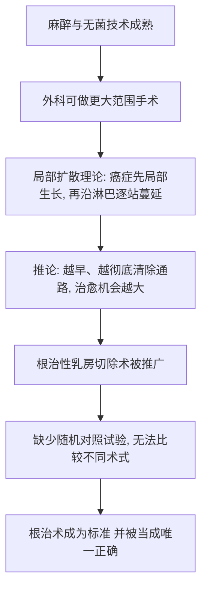

# 06｜为什么最早的抗癌疗法是「切得越多越好」？

> 本文要解决一个问题：在没有化疗、没有放疗的年代，外科医生为什么会相信，把肿瘤连着周围组织切得越干净，病人就越有救？

---

## 一、先说结论

十九世纪末，美国外科医生威廉·霍尔斯特德提出并推广了一种极其彻底的手术——根治性乳房切除术：不只切掉乳房，还连同胸大肌、胸小肌和腋窝淋巴结一起整块切除。这个做法在当时并不是愚昧或残忍，而是建立在一个看起来非常严密的推论上：癌症先在最开始的地方生长，然后沿着淋巴管一站一站向外扩散。既然是「一路走出去」的，那把癌细胞可能经过的整条路提前清空，就等于把它堵死在门口。穆克吉认为，这套逻辑在当时的医学框架内几乎无懈可击，因此它统治了外科将近半个多世纪。

---

## 二、我们先理解一个问题

要理解这个观点，得先回到十九世纪的手术台前。

在那之前，外科手术受两道枷锁束缚：**疼痛**和**感染**。病人常常在剧烈的痛苦中被按住动刀，医生则必须在几分钟内完成操作；而手术后伤口化脓几乎是常态。

1846 年前后，乙醚麻醉在美国麻省总医院被成功演示（据记载演示者是牙医威廉·莫顿），病人第一次可以在无痛中接受手术。此后几十年，消毒、灭菌、无菌手套等技术逐步推广——据记载，霍尔斯特德本人也推动了外科手套的使用。这两件事解放了外科医生：**他们第一次可以慢下来，切进去，切得更大。**

于是问题自然浮现：既然我能切得更多，那到底切多少才算够？

当时的答案不是「切到刚好」，而是「切到彻底」。而这个答案背后，是一整套关于癌症如何扩散的理论。

---

## 三、作者到底提出了什么观点？

穆克吉在书中讲述：霍尔斯特德在约翰斯·霍普金斯医院推广的根治性乳房切除术，核心主张是——**乳腺癌是一种局部疾病，它先在原发灶生长，再沿淋巴管按站点向外蔓延。** 因此，治愈的关键是把原发灶，以及它可能途经的所有组织，一次性、整块地清除。

手术范围后来甚至进一步扩大，尝试连同锁骨上、纵隔的淋巴结一并清扫。

这里必须区分两件事：

- **这是当时外科界的主流观点**，霍尔斯特德是它的代表人物；
- 穆克吉是在**转述并分析**这段历史，而不是在为它辩护。他真正想追问的是：一个逻辑上成立的理论，为什么可能带着整个行业走错半个世纪？

---

## 四、把这个观点翻译成人话

想象你发现家里的墙角在渗水。

你判断：水一定是从某一个裂缝进来，然后沿着墙体里的缝隙往外扩。于是你的方案是——既然不知道水会走哪条路，那就把整面墙都砸掉，把墙里的管线全部换掉。这样最保险。

这个判断在逻辑上没毛病。问题在于，你从来没有验证过：**水到底是不是从这面墙来的？** 如果真正的问题在地下主管道，那么砸墙只是砸墙，墙砸得越多，代价越大，而漏水的位置一点没变。

霍尔斯特德的逻辑，本质上是这个「砸墙」逻辑的外科版：在不能确定癌症从哪里、以什么方式扩散的前提下，用「切得足够多」来换取「不漏」。

---

## 五、为什么会这样？

把这段历史拆成推理链条：

关键在于 F 这一步：**当时没有工具，能公平地比较「切得多」和「切得少」到底哪个更好。** 外科医生看到的是接受大手术后的病人，看不到「如果只做小手术，会不会结果一样甚至更好」。经验本身无法回答这个问题，因为疾病有它自己的走向，而人会天然地把功劳归给最近做的那次干预。

---

## 六、举一个现实生活中的例子

再想想修剪树枝。

院子里有一棵树，某个枝干上出现了病斑。你担心病菌会沿着枝杈扩散，于是把整条枝干锯掉，甚至把旁边看起来还健康的枝条也一起锯了。第二年，病斑没有出现在原来那个位置，你就认定：**锯得对，锯得好。**

可是你有没有问过：如果不锯，树会不会也自己愈合？或者病斑其实来自根部，锯枝根本没有用？

只凭「手术后看起来不错」来评价手术，就像只凭「锯完那一下没看到病斑」来评价修剪。**没有对照组，你分不清是治疗起了作用，还是疾病本来就会那样走。**

---

## 七、回到书中重新理解

现在再回看霍尔斯特德，你会发现他是个矛盾的人物。

一方面，他是技术上的开拓者：精细解剖、严格无菌、推动手套使用，把外科手术的专业水准整体抬高了。另一方面，**他也是那个时代理论的囚徒**——他真诚地相信癌症是局部病，因此真诚地相信切得越大越安全。

穆克吉写这一段，不是为了嘲笑前人愚蠢，而是想让我们看见一个更普遍的困境：

> 当一个人的理论足够自洽、地位足够权威、又缺少反驳它的工具时，错误可以长期被当成真理。

根治性乳房切除术后来被扩展到更激进的版本，被写进教科书，成为年轻外科医生必须掌握的标准操作。许多人一生都在做这台手术，并真心认为自己在挽救生命。

---

## 八、这个观点背后还有什么？

这里有几个隐含前提，当时的人几乎没有意识到：

1. **「癌症是局部病」是假设，不是事实。** 整个手术方案都建立在它之上。
2. **「医生看得见的范围」被等同于「疾病存在的范围」。** 切缘干净，就被当成治愈。
3. **缺少对照，经验无法自我纠错。** 医学在这时主要靠权威和观察，而不是靠比较。
4. **手术的成功被用短期结果衡量。** 伤口愈合、局部不再复发，被当成胜利；病人的长期生存反而没被认真追问。

这些前提里，最要命的是第三点。它意味着：即使根治术并不比小手术更好，行业也几乎不可能自己发现这一点。

---

## 九、这个观点有问题吗？

从今天的证据看，更大范围的手术并没有带来与之相称的生存改善，反而造成了巨大的身体创伤和心理代价。这是医学界后来的共识。

但评价时必须公平：

- 在霍尔斯特德的时代，**根治术也许是当时条件下最合理的猜测**。他不是在明知错误的情况下推广它。
- 对一部分局部病变、尚未扩散的患者，彻底切除确实可能有帮助。问题不在「手术有没有用」，而在「范围是不是越大越好」。
- 真正的争议点，其实不是霍尔斯特德这个人，而是**一种方法论**：用权威和直觉代替对照证据。

所以，与其说这是「一个错误的人」，不如说这是「一个缺少纠错机制的时代」。

---

## 十、今天再看这个观点

（以下为现代延伸，非穆克吉原文）

今天的乳腺癌治疗，早已不是「切得越多越好」。保乳手术加放疗、前哨淋巴结活检等做法，用更小的手术范围取得了不逊色的结果。**手术仍然是许多实体肿瘤最重要的根治手段，但「切多少」不再由直觉决定，而由证据决定。**

这个转变的意义，超出了乳腺癌本身。它提醒我们：在任何领域，当「做得更彻底」看起来天然更安全时，都要多问一句——**我们有没有一种方法，能公平地比较「更彻底」和「刚好够」？**

---

## 十一、这一篇真正应该记住什么？

1. **根治术的逻辑在当时是自洽的。** 它的前提是「癌症先局部扩散、再沿淋巴蔓延」，在这个前提下，切得越大确实越像是对的。

2. **麻醉与无菌技术是外科扩张的前提。** 没有无痛、无感染的手术，就不可能出现范围越来越大的根治术。

3. **没有对照，经验无法自我纠错。** 医生只能看到做了手术的病人，看不到「不做这么大手术会怎样」。

4. **权威可以让错误长期延续。** 一个被教科书固化的理论，会让整整几代人真诚地重复同一个错误。

5. **问题往往不在人，而在方法。** 真正需要被质疑的，是「用直觉和权威代替证据」这件事本身。

---

## 十二、留一个问题

如果「切得越多越好」是错的，那医生们究竟是怎么发现这一点的？

在没有互联网、没有大数据、连统计方法都还很粗糙的年代，他们要凭什么，才能判断一台大手术并不比一台小手术更好？

下一篇，我们就来看医学史上一次关键的转身：**随机对照试验**——以及它如何把「癌症是局部病」的旧观念，翻转为「癌症从一开始就是全身性疾病」。
