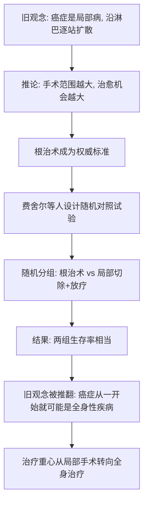

# 07｜「根治术」为什么统治了半个多世纪，又为什么被推翻？

> 本文要解决一个问题：如果切得越多越好，为什么更彻底的手术并没有带来更高的治愈率？一个统治了半个世纪的做法，究竟是被什么打败的？

---

## 一、先说结论

更大范围的根治术并没有带来与之相称的生存改善，却给病人留下了巨大的创伤。真正推翻它的，不是某位权威的一声号令，而是一种新工具——**随机对照试验**。伯纳德·费舍尔等人在上世纪七八十年代通过随机对照试验发现，乳房局部切除加放疗，与根治术的生存率相当。这个结果把「癌症是局部病」的旧观念，扭转为「癌症从一开始就可能是全身性疾病」。穆克吉认为，这不只是一次手术方式的更替，而是医学从「听权威」走向「看证据」的转折。

---

## 二、我们先理解一个问题

上一篇我们留下了一个悬念：如果根治术并不比小手术更好，那医学界是怎么知道的？

这听起来像是个简单问题，其实非常难。因为要判断「一台大手术是否比小手术更好」，你会遇到一堆干扰：

- 病人本来就有轻有重，重的被安排做大手术，结果差，能怪手术吗？
- 做手术的医生往往是最有经验、最相信这台手术的人，他的热情本身就会影响判断；
- 病人如果知道「自己用的是最新最彻底的方法」，心理上也会更乐观。

换句话说，**光靠观察和资历，永远分不清是治疗有效，还是别的因素在起作用。** 要回答这个问题，医学需要一种能主动排除这些干扰的方法。

---

## 三、作者到底提出了什么观点？

穆克吉在书中讲述了这场转变。其核心人物是美国外科医生伯纳德·费舍尔。他主持的美国乳腺与肠道外科辅助治疗研究项目（NSABP），在上世纪七八十年代开展了一系列**随机对照试验**，直接比较「根治术」和「范围更小的局部切除加放疗」。

据记载，结果显示：**局部切除加放疗的生存率，与根治术相当。** 与此同时，意大利也有团队做了类似方向的比较研究。

费舍尔由此提出了一个颠覆性的解释：乳腺癌可能**从一开始就是一种全身性疾病**。肿瘤细胞也许在很早期、甚至在做手术之前，就已经通过血液或淋巴离开了原发灶。既然如此，把乳房周围切得再大，也解决不了已经跑出去的细胞。

医学界普遍认为，这一系列试验是循证医学的重要里程碑。它改变的不只是乳腺癌的手术方式，而是整个肿瘤治疗的思想方向。

---

## 四、把这个观点翻译成人话

想象你家的天花板在滴水。

你笃定问题就在天花板上方那一小段水管，于是把那一块天花板和管子全砸了、全换了。可水还在滴。

这时候有个人说：先别砸了，我们先把整栋楼的水管系统查一遍，看看是局部堵，还是整个管网压力出了问题。

结果一查，是楼下主管道堵了。你砸的那块天花板，白砸。

费舍尔的发现，大致就是这个意思：**如果肿瘤在最早的时候就已经是「整个管网」的问题，那么只盯着「局部天花板」（乳房周围组织）去砸，方向就错了。**

根治术的问题不在于「切」，而在于它假设错了——它假设癌症是一个从中心向四周慢慢爬的局部问题。

---

## 五、为什么会这样？

把这场推翻拆成链条：

这条链里，最关键的一步是 D 和 E：**不是靠说服，而是靠设计。** 随机分组把病人公平地分到两组，剥离了「病人轻重不同」「医生偏好」「病人心理」这些干扰。只有当两组唯一的主要区别是手术方式时，结果的差异才真正可以归因于手术本身。

这也解释了为什么费舍尔的结论能战胜霍尔斯特德的权威：**证据一旦可以被重复，就不再依赖谁的名气更大。**

---

## 六、举一个现实生活中的例子

再换一个更贴近日常的场景。

家里的厨房下水道时堵时不堵。你每次都用同一招——拿棍子狠狠捅水槽下面那一段管子，捅完确实通了。

于是你得出结论：堵点就在这一段，捅得越猛越好。

直到有一天，请来一位师傅。他没有马上捅，而是先问：是所有下水都慢，还是只有水槽慢？是每次堵的时间有规律吗？然后他从整栋楼的横管开始排查，发现真正的问题在更远的公共管段。

师傅做的事，和随机对照试验做的事情很像：**他不是更聪明，而是换了一种「先比较、先排除、再下结论」的方法。** 如果没有这套方法，你永远只会相信自己那根棍子。

---

## 七、回到书中重新理解

现在回看这段历史，你会发现它有两层意义。

**第一层是医学意义**：根治术被更小的手术取代，病人少受了大量痛苦。乳房局部切除加放疗，后来逐渐成为许多早期乳腺癌的标准选择之一。

**第二层是方法论意义**：这场胜利真正的功臣，不是某把更锋利的手术刀，而是**随机对照试验**。它意味着医学开始承认：个人的经验、权威的判断，可能都是不可靠的；只有经过公平比较的证据，才值得信赖。

穆克吉把这一段放在外科时代的结尾，其实是在为整本书埋下一个更大的转折：**如果癌症从一开始就是全身性的，那么光靠外科医生切，永远切不干净。** 真正需要的，是能进入血液、跑遍全身去作战的武器。

---

## 八、这个观点背后还有什么？

这里有几个值得注意的深层前提：

1. **「全身性疾病」这个观念，是后面所有化疗的理论地基。** 药物之所以可能有用，正因为癌症不只待在一个地方。
2. **随机对照试验是一种「制度性的怀疑」。** 它假设人类会被偏见欺骗，因此用程序来防止偏见。
3. **证据能战胜权威，但过程很慢。** 费舍尔的结论并非一夜之间被接受，据记载，当时学界曾有过相当激烈的争论。
4. **医学的重心，从「医生能做什么」转向了「什么真的有效」。** 这是一个根本性的立场变化。

---

## 九、这个观点有问题吗？

随机对照试验极其重要，但它也不是万能药。

- **它给出的是「平均效应」。** 一组人的平均结果，可能掩盖了个体差异。对某些患者，更大的手术也许确有必要。
- **外科试验特别难做。** 医生和病人都很难接受「随机决定你做不做大手术」，因此这类研究的数量和设计都受限制。
- **结论容易被过度解读。** 「局部切除加放疗与根治术相当」，不等于「手术范围越小越好」，更不等于「手术没用」。手术依然是许多实体肿瘤最有效的根治手段。
- **当时的争论本身也有合理成分。** 一些医生担心缩小手术会导致局部复发增加，这种谨慎并非全无道理。

所以，争议的焦点其实是：**如何从「平均而言区别不大」的统计结论，推回到「眼前这一位病人该怎么做」。** 这个问题，今天的医学仍在处理。

---

## 十、今天再看这个观点

（以下为现代延伸，非穆克吉原文）

今天，「用证据说话」已经成为医学的默认规则。新药、新手术、新方案要上市，通常必须拿出随机对照试验的数据。乳腺癌的治疗更是走向了细分：不只是「切多少」，还要看肿瘤的分子类型、基因特征，来决定是否需要化疗、内分泌治疗或靶向治疗。

不过，现代医学也在反思随机对照试验的边界：当一种罕见病只有极少数患者时，当患者自己强烈偏好某种方案时，当「对照组」在伦理上难以接受时，单纯依靠经典试验会变得困难。于是，真实世界数据、单臂试验、适应性设计等方法逐渐被引入。

**费舍尔留下的真正遗产，也许不是某个具体结论，而是一种态度：越是看起来理所当然的疗法，越应该被认真地质疑一次。**

---

## 十一、这一篇真正应该记住什么？

1. **根治术的失败，首先是理论的失败。** 它错在假设癌症是局部病，而不是错在手术本身不够精细。

2. **随机对照试验是这场转变的关键工具。** 它用随机分组排除干扰，让「哪种方法更好」第一次成为可被公正回答的问题。

3. **癌症从一开始就可能是全身性疾病。** 这个观念一旦成立，局部手术的极限就暴露出来了。

4. **证据可以战胜权威，但需要很长时间。** 费舍尔的结论曾引发激烈争论，接受它靠的是不断累积的重复证据。

5. **「平均有效」不等于「对你有效」。** 统计结论要落到具体病人身上，仍需要医生的判断与病人的选择。

---

## 十二、留一个问题

既然癌症从一开始就可能跑遍全身，那么无论多大多彻底的手术，都只是处理了「看得见的那部分」。

问题来了：有没有可能，找到一种能进入血液、追着全身癌细胞跑的武器？

而且更奇怪的是——这种武器的第一条线索，居然来自战场上的**化学武器**。

下一篇，我们就来看看：**战争是如何意外催生了化疗的。**
