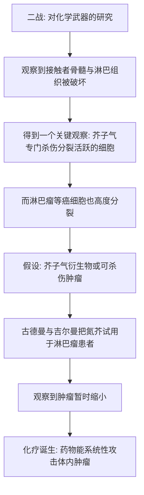

# 08｜战争如何意外催生了化疗？

> 本文要解决一个问题：第一种真正意义上的抗癌药，为什么竟然来自战场上的化学武器？

---

## 一、先说结论

第二次世界大战期间，研究人员在研究芥子气这类化学武器时，意外发现它能特异性地破坏人体的骨髓和淋巴组织。耶鲁大学的古德曼与吉尔曼据此把芥子气的衍生物——氮芥，用于淋巴瘤患者，据记载观察到肿瘤暂时缩小。这是人类第一次证明：**药物可以进入人体、缩小肿瘤。** 化学治疗（化疗）由此诞生，一段「以毒攻毒」的历史正式开始。穆克吉认为，这件事的意义不在于它治好了谁，而在于它打开了一扇门——原来癌症可以被化学物质主动攻击。

---

## 二、我们先理解一个问题

要理解这件事，先要接受一个反直觉的事实：**人类的第一种抗癌药，是从杀人武器里找出来的。**

这听起来很矛盾。我们通常期待药物是「干净的」「对症的」，怎么会用毒气去治病？

而且更奇怪的是，芥子气伤害的是骨髓和淋巴组织——这明明是一种「伤害」，怎么反而变成了「治疗」？

这里的关键在于一个当时刚刚被注意到的巧合：**癌细胞和骨髓、淋巴组织有一个共同点——它们都在疯狂地分裂。** 而芥子气恰好专门杀伤分裂活跃的细胞。也就是说，它的「毒性」并不是随机的，而是有选择性的。

这，就是化疗的全部起点。

---

## 三、作者到底提出了什么观点？

穆克吉在书中讲述了这段历史。据记载，二战期间，科学家对芥子气等化学战剂的生物学效应进行了大量研究，并观察到：接触者体内的骨髓和淋巴组织受到了严重破坏。

耶鲁大学的药理学家路易斯·古德曼与阿尔弗雷德·吉尔曼，大约在上世纪四十年代，把芥子气的衍生物——**氮芥**，用于淋巴瘤患者。据记载，他们观察到肿瘤出现了暂时的缩小。

穆克吉认为，这一小步具有划时代的意义：**它第一次证明，药物能够系统性地攻击人体内的肿瘤。** 「化疗」这个概念——用化学物质治疗癌症——从此不再只是幻想。

这里要区分两点：

- **历史事实层面**：芥子气能破坏骨髓和淋巴组织，氮芥曾被试用于淋巴瘤，并观察到肿瘤缩小；
- **穆克吉的解读层面**：他把这件事看作化疗诞生的起点，看作「以毒攻毒」思路的开端。

至于这是否算一次严格意义上的「成功治疗」，需要谨慎——它带来的是短暂缩小，而不是治愈。

---

## 四、把这个观点翻译成人话

想象你有一块田，田里长满了杂草，还混着你辛苦种下的庄稼。

你找到一种除草剂，它能杀死分裂生长最快的植物。而杂草恰恰长得比庄稼快。

于是你喷下去：**大部分杂草被抑制了，庄稼也受了一些伤，但还活着。**

这就是化疗的基本逻辑。它并不是精确制导的导弹，而更像一种「偏向性杀伤」——利用癌细胞「长得快」这个特点，去打一个它比正常细胞更扛不住的弱点。

但问题也随之而来：**你身体里还有很多正常细胞，也长得很快。** 比如骨髓里造血细胞、毛囊、口腔和肠道的黏膜。所以化疗会掉头发、会贫血、会恶心。这不是意外，而是这套逻辑的必然代价。

「以毒攻毒」这四个字，说的正是这种既有效又伤身的双重性。

---

## 五、为什么会这样？

把这条发现链拆开：

链条里最反直觉的一步是 C 到 D：**「有毒」和「有用」之所以能连起来，靠的是对细胞行为的理解，而不是运气。** 研究者不是在赌，而是抓住了一条规律——分裂越快的细胞，越容易成为这类毒物的靶子。

这也埋下了化疗与生俱来的矛盾：**正因为它针对的是「长得快」，它就无法只打癌细胞，不打正常细胞。** 治疗与伤害，从第一天起就绑在一起。

---

## 六、举一个现实生活中的例子

除草剂这个例子可以再具体一点。

一位果农的果园里，杂草疯长，抢走了果树的水和肥。他试过用手拔，但拔不干净，很快又长满。

后来他用了除草剂。第一次喷完，杂草大面积枯黄，果树也蔫了几天，但缓了过来。果农非常兴奋：**原来可以「不靠人工、大范围地」控制杂草。**

但他很快发现：杂草过几个月又长出来了；而且剂量稍微高一点，果树就受伤；有些杂草慢慢变得不怕这种药了。

这几乎就是早期化疗的完整剧本：**第一次尝到系统性打击的甜头，随后发现它不精准、有代价、且容易失效。**

果农的成功不在于「一次除干净」，而在于他找到了一种全新的、可以覆盖整片田的手段。

---

## 七、回到书中重新理解

现在再回看这段历史，你会发现穆克吉讲述的重点，并不在「氮芥治好了某些人」。

他真正想让我们看到的，是三个连续的转变：

1. **从「外科」到「内科」**：治疗癌症不再只能靠刀切，而可以用药物在全身循环。
2. **从「局部」到「全身」**：这与上一篇费舍尔「癌症是全身性疾病」的观念，正好接上——既然癌细胞会跑遍全身，那就需要能跑遍全身的药。
3. **从「治愈」到「缓解」**：早期化疗带来的往往是暂时的缩小，而不是痊愈。这让医学第一次直面一个残酷的事实——**杀得掉，不等于杀得完。**

所以，氮芥的价值，与其说是一种药，不如说是一个**概念证明**：它告诉全世界，化学物质可以在人体内与肿瘤交战。

---

## 八、这个观点背后还有什么？

有几点深层含义：

1. **「选择性毒性」是化疗的核心思想。** 药物不是靠杀死一切取胜，而是靠利用癌细胞与正常细胞的差异。
2. **副作用不是意外，而是原理的一部分。** 凡是快速分裂的正常组织，都会被牵连。
3. **治疗窗的概念浮现出来。** 所谓「够毒但不毒死病人」，就是在有效与有害之间找一条窄缝。
4. **战争与医学的关系是双面的。** 同一批关于毒气的研究，一边是屠杀，一边却意外打开了治疗之门。科学成果的价值，往往取决于被用在何处。
5. **早期证据还很薄弱。** 那时的观察样本很小，也没有严格的对照试验，所以「肿瘤缩小」与「病人活得更久」是两回事。

---

## 九、这个观点有问题吗？

需要保持几层清醒：

- **「肿瘤缩小」不等于「活得更久」。** 早期的观察样本极小、缺少对照，只能证明药物对肿瘤有可见的作用，还不能证明它延长了生命。
- **氮芥并非治愈性药物。** 它带来的多是短暂缓解，肿瘤往往很快卷土重来。
- **以毒攻毒存在伦理争议。** 用原本用于战争的毒物去治疗病人，其风险与知情同意问题，一直令人不安。
- **它的来源并不光彩。** 化学武器研究本身是战争的产物。承认它的科学价值，不等于认同它的来路。

但反过来也有一层值得保留：**如果因为来源不光彩就全盘否定，我们也就失去了癌症治疗的第一块台阶。** 争议真正指向的，是我们该如何对待「从恶中长出的善」。

---

## 十、今天再看这个观点

（以下为现代延伸，非穆克吉原文）

早期化疗药里的一些思路今天仍在延续。氮芥所属的「烷化剂」类药物，经过结构改良后，仍是某些肿瘤治疗方案中的组成部分。

而更大的影响在于，化疗确立了三条后来的研究主线：

- **找到更有选择性的药**——从「广撒网」走向靶向治疗；
- **控制副作用**——用支持治疗让病人扛得住毒性；
- **对付耐药**——这也是下一篇要讲的核心难题。

同时，化学武器与医学的关系也留下了持久的伦理课题：研究成果该不该有禁区？由战争催生的医学进步，该如何被评价？这些问题，至今没有标准答案。

---

## 十一、这一篇真正应该记住什么？

1. **化疗诞生于一个意外的观察。** 化学武器能破坏骨髓和淋巴组织，而这两者与癌细胞一样分裂活跃。

2. **古德曼与吉尔曼把氮芥试用于淋巴瘤，观察到肿瘤暂时缩小。** 这是「药物能攻击体内肿瘤」的第一次证明。

3. **化疗的本质是「选择性毒性」。** 它靠癌细胞长得快的特点下手，但因此必然误伤正常的快速分裂细胞。

4. **早期的胜利是「缩小」，不是「治愈」。** 肿瘤会复发，这一点决定了后面几十年的研究方向。

5. **战争与医学的关系是双面的。** 同一批研究，能通向屠杀，也能意外地通向治疗，关键看它被用来做什么。

---

## 十二、留一个问题

氮芥的故事留下了一个不太好听的结局：它能让肿瘤缩小，却很少能让病人真正好起来。而且，它最初是在成年人身上试验的。

那么，化疗真正站稳脚跟的地方，为什么反而会是一个**几乎无药可救的儿童病房**？

一位儿科医生，面对一群得了白血病、几乎注定很快死去的孩子，他到底做了什么，让「绝症」第一次出现了松动的迹象？

下一篇，我们就来看看同一个故事的另一条线：**法伯，和那些第一次「退却」的儿童白血病。**
