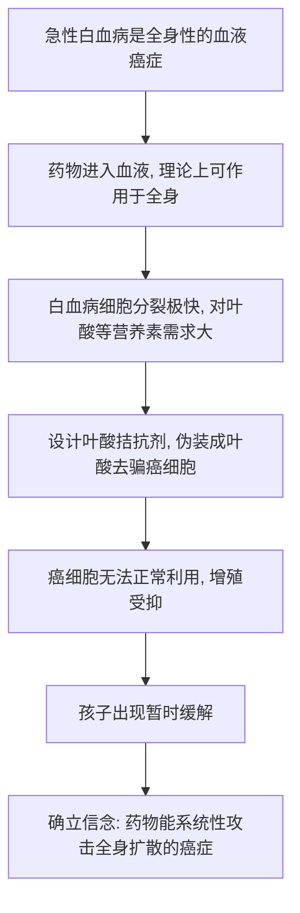

# 09｜一个儿科医生，如何让儿童白血病第一次「退却」？

> 本文要解决一个问题：为什么现代化疗的真正起点，不是成年人身上的淋巴瘤，而是一间几乎无药可救的儿童病房？

---

## 一、先说结论

上世纪四十年代末，波士顿儿童医院的儿科医生西德尼·法伯，把一种「叶酸拮抗剂」——氨基蝶呤，用在了患急性白血病的儿童身上。据记载，那些原本病情迅速恶化、几乎注定很快死去的孩子，出现了短暂的缓解：血液里的白血病细胞减少了，症状好转了。法伯不只是找到了一种药，他更确立了一种信念：**药物能够系统性地攻击已经全身扩散的癌症。** 穆克吉认为，「缓解」这个概念和它背后的希望，正是从这间儿童病房开始进入癌症治疗的。

---

## 二、我们先理解一个问题

为什么历史要把这个转折点，放在一群孩子身上？

成年人得了淋巴瘤，用氮芥试试，还说得过去。可给孩子用药，尤其是用毒性很强的药，在伦理上要沉重得多。更何况，儿童白血病在当时基本等同于「判决书」——进展极快，往往几周、几个月内就夺走生命。

正因为如此，这个问题才格外尖锐：

> 当一种病几乎百分之百会杀死这些孩子时，一个医生该怎么做？是尽可能地减少痛苦、让他们安静地离开，还是冒极大的风险，去试一种可能毫无用处、甚至加速死亡的药？

法伯的选择，是把「试」变成一种认真设计的观察。他要回答的，不是「孩子会不会死」（那时几乎都会），而是更小、更具体的一个问题：**这种药，能不能让癌细胞暂时减少一点？**

---

## 三、作者到底提出了什么观点？

穆克吉在书中讲述了法伯的工作。据记载，法伯长期关注儿童白血病，并注意到一个线索：白血病细胞的疯狂增殖，可能与它对某些营养素（比如叶酸）的巨大需求有关。

如果癌细胞比正常细胞更「贪吃」叶酸，那么也许可以用一种结构上与叶酸相似、却无法被利用的物质——**叶酸拮抗剂**——去「骗」它、堵住它。

大约在 1947 至 1948 年，法伯在波士顿儿童医院把**氨基蝶呤**用于患急性淋巴细胞白血病的儿童。据记载，部分孩子的病情出现了暂时的缓解：白血病细胞减少，贫血等症状改善。

穆克吉认为，这件事的意义不在于「治愈」，而在于它第一次让人看见：

> **已经扩散到全身的癌症，可以被药物削弱。**

他还推动了儿童癌症研究与社会募款——其中就有后来广为人知的「吉米基金」，以及后来与丹娜—法伯癌症研究所相关的建设。这让儿童癌症从「没人愿意研究」的角落，变成了社会愿意投入的战场。

这里需要区分：**「缓解」是法伯工作在当时能确认的结果；「治愈」则是此后几十年联合化疗等进展才逐步实现的目标。**

---

## 四、把这个观点翻译成人话

可以把这件事，类比成人类第一次用抗生素治好一种感染。

在抗生素出现之前，一场普通的细菌感染就可能要了人的命。抗生素出现后，人们第一次发现：**原来有一种药，可以进入身体，把全身的病原体压制下去。**

法伯做的，是让癌症治疗第一次尝到类似的滋味：原来有一种物质，可以进入血液，让全身游走的癌细胞变少。

但这里有一个**重要的区别，必须讲清楚**：

- 抗生素打击的是**外来的细菌**，细菌和人体的细胞差异很大，所以相对「干净」；
- 化疗打击的是**我们自己的细胞**，癌细胞和正常细胞非常相似，所以必然「伤人」。

换句话说：抗生素是「抓外人」，化疗是「平内乱」。**同样是全身性用药，难度完全不在一个量级上。**

理解了这个区别，你就能明白：为什么法伯带来的希望是真的，但这条路从一开始就注定凶险。

---

## 五、为什么会这样？

把法伯的思路拆成链条：

这条链的起点很关键：**白血病本身就是全身性的。** 它不像乳腺癌那样有一个「原发肿块」可以切，它一出现就散在血液和骨髓里。这反而让「药物治疗」成了唯一合乎逻辑的选择——既然没有可切的局部，那就只能用药去追。

而终点 G 更重要：**法伯证明的不是一种药，而是一个可能性。** 从那以后，「用药物治癌症」不再只是理论。

---

## 六、举一个现实生活中的例子

想象一场原本被判定「无解」的火灾。

这座楼里到处都有暗火，没有哪个房间是真正的火源，你没法靠「拆掉那一间房」来解决。消防员一度只能眼看着它烧。

后来，有人找到一种灭火剂，喷洒之后，火势第一次明显减弱了。它没能把火全灭，过一阵还会复燃，但所有人都看到了一个新事实：**这场火，是可以被外力影响的。**

从那一刻起，问题就从「有没有可能扑救」，变成了「怎么扑得更彻底、更持久」。这就是法伯的缓解带来的意义——它改变的不是结局，而是**问题的性质**。

---

## 七、回到书中重新理解

现在回看，法伯这一幕其实回答了两个问题。

**第一，为什么是儿童白血病？** 因为它进展极快、结局极惨，同时又没有可切的局部，只能用药物。它逼着医学去面对「全身治疗」这条路。

**第二，为什么「缓解」这个词如此重要？** 因为在此之前，癌症诊断几乎等同于「没有希望」。法伯让医生第一次可以对病人说：**你的病，暂时被压下去了。** 哪怕只是暂时的，这也彻底改变了医生与病人之间的关系——从「陪伴死亡」，变成了「争取时间」。

穆克吉把这一段放在氮芥之后，是要说明：**化疗不是一次孤立的发现，而是一条不断被验证、被推进的路线。** 氮芥证明了「药能碰肿瘤」，法伯证明了「药能让全身的癌症退却」。

---

## 八、这个观点背后还有什么？

几个容易被忽略的深层点：

1. **「缓解」不等于「治愈」。** 缓解只是病情暂时减轻，癌细胞可能仍然潜伏，随后卷土重来。法伯的孩子大多数后来仍然复发了。
2. **它改变了「癌症不可治」的心理预设。** 一个可以被药物影响的病，就不再是纯粹的宿命。
3. **它把儿童癌症推向了公共视野。** 「吉米基金」这类募款活动，让社会第一次大规模为癌症研究出钱。
4. **它暴露了单药的致命弱点。** 一种药能带来缓解，却很少能带来长久控制——这正是下一篇要讲的问题。
5. **早期的临床观察还很不规范。** 用今天的标准看，当时的试验设计、知情同意都远不完善，这也是后来医学伦理需要补的课。

---

## 九、这个观点有问题吗？

需要诚实地面对几个问题：

- **缓解是短暂的。** 接受氨基蝶呤的孩子大多仍然复发，所以不能把它夸大成「治愈的开端」。
- **它只对部分类型有效。** 叶酸拮抗剂并非对所有白血病、所有患者都起效，适用范围有限。
- **早期的伦理标准与今天不同。** 那个年代对儿童试验的知情同意、风险告知，远没有今天的规范。这既不能简单用今天的标准去审判，也不能因此回避其中的问题。
- **「缓解」这个词本身有风险。** 它给病人和家属带来希望，但如果不加区分地把「缓解」听成「治好」，反而会造成更大的失望。

所以，对法伯的评价要分两层：**方法上他开创了全身治疗的可能，结果上他并没有真正战胜儿童白血病。** 这两件事同时成立。

---

## 十、今天再看这个观点

（以下为现代延伸，非穆克吉原文）

今天，儿童急性淋巴细胞白血病的治疗结果，与法伯那个年代已不可同日而语。经过几十年的联合化疗、中枢神经系统预防、以及对不同风险分层的管理，许多患儿能够获得长期生存。这是几代人接力的结果，不能全部归功于最初的那一种药。

同时，法伯的故事也留下了一个持续被讨论的伦理议题：**如何在儿童身上开展医学试验？** 今天，这通常需要严格的伦理审查、监护人知情同意和独立监督。医学的进步，越来越被视为一项必须以病人的权利为前提的事业。

另外，「缓解」这个词今天在肿瘤科依然是核心概念，但它被拆得更细：完全缓解、部分缓解、微小残留病灶……医学学会了用更精确的语言，避免把「暂时压住」误读为「彻底治好」。

---

## 十一、这一篇真正应该记住什么？

1. **法伯用叶酸拮抗剂治疗儿童急性白血病，让孩子出现短暂缓解。** 这是化疗在临床上第一次显示对全身性癌症的效果。

2. **它确立的是一种信念，而不只是一种药。** 药物能系统性攻击扩散到全身的癌症，这个观念从此进入医学。

3. **作用原理是「伪装」。** 叶酸拮抗剂假装成叶酸，骗过对叶酸需求极大的癌细胞，从而抑制其增殖。

4. **缓解不等于治愈。** 孩子们大多复发，真正的问题——如何让缓解变得持久——留给了后面的人。

5. **它也带来伦理问题。** 在儿童身上做试验、如何告知风险与获取同意，成为医学必须长期面对的课题。

---

## 十二、留一个问题

法伯让孩子的病情短暂退却了，可这份退却几乎总是以复发收场。

为什么一种药，总是先有效、后失效？

如果癌细胞会「学会」抵抗一种药，那我们能不能——**同时用几种作用机制完全不同的药，让它们无路可逃？**

下一篇，我们就来看一个从结核病治疗里借来的思路：**联合化疗，以及它如何让一部分癌症第一次真正被「治愈」。**
