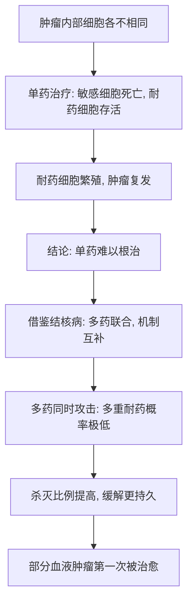

# 10｜为什么一种药治不好癌症？——联合化疗的诞生

> 本文要解决一个问题：为什么单靠一种药，总是先有效、后失效？我们能做点什么，来堵住癌细胞的退路？

---

## 一、先说结论

癌细胞会不断产生耐药性。用同一种药反复攻击，敏感的细胞被杀死了，剩下那些碰巧「不怕它」的细胞存活下来，迅速繁殖，肿瘤就卷土重来。研究者借鉴了结核病联合用药的思路：与其用一种药硬打，不如用几种**作用机制不同**的药物同时出手，这样既降低耐药的概率，也提高杀灭的比例。联合化疗让儿童白血病、霍奇金淋巴瘤等疾病第一次真正被「治愈」。穆克吉认为，它同时也确立了癌症治疗的一种雄心——**不是压制，而是根治**。

---

## 二、我们先理解一个问题

上一篇留下了一个几乎令人绝望的规律：**一种药，总是先有效、后失效。**

这看起来很奇怪。药没变，癌细胞也没「升级」出新武器，为什么过一阵就不灵了？

答案藏在一个我们熟悉的机制里：**选择和进化。**

想象一个肿瘤里其实住着上亿个癌细胞，它们并不是一模一样的。有的碰巧对某种药更敏感，有的碰巧更耐药。药物一来，敏感的大批死亡，耐药的少数活下来。这些活下来的细胞继续分裂，于是新长出来的肿瘤，几乎全都带着「抗药」这个特征。

所以，单药治疗的困境不是药的问题，而是**生物学的问题**：只要肿瘤里有差异，只要药物不能一次杀光，幸存者就会把耐药传下去。

那么问题就变成：**有没有办法，让有限的幸存者根本没有机会？**

---

## 三、作者到底提出了什么观点？

穆克吉在书中讲述了这条路。核心推动者包括美国国家癌症研究所（NCI）的埃米尔·弗雷与埃米尔·弗雷赖希等人——大约在上世纪六十年代，他们开始开发针对儿童急性淋巴细胞白血病的**联合化疗**方案。与此同时，德维塔（Vincent DeVita）等人为霍奇金淋巴瘤开发了著名的 **MOPP** 方案，即多种药物联合使用。

在理论层面，斯基珀（Howard Skipper）提出了**「对数杀灭」**（log-kill）的思想：药物是按固定比例杀死癌细胞，而不是一次杀到「一个不剩」。这意味着，要真正清除肿瘤，需要反复、联合地给够疗程。

医学界普遍认为，联合化疗是癌症治疗史上的一个分水岭：它第一次让某些血液系统肿瘤，从「必然复发」变成「可能治愈」。

这里要区分：

- **医学事实层面**：联合化疗确实提高了儿童白血病、霍奇金淋巴瘤等疾病的长期生存，这是一步关键进展；
- **穆克吉的解读层面**：他把这件事看作「用几种机制不同的药堵住耐药」这一策略的胜利，也看作「根治」这一雄心的确立。

---

## 四、把这个观点翻译成人话

想象一场围歼战。

敌人分散在山林里，你只有一门炮，威力有限。第一轮轰下去，打死了大部分，但有几股残兵从侧面溜走了。过一阵，他们又聚成一支队伍，而且这次更熟悉你的炮火。

换一种打法：**同时从几个方向、用几种不同的武器包围。** 从正面打、从侧翼堵、从后方断退路。残兵想逃，却发现每条路都被封了。

联合化疗的逻辑就是这样：

- **不同药物攻击癌细胞的不同环节**，一个阻止它复制 DNA，一个干扰它的分裂，一个阻断它需要的原料；
- 因为机制不同，一个细胞要同时对好几种攻击都产生抵抗，**概率极低**；
- 于是耐药细胞出现的可能被大幅压低，一次疗程下来，被杀灭的比例也更高。

代价是：**毒性也会叠加。** 每种药都会伤到正常细胞，几种一起用，副作用就会更重。这正是联合化疗凶险的地方。

---

## 五、为什么会这样？

把这条逻辑链画出来：

链条里最关键的一步是 E。**联合用药的思路并非癌症研究独创，而是从结核病治疗里借来的。** 结核病的治疗很早就发现：单用一种药容易耐药，必须几种药一起吃足够长的时间，才能根治。

这说明一件事：**「耐药」不是癌症独有的难题，而是一切快速繁殖、数量庞大的病原体或细胞的共同难题。** 你在结核病里学到的经验，可以直接搬到癌症上。

---

## 六、举一个现实生活中的例子

结核病的治疗，是最贴切的现实例子。

如果只用一种抗结核药，病人一开始往往会有好转，但过一段时间，结核菌就会产生耐药，治疗失败。所以现代结核病治疗的标准做法是：**同时使用多种抗结核药物，坚持足够长的疗程。** 每种药攻击结核菌的不同环节，让它很难同时对所有药物都产生抗性。

这几乎就是联合化疗的同一个剧本：

| | 结核病治疗 | 联合化疗 |
|---|---|---|
| 对手 | 结核菌 | 癌细胞 |
| 单药问题 | 容易耐药、复发 | 容易耐药、复发 |
| 对策 | 多种药联合、足疗程 | 多种药联合、按疗程 |
| 目标 | 根治 | 争取治愈或长期控制 |

这个表格最想说明的是：**当对手数量巨大、繁殖迅速、又容易变异时，「联合、足量、足疗程」几乎是一条通用的规律。**

---

## 七、回到书中重新理解

现在回看联合化疗，你会发现它解决的是一个**结构性问题**，而不是简单地「药更猛了」。

- 单药的问题：只要有一小撮细胞扛得住，它们就会壮大。
- 联合的价值：让「同时扛住好几种机制」这件事，在数学上变得极难发生。

穆克吉把这一段写得很有分量，因为它第一次让医学敢于说出那个词——**治愈**。在此之前，癌症治疗最乐观的期待是「缓解」；而联合化疗让一部分孩子、一部分霍奇金淋巴瘤患者，真正长期活了下来。

但请注意，这份雄心也埋下了后患：**既然「治愈」成为目标，人们就会本能地认为，药越猛、疗程越长、剂量越大越好。** 这种「越强越好」的思路，在后来遭遇实体瘤时，遇到了很大的挫折——这是后面几篇要讲的内容。

---

## 八、这个观点背后还有什么？

几个深层要点：

1. **耐药本质上是达尔文式选择。** 不是癌细胞「主动学习」，而是变异加选择的结果。
2. **「对数杀灭」改变了治疗的数学。** 它说明药物杀的是固定比例，所以要靠反复给药，逐步逼近清零。
3. **联合策略的前提是「机制不同」。** 如果几种药作用方式一样，耐药细胞照样能一次全部躲过。
4. **毒性是一个绕不过去的约束。** 联合越强，正常组织受的伤越重，治疗窗越窄。
5. **「根治」这个词，既是动力，也是压力。** 它推动了更激进的方案，也带来了后来对过度治疗的反思。

---

## 九、这个观点有问题吗？

需要保持几点清醒：

- **联合化疗并非对所有癌症都奏效。** 它在儿童白血病、霍奇金淋巴瘤等疾病上成绩显著，但对很多常见的实体瘤，效果要有限得多。
- **毒性可能大到无法承受。** 剂量叠加会带来严重副作用，甚至危及生命。并非所有人都能耐受。
- **「治愈」容易被过度推广。** 把血液肿瘤的成功经验直接搬到所有癌症上，是不成立的。不同癌症的生物学差异极大。
- **耐药并没有被真正消灭。** 联合用药只是大幅降低了耐药概率，并没有让它消失。肿瘤仍会以别的方式逃逸。
- **「越强越好」的思路后来受到质疑。** 过分追求剂量强度，可能只是让病人更痛苦，而生存期并未改善。

所以，联合化疗的争议不在「它有没有用」，而在「它的成功边界在哪里」，以及「我们是否把它当成了万能公式」。

---

## 十、今天再看这个观点

（以下为现代延伸，非穆克吉原文）

联合策略今天已经远远超出了「化疗药加化疗药」的范围，扩展到：

- **化疗 + 靶向药**：用靶向药精准打击某个关键分子，用化疗清除其余细胞；
- **化疗 + 免疫治疗**：借助病人自身的免疫系统，与药物形成合力；
- **序贯与自适应治疗**：根据肿瘤在治疗中的变化，动态调整用药组合，而不是一开始就固定死方案。

同时，研究者也在重新思考「根治」这个目标。对一部分癌症，长期控制、与瘤共存，可能比一味追求彻底消灭更现实。联合用药的核心思想——**堵住对手的每一条退路**——依然有效，但用多少种、用多强、用多久，答案正在变得越来越个体化。

---

## 十一、这一篇真正应该记住什么？

1. **单药失败的根本原因是耐药，而耐药是「变异 + 选择」的结果。** 不是药失效，而是幸存者繁殖。

2. **联合化疗借鉴了结核病的思路。** 用机制不同的多种药同时攻击，让多重耐药变得极难发生。

3. **「对数杀灭」解释了为什么要反复、足疗程给药。** 药物按固定比例杀死细胞，不可能一次清零。

4. **它让儿童白血病、霍奇金淋巴瘤等第一次可能被治愈，也确立了「根治」的雄心。**

5. **联合不是万能公式。** 毒性会叠加，对实体瘤效果有限，「越猛越好」的思路后来也被反思。

---

## 十二、留一个问题

联合化疗证明了一件事：**有些癌症，真的可以被「治愈」。**

既然有癌症能被治好，那人们自然会想：如果投入足够多的钱、足够强的政治意志，能不能把「攻克癌症」变成一场国家级的大工程，像登月一样，在几年内宣布胜利？

这件事真的发生过。1971 年，美国发起了一场「向癌症宣战」。

它成功了吗？它兑现了当初的承诺吗？

下一篇，我们就来看看：**尼克松、拉斯克与那场未兑现的抗癌战争。**
