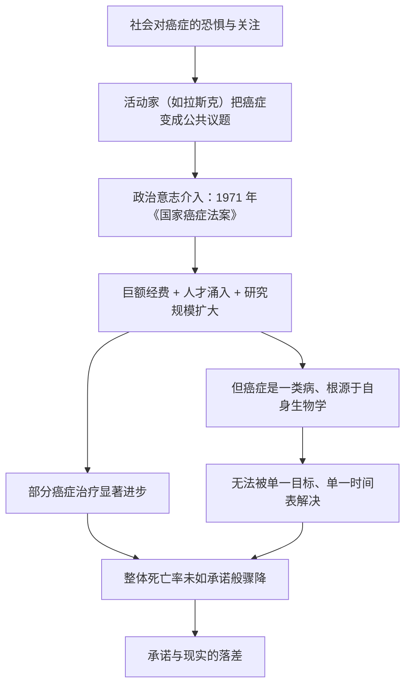

# 11｜「向癌症宣战」：尼克松、拉斯克与一个未兑现的承诺

> 如果举全国之力、砸下重金，癌症能不能像登月一样被「攻克」？这一篇要回答的是：为什么那场声势浩大的「抗癌战争」，既改变了历史，又没能兑现它最响亮的承诺。

---

## 一、先说结论

穆克吉讲这段历史，核心想说一句反直觉的话：**1971 年的「抗癌战争」是一场由善意、信念和政治能量共同推动的伟大赌注。它确实改变了癌症研究的规模与速度，却也让整个社会第一次真切地看到——科学有它自己的时钟，政治的时钟无法让科学走得更快。**

把癌症想象成「一个可以按下按钮就消灭的敌人」，是这场战争最根本的误判。癌症不是一种病，而是一类病；它的根源又深植于我们自身的细胞。因此，钱和决心能买到时间与人才，却买不到「几年之内攻克」这个结果。这不是失败的辩解，而是科学规律对政治承诺的一次冷静校正。

---

## 二、我们先理解一个问题

先抛开癌症，想一个更普遍的问题：

> **一项艰巨的目标，如果投入足够多的人、足够多的钱、足够强的国家意志，是不是就一定能在规定时间内完成？**

我们很容易点头。因为二十世纪有一个耀眼的先例——把人送上月球。肯尼迪在 1961 年提出「十年内登月」，1969 年真的实现了。这件事让很多人相信：只要目标明确、资源到位，人的意志几乎无所不能。

于是，一个顺理成章的念头出现了：**既然能把人送上月球，为什么不能「攻克癌症」？**

问题也就在这里：登月和治癌，看上去都是「高难度科学工程」，它们真的一样吗？如果不一样，差别究竟在哪里？

---

## 三、作者到底提出了什么观点？

穆克吉把这场战役放回了它的历史现场。

据记载，二十世纪中期，癌症在美国逐渐从「私人悲剧」变成「公共议题」。推动这一转变的关键人物之一，是社会活动家兼慈善家玛丽·拉斯克（Mary Lasker）。她不是科学家，却极擅长把医学问题翻译成政治语言：四处游说议员、组织公众、争取经费，把「政府应当为癌症研究出钱」变成了一个难以回避的议题。她身边还聚集着一批有影响力的医生与研究者，比如儿科肿瘤的先驱法伯。

在这股力量的推动下，美国总统尼克松于 1971 年 12 月签署《国家癌症法案》（National Cancer Act），正式发起所谓「抗癌战争」（War on Cancer）。法案大幅增加了国家对癌症研究的投入，也扩大了国家癌症研究所的资源与话语权。

穆克吉认为，这件事的意义是双重的：

- **积极的一面**：它把癌症研究从边缘推到国家战略层面，吸引了大批人才，建立起长期的研究基础设施，让此后几十年的治疗进步有了土壤。
- **问题的一面**：围绕这场战争，形成了一种「几年之内攻克癌症」的乐观预期。这种预期把癌症当成了一个目标清晰的工程项目，而不是一个牵涉整个生物学的复杂难题。

换句话说，政治给了科学一笔空前的预算和一次空前的期待，而科学最终交出的，是一份**真实的、但不漂亮的成绩单**。

---

## 四、把这个观点翻译成人话

打个比方。

假设你住的小区，下水道常年堵塞，大家忍无可忍。业主们联合起来，逼物业「一个月之内彻底解决」。物业迫于压力答应了，还追加了一大笔预算、请了最贵的施工队。

结果一个月后，堵塞确实缓解了一些——因为钱到位了，清走了大部分淤泥，换了几段老管道。但要「彻底解决」，却做不到。因为问题的根子在整片管网设计落后、楼龄太老、地基下沉，这些都不是一个月、一笔钱能改的。

这时候，聪明的做法不是骂施工队无能，也不是假装问题已经解决，而是承认：**我们当初把问题的难度估计错了。** 钱和压力没有白花，它们解决了一部分；剩下的部分，需要的是时间、方法和认知的更新。

穆克吉想说的，大致就是这个意思。抗癌战争不是骗局，它的投入结出了果实；但「几年攻克」这个承诺，从一开始就建立在一个错误的比喻上——**它把癌症当成了下水道，而癌症其实更像整栋楼的结构。**

---

## 五、为什么会这样？

把这段逻辑理成一条链：

这条链的枢纽在 **F 那一环**：癌症不是一个可以被「锁定」的敌人。它是乳腺癌、白血病、肺癌、淋巴瘤……是许多行为各异的疾病；更麻烦的是，它的成因深植于我们自身的基因与细胞机制。

登月之所以能成功，是因为目标可以被清晰拆解：火箭、轨道、生命维持系统，每一项都是工程问题。而癌症不是工程问题，它更像「如何让一个已经失控的复杂系统重新受控」——这里没有一条可以一按到底的开关。

---

## 六、举一个现实生活中的例子

想想我们身边常见的一种落差：**广告承诺和真实效果之间的差距。**

一款产品在广告里说「用一周，彻底解决你的腰背酸痛」。这句话之所以动人，是因为它把「疼痛」简化成了一个可以一键清除的东西。但真实的腰背痛，可能来自肌肉劳损、椎间盘、坐姿习惯、体重、压力……厂商未必说谎，产品也许确实能缓解一部分人的一部分症状；但「一周彻底解决」这个说法，是在用营销语言僭越医学规律。

消费者买到手之后，发现有效果、但没「彻底」，于是产生被欺骗的感觉。问题不在于产品一无是处，而在于**承诺的尺度，和问题的性质不在同一个量级上。**

抗癌战争与之相似：它给了公众一个「一周解决」式的心理预期，而科学只能给出「日拱一卒」式的真实进展。这中间的落差，最终变成了公众对医学的失望。

换一个更贴近宏观治理的类比也一样：一纸漂亮的规划图，可以在一天之内画好；但一座真正运转良好的城市，要靠几十年的水、电、路、产业和人慢慢长出来。图纸的快，和城市的慢，本来就是两件事。

---

## 七、回到书中重新理解

现在再回看《国家癌症法案》和「抗癌战争」，我们会发现穆克吉并不是在嘲笑它。

他真正想记录的，是一种**典型的现代错觉**：我们习惯用工程思维去理解生命问题。战争、登月、「攻克」、「宣战」——这些词都属于同一个语言体系，它们暗示敌人是明确的、目标是单一的、胜利是可以宣布的。

而癌症恰好拒绝这套语言。穆克吉在全书里反复做的一件事，就是拆掉这个隐喻：癌症不是外敌入侵，而是「我们自己的生长与修复机制出了错」。你无法对一个「自己的一部分」宣战，就像你无法对自己宣战。

所以，抗癌战争真正的遗产，不只是钱和设施，更是一堂关于**期望管理**的公开课：当政治向科学索取一个时间表时，科学最好的回答可能不是「好的」，而是「我尽力，但时间不由你定」。

---

## 八、这个观点背后还有什么？

这里藏着两个更深的层次。

第一，**科学的进步是非线性的，而政治是线性的。** 政治需要承诺、时间表和可交代的成果；科学却常常是长期积累后突然跃迁，中间充满迂回和失败。把两者强行对齐，往往两头都受伤：科学家被迫做短期、易出成果的选题，政治家则得到一个无法兑现的承诺。

第二，**资金来源会悄悄塑造研究方向。** 当巨额资金涌向某个领域时，它既能催生突破，也可能让某些更基础、更冷门、更需要时间的问题被忽视。经费是力量，也是偏见。

这也解释了一个现象：为什么癌症治疗史上那么多「突破」，最后都变成了「部分有效」。**因为在生命面前，突破和「彻底」常常不是一回事。**

---

## 九、这个观点有问题吗？

公允地说，对「抗癌战争未兑现承诺」这个判断，本身也有不同的看法。

一种观点认为：**不能用「没有根治」来否定这场战争。** 支持者会指出，正是这几十年的投入，让儿童白血病、霍奇金淋巴瘤、部分乳腺癌等的治疗大幅改善，让无数人活得更久。如果只看「是否根治」，就会低估那些「把绝症变成可控慢性病」的真实成就。

另一种观点认为：**「未兑现承诺」这个批评，可能也简化了当年的语境。** 有些措辞是媒体和政客放的「卫星」，未必是科学界一致的承诺；把舆论的夸张全部记在科学账上，并不公平。

还有一种更尖锐的批评来自后来的学界：**战争隐喻本身可能造成了误导。** 它让人以为只要「更狠地打」就能赢，于是过度治疗、把病人当战场的问题也随之出现。这是隐喻的代价。

所以，争议不在于「钱该不该投」，而在于：**我们该用什么标准去评价一场科学战役——是它有没有兑现政治口号，还是它有没有真实地改变病人的命运？** 这两种标准，结论并不一致。

---

## 十、今天再看这个观点

（以下为现代延伸，非穆克吉原文）

抗癌战争的教训，在今天几乎每个领域都会重演。

我们见过太多「几年内攻克 X」式的宏大目标：攻克阿尔茨海默、逆转衰老、用 AI 快速找到所有新药……它们和「几年攻克癌症」共享同一种句式。**每当一种强大的新工具出现，人类就很容易再一次相信「这次不一样，这次能按下按钮」。**

穆克吉式的提醒因此依然有效：新工具会加快某些环节，但不会取消问题的复杂性。癌症是进化的产物、是系统失控；人工智能或许能更快筛选靶点、更快读影像，但它不会让生物学突然变得听话。

真正成熟的姿态，也许是把「战争」换成「管理」：不追求某一天的全面胜利，而是接受一场长期的、需要耐心的、有输有赢的共处。

---

## 十一、这一篇真正应该记住什么？

1. **1971 年美国发起「抗癌战争」，是政治意志与科学的一次大规模结合。** 它来自拉斯克等人的长期推动，由尼克松签署《国家癌症法案》正式启动。

2. **它确实改变了历史。** 巨额投入带来了人才、设施和一批真实疗效，改变了无数病人的命运。

3. **但「几年攻克」的承诺没有兑现。** 因为癌症是一类病，根源在自身生物学，无法像登月那样被当作单一工程目标。

4. **核心教训是期望管理。** 科学有它自己的节奏，政治的时钟无法让它走得更快；把生命问题当工程问题，迟早会产生落差。

5. **评价一场科学战役，标准不止一个。** 「是否根治」和「是否改善了病人的命运」，会给出不同的答案。

---

## 十二、留一个问题

既然举国之力都难以「攻克」癌症，那是不是说明，我们更应该把力气花在**让它根本不发生**上？

可是，癌症真的能预防吗？在有人证明「环境暴露会致癌」之前，这个想法几乎无人认真对待。

下一篇，我们就从一位十八世纪的英国外科医生，和他观察到的扫烟囱工人说起，看看**癌症预防**这条线索是怎么被一点点揭开的。
