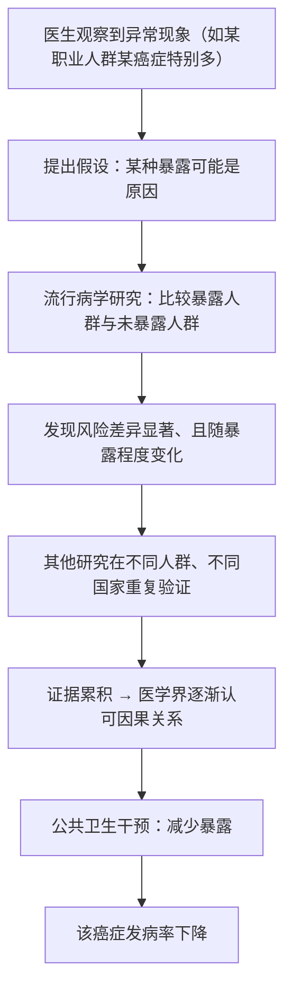

# 12｜癌症是可以预防的吗？——从扫烟囱工人到吸烟

> 如果癌症这么难治，我们能不能在它发生之前就阻止它？这一篇要回答的是：凭什么说「相当一部分癌症可以预防」，这个结论又是怎么被一步步证明的。

---

## 一、先说结论

穆克吉想让我们接受一个和直觉相反的事实：**癌症虽然难治，但相当一部分癌症是可以预防的。**

这个结论不是靠聪明想出来的，而是靠流行病学一步步「逼」出来的。据记载，早在十八世纪，英国外科医生帕特就观察到扫烟囱工人容易得一种特殊的阴囊癌，并把它和长期接触煤灰联系起来；到了二十世纪中期，多尔与希尔又用研究把吸烟和肺癌牢牢绑在一起。

穆克吉认为，这类发现的意义极其深远：它说明癌症并不总是「命中注定」的意外，很多情况下，它和我们长期暴露在什么样的环境、有什么样的生活习惯有关。于是，「预防」从一个边缘话题，变成了与「治疗」同等重要的战场——**与其在病人体内打一场艰苦的仗，不如在源头减少让他得病的机会。**

---

## 二、我们先理解一个问题

先说一个让人不太舒服的现象。

面对一场重病，人们天然地更相信「治」，而不是「防」。医生把一个人从死亡线上拉回来，是英雄；而劝人别抽烟、别接触某种有害物质，往往显得平淡、甚至招人烦。

为什么？

因为「治疗」看得见结果：病人活下来了。而「预防」的结果是**看不见的**——你阻止了一件没有发生的事。一个人因为没抽烟而没得肺癌，这件事永远不会出现在新闻里，也没人给他颁锦旗。

于是就有一个真问题：

> **如果预防的效果永远「看不见」，我们凭什么相信它真的有用？又要怎样才能证明「某个东西会致癌」？**

这就把我们带到了流行病学——一门专门研究「人群里什么因素和什么疾病相关」的学问。

---

## 三、作者到底提出了什么观点？

穆克吉在书中用两个标志性的故事，串起了癌症预防的历史。

**第一个是帕特与扫烟囱工人。** 据记载，1775 年，英国外科医生珀西瓦尔·帕特（Percivall Pott）注意到，伦敦的扫烟囱工人中，阴囊癌的发生率异常地高。这些工人多是小男孩，成天爬进狭窄的烟道，全身沾满煤灰。帕特提出，这种癌症与他们长期接触煤灰有关。这被后来的医学界普遍视为职业致癌物最早的经典发现之一——也就是说，某些癌症是「工作环境带来的」。

**第二个是多尔、希尔与吸烟。** 大约在 1950 年，理查德·多尔（Richard Doll）与奥斯汀·布拉德福德·希尔（Austin Bradford Hill）发表研究，把吸烟和肺癌联系起来。随后，他们又开展了著名的英国医生队列研究，长期追踪大量医生的吸烟习惯与健康状况。随着时间推移，数据越来越清楚地指向同一个方向：吸烟者的肺癌风险显著更高。

在此基础上，穆克吉的观点可以概括为一句话：

> **相当一部分癌症并非凭空发生，而是与可识别的环境暴露和行为有关；因此，它们原则上是可以预防的。**

这意味着医学的目标要发生变化：不能只盯着「怎么治」，还要盯着「怎么让人不得」。

---

## 四、把这个观点翻译成人话

想象一条河。

下游年年有人落水，于是大家在河边建医院、组救援队、造更好的救生圈——这当然重要。但真正聪明的人会往上游走，看看这些人为什么会掉进河里：是桥太窄？是护栏坏了？是夜里没有灯？

**「治疗」是在下游救人，「预防」是到上游去修桥。**

帕特和多尔、希尔做的事情，就是往上游走。他们发现，某些癌症的「上游」是煤灰、是烟草。把这些上游因素堵住，河里落水的人就少了。

这个道理的动人之处在于：它把责任从「个人运气」部分地转移到了「可以改变的条件」上。你没法控制自己的基因，但你可以在很大程度上控制自己接触什么、养成什么习惯，社会也可以控制工厂排什么、公共场合允不允许吸烟。

---

## 五、为什么会这样？

把「证明某物致癌」的过程理成一条链：

这条链里有两个关键点。

**第一，流行病学看重「关联」而不是单个病例。** 一个抽了一辈子烟却没得肺癌的人，不能推翻「吸烟致癌」；因为我们要看的是**人群层面的概率**，不是个人的孤例。

**第二，从「关联」到「因果」需要额外的证据。** 光看到两个东西一起出现还不够，还要看：暴露越久风险是否越高？停止暴露风险是否下降？不同国家、不同研究是否得到一致结果？把这些拼起来，才能比较有把握地说「是它造成的」。

---

## 六、举一个现实生活中的例子

最好的例子，就是我们每天都在用的**安全带。**

在安全带普及之前，车祸伤亡非常普遍。有人会说：「我开车技术好，不需要安全带。」这话在个体层面似乎有道理，但从人群看，车祸伤亡率居高不下。

后来，安全带被强制普及。结果是：车祸依然发生，但**死亡和重伤的比例大幅下降**。有人一生系着安全带，也从未经历能考验它的事故——对他来说，安全带「什么也没做」。但我们不会因此说安全带没用，因为我们看的是整个人群的统计。

癌症预防完全是同一种逻辑：

- 不是每个吸烟者都会得肺癌，也不是每个不吸烟者都不会得；
- 但从**人群**看，减少烟草暴露，会实实在在地减少肺癌；
- 那些「因为预防而没生病」的人，永远不会知道自己被救过一次。

这就是为什么预防的功劳总是被低估——**它的成功，表现为一件没有发生的事。**

---

## 七、回到书中重新理解

现在再回看帕特和多尔、希尔，我们就能理解穆克吉为什么如此重视他们。

他真正想说的，不只是「吸烟有害健康」这种常识，而是一个更深的方法论：**癌症研究不一定要从显微镜下开始，也可以从人群的统计里开始。**

帕特没有显微镜下找到煤灰里的致癌物质，他只是敏锐地注意到「这群人得这种癌特别多」。多尔和希尔也不是先在实验室里找到烟草的致癌机制，而是先用大规模的追踪数据把关联坐实。

这提醒我们：**在还不知道「为什么」的时候，只要「是什么」足够清楚，就已经可以救人。** 公共卫生很多时候就是靠这种「先行动、后理解」的务实精神推进的。

同时，这也改变了癌症在人们心中的形象。它不再只是一个神秘的、随机降临的厄运，而是一个**至少有一部分可以被我们主动影响**的问题。

---

## 八、这个观点背后还有什么？

这里至少有两层隐含前提。

**第一层：它假定「可改变」就等于「该改变」。** 预防的推论是——既然吸烟增加风险，那就劝人戒烟、提高烟草税、限制公共场所吸烟。这在逻辑上很顺，但它同时牵涉到个人自由与公共利益的边界，是一个社会问题，不只是医学问题。

**第二层：它把部分责任分给了社会，而不只是个人。** 如果一种癌症来自工厂粉尘，那么单靠「你自己小心点」是没用的，需要的是职业安全法规。穆克吉式的预防观，天然带有一种公共性：**有些风险不是靠个人自律能解决的，必须靠制度。**

这也解释了为什么预防之路往往比治疗之路更艰难——治疗只需要医生和病人，预防却需要整个社会达成一致。

---

## 九、这个观点有问题吗？

「癌症可以预防」这个说法很有力，但也需要小心。

**第一，相关不等于因果。** 看到两个现象一起出现，不等于前者导致后者。历史上有很多「看起来相关」的结论后来被推翻。所以多尔和希尔当年非常谨慎，他们要的不是一条关联，而是一整套互相印证的证据。今天我们知道吸烟致癌，是因为证据链已经足够粗壮，而不是因为「有人看到一起出现过」。

**第二，预防不等于「保证不生病」。** 不吸烟也可能得肺癌，因为癌症还有遗传、随机突变等因素。把「可以预防」误读成「只要做对就一定没事」，会带来两个后果：一是健康时的过度自信，二是生病后的过度自责。

**第三，警惕「甩锅给个人」。** 如果一味强调「你生病是因为你生活习惯差」，就可能忽略了空气污染、职业暴露、医疗可及性等更大的结构性因素。医学界普遍认为，预防应当是「改变环境」和「帮助个人」双管齐下，而不是把全部压力丢给病人。

所以，这个观点的真正分寸在于：**预防有效，但不是万能；它降低的是群体的风险，而不是给个人发放免罪符。**

---

## 十、今天再看这个观点

（以下为现代延伸，非穆克吉原文）

从帕特、多尔、希尔到今天，预防已经从「观察职业人群」发展成一套庞大的公共卫生体系。

- **疫苗**：人乳头瘤病毒（HPV）疫苗的出现，让一种与病毒相关的癌症（宫颈癌）第一次有了真正意义上的「预防手段」。这在上个世纪是很难想象的。
- **筛查**：乳腺癌、宫颈癌、结直肠癌等的定期筛查，让很多癌症在还能处理的时候被提前发现。这在某种程度上是「次级预防」——不是阻止它发生，而是阻止它发展。
- **控烟与环保**：公共场所禁烟、烟草税、烟草广告限制，以及空气污染治理，都是把「上游的桥」修得更好。

值得一提的是，今天的预防观念比穆克吉书中写的更强调「公平」：同样一套健康建议，对不同阶层的可行性并不一样。真正有效的预防，必须考虑人们**有没有条件**去做到。

---

## 十一、这一篇真正应该记住什么？

1. **相当一部分癌症可以预防。** 这不是口号，而是从帕特到多尔、希尔，靠流行病学一步步证明出来的。

2. **预防的逻辑是「往上游走」。** 与其在下游救人，不如在源头减少让人掉进河里的机会。

3. **预防的功劳总是看不见。** 它表现为「一件没有发生的事」，所以天然容易被低估、被忽视。

4. **从关联到因果需要一整套证据。** 不能因为「看到两个现象一起出现」就下结论，这也是科学谨慎的体现。

5. **预防有效，但不是个人免罪符。** 它降低群体风险，也需要制度与社会配合，而不是只靠个人自律。

---

## 十二、留一个问题

既然证据已经这么清楚——吸烟会致癌——按理说，公共政策应该很快跟上，吸烟率应该迅速下降。

可是，为什么在证据摆上桌面之后，这个话题还是被拖了几十年？为什么明明「大家都知道」，改变却如此缓慢？

下一篇，我们就来看看一个教科书级的案例：**烟草公司是如何「制造怀疑」的。**
