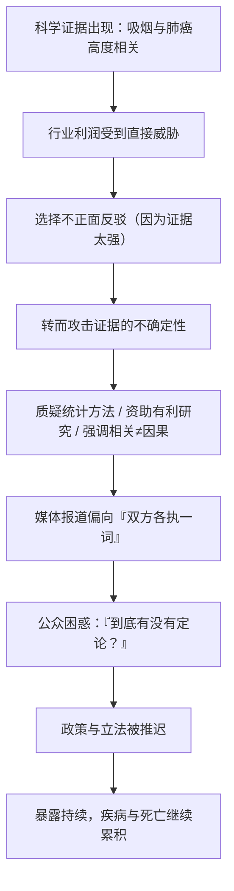

# 13｜烟草公司是如何「制造怀疑」的？

> 证据都那么清楚了，为什么烟草行业还能拖延几十年？这一篇要回答的是：当科学已经给出结论，商业利益还能用什么方式，让公众继续「雾里看花」。

---

## 一、先说结论

穆克吉通过烟草业这个案例，揭示了一种比「撒谎」更高级、也更难对付的手段：**制造不确定。**

面对吸烟致癌的强有力证据，烟草公司很少正面否认。他们做的是另一件事——质疑统计方法、资助对自己有利的研究、反复强调「相关不等于因果」、把水搅浑，让公众觉得「这件事还没定论」。

穆克吉认为，这不仅是商业伦理的问题，更是一个关于**科学共识如何转化为公共政策**的深刻案例。它说明：科学结论不会自动变成社会行动。即使证据堆积如山，只要有人有动机、有资源去制造怀疑，真相也可能被推迟很多年，代价则是一条条真实的人命。

---

## 二、我们先理解一个问题

先想一个逻辑问题。

假设有一群人，长期用一套说辞来拖延一件对自己不利的事。他们最有效的说法，往往不是「你说的不对」，而是：

> **「这件事还没定论吧？谁也说不准吧？」**

为什么「还没定论」这句话这么有杀伤力？

因为科学本身的语言就是谨慎的。科学家很少说「绝对」「百分之百」，他们习惯说「证据支持」「目前认为」「随着研究深入」。这种谨慎是科学的诚实，却也恰恰成了被利用的空间——**只要把正常的不确定无限放大，就能让一份清楚的证据看起来像一团迷雾。**

于是真问题就来了：

> **如果科学永远无法达到「绝对确定」，那商业利益是不是就可以永远拿「还不确定」当挡箭牌？**

---

## 三、作者到底提出了什么观点？

穆克吉在书中把烟草业的策略，描述为一套系统的「怀疑生产」。

据后来披露的烟草行业内部文件显示，其策略大致包括几个层面：

- **不否认，只质疑**：不直接说「吸烟不致癌」，而是攻击研究的统计学、样本、方法，让人怀疑结论是否可靠。
- **资助有利研究**：出钱支持那些能得出「存在争议」结论的研究，人为制造「学界还有分歧」的印象。
- **反复强调「相关不等于因果」**：用一句本身正确的科学原则，去动摇人们对大量累积证据的信任。
- **把个体案例当反例**：「我认识一个抽了一辈子烟还很健康的人」——用孤例对抗统计。

其中，一份被广泛引用的备忘录表达了这样一层意思：**「怀疑」本身就是这个行业的产品**——因为只要公众心存疑虑，就无法形成一致的行动。

穆克吉认为，这就是科学证据与商业利益博弈的经典样本：**它解释了为什么科学共识并不自动变成公共政策。** 证据要变成政策，需要经过公众理解、政治意愿、法律和舆论；而这些环节，恰好都是可以被「制造怀疑」所渗透的。

---

## 四、把这个观点翻译成人话

打个不太精确但很传神的比方：**雾里看花。**

其实那朵花一直都在，颜色、形状都很清楚。但只要有人不断制造雾气——一会儿说是水汽，一会儿说是镜头问题，一会儿说观察角度不对——看花的人就会开始动摇：**「也许真的看不清吧？」**

关键在于：制造雾的人**不需要证明花不存在**。他只需要让你相信「看不清」。因为在「看不清」的状态下，谁也无法理直气壮地要求采取行动。

「制造怀疑」的全部诀窍就在这里：**它不追求让你相信相反的结论，它只追求让你无法确定原来的结论。** 而一个不确定的公众，是不会去推动禁烟立法的。

---

## 五、为什么会这样？

把这条「怀疑生产线」理成一条链：

这条链的枢纽在 **C 和 D** 之间。

如果证据弱，行业可以直接反驳；但证据太强时，正面反驳反而会暴露自己。于是最聪明的做法是**绕开结论，攻击确定性本身**。这不是在「辩论事实」，而是在「管理信任」。

而这一招之所以有效，是因为科学传播有一个天然的弱点：**媒体喜欢「平衡报道」**。当一方说「证据确凿」，另一方说「仍有争议」，报道很容易变成「双方各有说法」。可问题在于——一边是成千上万项研究，一边是被雇来的质疑，**它们看起来却被摆成了对等的两方。**

---

## 六、举一个现实生活中的例子

想想一家食品企业被投诉。

有消费者吃了它的产品后身体不适，检测也发现了一些问题信号。面对这种情况，一家真正负责的企业会怎么做？召回、调查、公开结果。

但另一种处理方式也很常见：**不正面回应，而是把焦点转移到「检测是否可靠」「症状是否真的由我们的产品引起」「个别人不适不代表普遍问题」上。** 然后再请几位「自己的专家」出面，说「科学尚无定论」。甚至主动资助一些「结论模糊」的研究，好对外宣称「学界仍有分歧」。

时间一长，公众就糊涂了：到底有没有问题？于是媒体转向别的热点，监管迟迟不动，产品继续卖。**不是因为他们证明了产品安全，而是因为他们成功地让「是否安全」变得不再清楚。**

这和烟草业的打法，本质上是同一套方法论。它教的不是怎么赢一场辩论，而是**怎么让辩论永远不要有个结果。**

---

## 七、回到书中重新理解

现在再回看穆克吉讲的烟草故事，我们就能明白，他关心的其实不只是「烟草有多坏」。

他真正想让我们看见的，是**科学在现代社会里的一种处境**：科学能生产知识，却不一定能自动生产行动。从「科学发现」到「社会改变」之间，隔着一整片可以被操纵的地带——媒体、法律、政治、公众信任。

这也纠正了一个天真的假设：

> 「真理会自己胜出。」

穆克吉式的观点告诉我们：**真理需要有人替它争取。** 如果只有利益方在投入资源、组织说客、制造怀疑，而真相这一边只能靠科学家业余地去解释，那么即使证据占优，输的也可能是真相。

---

## 八、这个观点背后还有什么？

这里藏着几个更深的问题。

**第一，科学的「诚实」会被反过来利用。** 科学家说「目前证据支持」，这本来是很高的确定度，但在公关语境里，却被读成「科学家自己都没把握」。**科学的谨慎，成了它自己的软肋。**

**第二，不确定性是可以被「规模化生产」的。** 只要有钱、有动机，就能持续产出「看起来像研究」的东西，让噪音盖过信号。这提醒我们：**信息的数量，不等于信息的质量。**

**第三，信任是一种公共资源。** 制造怀疑的做法，透支的不只是公众对烟草业的信任，还有公众对科学、对媒体、对「专家」的整体信任。这种损伤是长期的——当人们习惯了「什么都有争议」，就可能在真正需要共识的时候，也不再相信任何证据。这是这类策略最深远的代价。

---

## 九、这个观点有问题吗？

要把这个案例看清楚，也需要避免简单化。

**第一，科学本身的不确定性是真实存在的，不是所有质疑都是「制造怀疑」。** 有些研究者确实在认真讨论方法问题，这是科学的自我纠错。把一切谨慎等同于「别有用心」，同样不客观。区分点在于：**这种质疑是诚实地寻求真相，还是刻意地阻挠行动。**

**第二，把责任全推给「邪恶的公司」，可能忽略了结构性原因。** 科学的传播机制、媒体的平衡报道偏好、立法对经济利益的顾虑、公众对风险的认知方式……这些都是让「制造怀疑」得以奏效的土壤。换个行业、换个议题，同样的剧本照样能演。

**第三，历史也显示，科学的胜利是可能的。** 尽管被拖延了几十年，控烟最终还是取得了巨大进展。这说明「制造怀疑」并非万能——**当证据足够坚实、社会动员足够持久时，共识仍然可以转化为政策。** 只是这个过程，比我们想象的要慢得多、贵得多。

所以，争议不在于「烟草业是否用了这套策略」，而在于：**我们要怎样设计制度，才能让真相不必总是打一场消耗战？**

---

## 十、今天再看这个观点

（以下为现代延伸，非穆克吉原文）

「制造怀疑」这套打法，在穆克吉书成之后非但没有消失，反而被更多领域学会了。

- **气候议题**：围绕全球变暖，也出现过类似的「质疑统计、资助反方研究、强调不确定性」的剧本。
- **其他健康风险**：某些化学品、食品添加剂、含糖饮料的争议中，都能看到类似的公关模式。
- **社交媒体时代**：信息传播成本趋近于零，制造噪音比过去更便宜。真相与谣言可以同时、同速扩散，「雾里看花」变得更加容易。

穆克吉的案例因此有了新的现实意义：**在一个信息过载的时代，判断力的一部分，就是识别「谁在真正提供证据，谁只是在提供怀疑」。** 这两者在形式上可能很像，但目的大相径庭。

---

## 十一、这一篇真正应该记住什么？

1. **「制造怀疑」比「撒谎」更高级。** 它不追求让你相信相反结论，只追求让你无法确定原来的结论。

2. **它利用的是科学自身的谨慎。** 科学习惯说「尚未绝对确定」，这成了被放大成「一片迷雾」的空间。

3. **科学证据不会自动变成公共政策。** 从发现到行动，中间隔着媒体、政治、法律与公众信任，这些环节都可被渗透。

4. **真理需要有人替它争取。** 如果真相一方不投入，只有利益一方在组织资源，证据占优也可能输给公关。

5. **信任是最深的代价。** 长期「制造怀疑」会损害公众对科学、媒体和专家的整体信任，这种损失难以修复。

---

## 十二、留一个问题

到这里，我们基本接受了「环境暴露可以致癌、因此可以预防」这个思路。但它马上会引出一个更让人困惑的现象。

我们都见过这样的人：**同一条街、同样抽烟、同样生活，一个人得了癌症，另一个人却安然无恙。**

如果癌症真的和暴露有关，那为什么它不是平均地落在每个人头上？为什么同样的环境，对不同的人结果完全不同？

下一篇，我们就来正面拆开这个问题：**癌症到底是「命中注定」，还是「环境所致」？**
