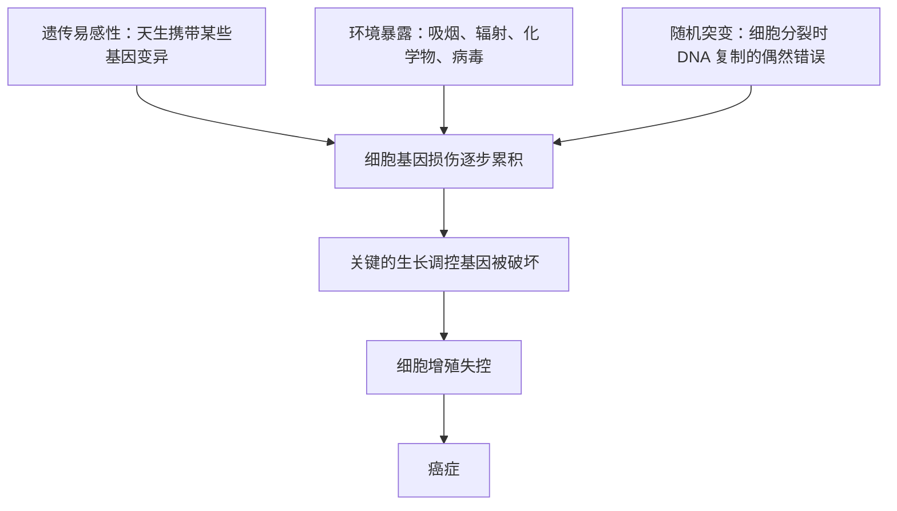

# 14｜癌症是「命中注定」，还是「环境所致」？

> 同一条街上，两户人家相似的生活，一户有人患癌、另一户平安无事。癌症到底有多少来自遗传、多少来自环境？这一篇要回答的，正是这个让人困惑又容易走极端的问题。

---

## 一、先说结论

穆克吉想纠正的，是我们思考癌症原因时最常见的一种「二选一」习惯。

我们总想在「命中注定」和「环境所致」之间挑一个答案：要么认为癌症是基因写好的宿命，要么认为都是抽烟、污染、生活方式惹的祸。

穆克吉的立场是：**癌症通常是基因、环境与随机突变共同作用的结果，而不是其中任何单一因素能解释的。** 理解这一点，才能同时避开两个极端——把所有癌症都归咎于个人生活方式，或者把一切都推给无法改变的命运。

这个结论听起来像「和稀泥」，但它其实是最诚实的：它承认了复杂性，也把「我们能做什么」和「我们无法控制什么」分清楚了。

---

## 二、我们先理解一个问题

先看一个几乎每个人都遇到过的困惑。

同一条街，有两户人家。年龄相仿，作息相似，都不怎么抽烟，也都在这条街上住了几十年，呼吸着同样的空气。结果，一户的老人得了肺癌，另一户的老人却健康地活到九十多。

于是两家人都会问同一个问题：

> **「为什么是我？我们明明差不多啊。」**

这个问题之所以刺痛人，是因为它背后藏着两种让人不安的解释：

- 如果说「是环境」，那为什么同样的环境，结果不同？
- 如果说「是命运」，那岂不是意味着我们什么都做不了？

所以真正的问题不是「环境还是命运」，而是：**这两者，以及可能还有第三种东西，究竟是怎么组合在一起的？**

---

## 三、作者到底提出了什么观点？

穆克吉在讨论癌症成因时，反复强调一个「多因素」的图景。它大致包含三个来源：

**第一，遗传易感性。** 有些人天生携带某些基因变异，使他们更容易患癌。医学界普遍认为，少数癌症有明显的家族聚集性——某些家族性癌症综合征就是典型的例子。这类人可能从父母那里继承了一个「已经出问题的基因」，于是更容易走到癌症那一步。

**第二，环境暴露。** 这是前面几篇反复讲到的：吸烟、辐射、某些化学物质、职业粉尘、病毒感染……这些都可能损伤细胞的基因，增加癌变风险。

**第三，随机突变。** 细胞每次分裂，都要复制整套 DNA，这个过程本身就可能出错。有些错误和你的习惯、环境无关，纯粹是「复制时的偶然」。这一层，是穆克吉在书中讨论癌症起源时会触及，但真正被大规模研究讨论，是更晚的事情。

穆克吉的核心观点可以概括为：

> **癌症不是一个单一原因造成的，而是多种因素长期累积、共同把细胞推向失控的过程。**

所以，问「是遗传还是环境」，就像问「一场火灾是氧气造成的还是燃料造成的」——**每个因素都为结果出了力，缺一不可，也很难单独切分。**

---

## 四、把这个观点翻译成人话

用一个更贴切的类比：**掷骰子。**

假设你要掷出「三个 6」才会得癌症（这只是个粗糙的比喻，真实的癌症需要更多次「坏运气」叠加）。

- 你的**基因**，决定了你手里拿的是普通骰子，还是几个面都是 6 的「灌铅骰子」。家族性遗传，就等于给了你一副更容易掷出 6 的骰子。
- 你的**环境与习惯**，决定了你有多少次投掷机会，以及骰子有没有被动过手脚。抽烟、辐射，相当于让你投得更多、更频繁。
- 而**随机突变**，就是骰子落地那一瞬间的偶然。

这样一看就清楚了：**「灌铅的骰子」不会自动让你赢，但只要给你足够多次投掷，你迟早会掷出三个 6。** 而一个拿着普通骰子、又只投很少几次的人，可能一辈子都不会「中奖」。

癌症就是这样：它不是某一个瞬间被「决定」的，而是**一副骰子、投掷次数、和运气，三者长期合作的结果。**

---

## 五、为什么会这样？

把这三个来源如何汇合，理成一条链：

这条链的关键在于 **D 这一环**：癌症很少是「一次事故」造成的，而通常是**多次基因损伤累积**的结果。这也解释了为什么癌症的发病率随年龄上升——活得越久，细胞分裂次数越多，累积的「错误」也越多。

理解了这一点，很多困惑就顺了：

- 为什么同样的环境，有人得癌有人不得？因为每个人手里的「骰子」不同，投掷次数不同，运气也不同。
- 为什么有人生活习惯很好还是得了癌？因为随机突变和遗传易感性，不受生活习惯的完全控制。
- 为什么有人抽烟几十年也没事？因为概率不是保证——他可能只是还没掷出那三个 6。

---

## 六、举一个现实生活中的例子

我们再用那个「同一条街」的例子，把它拆得更细一点。

老张和老王住在同一条街，都七十岁。老张得了肺癌，老王没事。表面上看，他们的「环境」一样。但只要往深处问，差异就出来了：

- **遗传**：老张的家族里，有几位近亲得过癌症；老王家族里则没有。老张可能天生对某些致癌损伤更敏感。
- **暴露史**：老张年轻时在工厂待过几年，接触过一些有害粉尘，虽然后来离开了；老王一辈子做的是室内文职。
- **随机**：即便前两项都一样，两个人细胞分裂过程中「出错」的时机和位置也不可能相同。

**注意，这里的每一项都不能单独解释结果。** 老张有家族史，但不是每个有家族史的人都会得癌；老王没有明显暴露，但也不是每个没暴露的人都绝对安全。

癌症就是这样一种「合力」的结果：**没有哪一项是唯一的罪魁祸首，但每一项都在悄悄改变概率。**

---

## 七、回到书中重新理解

现在再回看穆克吉对癌症成因的讨论，就能理解他为什么如此反对「单一原因」的叙述。

因为「单一原因」不仅不准确，还会带来两种现实的伤害：

**一是对病人的二次伤害。** 如果社会认定「癌症就是生活方式不好造成的」，那么病人不仅要承受疾病，还要承受「都是你自己作的」这种隐性的指责。而事实上，很多病人生活习惯良好，甚至根本不抽烟。

**二是对预防的误导。** 如果只强调个人责任，就会忽略更大的结构性问题——空气、水、职业环境、医疗可及性。把复杂问题简化成「你不够自律」，无助于真正降低发病率。

穆克吉的「多因素」观点，恰恰是在提醒我们：**面对癌症，既不要迷信宿命而放弃行动，也不要自负地以为一切尽在掌控。**

---

## 八、这个观点背后还有什么？

这里有三个容易被忽略的深层含义。

**第一，概率思维取代了确定思维。** 多因素模型告诉我们：我们讨论的从来不是「你会不会得癌」，而是「你得癌的概率是多少」。这在心理上很难接受，因为我们习惯要一个确定的答案，但生命科学给出的常常是概率。

**第二，「可以预防」和「无法预防」是同一条光谱的两端。** 环境暴露那一部分，我们可以努力改变；遗传和随机那一部分，我们改变不了。分清哪些能改变、哪些不能，本身就是一种智慧——**不在无法改变的事上自责，在能改变的事上行动。**

**第三，多因素也意味着「干预点很多」。** 既然癌症是累积的结果，那么任何一个环节的改善——少抽一点烟、少接触一点有害物、定期筛查——都可能把风险往下拉一点。**不需要「全对」，只要「少错」，就有价值。**

---

## 九、这个观点有问题吗？

「基因 + 环境 + 随机」这套框架，本身也并非没有争议。

**第一，三者的比例并不清楚。** 对于某一种具体的癌症，遗传占多少、环境占多少、随机占多少，学界并没有一个统一的答案，不同研究给出的估计也常有分歧。把三者并列，不代表它们权重相等。

**第二，「随机突变」这个因素尤其敏感。** 有研究认为，很多癌症的发生与细胞分裂的「运气」关系密切（这类讨论大约在 2015 年前后引起过广泛关注）；但也有不少研究者强调，这类结论容易被误读成「癌症主要靠运气，预防没用」。**关于随机因素究竟占多大比重，至今仍存在争论。** 谨慎的表述应该是：随机突变是重要的一环，但绝不是说生活方式和环境就不重要。

**第三，「多因素」有时会被滥用成「什么都不用做」的借口。** 既然原因这么复杂，那是不是做什么都没意义？不是的。复杂性恰恰说明：**每一分风险的降低，都是真实的收益。**

所以，这个观点最需要把握的分寸是：**承认复杂性，不等于放弃行动；承认运气，不等于否认努力。**

---

## 十、今天再看这个观点

（以下为现代延伸，非穆克吉原文）

近年来的研究，让我们对「三因素」的理解更细了。

- **遗传检测**：一些明确的癌症易感基因被发现，让部分高风险人群可以更早、更有针对性地筛查和干预。这把「遗传」从宿命变成了可管理的信息。
- **对随机因素的研究**：有研究尝试量化「细胞分裂次数」与癌症风险的关系，引发过关于「运气」的广泛讨论。但学界主流仍强调，环境与行为因素的公共卫生意义丝毫不减。
- **表观遗传学**：环境不仅可以直接损伤基因，还可能通过影响基因的「开关」起作用。这让「环境」与「基因」不再是简单的两分，而是互相缠绕。
- **公平视角**：同样的基因、同样的行为建议，对不同处境的人可行性不同。真正有效的公共卫生，要考虑这些差异。

这些是穆克吉书中思想在现代的延伸，而不是他原文的结论。它们共同指向同一个方向：**癌症的原因，永远是「多件事一起发生」，而不是「一件事注定」。**

---

## 十一、这一篇真正应该记住什么？

1. **癌症通常是多因素的结果。** 遗传、环境与随机突变彼此交织，很少能归因于单一原因。

2. **「遗传」是概率，不是命运。** 携带易感基因会提高风险，但不等于必然发病。

3. **「环境」是我们可以着力改变的部分。** 少暴露、早筛查，能真实地降低风险。

4. **「随机」提醒我们要谦卑。** 它解释了为什么好人也会得病，也提醒我们不要用生活方式去指责病人。

5. **分清能与不能，是面对癌症的关键。** 在无法改变的事上不苛责自己，在能改变的事上认真行动。

---

## 十二、留一个问题

我们已经从环境、遗传、随机三个方向，讨论了癌症是怎么发生的。

但历史上，还有一群人相信一条完全不同的线索：**癌症是由病毒引起的，是一种会「传染」的东西。**

这个想法曾被寄予厚望，也曾让一整代科学家为之投入巨大资源。它最终是被证伪了，还是以另一种方式被证明是对的？

下一篇，我们就走进这场持续了半个世纪的争论：**癌症是病毒引起的吗？**
