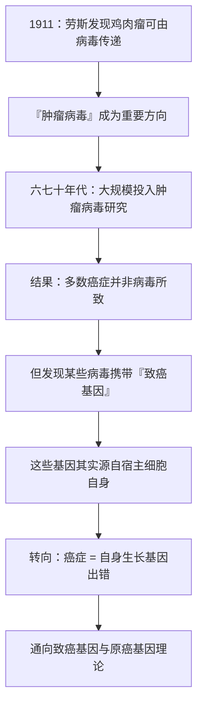

# 15｜癌症是病毒引起的吗？——一场持续半个世纪的争论

> 为什么会有一代科学家坚信「癌症会传染」？这一篇要回答的是：一场关于病毒与癌症的漫长争论，如何意外地指向了癌症最核心的秘密。

---

## 一、先说结论

穆克吉讲这段历史，是想展示一条极其戏剧性的科学路线：**一个起初看似只解释少数癌症的线索，最后竟然通向了癌症最核心的秘密——基因。**

故事从劳斯开始。据记载，1911 年，佩顿·劳斯（Peyton Rous）发现，鸡的某种肉瘤可以通过一种病毒在鸡之间传递。这等于说：肿瘤可以由一个「感染因子」带过去。此后几十年，「肿瘤病毒」成了热门方向，上世纪六七十年代美国还为此投入过大量研究资源。

但后来人们逐渐明白：**病毒只能解释少数癌症**（比如人乳头瘤病毒 HPV 与宫颈癌）。穆克吉认为，真正的收获藏在别处——研究病毒时，科学家意外发现在病毒里负责致癌的基因，其实来自宿主细胞自身。**病毒这条路，最终把我们领回了「癌症是我们自己的基因出了错」这个真相。**

---

## 二、我们先理解一个问题

先问一个当时看来完全合理的问题：

> **如果肿瘤能在动物之间「传递」，那癌症会不会是一种传染病？**

在劳斯的实验之后，这个问题不再是空想。因为在鸡的身上，它真的发生了：把肿瘤磨碎、过滤掉细胞、只留下极小的颗粒（病毒），再注射给健康的鸡，健康鸡也会长出肿瘤。这说明，传递肿瘤的，不是完整的细胞，而是某种更小的东西。

于是，一代人开始认真思考：**如果某些癌症是由病毒引起的，那么只要找到这些病毒，或许就能像对付传染病一样，用疫苗或抗病毒手段去预防、治疗癌症。**

这个想法太诱人了。它给了一个清晰的方向、一个明确的目标、一个可能被「攻克」的敌人。也正因为诱人，它持续吸引了几十年的研究热情。

但问题也随之而来：为什么这条路，最终只解释了少数几种癌症？

---

## 三、作者到底提出了什么观点？

穆克吉把这段历史，讲成一场「病毒论、化学致癌论、遗传论」之间的长期拉锯。

**第一幕：病毒论的兴起。** 劳斯在 1911 年的发现，让「肿瘤病毒」成为可能。据记载，他后来在约 55 年之后获得诺贝尔奖（1966 年），这本身就说明：这个想法被视为极重要，但也经历了漫长的等待与承认。

**第二幕：大规模投入。** 上世纪六七十年代，美国曾大规模投入「肿瘤病毒」研究，一度把「找到致癌病毒」当作攻克癌症的希望所在。这是典型的「科学热点」现象——一个方向看起来前景无限，资源就会大量涌入。

**第三幕：期望的修正。** 随着研究推进，人们逐渐认识到：**病毒只能解释少数癌症。** 多数癌症并不由病毒引起。这一认识，纠正了当年的过度乐观。

**第四幕：意外的转向。** 但故事并没有就此结束。研究者发现，某些致癌病毒携带的「致癌基因」，其实与宿主细胞里正常的基因高度相似。**换句话说，真正让细胞失控的基因，并不是病毒发明的，而是病毒从我们自己的细胞里「带走」或「借用」的。** 这条线索，最终通向了「致癌基因」这一核心概念。

穆克吉的观点因此是辩证的：**病毒论既「错了」，又「对了一半」。** 它没有成为癌症的普遍解释，却意外地为理解癌症的基因本质，打开了一扇门。

---

## 四、把这个观点翻译成人话

打个比方：一群侦探在追一桩案子。

他们盯上了一个嫌疑人——病毒。有确凿的线索表明，这个嫌疑人确实出现在少数几起案件里（HPV 与宫颈癌、部分肝癌、部分淋巴瘤等）。于是侦探们倾巢而出，判定「一定是他干的，所有的案子都是他干的」。

追了很多年，他们不得不承认：**大多数案子，这个嫌疑人根本不在场。** 病毒只能解释一小部分癌症。

但如果故事就停在这里，那只是一次失败的追捕。真正精彩的是——**在追踪这个嫌疑人的过程中，侦探们发现了一条被忽略的线索：所有案件的作案手法，都指向同一类「凶器」，那就是细胞里调控生长的基因。** 于是，他们从追人，转向了找凶器的来源。

而这，正是癌症研究史上最重要的一次转向：**从病毒，走向基因。**

---

## 五、为什么会这样？

把这条路线理成一条链：

这条链最迷人的地方在 **E 到 F**：一个本来要证明「癌症来自外敌」的研究方向，最终却证明了「癌症来自我们自身」。

这也说明，科学史上很多重大突破并不是沿着预定路线到达的。**研究的价值，往往不在于它最初想证明什么，而在于它在路上发现了什么。**

---

## 六、举一个现实生活中的例子

这种「追一条线索，追到另一个真相」的情形，其实在生活里也不少见。

想象一次火灾调查。调查员起初认定是「有人纵火」，于是全力追查可疑人员。查了很久，发现没有外来的纵火者。但在反复勘察现场的过程中，他们注意到：真正的起火点，来自建筑本身的电路老化。

火灾不是外人放的，而是**房子自己出了问题**。

如果调查员因为「纵火假设不成立」就草草收工，他们永远发现不了电路隐患。只有继续追问「那火星到底从哪来」，才能找到真正的根源。肿瘤病毒的研究，就是一次这样的调查：**嫌疑人（病毒）大多被排除了，但现场留下的证据，指向了房子（细胞基因）自身的缺陷。**

（这里要小心一个区别：病毒只解释了**少数**癌症，比如 HPV 与宫颈癌的关联是明确的，后来的 HPV 疫苗正是建立在这一发现之上。这提醒我们，一个方向即使不能解释全部，也可能有真实的、重要的价值——不能因为「不是普遍规律」就全盘否定。）

---

## 七、回到书中重新理解

现在再回看劳斯，我们就能理解他的历史地位为什么如此特殊。

他当年提出的，是一个当时看来很「小众」的可能性：肿瘤能不能被一个微小因子传递？在他所处的年代，主流看法更偏向「化学致癌物」和「细胞本身的问题」。劳斯的方向，一开始并不被普遍接受。「大约半个世纪后」他才获得诺贝尔奖，这个时间差本身，就是科学承认之艰难的写照。

而穆克吉真正想传递的，还有一层更普遍的道理：**科学不是一往无前的直线，而是不断修正方向的过程。**

病毒论曾经是希望、后来是挫折、最后又变成意外的馈赠。如果当年那些研究者因为「病毒只解释少数癌症」就彻底放弃，可能就没有后来对致癌基因的发现。**很多时候，重要的不是假设最终对错，而是这个假设逼着你去做了哪些实验、看了哪些以前看不见的东西。**

---

## 八、这个观点背后还有什么？

这里有三个深层的共识与张力。

**第一，科学的「热点」既有力量也有风险。** 当巨额资源涌向「肿瘤病毒」时，一方面催生了大量发现，另一方面也可能挤压了其他方向。这提醒我们：**热点是必要的，但把全部赌注压在一个假设上，是危险的。**

**第二，不同理论之间未必是「你死我活」。** 病毒论、化学致癌论、遗传论在历史上曾互相竞争，但回头看来，它们其实是从不同角度逼近同一个核心：细胞生长调控的失控。**一个理论被证伪的，往往是它的「普遍性」，而不是它的「全部价值」。**

**第三，颠覆未必来自正面胜利。** 病毒论最重要的贡献，不是证明了「癌症是传染病」，而是顺带交出了「致癌基因」这张底牌。**这在科学史上非常常见：一个错误的假设，可能孕育出正确的发现。**

---

## 九、这个观点有问题吗？

关于「病毒与癌症」的关系，需要格外谨慎，避免两种误读。

**第一，不能因为「病毒只解释少数癌症」，就否定病毒与癌症的真实关联。** 医学界普遍认为，至少有几类癌症与病毒感染确实相关：例如高危型 HPV 与宫颈癌的关联由楚尔·豪森（Harald zur Hausen）等人的研究确立（大约在二十世纪八十年代），并最终催生了 HPV 疫苗。这是实实在在的成果。把「不是普遍原因」说成「不是原因」，同样不准确。

**第二，也不能反过来夸大病毒的作用。** 早期把大多数癌症都归因于病毒的想法，是被后续证据修正了的。今天的主流观点是：**病毒是部分癌症的重要（有时是必要）因素，但远不是全部。**

**第三，「癌症会不会传染」这个问题，容易被公众误读。** 需要说清楚：**大多数癌症本身并不在人与人之间传染。** 某些与癌症相关的病毒（如 HPV）可以被传播，但「感染病毒」和「因此患癌」之间，还隔着很多条件。把两者直接等同，会造成不必要的恐慌。

所以，这段历史真正的教训是：**既要承认病毒论确有其事、确有贡献，也要承认它被过度期待过；而它最大的礼物，是把我们引向了基因。**

---

## 十、今天再看这个观点

（以下为现代延伸，非穆克吉原文）

从这段历史出发，今天至少有几点值得延伸思考。

- **疫苗预防癌症**：HPV 疫苗是「用预防传染病的方式预防癌症」最成功的例子。它证明，病毒论虽然没有成为癌症的普遍解释，却在一部分癌症上真正造福了人类。
- **感染与癌症的名单**：除了 HPV，医学界还确认了乙肝、丙肝病毒与肝癌、EB 病毒与某些淋巴瘤等的关联。这些关联让「抗病毒 + 疫苗」成为一类现实的防癌手段。
- **从病毒到基因的路还在延伸**：今天研究癌症，主线早已是基因与分子机制。但回顾历史会发现：**正是病毒的「错误方向」，把科学家推到了基因面前。**

这些是穆克吉书中思想在现代的延伸。它们共同说明一件事：**科学的价值，不能只用「假设最终对不对」来衡量。**

---

## 十一、这一篇真正应该记住什么？

1. **劳斯的发现开启了一条重要线索。** 1911 年他发现鸡肉瘤可由病毒传递，约半个世纪后获得认可与诺贝尔奖。

2. **病毒只能解释少数癌症。** 上世纪六七十年代的大规模投入，最终修正了「癌症是传染病」的过度乐观。

3. **但它的贡献是真实的。** 高危型 HPV 与宫颈癌的关联被确立，并催生了 HPV 疫苗。

4. **最大的礼物是转向基因。** 研究病毒时发现，致癌基因其实源自宿主自身——这条路意外通向了癌症的核心秘密。

5. **科学的价值不只看结论对错。** 一个被证明不具普遍性的假设，也可能孕育出真正关键的发现在路上。

---

## 十二、留一个问题

如果致癌的基因，其实来自我们自己的细胞，那么问题就变得非常尖锐了：

> **既然这些基因本来是我们正常生长所需要的，为什么它们会突然「叛变」，让细胞失控？**

下一篇，我们就进入分子革命的核心命题：**致癌基因——癌症为什么是「我们自己的基因」出了错？**
