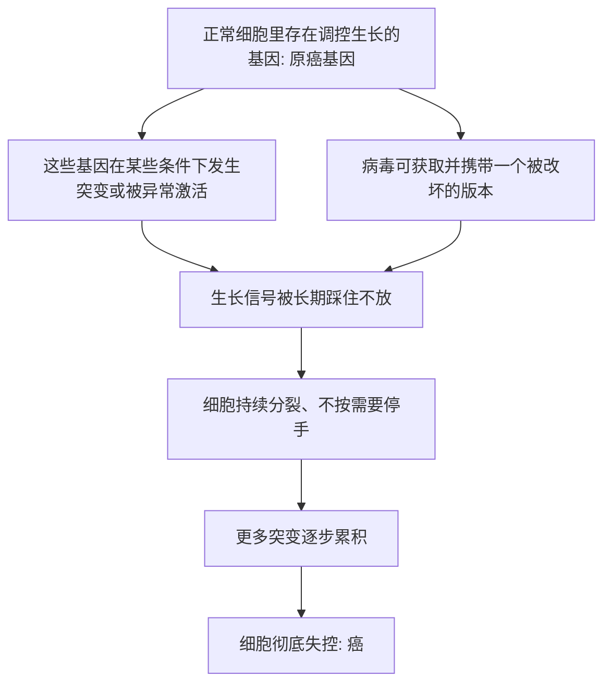

# 16｜致癌基因：癌症为什么是「我们自己的基因」出了错？

> 如果癌症真的来自我们体内，那么那个「叛徒」到底是谁？它又是怎么叛变的？

---

## 一、先说结论

穆克吉在书中反复强调：癌症不是从外面闯进来的怪物，而是我们身体里本来就有的东西坏了。而把这个判断落到分子层面，靠的是一个关键概念——**原癌基因**。

大约 1976 年，毕晓普与瓦尔缪斯证明：病毒里那个能致癌的基因，其实是从宿主细胞自己的正常基因「借」来的。也就是说，致癌的指令原本就写在我们的基因组里，只是被改坏了。更早的源头可以追到劳斯发现的鸡肉瘤病毒，但真正把线索引向「自身基因」的，是这一步。

从此，癌症研究有了新的图景：癌细胞不是外来入侵者，而是**我们自己的生长基因在特定条件下失控**。这一发现让毕晓普与瓦尔缪斯在 1989 年获得诺贝尔奖。

---

## 二、我们先理解一个问题

上一篇我们看到，劳斯证明鸡肉瘤可以通过病毒传递，于是很多人一度相信癌症可能是一种「传染」现象。

可是这里很快就出现了矛盾：

> 如果致癌的东西真的来自病毒，那为什么绝大多数人并没有得那些癌症？
> 为什么当研究者顺着病毒往下追，线索反而一次次指向了「基因」？

一个让人不安的问题浮现出来：

**如果癌细胞是被某种外来的东西「教坏」的，那外来的东西究竟是什么？如果找不到，癌症的根源又在哪里？**

---

## 三、作者到底提出了什么观点？

在穆克吉讲述的这段科学史里，曾经有一个很自然的假设：致癌基因是病毒自带的东西。病毒带着一把「致癌的钥匙」闯进细胞，把细胞撬开，逼它疯狂分裂。

但毕晓普和瓦尔缪斯的实验指向了另一个答案：

> **病毒并没有发明那把钥匙。那把钥匙原本就挂在细胞自己的墙上。**

具体来说，劳斯肉瘤病毒里有一个叫 src 的基因，它能让细胞癌变。研究发现，这个 src 并不是病毒独有的——**正常细胞里也有一个和它高度相似的基因**。科学家把细胞里这个正常的版本称为「原癌基因」（proto-oncogene）。

它平时并不坏，反而参与正常细胞的生长与信号传导。病毒做的事情，更像是把这段正常基因「抄」了过去，然后在抄写和传递的过程中把它弄坏了，变成一个持续踩着油门的版本。这个坏掉的版本，才被称为致癌基因。

所以，穆克吉想说的核心是：**癌症的关键，往往不是外来病原体，而是我们自身的基因在特定条件下的异常。** 癌，是我们的基因在某种意义上的「背叛」。

---

## 四、把这个观点翻译成人话

把细胞想象成一栋大楼里的一个车间。

车间里有很多开关和调速器，控制着什么时候开工、什么时候扩建、什么时候停下来。这些开关，就是与生长相关的基因。平时它们运转良好：身体需要长出新组织、修复伤口时，它们就启动；不需要时，就收手。

原癌基因，就是这类「油门开关」中的一个。正常状态下，它该踩的时候踩，该松的时候松。

所谓致癌基因，就是同一个开关被卡住了——一直踩着油门不放。可能是开关本身被改坏了（突变），可能是它被复制出了太多份，也可能是它被接到了错误的电路上，从而被异常激活。

**注意最关键的一点：这个坏掉的开关，并不是从外面搬进来的零件，而是原本就装在楼里的那个开关。**

敌人没有翻墙进来。是楼里的规章，被改了。

---

## 五、为什么会这样？

把这条逻辑链整理一下：

这条链里藏着两次「认知反转」。

第一次反转：致癌的指令不是病毒原创的，而是从细胞自身的正常基因来的。第二次反转：癌症的发生往往需要多次基因改变，而不是单一事件。

这就引出另一个重要概念——**抑癌基因**。

「油门」坏掉是一类问题；还有一类问题出在「刹车」上。像 RB、p53 这样的基因，正常时负责让细胞在出问题的时候停下来、修复或者自我毁灭。当这些「刹车」失灵，细胞同样会失控。

理解了「油门」和「刹车」这一对，你就能明白：癌症可以是加速过度，也可以是制动失效，或者两者兼有。

值得一提的是，大约 1971 年，克努森（Knudson）在研究一种儿童眼部的肿瘤（视网膜母细胞瘤）时，提出了「二次打击」假说——用来解释为什么有些遗传性病例更早、更容易发病。这个假说的思路，后来成为理解抑癌基因的重要基础。

---

## 六、举一个现实生活中的例子

想象一家大公司，有一整套内部管理规章。

规章里写着：某个部门达到一定规模后就必须停止扩张；如果账目出现异常，就必须上报、暂停、接受审计。这些规则平时默默无闻，正是它们让公司不至于失控。

现在出问题了。

一种情况是，负责「扩张授权」的那条规定被悄悄改了——原本是「订单增加才允许扩招」，变成了「无条件永久扩招」。这个部门就会像脱缰一样膨胀，不断挤占其他部门的资源。这对应原癌基因被异常激活。

另一种情况是，「审计和叫停」的那条规定失效了——账目再离谱也没人管，异常没人上报，谁来查都查不动。这对应抑癌基因失能。

更要命的是，这两件事往往不是同时发生的，而是一条一条累积起来的。每改坏一条规章，公司就离崩溃更近一步，但因为还剩一些约束在，表面上还能勉强维持。等到足够多的规章被破坏，整个组织就彻底失控。

**这家公司没有引进任何外来的敌人。毁掉它的，是它自己的规章。**

这正是穆克吉讲癌症时最让人心惊的地方。

---

## 七、回到书中重新理解

现在再回看前面「癌症是细胞的叛变」这个说法，就能理解得更深了。

「叛变」这个词容易让人以为，细胞变成了完全陌生的东西。但致癌基因的发现说明：叛变的细胞并没有变成别的东西，它用的还是自己的基因、自己的机器，只是**调控的规则坏了**。

这也解释了为什么癌症如此难治——你不能简单地「杀死一个闯入者」，因为失控的细胞在很多方面就是你自己的细胞。攻击它，就等于在攻击自己。

这正是整本书反复回到的困境。

---

## 八、这个观点背后还有什么？

这一发现背后，是一个更普遍的生物学事实：**多细胞生命本身就需要一套精密的「自我约束」。**

成为多细胞生物，意味着单个细胞必须放弃一部分「想分裂就分裂」的自由，服从整体的需要。癌症，可以说是这种约束在不同环节上的失效。所以有生物学家会说，癌症是「多细胞」这种生存策略附带的代价。

另一个隐含前提是：癌症不像细菌感染那样，是一个「外来病原体」问题，因此不能期待有类似抗生素那样「一劳永逸」的杀灭手段。因为靶子本身就是我们自己的基因产物，任何针对它的攻击，都可能波及正常细胞。

明白了这一点，你就会理解：为什么后来的抗癌思路越来越强调「精准」，而不只是「更强」。

---

## 九、这个观点有问题吗？

需要区分几层来谈。

第一，「原癌基因来自正常基因」是经过反复验证的分子生物学事实，这一点**医学界普遍认同**，争议不大。

第二，但把癌症整体归因于「基因出错」，也有它的局限。并非所有癌症都由少数明确的致癌基因驱动；肿瘤的发生涉及基因、环境暴露、随机突变等多个层面，单靠基因解释不了全部。关于「多少来自遗传、多少来自环境」，学界至今仍有争论，这个系列后面会专门讨论。

第三，一个容易被误读的地方是：说癌症「是我们自己的基因」，**不等于**癌症是命中注定、无法预防。原癌基因是每个人都有的正常配置，但让它出错的因素，很多来自环境与生活方式。理解机制的目的，恰恰是为了找到可以干预的环节。

第四，也有科学家提醒，「原癌基因」这个命名本身带有一定的事后视角——它是在先知道了「坏版本」能致癌之后，才回头这样称呼那个正常版本的。

---

## 十、今天再看这个观点

（以下为现代延伸，非穆克吉原文）

原癌基因与抑癌基因的框架，今天已经成为癌症研究和临床的通用语言。

许多靶向药的设计思路，正是沿着这条线索走的：先找出某个癌症里到底是哪个「开关」坏了，再设计药物去关掉它。下一篇要讲的费城染色体和格列卫，就是这条思路最经典的一次成功。今天医生做基因检测、寻找「驱动突变」，本质上都是在这一框架下工作。

还有一点值得注意：既然癌症是「多次改变逐步累积」的结果，那么它就不是一夜之间发生的。这为「早发现」和「减少致癌暴露」提供了理论依据——你每减少一次让基因出错的机会，就可能延后或降低某些癌症的发生风险。

当然，同样的框架也带来新的难题：目标是我们自己的基因产物，如何在打击它的同时尽量不伤及正常细胞。这个平衡，至今没有被完美解决。

---

## 十一、这一篇真正应该记住什么？

1. **致癌基因不是病毒原创，而是来自宿主自身的正常基因**——科学家称之为「原癌基因」。
2. **原癌基因平时是正常的生长调控基因**，只有被突变或异常激活后，才可能推动癌变。
3. **除了「油门」失灵，还有「刹车」失灵**——抑癌基因（如 RB、p53）的失活同样重要。
4. **癌症往往是多次基因改变逐步累积的结果**，而不是单一事件、一夜发生。
5. **说癌症是「我们自己的基因出错」，是为了理解机制**，而不是宣告它命中注定、无法预防。

---

## 十二、留一个问题

既然癌症的根源藏在我们自己的基因里，那么一个自然的问题就是：

> 如果有一种癌症，它的病因明确到可以指出「就是这一条染色体、这一个基因出了问题」，
> 我们是不是就能设计出只打这一个目标的药？

下一篇，我们就来讲一个真实发生过、堪称转折点的故事：**费城染色体**——以及它如何开启了靶向治疗的时代。
