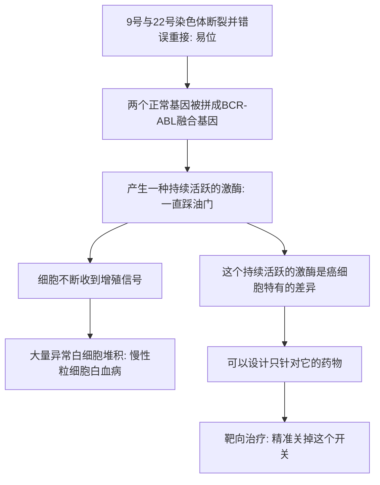

# 17｜费城染色体：靶向治疗的黎明

> 如果一种癌症的病因明确到只剩下一个「开关」，我们能不能像配钥匙一样，专门为它造一把钥匙？

---

## 一、先说结论

据记载，1960 年，两位研究者在慢性粒细胞白血病患者的细胞里，发现了一条特别短小的异常染色体。因为发现地在美国费城，它被称为「费城染色体」。1973 年，珍妮特·罗利进一步证明，它其实是 9 号和 22 号染色体互相「断开又接错」的结果。

后来科学家确认，这次接错把两个原本无关的基因拼成了一个融合基因（BCR-ABL），它产生一种持续「开着」的酶，不断给细胞发出增殖信号。

穆克吉讲这个故事，是为了说明一个概念上的突破口：**如果癌症的病因明确到只剩下一个持续打开的开关，理论上就可以为它量身打造一把只关这个开关的钥匙。**

这就是「靶向治疗」的思想起点。

---

## 二、我们先理解一个问题

化疗的逻辑是「杀死分裂快的细胞」。它为什么让人痛苦？因为正常细胞里也有很多分裂快的——骨髓、消化道、毛囊都算。于是它们被一起误伤。

一个问题随之而来：

> 能不能有一种药，只对付癌细胞，而尽量不碰正常细胞？
> 要造出这样的药，前提是什么？

前提是：你必须先知道癌细胞和正常细胞**到底差在哪**，而且这个差别要足够明确、足够独特。

费城染色体的故事，提供的正是这样一个罕见的、清晰的差别。

---

## 三、作者到底提出了什么观点？

穆克吉在书中强调的，不只是一条染色体的发现，而是一次思路的转变。

在很长时间里，癌症在人们眼中是一团混乱——细胞到处乱长，原因不明。而费城染色体第一次让某种白血病有了一个**具体、可以指认的分子病因**：不是模糊的「生长失控」，而是两条染色体断裂、接错，凭空造出一个本不该存在的基因。

这个基因（BCR-ABL）所编码的，是一种「激酶」——可以理解为一个给细胞增殖信号「加标记」的开关。正常版本需要被上游命令才会启动；而融合之后的版本，**不需要任何人下令，自己就一直开着。**

于是，医学第一次面对这样一种局面：

> 病因明确，机制单一。既然是一把一直卡在「开」位置的开关，
> 那就可以设计一把只针对它的钥匙。

这就是「靶向治疗」从概念走向现实的关键一步。

---

## 四、把这个观点翻译成人话

把细胞想象成一间工厂，厂长靠一连串指令决定要不要扩建、要不要加班。

正常工厂里，指令是一层层签发的：接到外面的订单，经理才批准加班；订单完成，就恢复原状。这样不会失控。

现在，两条生产线在改造时接错了线路，结果有一个开关被永久接通了。它不再需要任何订单，也会不停向全厂广播：「加班！扩建！再多造！」

更糟的是，这个开关和厂里其他开关长得非常像——它们属于同一类零件（激酶）。如果你用一颗大炸弹去炸掉所有开关，工厂会彻底瘫痪。这正是化疗误伤的困境。

可如果这种开关上有一个**只有它才有的、别人都没有的小小凹槽**，那么你就能造一把只有它才能插进去的钥匙，轻轻一拧，把它关掉。

费城染色体带来的，正是这样一个罕见的、独一份的凹槽。

---

## 五、为什么会这样？

这条链里最关键的两个环节是：**病因单一**，以及**这个差异只属于癌细胞**。

正因为如此，它才可能被「精准打击」，而不是被无差别轰炸。

也正因为这样，慢性粒细胞白血病成了靶向治疗理想的「第一个试验场」——它病因清楚、标志明确，是最容易被验证的癌症之一。

---

## 六、举一个现实生活中的例子

想想一把锁。

一栋大楼里有许多房间，门上装的是同一牌子、同一规格的锁。你有成千上万扇门要处理，但只有一间房里出了问题，需要把它单独锁上。

用一把大锤去砸，确实能把那扇门封死——但楼里的其他门也会被砸坏。这就是化疗的困境：手段有效，代价巨大。

可如果那间出问题的房门，恰好用的是全楼**唯一一把特殊锁芯**的锁，而你手里正好有它唯一的钥匙，那么你只需要把钥匙插进去、轻轻一拧。其他门丝毫不会受影响。

靶向治疗的梦想，就是找到那把只开一把锁的钥匙。

费城染色体，是医学第一次遇到的、如此明确的一把「特殊锁芯」。

---

## 七、回到书中重新理解

现在再回看前面几篇讲过的内容，会发现费城染色体是一个意义上的分水岭。

前面我们讲过，化疗时代的人们一直梦想「既能杀癌、又不伤人」。但那时的药物做不到，因为它们分不清敌我。费城染色体的发现之所以重要，是因为它第一次把「敌我差异」**精确到了分子层面**：原来癌细胞和正常细胞的差别，可以具体到一条染色体的错误、一个基因的融合、一个开关的失控。

穆克吉在书里反复讲到的一件事是：癌症不是一个敌人，而是一类各不相同的疾病。费城染色体正是这句话最有力的注脚——**不同的癌症有不同的破绽，而分子层面的发现，让「找破绽」第一次有了可行的方向。**

---

## 八、这个观点背后还有什么？

这一段背后，藏着一个更普遍的医学方法论。

在费城染色体之前，「找到病因」和「治疗疾病」之间常常是断开的：知道了原因，也未必有办法下手。而在这里，因果链短到惊人——

**一条染色体异常 → 一个融合基因 → 一个持续活跃的激酶 → 一个明确的药物靶点。**

知道原因，几乎等于知道该往哪里打。

这也埋下了一个隐含前提：**「病因单一」的癌症是特例，而不是常态。** 大多数实体瘤不像慢性粒细胞白血病那样干净利落，往往同时有好多基因出错。

所以，费城染色体这条路虽然漂亮，却不容易被复制到所有癌症上——这一点，在接下来几篇里会越来越明显。

---

## 九、这个观点有问题吗？

有几个地方需要保持清醒。

第一，费城染色体和 BCR-ABL 的存在，是反复验证的**客观事实**，这一点学界没有争议。

第二，但在早期，人们也一度把「发现一个染色体异常」和「它就是原因」混为一谈——看到异常，并不自动等于证明它是病因，还需要后续的功能研究来确认。这提醒我们：**观察到关联，和确立因果，是两件事。**

第三，更重要的一点是：即便找对了靶点，也不等于治疗就此成功。靶点明确，只解决了「打哪里」；「用什么打、打了会不会反弹、会不会伤到正常细胞」都是另外的问题。关于「单一靶点能否带来长久疗效」，学界很快发现了它的局限——这正是后面要讲的耐药问题。

第四，「靶向」这个词也容易给人过高期待。它并不总意味着「只杀癌细胞、绝对安全」，很多靶向药依然会有副作用，只是通常比传统化疗温和、可预测一些。

---

## 十、今天再看这个观点

（以下为现代延伸，非穆克吉原文）

费城染色体的思路，今天已经扩展到很多癌症。

「先找到驱动基因，再设计针对性药物」——这套逻辑，成了现代肿瘤学的主流方法之一。医生对许多癌症做基因检测、寻找可靶向的突变，本质上都是在寻找各自的「费城染色体」。

还有一个方向值得注意：费城染色体不只用于治疗，也用于**监测**。因为它是癌细胞特有的标志，检测它的数量变化，可以帮助判断病情是在缓解还是在回升。这说明一个明确的分子标志，价值不止在「打」，还在于「看」和「追踪」。

同样要提醒的是：靶向治疗并非万能，它的成功高度依赖「找得到一个干净、独特、可下手的靶点」。多数癌症并没有这么理想的条件。

---

## 十一、这一篇真正应该记住什么？

1. **费城染色体是 1960 年在慢性粒细胞白血病患者细胞里发现的异常染色体**，因发现地得名。
2. **1973 年，珍妮特·罗利证明它是 9 号与 22 号染色体的易位**。
3. **这次易位形成 BCR-ABL 融合基因**，产生持续活跃的激酶——一个一直开着的增殖开关。
4. **病因明确且为癌细胞特有**，使「只针对它设计药物」在概念上成为可能，这是靶向治疗的起点。
5. **「靶点明确」只解决了打哪里**，不等于治疗一定成功——耐药等难题仍在后面。

---

## 十二、留一个问题

费城染色体的故事告诉我们：找到癌细胞的破绽，就有可能精准打击。

但一个更大的问题随之而来：

> 形形色色的癌症——乳腺癌、肺癌、白血病、淋巴瘤——它们看起来差别那么大，
> 会不会其实共享着一些共同的底层「能力」？有没有一张统一的清单？

下一篇，我们就来看一张试图把整个癌症世界收拢起来的地图：**《癌症的标志》。**
