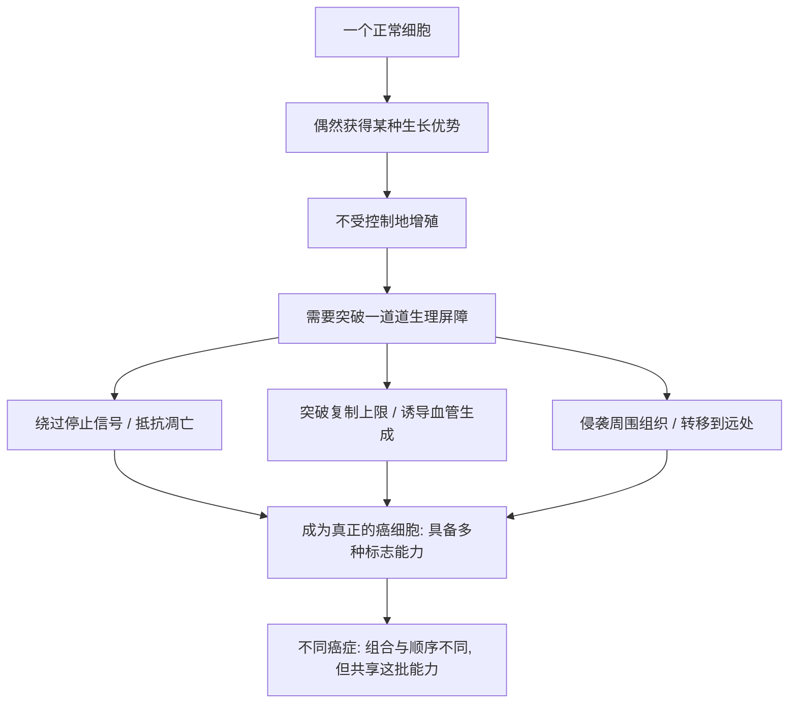

# 18｜癌细胞有哪些「超能力」？——《癌症的标志》

> 形形色色的癌症，看起来千差万别，它们背后会不会共享着同一批底层「能力」？

---

## 一、先说结论

癌症有成百上千种，差别巨大。但汉纳汉与温伯格在 2000 年发表的《癌症的标志》提出一个整合性的看法：**尽管癌症五花八门，一个细胞要真正成为癌细胞，必须获得若干种共同的核心能力。**

这些能力一般认为包括：能自己制造增殖信号、对「停止生长」的信号不敏感、抵抗细胞的自毁程序、突破复制次数的上限、诱导身体为它长出新血管，以及侵入周围组织并转移到远处。2011 年，两位作者又对这一框架做了扩展和更新。

穆克吉借这个框架说明：癌症不是一堆互不相干的怪病，而是一套可以被归纳、被理解、被画在地图上的系统。它像一份分类目录，把漫天乱飞的研究线索收拢起来。

---

## 二、我们先理解一个问题

前面几篇讲的都是单一癌症、单一机制：慢性粒细胞白血病里有费城染色体，某个基因坏了，某种药精准地关掉了它。

可现实是：乳腺癌、肺癌、淋巴瘤、胰腺癌……它们在病人身上表现完全不同，有的长在器官里，有的弥漫在血液中。

问题就来了：

> 如果每种癌症都各不相同，研究岂不是要一种一种重做一遍？
> 有没有可能，它们只是用不同的方式，学会了同一批「本领」？

如果答案是「有」，那么医学就有机会不再一个一个打，而是抓住它们的共同弱点。

---

## 三、作者到底提出了什么观点？

穆克吉在书中介绍的，是汉纳汉与温伯格的这套框架。它的核心思路可以概括为一句话：

> **从「癌症是什么器官得的」，转向「癌细胞会做什么」。**

过去分类癌症，靠的是长在哪里、显微镜下长什么样。这个框架换了个角度看问题：不管来自哪个器官，一个细胞要真正变成癌细胞，必须在若干关键能力上「解锁」。一般认为包括：

- 自己制造生长信号，不再等外部指令
- 对「别长了」的抑制信号不敏感
- 抵抗细胞正常的自我毁灭程序（凋亡）
- 突破正常细胞的分裂次数上限，近乎无限地复制
- 诱导身体为它长出新血管，供应养分
- 能够侵入周围组织，并转移到远处

两位作者把这些共同能力称为「标志」（hallmarks），并指出：**癌症的多样性，很大程度上是同一批能力被不同组合、不同顺序获得的结果。**

---

## 四、把这个观点翻译成人话

把癌症想象成一场「越狱」。

监狱的规矩是一层层设定的：不能随便走动、到点就得回牢房、违规要受处分、不能扩建、不能挖地道、更不能翻墙。

一个囚犯要真正逃出去，光靠一项本事远远不够，他得一路解锁：能无视看守的命令、能躲过内部的处罚、能找到源源不断的食物、能探出一条通往墙外的路。

不同的囚犯可能用了不同的办法，解锁的顺序也各不相同，但**最终能逃掉的那些人，都掌握了同一批关键能力**。

汉纳汉与温伯格做的事，就是把这些「关键能力」列成一张清单。

这也带来一个重要的推论：治疗未必要针对每一种癌症单独发明方法，也可以针对这些**共同能力**下手——比如切断肿瘤的血管供应，理论上可能对很多癌症都有效。

---

## 五、为什么会这样？

这张图想说两件事。

第一，癌症不是一步到位的，而是一步步「解锁」能力的过程。第二，这些能力是**有共性的**——所以可以做成一张地图。

穆克吉反复强调「癌症是一类病」，这个框架正是对这句话最系统的诠释。

另外，作者也提到一些「使能因素」：比如基因组的不稳定，让细胞更容易累积错误；以及长期的慢性炎症，可能为肿瘤提供有利环境。这些不算能力本身，而是让能力更容易被获得的土壤。

---

## 六、举一个现实生活中的例子

想想图书馆。

你走进一座巨大的图书馆，里面堆着上百万本书，内容从天文到菜谱，乱七八糟。你想找一本特定的书——几乎不可能。这时如果没有分类系统，你只能一本一本地翻。

但一旦有人建立了分类法：按学科分、按作者分、按年代分，并且给共同主题贴上「标签」，整个图书馆立刻变得可理解。你会知道：这些书虽然内容各异，但有些可能在讲同一类主题。

「癌症的标志」就是给癌症研究建的这样一套分类法。在此之前，研究者各自守着自己的癌种，术语不通、结论难比；框架建立之后，所有人有了共同的坐标系。一个研究乳腺癌里「逃避凋亡」的人，和一个研究白血病里同一能力的人，突然可以说同一种语言了。

再补一个更贴近医疗的例子：医生面对一个症状古怪的病人，会对照一份清单逐项排查，而不是凭感觉猜。清单的价值不在完美，而在于**让杂乱的线索变得可比较、可交流、可积累**。

癌症的标志，就是这个意义上一份针对癌细胞的「能力清单」。

---

## 七、回到书中重新理解

现在再回看前面那些具体故事，你会发现它们各是什么。

费城染色体，是某个癌症在「自己制造生长信号」这一条上出的问题。联合化疗之所以能成功，是因为它从多个方向同时压制癌细胞。而这本书反复强调的「癌症不是一种病，而是一大类病」，在这个框架里得到了骨架式的支撑：**疾病的多样性是真的，但底层的共性也是真的。**

穆克吉借这个框架想表达的是：理解癌症，既要看到差异，也要不断寻找共性——只有找到了共性，治疗才可能从「一个一个打」变成「成片地打」。

---

## 八、这个观点背后还有什么？

这个框架背后，是一个更深的哲学选择：**分类方式，决定了你能看到什么。**

如果按器官分类，你会得到一份器官清单；如果按能力分类，你会看到一张系统图。不同的分类，会导向不同的研究方向和治疗策略。穆克吉在书里反复在做的一件事，就是提醒读者：癌症研究的进步，很多来自对「该怎么给癌症分类」这个问题的重新回答。

另一个隐含前提是：**框架是工具，不是真理。** 它帮人把混乱理出秩序，但任何归纳都会丢失细节。用得好的时候，它让复杂变得可讨论；用得不好的时候，它可能遮住真正重要的差异。

---

## 九、这个观点有问题吗？

几点值得留意。

第一，这个框架**便于整合、富有解释力**，这一点学界普遍认可，它对研究方向的影响很大，被大量引用和讨论。

第二，但它也有「过度整齐」的风险。真实肿瘤内部是高度异质的，同一颗瘤里不同区域的细胞，能力都不完全一样。把癌症讲成整齐的几条能力，可能会让读者低估它的混乱程度。关于「标志清单该有几条、还缺哪些」，学界一直有讨论和补充，这本身就说明它不是一个已经封板的标准答案。

第三，它偏重描述「癌细胞能做什么」，对「这些能力如何组合、如何随病程变化」的解释，还在发展之中。

第四，也有人担心，这类高度概括的框架容易被简化成口号，反而淹没了具体癌症之间的重要差别。对研究者是地图，对公众则可能变成一种过度顺滑的叙事。

---

## 十、今天再看这个观点

（以下为现代延伸，非穆克吉原文）

「癌症的标志」今天已经成为肿瘤研究和教学中的常用框架，并且随研究进展不断被修订和扩展——陆续有人提出新的候选能力，也有人主张把肿瘤所处的「微环境」和「逃避免疫」提到更重要的位置。

在临床上，这套思路也在影响治疗的组合方式：既然癌细胞依赖一批共同能力，那么把针对不同能力的药物联合使用，就成了一种自然的策略——这正是后面「组合疗法」和对抗耐药的逻辑基础之一。

要提醒的是：框架的流行不等于问题的解决。知道癌细胞有哪些「超能力」，只是知道了该往哪些方向设防；具体每一种癌症该打哪一条、按什么顺序打，仍然是难题。

---

## 十一、这一篇真正应该记住什么？

1. **「癌症的标志」由汉纳汉与温伯格在 2000 年提出**，2011 年扩展更新，试图归纳癌细胞的共同核心能力。
2. **典型能力包括**：自主增殖、无视停止信号、抵抗凋亡、无限复制、诱导血管生成、侵袭与转移等。
3. **它把癌症研究从「按器官分」推向「按能力分」**，让不同癌种的研究者有了共同语言。
4. **这个框架的价值是「整合与地图化」**，而不是一份必须逐条死记的标准答案。
5. **它同时提醒我们**：癌症的多样性背后有共性，这对设计更广谱的策略很重要。

---

## 十二、留一个问题

如果癌细胞依赖的是一批共同的能力，那么只要能精准地关掉其中最关键的一条，是不是就能让治疗产生巨大的效果？

事实上，已经有一个药物做到了这件事，它的成功几乎改变了某一类癌症的整个治疗方式。

下一篇，我们来讲**格列卫**——一颗被称为「魔弹」的药。
