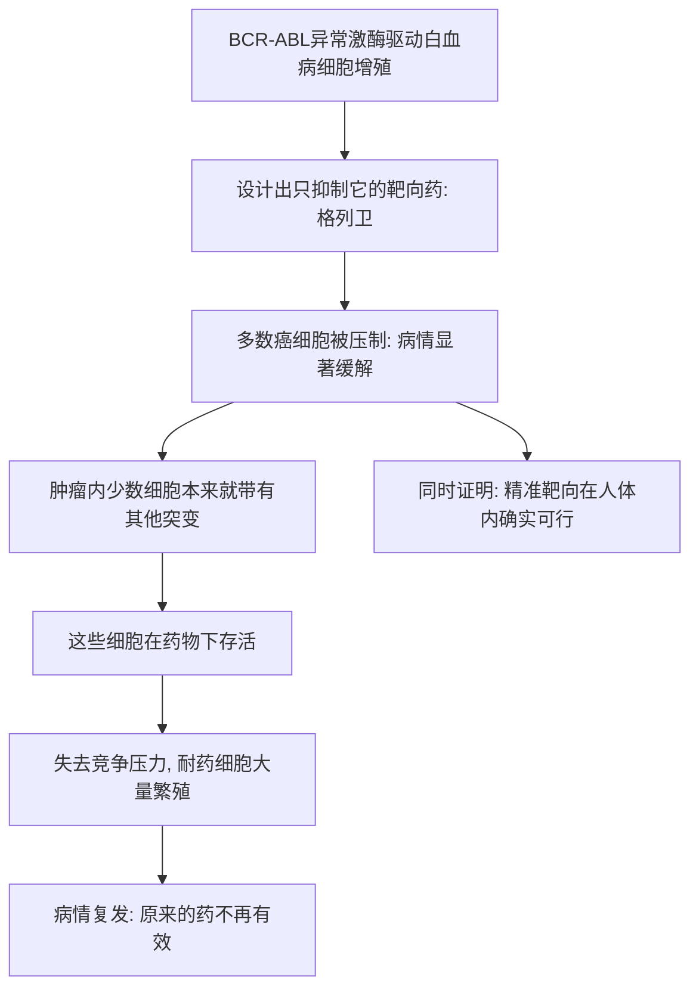

# 19｜格列卫：一颗「魔弹」如何改写癌症治疗？

> 如果真能造出一把只开一把锁的钥匙，癌症治疗会变成什么样？它真的能一直有效吗？

---

## 一、先说结论

大约 2001 年，一种叫伊马替尼（商品名格列卫）的药物获美国 FDA 批准，用于治疗慢性粒细胞白血病。它针对的，正是上一篇讲的那个一直开着的 BCR-ABL 激酶开关。

据记载，在这之前，慢性粒细胞白血病患者用传统化疗往往预后不佳；而用上这种药后，很多人获得了极高的缓解率，副作用也远小于化疗。穆克吉在书中把它写得近乎一个梦想成真的时刻：医学第一次做到了「精准点射」，而不是「大面积轰炸」。

这颗「魔弹」证明了靶向治疗不只是理论。但故事没有到此结束——没过多久，癌细胞就进化出了耐药。这正是癌症最顽强的地方。

---

## 二、我们先理解一个问题

上一篇我们确认了：慢性粒细胞白血病有一个明确的分子开关，理论上可以精准关掉它。

但「理论上可以」和「真的做到了」之间，隔着整个药物研发史。

> 一个在实验室里想清楚的点子，究竟要经过什么，才能变成病人手里真正有效的药？
> 即便药做出来了、也有效了，它是不是就能一直有效下去？

格列卫的故事，刚好把这两个问题都回答了一遍——前半段是成功，后半段是提醒。

---

## 三、作者到底提出了什么观点？

穆克吉讲的格列卫故事，核心有两层。

第一层，是**「魔弹」这个百年梦想的兑现**。这个概念其实可以追到更早的保罗·埃利希：他梦想有一种药物，能像子弹一样只命中病原体，而不伤及人体。格列卫让这个梦想第一次以一种令人信服的方式实现——它专门抑制 BCR-ABL 这类异常活跃的激酶，对不依赖它的细胞影响相对较小，因此副作用明显比传统化疗温和。

第二层，也是穆克吉更在意的：**这颗魔弹并没有终结战争。** 用药一段时间后，一部分患者的病情重新恶化。研究者发现，癌细胞里的 BCR-ABL 基因又发生了新的突变，使得药物不再能有效结合——**癌细胞在药物压力下，被「筛选」出了耐药的版本。**

所以穆克吉想表达的是：格列卫既是靶向治疗的胜利，也是「癌症是一台进化机器」的第一声警报。它证明你能打中靶心，却也提醒你，靶子会变。

---

## 四、把这个观点翻译成人话

先想想两种打仗方式。

一种是**大面积轰炸**：把整个区域犁一遍，敌人的据点确实会被摧毁，但平民、道路、建筑也一并遭殃。这就是传统化疗——杀死快速分裂的细胞，癌细胞被压下去，骨髓、消化道、毛囊等正常组织也被误伤。

另一种是**狙击手点射**：情报精确，目标清晰，一发子弹打掉关键人物，周围一切完好。格列卫更像后者——它瞄准的是癌细胞特有的那个异常开关。

但「点射」有个前提：目标必须是老样子。

如果那个关键人物发现有人要狙击他，开始不断换装、换位置、甚至换一批新的替身，那么原来的瞄准参数很快就会失效。

癌细胞做的正是这件事：它在药物的压力下不断变异，**谁能躲过药，谁就活下来繁殖。**

---

## 五、为什么会这样？

这条链里最该注意的是 **D 到 F 这一步**。

肿瘤不是一个整齐的群体，而是一大群略有差异的细胞。药物杀死的是大多数；剩下的少数——本来只是偶然带有耐药突变的——因为没有了竞争者，反而获得了空前的繁殖空间。

这不是因为药不好。恰恰相反，是因为药太好、太专一，把其他细胞清空，反而给耐药细胞腾出了位置。

**这也是后面的关键主题：单一疗法很难取得永久胜利。**

---

## 六、举一个现实生活中的例子

把城市里一个顽固的据点想象成一个卡死的开关。

整座城市因为这一个开关卡在「开」的位置而陷入混乱。你有两个选择：一是往整片区域投弹，把开关和周围的一切都炸平；二是派专人找到那个开关，用一把专用钥匙把它拧回去。

第二方案显然更漂亮，对城市的破坏也小得多。格列卫就是那把专用钥匙。

但问题来了：那个开关所在的机器并不是静止的。它会磨损、会变形、会换零件。一开始钥匙还能插进去；用了一段时间，锁芯变了形状，钥匙就插不动了。

你不能怪钥匙不好——你只是需要**再观察锁芯是怎么变的，然后配一把新的钥匙。**

研究者后来正是这么做的：针对新的耐药突变，又开发出能抑制它们的下一代药物。所以「耐药」常常不是终点，而是又一轮「找新破绽、配新钥匙」的开始。

---

## 七、回到书中重新理解

现在回看穆克吉为什么把格列卫写得如此重要，就能理解了。

在它之前，靶向治疗更多是一个概念、一种希望——费城染色体告诉我们「可以瞄准」，但还没有真正打中过。格列卫第一次用实实在在的病人结果，证明**精准打击是可行的**：你可以只针对一个分子异常，就产生巨大的临床效果。

但穆克吉同时把它放在整本书更长的线索里看：从化疗的「以毒攻毒」，到靶向的「精准点射」，医学的方法越来越聪明，可癌症总能以某种方式绕开。

**格列卫的胜利是真实的，它的局限也是真实的。** 这两件事并不矛盾，反而都是理解后续所有靶向治疗的关键。

---

## 八、这个观点背后还有什么？

这个故事背后，藏着一个贯穿全书的深层逻辑：**癌症的适应能力，本质上是一种进化能力。**

肿瘤里的细胞会变异、会被筛选、会适者生存。药物是一种强大的「选择压力」，它不会让癌症消失，反而会改变癌症内部的竞争格局。理解了这一点，你就能明白为什么「一种药打到底」的思路总是遇到瓶颈——**你面对的不是一个固定靶，而是一个会随你出招而改变的对手。**

另一个隐含前提是：药物研发的胜利，往往不来自某个人灵光一现，而是实验室、药厂、临床医生和病人共同参与的长链条。格列卫背后，是很多人在几十年里接力的结果。

---

## 九、这个观点有问题吗？

需要小心几点。

第一，「格列卫是靶向治疗的成功范例」是**医学界普遍认同**的事实。它的出现确实改变了慢性粒细胞白血病的治疗。

第二，但「魔弹」这个词容易给人过于理想化的印象。靶向药并非绝对只伤癌细胞、完全不影响正常组织；很多患者依然会遇到副作用，只是通常比传统化疗可控。把靶向治疗想象成「零代价」，是不准确的。

第三，也是最需要强调的：**耐药不是个别意外，而是靶向治疗的普遍难题。** 关于「为什么耐药如此普遍、如何应对」，学界的认识已经比较一致——这是进化的必然结果；但具体到每种药、每种癌症该如何组合和排序用药，仍有大量争议和探索。

第四，还有现实层面的问题：格列卫这样的药价格高昂，如何让需要它的人用得起，是一个长期存在的争论。技术上的成功，并不自动等于可及性上的成功——这一点，穆克吉在书中也有所触及。

---

## 十、今天再看这个观点

（以下为现代延伸，非穆克吉原文）

格列卫之后，靶向治疗已经扩展到许多癌症，成为现代肿瘤学的重要支柱之一。今天治疗不少癌症时，医生会先做分子检测，再决定用哪种靶向药——这套流程的思想源头，就是费城染色体与格列卫开辟的那条路。

另一个重要的发展是**联合与轮换策略**：既然单一药物容易被耐药绕过，那就同时或依次使用针对不同靶点的药，尽量堵住癌细胞的「逃生通道」。这既借鉴了当年联合化疗的经验，也用上了新的分子知识。

还有一个方向是**监测耐药**：通过检测血液里癌细胞标志物的变化，尽可能早地发现耐药苗头，及时换药。这把「打」和「看」结合了起来。

要提醒的是：靶向治疗的成功仍高度依赖「找得到明确的靶点」，多数癌症并不具备慢性粒细胞白血病那样干净的条件。

---

## 十一、这一篇真正应该记住什么？

1. **伊马替尼（格列卫）大约在 2001 年获 FDA 批准**，用于治疗慢性粒细胞白血病，靶点是 BCR-ABL 激酶。
2. **它实现了「魔弹」的梦想**：针对明确的分子异常，高效且副作用较化疗温和。
3. **它的成功证明靶向治疗在人体内确实可行**，是癌症治疗史上的分水岭。
4. **但它很快遭遇耐药**——癌细胞在药物压力下被筛选出新的突变。
5. **耐药不是终点**，而是新一轮「找破绽、配新钥匙」的开始，单一疗法难以永久取胜。

---

## 十二、留一个问题

格列卫打的，是「癌细胞自己多出来的那个开关」。可还有一类完全不同的思路：

> 癌细胞要长大，是不是必须先「骗」身体为它长出新血管，给自己运粮？
> 如果我们不直接打癌细胞，而是切断它的补给线，行不行得通？

下一篇，我们来讲福克曼与他的**血管生成**假说——一个充满想象力、却屡经波折的抗癌思路。
