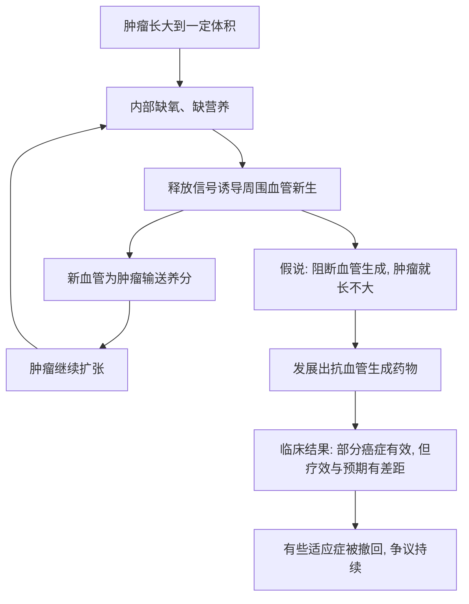

# 20｜能不能「饿死」肿瘤？——福克曼与血管生成

> 癌细胞也要吃饭、要氧气。如果不直接杀它，而是切断它的补给线，能不能把它「饿死」？

---

## 一、先说结论

大约 1971 年，犹大·福克曼提出一个大胆假说：肿瘤不可能无限长大，除非它能诱导身体为它长出新的血管来供应养分。

如果这是真的，那么**「抗血管生成」就可能成为一种广谱抗癌策略——不是直接杀癌细胞，而是切断肿瘤的补给线。** 这个想法极富想象力，后来也确实催生了药物：比如贝伐珠单抗（Avastin）在约 2004 年获批，沙利度胺也曾被研究用于这个方向。

但穆克吉在书中强调的是另一面：这条路的临床历程充满希望与争议——有些效果显著，有些适应症后来被撤回，整体疗效也常常不如最初期待。

它说明的道理是：癌症治疗的每一个「巧妙点子」，都必须经过漫长而残酷的验证。

---

## 二、我们先理解一个问题

前面几篇的思路基本都是「直接打癌细胞」：化疗毒杀、靶向精准抑制。

可这些方法都会遇到同一个麻烦——癌细胞会变异、会耐药。

于是有人想：能不能换个打法，不直接跟癌细胞硬碰硬，而是掐住它的生存条件？

> 癌细胞也是活细胞，它们也要吃饭、要氧气。这些东西靠什么运来？靠血管。
> 那如果我们让肿瘤长不出新血管，它是不是就会被「饿死」？

这听起来是个很聪明的迂回，但聪明不等于成立。这一篇要看的，正是这种「聪明」如何被现实一点点检验。

---

## 三、作者到底提出了什么观点？

福克曼的假说，用一句话概括是：**肿瘤的生长依赖新生血管，因此血管生成是一个可以被攻击的靶点。**

具体来说，正常组织里的血管相对稳定，只在伤口愈合、生理周期等特定时候才长新血管。而肿瘤长到一定大小后，内部细胞离血管越来越远，会缺氧、缺营养，于是它会释放信号，「骗」周围的血管向它生长。

福克曼认为，如果你能阻断这些信号，肿瘤就长不大、甚至萎缩。

这个思路的诱人之处在于：它**不直接针对癌细胞，而是针对肿瘤赖以生存的支持系统**。理论上，不同种类的癌症都需要血管，因此这可能是一种「广谱」策略；而且血管细胞相对稳定，不像癌细胞那样容易突变耐药。

穆克吉在书中把这个设想讲得很有画面感：与其一次次追杀会变形的癌细胞，不如断掉它的后路。

---

## 四、把这个观点翻译成人话

把肿瘤想象成一座不断扩张的据点。

它要养活里面的人，就必须从外面运进粮食和水。为此，它得先修一条补给线——也就是新血管。据点越大，需要的补给越多，这条线就越关键。

第一代打法是直接冲进据点清人（化疗、靶向）；第二代思路是：不进去，而是**把补给线掐断**。没有粮草，据点就算不被攻破，也扩张不下去。

听起来很妙，但现实给这套思路加了几道难题：

- 一座据点可能有好几条补给线。掐断一条，它可能另开一条。
- 也可能有其他通路可以绕行，或者据点干脆进入「低耗能」状态，暂时不死。
- 更麻烦的是，人体的正常组织也需要血管：伤口愈合、女性生理周期、心脏供血都离不开它。所以抗血管生成的药，副作用往往是出血、高血压、伤口难愈等——因为你在动的，是身体正常的机制。

人类的身体远比一盆植物复杂。给植物断水，它会枯萎；但对人体来说，血管系统牵连着全身，不能一概而论。

---

## 五、为什么会这样？

这条链的后半段，正是穆克吉想让人看到的部分：**从「讲得通的机制」到「真正好用的药」，中间隔着大量意想不到的情况。**

比如，抑制血管生成后，肿瘤可能变得更缺氧、更具侵袭性；也可能只是生长变慢，而没有真正死亡；有时需要和化疗联合使用，效果才明显，单独使用则有限。

---

## 六、举一个现实生活中的例子

想想一座边境上的军事据点，靠一条后方公路持续获得补给。

指挥部判断：与其强攻据点、付出巨大伤亡，不如切断这条公路。理论上，据点没有补给，就会撑不下去。

但真实情况往往复杂：

- 据点可能早就储备了物资，能撑很久。
- 它可能临时开辟小路、空运，甚至走水路绕过来。
- 它的士兵可能减少活动、降低消耗，进入一种「休眠但没死」的状态。
- 更麻烦的是，那条公路同时也是**平民运送粮食、药品的通道**。你一炸，平民也跟着受苦。

所以「切断补给线」是个好思路，但绝不是一招制敌。

这几乎就是抗血管生成疗法在真实世界里经历的缩影：**逻辑漂亮，执行艰难，效果常常「有效但不惊艳」，还伴随代价。**

---

## 七、回到书中重新理解

现在回看穆克吉为什么要用这么长的篇幅讲福克曼，就明白了。

在格列卫之后，人们很容易产生一种乐观：只要找到靶点，精准打击就能成功。福克曼的故事提供的是一个更现实的对照——他提出的机制是对的，方向也很迷人，但把它变成对病人真正有用的药，历经波折，结果也远比当初的期待复杂。

穆克吉想说的其实是科学研究的常态：**从假说到疗法，中间不是一条直线。** 一个「巧妙的点子」被确认在生物学上成立，不代表它就能轻易转化成疗效。这既不是骗局，也不该被过早欢呼——它需要的是一步一步、可能长达几十年的临床验证。

---

## 八、这个观点背后还有什么？

这个故事背后，是一个关于「如何评价一种疗法」的深层问题。

一种药在机制上说得通、在动物实验里有效、甚至在部分患者身上起效，都还不能算最终成功。真正的判断标准，是**大规模、严格的临床试验**：它对生存期的实际影响有多大？副作用如何？哪些病人真的受益？

这背后是一整套循证医学的逻辑。

另一个隐含前提是：**抗癌不是只有「直接杀」一条路。** 抗血管生成代表的是一种「扶植系统」思路——攻击肿瘤赖以生存的环境，而不是肿瘤本身。这个思路后来还延伸到别的领域，成为重要的方向之一。

---

## 九、这个观点有问题吗？

需要区分几层。

第一，福克曼关于「肿瘤生长依赖血管生成」的假说，经过大量研究，**医学界普遍认同其基本方向**——肿瘤确实会诱导血管生成。

第二，但「抗血管生成就一定能有效治疗癌症」这个推论，遭到了现实的检验。一些药物在部分癌症中确有临床价值，但整体疗效没有达到最初设想的那种「饿死肿瘤」的程度；还有一些适应症，后来因为获益有限而被撤回。**关于它在不同癌症中的实际价值，学术界与监管机构一直存在争议。**

第三，一个重要的科学教训是：血管生成在正常生理中不可或缺，所以完全、彻底地阻断它并不现实，也不安全。药物研究后来更多转向「如何更聪明地联合使用」，而不是单纯地「断水」。

第四，「饿死肿瘤」这个说法本身是一种简化，容易让公众产生过高期待。真实的抗血管生成治疗，更像是一种让肿瘤「喘不过气、扩展变慢、更容易被其他疗法打击」的辅助策略。

---

## 十、今天再看这个观点

（以下为现代延伸，非穆克吉原文）

抗血管生成药物今天仍在使用，但它的地位比最初设想要谦逊得多：更多是作为**联合治疗的一部分**，与化疗或其他药搭配，而不是单打独斗。

更重要的是，「攻击肿瘤的生存环境」这个思路本身，后来结出了更大的果实——**免疫治疗**。它不去直接杀癌细胞，而是解除癌细胞对免疫系统的「刹车」，让身体自己的免疫细胞去攻击肿瘤。这可以说是福克曼式「换一种打法」思想在另一个方向上的延续。

还有一个现代的应用是**血管正常化**的思路：不是把血管彻底掐死，而是让肿瘤里紊乱的血管暂时变得规则一点，从而让化疗药更容易送进去。这几乎是把福克曼的问题反过来想了一遍。

要提醒的还是那句老话：机制上成立、思路上迷人，都不等于临床上一定成功。这个道理，直到今天仍然适用。

---

## 十一、这一篇真正应该记住什么？

1. **福克曼大约在 1971 年提出**：肿瘤生长依赖新生血管，抗血管生成可能成为广谱策略。
2. **这一假说在生物学上基本成立**，但转化成有效疗法远比预想复杂。
3. **抗血管生成药物经历了「希望与争议并存」的临床历程**，如贝伐珠单抗、沙利度胺等研究。
4. **血管在正常生理中也必不可少**，因此完全阻断既不现实也不安全。
5. **它最大的启示是**：一个说得通的「巧妙点子」，仍需经过漫长而严格的临床验证。

---

## 十二、留一个问题

从格列卫到抗血管生成，我们已经看到：靶向药有效，但总会遇到麻烦。

有一个现象反复出现——**药一开始有效，用着用着就失效了。** 为什么？

> 为什么被压制下去的癌症，总能卷土重来？
> 它靠的究竟是怎样一种「能力」，让所有单一疗法都难以一劳永逸？

下一篇，我们就来正面回答这个问题：**癌症是一台进化机器。**
