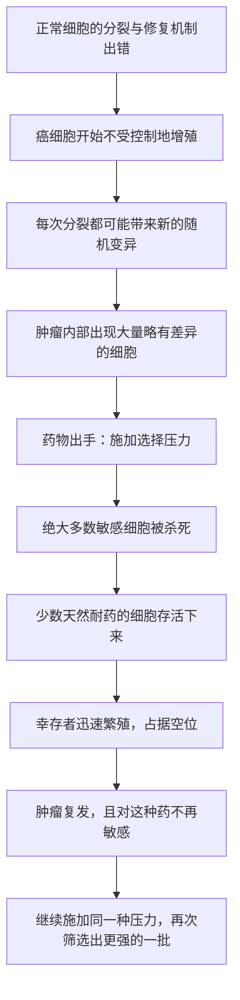

# 21｜为什么治好的癌症还会复发？——癌症是一台进化机器

> 靶向药明明能把肿瘤打到几乎看不见，为什么过一段时间，它又会卷土重来？

---

## 一、先说结论

穆克吉想让我们接受一个不太舒服的事实：**癌症不是一个静止的敌人，而是一个会「进化」的对手。**

同一个肿瘤里的细胞，并不是一模一样的复制品，而是成千上万个略有差异的版本。药物杀死了其中绝大多数，却常常留下少数恰好「不怕这种药」的细胞。这些幸存者迅速繁殖，肿瘤就以新的面目回来了。

所以问题不在于「药不够好」，而在于——**只要肿瘤里还有差异，选择就会发生；只要有选择，耐药就迟早会出现。** 癌症，本质上是一场发生在你身体内部的达尔文式进化。

---

## 二、我们先理解一个问题

先想象一个几乎完美的治疗故事。

有一种药，专门针对某个癌细胞的「开关」。吃下去，肿瘤迅速缩小，影像上的阴影几乎消失，病人感觉像好了，医生也谨慎地乐观。所有人都以为，这次可能真的赢了。

然后，几个月或几年之后，复查结果出来：肿瘤又出现了，而且这一次，原来的药不管用了。

为什么会这样？

如果癌症只是一堆「坏细胞」，那么一种高效药物就应该把坏细胞全部清空，问题就结束了。但现实反复告诉我们：**清空很少真正发生。** 于是我们必须问一个更深的问题——

> 为什么一种药能杀死绝大多数癌细胞，却常常败给剩下的那一小撮？

---

## 三、作者到底提出了什么观点？

穆克吉在书中反复用「进化」来理解癌症。他认为：

**肿瘤不是一块均质的肉，而是一个内部的生态系统。**

在这个生态系统里，细胞并不是完全相同的。每一次细胞分裂，都可能带进新的随机变异；有些变异让细胞长得更快，有些让它更耐打，有些让它更容易转移。于是，一个肿瘤内部，其实同时挤着许多「略有不同的版本」。

当我们用一种药去攻击时，我们其实是在给这个系统施加一种**选择压力**。绝大多数细胞死了——因为它们没有对应的「抗性」。但总有一小撮细胞，可能因为某个偶然的突变，恰好对这把药不敏感。它们活了下来。

接下来发生的事情，就像任何一场自然选择：活下来的细胞繁殖后代，占满了原本被死者腾出的空间。**肿瘤不但回来了，而且几乎是「同一件坏事」的升级版——它现在对这种药天然免疫。**

穆克吉强调，这就是为什么单一疗法往往「先成功、后受挫」。不是药物背叛了我们，而是我们面对的不是一个静态目标，而是一个会随着我们的攻击不断改变自己的过程。

---

## 四、把这个观点翻译成人话

这里最好用的类比，是抗生素和耐药细菌。

假设你得了细菌感染，吃一种抗生素。前两天效果很好，烧退了，人也精神了。但你只吃了三天就停了——或者，把抗生素用来治根本不需要它的感冒。

结果是什么？大部分细菌被杀死，但那些恰好带有一点抗药性的细菌活了下来。没有竞争对手，它们迅速繁殖。下一次同样的感染再来，这种药就不好使了。

这不是因为你运气差，而是因为你亲手完成了一次**筛选**：你淘汰了弱者，留下了强者。

肿瘤面对抗癌药时，逻辑几乎一模一样。**药物越精准、越单一，筛选的压力往往就越集中，耐药也可能出现得越快。** 这也解释了一个反直觉的现象：有时候最强的药，反而最容易被进化「绕过」。

---

## 五、为什么会这样？

把这条逻辑整理成链条：

这条链里，最关键的其实是 **D**：肿瘤内部的差异。

如果没有差异，药物就能一网打尽。但差异是生物繁殖的常态——只要有分裂，就有出错；只要有出错，就有差异。所以耐药不是「意外事故」，而是「统计上的必然」。**只要你不把差异考虑进去，任何单一疗法都会面对同一个结局。**

---

## 六、举一个现实生活中的例子

抗生素耐药是最贴切的类比，但我们可以把它再推进一步。

想象一片农田里的杂草。一开始，你用一种除草剂，效果拔群，田里干干净净。但杂草的种群里有千千万万株，基因并不完全相同。总有一两株碰巧对除草剂不敏感。它们活下来，结出种子，第二年长满整片田。

于是你加大剂量，或者换一种除草剂。短期内又有效了，但新的「幸存者」又出现了。这就是农业里常说的「抗性杂草」问题——**它不是因为你药不好，而是因为你在和一群会繁殖、会变异的生物博弈。**

肿瘤和杂草一样，都是「种群」，而不是「一个东西」。**对付种群，不能只想着一次歼灭，必须考虑它会怎么回应你的攻击。**

---

## 七、回到书中重新理解

现在再回想格列卫那样的「魔弹」——它在慢性粒细胞白血病里曾经创造了近乎奇迹的效果，许多患者一度以为癌症终于被驯服了。

但穆克吉提醒我们：**再精准的魔弹，也是打在一个细胞种群的靶子上。** 只要肿瘤内部存在少数不同版本的细胞，压力一旦持续，选择就会发生。部分患者最终出现耐药，正是这个过程的体现。

理解了这一点，再看联合化疗的思路，就会多一层含义：它不只是「用几种药一起杀得更狠」，更是在**同时施加多种不同的选择压力**，让细胞很难一次性突变成对所有药都免疫。这是人类第一次有意识地「对抗进化」，尽管我们当时未必完全用这个词来理解它。

在书中，癌症的治疗史因此呈现出一种反复的节奏：**发明一种武器 → 取得惊人成功 → 癌症以耐药回应 → 我们被迫想出新策略。** 这不是某个环节的失败，而是这场博弈的结构本身。

---

## 八、这个观点背后还有什么？

用进化看癌症，背后藏着几个很深的推论。

第一，**治疗策略要考虑「顺序」和「时机」，而不只是「强度」。** 如果最大剂量会疯狂筛选耐药细胞，那么有时候适度控制、留一部分敏感细胞「占位」，反而可能延缓耐药——这是一种反直觉的思路。

第二，**「治愈」和「控制」在这里分岔了。** 如果癌症是进化过程，那么把它变成一个可以长期相处的慢性状态，可能比追求一次性的「灭绝」更现实。

第三，**这个框架其实超越了癌症。** 凡是会繁殖、会变异、会随环境改变的系统——细菌、病毒、害虫，甚至某些竞争中的组织——都会遇到类似的「进化反扑」。

不过，也要注意它的隐含前提：这套解释假设肿瘤细胞之间确实存在可被选择的差异，并且这些差异能在治疗压力下被放大。这个前提在多数情况下成立，但并非所有癌症、所有阶段都同样适用。

---

## 九、这个观点有问题吗？

进化视角极有解释力，但并非没有争议。

**争议之一：所有复发都是「耐药进化」吗？** 有研究显示，肿瘤复发有时还来自另一类机制——比如少数「种子」细胞本就长期潜伏、对药物不敏感，治疗结束后重新生长。这更像是「打不死的休眠者」，而不完全是「被筛选出的幸存者」。两种解释并不互相排斥，但侧重不同，学界至今仍有讨论。

**争议之二：「耐药不可避免」会不会太悲观？** 事实上，许多癌症已经被真正治愈——比如某些儿童白血病、霍奇金淋巴瘤、部分睾丸癌。也就是说，进化未必总是赢。当治疗足够快、足够联合、足够彻底时，肿瘤可能来不及完成那场选择。把「耐药是必然」说成普遍规律，对一部分可治愈的癌症并不公平。

**争议之三：把癌症完全类比成「物种进化」，是否过度简化？** 肿瘤的演化并不是标准的自然选择，它发生在很短的时间尺度上，突变的产生方式也更混乱。类比帮助我们理解，但不能代替真实的生物学。

所以更准确的说法也许是：**进化是理解耐药的一把关键钥匙，但不是全部答案。**

---

## 十、今天再看这个观点

（以下为现代延伸，非穆克吉原文）

这几年，医学界越来越认真地对待「把癌症当进化系统」这件事。

一方面，监测手段在进步。**液体活检**等技术试图通过抽血捕捉肿瘤释放的微量 DNA，像「读日志」一样观察耐药克隆什么时候冒头，从而在肿瘤变大之前就调整策略。

另一方面，治疗思路本身也在变化。有研究者提出**适应性治疗**的设想：不再一味追求「最大剂量杀灭」，而是有意识地保留一部分敏感细胞，去压制那些更危险的耐药细胞，把肿瘤控制在一个低水平、长期共存的状态。这类策略目前仍在研究和试验中，效果因癌种而异，远未成为标准方案，但方向已经很清楚——**从「歼灭」转向「管理一场持续的军备竞赛」。**

对普通人而言，这个视角最实用的一层是：**按医嘱足量、足疗程用药，不随意中断，本身就是在减少筛选耐药的机会。** 因为每一次「半途而废」，都可能是在帮对手完成一轮进化。

---

## 十一、这一篇真正应该记住什么？

1. **肿瘤不是一块均质的肉，而是一个内部有差异的细胞种群。** 差异，是耐药能够发生的前提。

2. **药物是选择压力，不是终结者。** 它杀死多数敏感细胞，同时把少数耐药细胞「筛选」出来。

3. **耐药不是意外，而是进化在短时间尺度上的结果。** 单一疗法越精准、越孤立，往往越容易被绕过。

4. **联合与轮换策略的本质，是对抗进化。** 用多种压力同时施加，让细胞难以一次突变全部躲开。

5. **进化视角既深刻也有边界。** 它解释了耐药，但已被治愈的癌症提醒我们：进化并非总是赢。

---

## 十二、留一个问题

如果癌症注定是一场我们赢不完的进化博弈，那么当治疗真的走到尽头——当所有药都失效，当「治愈」这个词不再适用——医学还能为一个人做些什么？

下一篇，我们要走进这本书最柔软的部分：**临终关怀，以及「治愈」之外的意义。**
