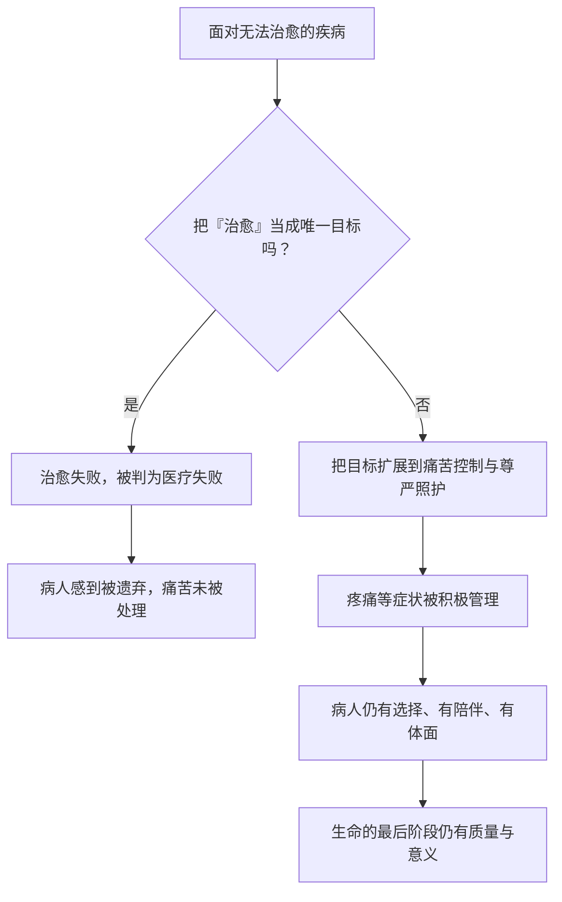

# 22｜当医学无法治愈时，我们还能做什么？

> 如果一种疾病注定无法根治，医学的意义，是不是就到此为止了？

---

## 一、先说结论

穆克吉的答案是：**治愈从来不是医学唯一的目标。**

当疾病无法根治，医学的价值并没有随之崩塌，而是转向了另一组同样重要的东西——减轻痛苦、维护尊严、陪伴一个人走完最后的路。他把这种转变称为从「治愈」到「照护」。

临终关怀不是「放弃治疗」，而是把目标从「消灭疾病」换成「照顾好这个人」。这大概是全书最柔软、也最容易被忽略的一部分。

---

## 二、我们先理解一个问题

设想一个场景：一位病人的癌症已经扩散，所有可用的方案都试过了。医生坐下来，准备告诉他和家人：我们可能无法让你痊愈了。

接下来会发生什么？

在很多人的想象里，这句话之后就是「什么都做不了」——回家，等待，结束。这也是为什么很多医生和家属都不愿开口：仿佛承认不能治愈，就等于宣布失败。

但书中的病人告诉我们，故事并没有在这里结束。真正的问题不是——

> 当治愈不可能时，医学还剩下什么？

而是——

> 我们凭什么认为，「无法治愈」就等于「无事可做」？

---

## 三、作者到底提出了什么观点？

穆克吉在书中反复回到这个问题。他既是肿瘤科医生，也接触过临终照护。他主张：

**医学的目标从来不止一个。** 延长生命是其中之一，但不是唯一。减轻疼痛、控制症状、缓解恐惧、维护一个人的尊严、让他在清醒和有陪伴的状态下度过最后的日子——这些都是医疗，而且是极其重要的医疗。

他特别警惕一种思维方式：把「治好」当成唯一的成功标准，于是只要没治好，就自动判定为失败。这种标准对病人是不公平的，对医生也是。因为它把一件复杂的、有温度的工作，压缩成了一个二元的输赢。

穆克吉的意思是：**当「治愈」这条路走到尽头，医学不是没有路可走，而是换了一条路走——从治疗疾病，转向照护一个人。**

---

## 四、把这个观点翻译成人话

想象一栋很老的老房子。

它曾经很结实，但年代久了，地基开始下沉，水管生锈，墙体开裂。你请来工程师，他说：要按原样彻底修好，已经不可能了。

这时候你有两个选择。

第一个是硬撑着「修好它」——拆墙、换梁、不断投钱，房子住不了人，家人也跟着受累，最后还是塌了。

第二个是承认它修不回去了，于是换一个目标：**让它尽可能住得舒服、安全、体面。** 加固危险的地方，保持通风和采光，把生活安排得方便一些，让住在里面的人安心。

临终关怀，就是第二种选择。它不是不管房子了，而是终于承认：**在无法修好的前提下去追求「舒服和尊严」，才是对住在里面的人真正负责。**

---

## 五、为什么会这样？

把这条逻辑整理成链条：

这条链的关键，在 B 这个岔路口。**同一场疾病，因为我们对「成功」的定义不同，走向完全不同。**

如果成功只有「治好」一种，那么走到尽头就是彻底的失败；如果成功还包括「让这个人好好地活到最后一刻」，那么即使在终末期，医疗依然有的可做，而且相当重要。

---

## 六、举一个现实生活中的例子

可以想想照顾一位高龄、身患慢性病的家人。

到了某个阶段，你可能已经无法让他恢复健康——器官在老化，疾病在进展，这是不可逆的。这时候，家人的目标往往悄悄发生变化：不再是「把他治好」，而是让他少受点罪、吃得下饭、睡得安稳、别那么害怕、有人陪着说话。

这并不意味着「放弃了」。恰恰相反，**这是把力气用在了真正能改善他生活的地方。**

同样的道理，用在医疗上就是：不再为了延长几天生命而反复做高风险、高痛苦的干预，转而把重点放在止痛、让病人保持清醒、尊重他自己的意愿、让家人有机会好好告别。有研究显示，这样的照护不仅让病人更舒服，有时甚至并不缩短寿命，反而可能让最后的日子过得更有质量。

---

## 七、回到书中重新理解

现在再读这本书，你会发现，它从头到尾穿插着许多病人的真实故事——他们的恐惧、希望、治疗中的煎熬，也包括最后的日子。

穆克吉没有把这些故事写成「成功」或「失败」的案例。他写的是**一个个具体的人**。这正是他野心的一部分：为癌症写一本「传记」，意味着要看见疾病背后的人，而不是只统计治愈率。

书中的病人有的被治愈，有的复发，有的走向终点。但无论结局如何，穆克吉都在追问同一件事：**我们有没有对这个人尽到了责任？** 而这份责任，显然不只是「有没有把病治好」。

---

## 八、这个观点背后还有什么？

这里藏着一个更深的问题：**我们究竟为什么害怕承认「治不好」？**

一部分原因是「战争」的隐喻。如果癌症是一场战争，那么不能治愈就等于战败，而战败是耻辱。于是医生不愿说，家属不愿听，病人被夹在中间。穆克吉暗示，这种隐喻本身可能是有害的——它把死亡变成了敌人，把平常的、必然的告别，变成了不堪的失败。

另一个隐含前提是：**死亡不是医学的敌人，痛苦和孤独才是。** 从这个角度看，临终关怀不是医学的退场，而是医学回到它更古老的职责——陪伴、安慰、减轻苦难。

---

## 九、这个观点有问题吗？

当然也有争议和张力。

**争议之一：「临终关怀」会不会被误解成「放弃治疗」？** 这可能是它面临的最大障碍。很多人一听就以为是「不救了」。事实上，现代临终关怀（hospice）和缓和医疗（palliative care）强调的是积极控制症状，而不是停止一切照护。缓和医疗甚至可以在治疗的早期就介入，与抗癌治疗并行，而不是二选一。

**争议之二：会不会选择得太早？** 有人担心，一旦转向照护，就失去了可能有效的治疗机会。这里没有放之四海皆准的答案，取决于具体病情、可用的疗法，以及病人自己的意愿。争议的核心，其实是**该由谁来决定「什么时候该转向」——医生、家属，还是病人自己？**

**争议之三：文化差异。** 在不同文化里，谈论死亡、告知坏消息的方式差别很大。有的家庭倾向于不把病情全部告诉病人本人，有的文化则强调充分的知情和自主。哪一种更好，很难一概而论。

所以这里没有简单的对错，只有一次次艰难的、需要被认真对待的对话。

---

## 十、今天再看这个观点

（以下为现代延伸，非穆克吉原文）

今天，「缓和医疗」和「临终关怀」在全球医学中已经成为一个完整的分支。越来越多的研究支持把缓和医疗**提前**纳入癌症治疗流程，而不是等到最后才启用。**预先医疗指示**（advance directives）等工具，让病人可以提前表达自己的意愿，减少临终时家属的两难。

随着人口老龄化，这件事只会越来越重要。**我们大多数人最终都会面对某个版本的这个问题：当医学的「消灭」手段用尽，我们能不能允许它转向「陪伴」和「照顾」？** 这不是一个纯医学问题，而是一个社会如何理解生命终点的问题。

---

## 十一、这一篇真正应该记住什么？

1. **治愈不是医学唯一的目标。** 减轻痛苦、维护尊严、陪伴病人，同样是医疗的核心任务。

2. **临终关怀不是放弃，而是目标的转换。** 从「消灭疾病」转向「照顾好这个人」。

3. **把治愈当作唯一标准，会让所有人受伤。** 医生背负不必要的失败感，病人承受被遗弃的恐惧。

4. **「战争」隐喻有其危险。** 它把必然的告别变成不堪的失败，扭曲了我们对医学的期待。

5. **缓和医疗可以早期介入，而非最后选项。** 它和抗癌治疗并不冲突，反而常能提升生命质量。

---

## 十二、留一个问题

如果我们承认，医学的进步可能是以某些人的付出为代价的，那么下一个问题就更扎人了：

**海拉细胞——那些拯救了无数人的细胞，最初是从谁身上、在什么情况下取走的？她的家人知道吗？**

下一篇，我们就来看医学进步背后，那个长期被忽略的代价。
