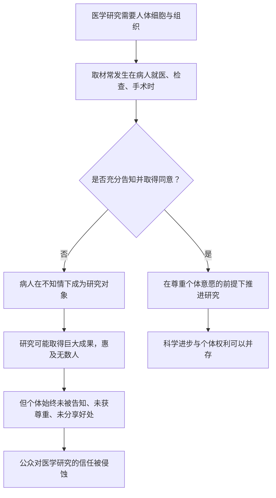

# 23｜海拉细胞：医学进步的背面，是谁的代价？

> 一项拯救了无数人的医学成果，如果来自未经同意的取材，它该如何被评价？

---

## 一、先说结论

海拉细胞是现代医学最重要的细胞之一，来自一位名叫亨丽埃塔·拉克斯的黑人女性。大约在 1951 年，她因宫颈癌在约翰斯·霍普金斯医院接受治疗，医生在她不知情、也未征求同意的情况下取走了她的细胞样本。她于同年去世，而她的细胞却在全世界的实验室里不断复制、流传至今。她的家人，很多年后才知道这件事。

穆克吉借这个案例逼我们面对一个根本问题：**当科学的进步建立在某个具体的人身上，而这个人从未被征得同意、也从未分享到任何好处时，我们该如何评价这份「进步」？** 科学的边界，究竟在哪里？

---

## 二、我们先理解一个问题

先看一个事实：如果没有海拉细胞，现代医学的很多进展可能会晚很多年。它们被用于细胞生物学、病毒学、疫苗研发等无数研究，几乎成了实验室里的「标准材料」。

再看另一个事实：提供这些细胞的人，是一位贫穷的黑人女性。她当时的医疗处境本身就受到时代和种族的限制。她的细胞被取走时，没有人问过她；她的家人，也是在很久很久以后，才拼凑出事情的全貌。

于是问题来了——

> 如果一项成果极大地造福了全人类，但它的起点是一次未经同意的取材，我们到底应该把它看作「医学的胜利」，还是「一个人的损失」？

或者更尖锐地说：**造福多数人的账，能不能由少数人、在不知情的情况下、单方面支付？**

---

## 三、作者到底提出了什么观点？

穆克吉在书中讲述海拉细胞的故事，并不是要简单谴责某家医院或某位研究者。他更想让读者看见一个结构性的矛盾：**医学研究的需要，和个体的权利之间，长期存在着张力。**

研究者需要材料才能推进科学，而人体样本往往是无可替代的。但取材的对象，是有血有肉、有自己的意愿和处境的人。当研究的速度和便利压过了对个体意愿的尊重，就可能出现像海拉细胞这样的事件。

穆克吉强调，这件事真正的价值，不在于追究某个人的责任，而在于它**迫使医学去思考：谁的身体，可以被谁使用，以及在什么条件下使用。** 他的意思可以概括为一句话：科学的进步，不能以牺牲个体的知情权和尊严为代价，哪怕是「为了全人类」。

---

## 四、把这个观点翻译成人话

你可以这样想。

你随手拍了一张自己的照片，发在私人相册里。某天你发现，一家公司把你的照片拿去做广告，赚了大钱——而这一切，你从头到尾都不知道，更别说同意了。

你会怎么想？大概不是「太好了，我帮了这么多人」，而是**「你们凭什么用我的东西，还不告诉我？」**

海拉细胞的故事，本质上就是这样一件「被使用却不知情」的事。区别只在于：被取走的不是照片，而是一个人身体的一部分；受益的不是某家公司，而是整个医学。

用别人的东西去做好事，是否就自动变得正当？**这正是这个案例真正让人不安的地方：它好得让人无法否认，却又错得让人无法忽略。**

---

## 五、为什么会这样？

把这条逻辑整理成链条：

注意 C 这个岔路。**同样是为了治病救人，走哪条路，取决于有没有把「这个人」当回事。**

而一旦走了「否」这条，即使结果再好，也会留下一个无法抹去的缺口。因为信任一旦受损，重建的代价会非常高昂。

---

## 六、举一个现实生活中的例子

再想想征地。

城市要修一条重要的公共设施，需要征用一片土地。这件事显然是有价值的——路修好了，惠及所有人。但问题在于：**补偿是否公平？居民是否被充分告知？有没有人被迫在自己不情愿的情况下交出住所？**

没人会否认公共工程的价值，但也没有人会说：因为它有价值，所以可以不管具体居民的意愿。**价值的大小，不能取消程序正义。**

海拉细胞是同一个结构：公共利益是真的，个人的权利也是真的。真正的伦理问题，从来不是「要不要这个好处」，而是「在获得这个好处的过程中，有没有把具体的人当人对待」。

---

## 七、回到书中重新理解

在书里，海拉细胞出现在讲述医学进步与伦理的那一部分。它和另外一些事件一起，构成了一个刺眼的对照：**一边是飞速推进的科学，一边是被遗忘在角落里的人。**

穆克吉没有把它写成一段纯粹的「科学传奇」，尽管它确实足够传奇。他更愿意让我们看到的，是那个被历史轻轻带过的名字，以及她的家人在多年后得知真相时的震动。

这也呼应了这本书的整体立场：**为癌症作传，不能只写疾病和技术，也要写被卷入其中的人。** 进步如果不能被认真地追问代价，它本身就不完整。

---

## 八、这个观点背后还有什么？

这个案例背后，是医学伦理的一次结构性转变。

据记载，1947 年纽伦堡审判之后形成的《纽伦堡法典》，确立了人体实验必须遵循知情同意等基本原则。它诞生的背景，是二战期间骇人的医学暴行。海拉细胞取材于 1951 年——法典的原则已经存在，却并未阻止这件事发生。

这说明：**写下来的原则，和落到每个具体情境中的实践，之间隔着很远的距离。**

此外，还有一个更现代的问题：**我们身体的一部分被取走之后，它还属于我们吗？** 如果它带来了商业价值或重要发现，提供样本的人应不应该分享其中的利益？这些问题至今仍在讨论，而且随着生物技术和数据科学的发展，变得比过去更加复杂。

---

## 九、这个观点有问题吗？

这个案例的争议，恰恰在于它很难被简单地评判。

**一种观点认为**，应当放在当时的历史条件里看：那个年代的医学惯例、伦理标准、甚至种族观念都不同，用今天的标准去要求过去的人，未必公平。这个说法并非没有道理。

**另一种观点则认为**，正因为在当时就已经有了《纽伦堡法典》这样明确的伦理原则，问题不能完全归给「时代局限」。个人的尊严，不该因为「大家都这么做」就被搁置。

还有人指出，事情的影响不止于此：**它涉及医学与特定群体之间长期存在的信任裂痕。** 当某些群体意识到自己被当作「材料」而非「病人」，他们对医疗系统的信任会受到长久的影响。

所以这里没有一个干净的答案。它更像一面镜子，逼着我们承认：**「为了人类」这句话，有时候太好用了，好用到可以让具体的人消失。**

---

## 十、今天再看这个观点

（以下为现代延伸，非穆克吉原文）

海拉细胞之后，医学伦理发生了实实在在的变化。**知情同意**从一条抽象原则，变成了研究流程里的硬性要求；伦理审查委员会、研究伦理规范、生物样本库的同意机制，都逐步建立起来。

今天，随着基因检测、生物样本库和大数据研究的普及，问题不是变小了，而是更复杂了。你的基因数据该归谁？样本库能不能用于当初没有明确说明的研究？商业公司用这些数据获利时，提供者是否应得到回报？这些讨论，本质上都是海拉细胞问题在新时代的延续。

在这个议题上，穆克吉那个时代尚未充分展开的争论，如今成了每一个接受基因检测的人迟早要面对的问题。**而它的核心，始终是同一个：进步和具体的人之间，怎样才算公平？**

---

## 十一、这一篇真正应该记住什么？

1. **海拉细胞是医学的功臣，也承载着一位女性未被告知的付出。** 两者都是事实，不能被互相取消。

2. **知情同意不是形式，而是对「这个人」的基本尊重。** 《纽伦堡法典》早已确立原则，但原则落到实践需要长期努力。

3. **「为了全人类」不能成为绕过个体权利的理由。** 公共价值与个人尊严可以且应当并存。

4. **信任一旦受损，代价极高且难以修复。** 特定群体与医学系统之间的裂痕，正是这样留下的。

5. **科学越强大，伦理越不能缺席。** 生物技术与数据时代，这个问题只会更重要。

---

## 十二、留一个问题

看完了海拉细胞，我们已经被迫承认：医学的每一次前进，都伴随着复杂的代价与两难。

那么，回到全书最根本的问题——

**如果癌症源于我们自身，它到底能不能像天花那样被彻底消灭？如果不能，我们奋斗的方向又该是什么？**

下一篇，也是整个系列的最后一篇，我们就来回答这个终极问题。
