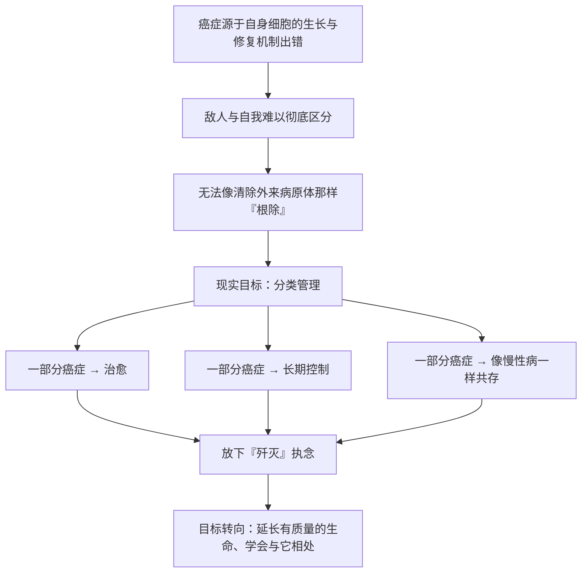

# 24｜癌症会被彻底消灭吗？——「治愈」「控制」与「共存」

> 为癌症写一本「传记」，它最终的结局，究竟是悲观还是乐观？

---

## 一、先说结论

穆克吉的回答，既不简单地悲观，也不盲目乐观。他认为：**由于癌症源于我们自身的生物学，它很难像天花或小儿麻痹那样被「根除」。** 我们面对的，不是一个外来的、可以被赶尽杀绝的敌人，而是自己身体生长与修复机制出错后的产物。

因此，更现实的未来不是「消灭癌症」，而是把它拆开来看：**一部分癌症可以被治愈，一部分可以被长期控制，还有一部分，也许可以像高血压、糖尿病那样，与患者长期共存。** 真正的进步，或许是放下「战争」的隐喻，学会更聪明、更有耐心地与它相处。

---

## 二、我们先理解一个问题

先承认一个让人不太舒服的事实：过去几十年，我们在癌症上投入了巨大的资源，也取得了真实的进步——但「消灭癌症」这个目标，始终没有实现。

于是有人失望，有人愤怒，有人觉得这是一场空头承诺。但我们是不是从一开始，就问错了问题？

假设我们真的能像对付天花一样，把癌症彻底从人类身上抹去——这可能吗？如果不可能，那么「打赢这场战争」又意味着什么？

> 如果「彻底消灭」本身就是一个不可能的目标，我们是不是应该重新定义「胜利」？

---

## 三、作者到底提出了什么观点？

穆克吉在全书临近结尾时，把这个想法摊开来讲。他认为：

癌症不是一种外来的病原体，而是**我们自己细胞的失控**。它深深扎根于我们作为多细胞生物的基本机制之中——细胞要分裂、要修复、要生长，而这些机制一旦出错，癌症就可能出现。这跟天花病毒完全不同：天花病毒是外来的，可以被识别、隔离，直到从人群中消失；但我们没有办法「清除」自己的细胞分裂机制。

因此，穆克吉主张：**不要把癌症当成可以用一场决战消灭的单一敌人。** 它更像是一类需要长期管理的疾病。有些癌症，我们已经有相当高的治愈率；有些，我们可以控制很多年；还有一些，仍然非常难治。

他反对的，不是努力，而是那种「按下按钮就能结束一切」的想象。**他提倡的，是一种更成熟、更有耐心的态度**：承认癌症的复杂性，然后一寸一寸地、持续地争夺进展。

---

## 四、把这个观点翻译成人话

想象一座城市面对反复出现的各种问题——比如积水、垃圾、路面损坏。

你可以把它当成一场「歼灭战」：发起一次声势浩大的大扫除，发誓从此彻底解决。可问题是，城市每天都在运转，新的问题每天都在产生。一次大扫除之后，垃圾还会再出现，路面还会再坏。

更现实、也更有效的方式，是**把它变成一个长期的维护体系**：定期清淤、持续巡查、逐步改造。你永远无法宣布「从此再也没有垃圾」，但城市可以长期保持在一个不错的水平。

癌症也是这样。**对一部分癌症，我们或许真的能「治好」；对更多癌症，也许我们要学会的是「管好」。** 这不等于认输，而是把目标定在一个真正可能实现的地方。

---

## 五、为什么会这样？

把这条逻辑整理成链条：

这条链的起点是 A。**只要癌症的根源在我们自己身上，「清扫敌人」这个隐喻就注定不完全适用。** 于是终点不是「消灭」，而是「分类」与「管理」。

---

## 六、举一个现实生活中的例子

最贴切的对照，是我们对待慢性病的方式。

高血压、糖尿病，今天都没有办法「根治」。但一个高血压患者，可以通过长期服药、调整生活方式，几十年里正常地生活、工作、老去。我们不会因为「治不好」就说这些病是医学的失败——因为我们早就接受了「长期管理」的模式。

有一些癌症，正在慢慢走上这条路。**它不一定意味着痊愈，但意味着它可以被控制到一个不那么可怕的程度，让人继续生活。**

另一个角度是治理的比喻：城市管理从「一次大扫除」转向「长期维护」，看起来不够痛快，但往往更有效、更可持续。**医学对癌症的认识，也在经历类似的转变。**

---

## 七、回到书中重新理解

现在再回到这本书的书名——《众病之王：癌症传》。你会发现，「传」这个字是关键。

穆克吉没有把它写成一部的战史，而是写成一部**传记**。这意味着：他要理解这个对手的来历、性格、弱点，也要理解与它交手的人。传记不会以「主人公被彻底消灭」作为唯一结局，因为传记关心的是**如何理解一个长期存在的东西**。

从最古老纸草上的记录，到外科的强切、化疗的毒杀、预防的拦截、分子靶向的精准打击，再到耐药的反扑和临终的照护——这一路走下来，你会发现，每一代人都在和癌症重新谈判一次边界。**人类并没有赢得一场战争，但确实一点点学会了如何与这个对手相处。**

---

## 八、这个观点背后还有什么？

这个结论背后，一个容易被忽略的问题是：**隐喻本身会塑造我们的行动。**

当我们说「向癌症宣战」，我们会本能地要求「彻底胜利」，于是把任何没有治愈的结果都看成失败。这种期待会流向病人——让他们觉得自己「没打赢」，也会流向科研——让公众误以为投入足够多的钱，就能在某一年终结癌症。

穆克吉提醒我们：**换一个隐喻，可能就换一种活法。** 从「战争」到「管理」，从「歼灭」到「共存」，听起来像是降低目标，实际上可能是更诚实地面对现实，因而也更有效地帮助病人。

另一个隐含的层次是：**我们究竟想从医学那里得到什么？** 是永生不死，还是尽可能长久、尽可能有质量、有尊严的生命？这已经不只是科学问题，而是价值问题。

---

## 九、这个观点有问题吗？

这个「不能根除、只能共存」的结论，同样存在争议。

**一种反驳是：它可能过于悲观。** 事实上，我们已经在一些癌症上取得了惊人的成果。比如，儿童急性淋巴细胞白血病、霍奇金淋巴瘤、某些睾丸癌，治愈率已经相当高。更重要的是，**通过预防，我们其实已经在「消灭」一部分癌症**：乙肝疫苗、HPV 疫苗、戒烟，都在从源头上减少某些癌症的发生。说「不可能根除」，是否会低估了预防的力量？

**另一种反驳是：把癌症都当成慢性病来管理，也许并不现实。** 高血压可以靠长期吃药控制，是因为它的进展相对缓慢、可控。但很多癌症的进展极其凶猛，留给「慢慢管理」的空间很小。对它们而言，追求尽快、彻底的打击，仍然是必要的。

还有一种更深的争论：**「共存」这个词，会不会在不知不觉中降低我们对治愈的追求？** 有人认为它有助于现实地对待疾病，也有人担心它会让人过早放弃。

所以，更准确的说法或许是：**不同的癌症，需要不同的答案。** 有的应该全力追求治愈，有的适合长期控制，有的只能以照护为主。把「共存」当成对所有癌症的唯一答案，同样是过度简化。

---

## 十、今天再看这个观点

（以下为现代延伸，非穆克吉原文）

穆克吉写作此书之后，癌症治疗又有了新的进展。**免疫治疗**让免疫系统重新识别并攻击癌细胞，在一些过去束手无策的癌症上带来了突破；**精准医疗**让治疗越来越针对具体的分子特征；**早期筛查和预防**也在改变许多癌症的结局。这些进展，有些印证了书中的判断，也有些在挑战「不可能根除」的悲观色彩。

不过，一个更根本的趋势没有变：**癌症正在变得更加「可管理」。** 对越来越多的患者来说，带瘤长期生存，正在从奢望变成可能。这既带来了希望，也带来了新的问题——长期用药的负担、复发的阴影、心理与经济的压力。

这本书没有预言某一天会「战胜」癌症。它更像是提醒我们：**与其等待一场终局性的胜利，不如踏实地改善每一个患者当下的处境。** 这也许才是医学更真实的样子。

---

## 十一、这一篇真正应该记住什么？

1. **癌症源于我们自身，因此很难像外来传染病那样被彻底「根除」。** 这是它的本质，也是「众病之王」这个称号的由来。

2. **未来不是单一的胜利，而是分类管理：** 一部分治愈，一部分长期控制，一部分以照护为主。

3. **「战争」的隐喻有代价。** 它让未治愈变成失败，也让公众对医学抱有不切实际的期待。

4. **不同的癌症需要不同的策略。** 预防、治愈、控制和照护，是并存的多条路径，而非互相替代。

5. **真正的进步，也许是学会更有耐心、更诚实地与癌症相处**，而不是执着于一场不可能有的完胜。

---

## 十二、留一个问题

我们从这本书的第一页走到最后一页，其实只回答了同一个问题的两个侧面：

> **当敌人就是我们自己时，所谓「战胜」，究竟意味着什么？**

也许，这部「癌症传记」真正想留下的不是答案，而是这样一个开放的追问：

**如果有一天，我们能把癌症变成一种可以带着生活几十年的慢性病，那算是胜利吗？还是说，人类会继续想要更多——想要一个不再有癌症的世界？**

而在这个问题上，每个人的答案，可能都不一样。
