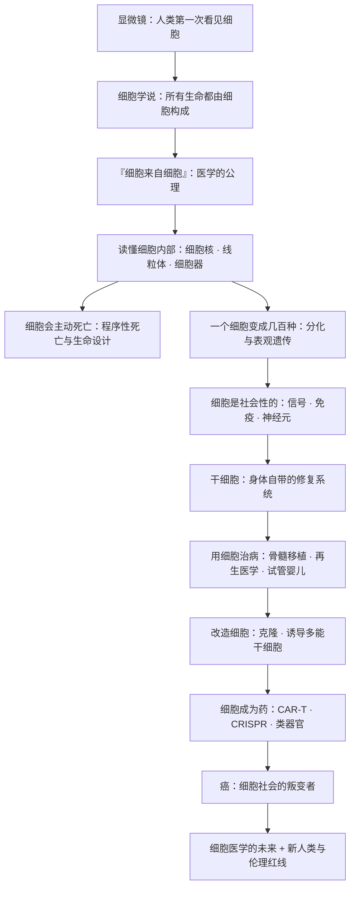

# 《细胞传》深度解读系列

## 系列简介

我们由什么构成？答案是一个听上去平凡、却改变了整个生物学的词——细胞。

《癌症传》作者悉达多·穆克吉这一次把目光从「疾病」转向「生命的最小单位」。他写道：细胞不只是一种结构，它是生命的基本单位，也是医学正在抵达的新前线。从胡克在软木里看到的一个个「小房间」，到魏尔啸那句「细胞来自细胞」，再到今天用干细胞、免疫细胞和基因剪刀去治病，人类对细胞的理解，正在把医学推向一个全新的阶段——**用活着的细胞，去修复活着的身体。**

这本书最重要的主张是：**医学正在从「用药治身体」，走向「用细胞治身体」。** 细胞既是理解生命的钥匙，也可能成为改造生命、甚至重新定义「人」的工具。这条路通向希望，也通向必须回答的伦理问题。

本系列不按原书章节复述，而是重建一条认知链：先讲清「细胞是什么、人类如何发现它」，再讲「细胞如何组成一个人」，然后走进「用细胞治病、改造细胞」的历史，最后讨论穆克吉真正想追问的东西——当细胞可以被设计，「新人类」意味着什么。

---

## 全书核心问题

| 层次 | 问题 |
|---|---|
| 定义问题 | 细胞是什么？为什么它是理解一切生命的起点？ |
| 历史问题 | 人类是如何一步步发现细胞、读懂细胞的？ |
| 组织问题 | 一个受精卵如何变成几十万亿个各司其职的细胞？ |
| 医学问题 | 我们能否用细胞来治病？细胞为什么会成为「药」？ |
| 改造问题 | 改造细胞（克隆、干细胞、基因编辑）会带来什么？ |
| 伦理问题 | 谁有权改写生命？「新人类」的边界在哪里？ |

一句话版本：

> **当生命可以被拆解成一个又一个细胞，我们能用它治病、改造它，甚至重新定义「人」吗？**

---

## 全书知识地图



再压缩成一句话：

```text
发现细胞 → 理解细胞（结构与死亡）
        → 细胞组成人（分化 · 信号 · 免疫 · 神经 · 干细胞）
        → 用细胞治病（移植 · 再生 · 试管）
        → 改造细胞（克隆 · 重编程 · 基因编辑 · 活体药物）
        → 追问：细胞工程会把「人」带向哪里？
```

---

## 全系列目录

### 第一部分：认识细胞

#### 01｜为什么「细胞」是理解生命的关键？

核心问题：为什么说「细胞」这个发现，比任何单一疾病的攻克都更重要？

核心观点：细胞是生命的基本单位——所有生物，无论大小，都是由细胞构成的。穆克吉把它当作整本书的主角。理解细胞，就等于拿到了理解生命、疾病与医学的通用地图。

理解难度：★★☆☆☆

关键词：细胞学说、生命的基本单位、穆克吉的框架

---

#### 02｜人类第一次看见细胞，看到了什么？

核心问题：在显微镜出现之前，人类为什么从不知道细胞的存在？

核心观点：十七世纪的显微镜让人类第一次窥见「生命的砖块」。胡克在软木薄片里看到一个个小格，命名为「cell」（小房间）；列文虎克则第一次看到了活的单细胞生物。工具的革命，往往先于认知的革命。

理解难度：★★☆☆☆

关键词：胡克、列文虎克、显微镜、cell 的命名

---

#### 03｜细胞学说：所有生命都建立在同一块砖上吗？

核心问题：为什么说「一切生物都由细胞构成」是生物学最深刻的统一？

核心观点：十九世纪，施莱登与施旺分别从植物和动物出发，提出细胞学说：所有生物都由细胞构成。这条命题把千差万别的生命统一在同一个底层结构上，成为现代生物学的基石。

理解难度：★★☆☆☆

关键词：施莱登与施旺、细胞学说、生命的统一性

---

#### 04｜「细胞来自细胞」：一句口号如何成为医学公理？

核心问题：细胞究竟从哪里来？为什么这句话如此重要？

核心观点：魏尔啸提出「细胞来自细胞」（omnis cellula e cellula）：新细胞只能由已有细胞分裂产生。它终结了「自然发生」的旧观念，也意味着疾病必须回到细胞层面去理解——这是现代病理学的起点。

理解难度：★★★☆☆

关键词：魏尔啸、细胞来自细胞、病理学、自然发生说

---

#### 05｜细胞内部，究竟藏着一座怎样的「城市」？

核心问题：一个肉眼看不见的细胞，内部为什么如此复杂？

核心观点：细胞不是一团简单的胶状物，而是一个高度组织化的「微型城市」：细胞核是控制中心，线粒体是发电厂，内质网与高尔基体是生产与物流系统，细胞膜是边界与海关。理解这套结构，是理解细胞如何运作的前提。

理解难度：★★★☆☆

关键词：细胞核、细胞器、线粒体、细胞膜、细胞作为工厂

---

#### 06｜细胞为什么会主动「赴死」？

核心问题：细胞死亡听起来是坏事，为什么它反而是生命必需的设计？

核心观点：细胞并不只是「活着」，它还会在特定信号下主动、有序地自我毁灭——这就是程序性死亡（凋亡）。它塑造了胚胎发育、维持组织平衡、清除受损细胞。死亡不是生命的对立面，而是生命设计的一部分。

理解难度：★★★★☆

关键词：程序性死亡、凋亡、细胞自杀、发育与平衡

---

#### 07｜线粒体原来是一种细菌？——内共生

核心问题：细胞里的线粒体，为什么会拥有自己的 DNA？

核心观点：内共生学说认为，线粒体（以及植物细胞的叶绿体）原本是独立生存的细菌，被祖先细胞「收编」后形成共生关系。这是生命史上最重要的一次「合作」。它提醒我们：细胞本身，也可能来自一场联合。

理解难度：★★★★☆

关键词：内共生、线粒体、叶绿体、共生、能量的起源

---

### 第二部分：细胞如何组成一个人

#### 08｜一个受精卵，如何长成几十万亿个细胞？

核心问题：同一个基因组，怎么可能造出皮肤、神经、肌肉这些完全不同的细胞？

核心观点：一个受精卵通过不断分裂与分化，最终形成几十万亿个各司其职的细胞。它们携带的 DNA 几乎完全相同，差别在于哪些基因被「打开」、哪些被关闭——这就是细胞分化的核心谜题，也是表观遗传学的舞台。

理解难度：★★★★☆

关键词：受精卵、细胞分化、基因表达、表观遗传

---

#### 09｜细胞之间如何「对话」？

核心问题：一个细胞怎么知道旁边发生了什么，并做出反应？

核心观点：细胞不是孤岛。它们通过信号分子、受体和信号通路彼此沟通，协调生长、迁移、分工与死亡。身体的秩序，来自细胞之间持续的「交谈」。一旦沟通失灵，就可能走向疾病。

理解难度：★★★☆☆

关键词：细胞信号、受体、信号通路、细胞通讯

---

#### 10｜免疫细胞如何分辨「自己人」和「入侵者」？

核心问题：免疫系统如何在杀死入侵者的同时，不误伤自己的身体？

核心观点：免疫是一套由细胞组成的识别与防御系统。它能区分「自我」与「非我」，攻击病原体与被感染的细胞。但当这套识别失灵，就会出现自身免疫病或对肿瘤的「视而不见」。免疫细胞也因此成为今天最强大的抗癌武器之一。

理解难度：★★★★☆

关键词：免疫细胞、T 细胞、自我与非我、免疫监视

---

#### 11｜大脑也是细胞构成的吗？——神经元学说

核心问题：思想与意识所在的大脑，能不能也用「细胞」来解释？

核心观点：卡哈尔的神经元学说证明，神经系统同样由一个个独立的细胞（神经元）构成，它们通过突触相互连接。这一发现把大脑纳入了细胞学说的版图，也奠定了现代神经科学的基础。

理解难度：★★★☆☆

关键词：卡哈尔、神经元学说、突触、神经系统

---

#### 12｜干细胞：身体里的「备用零件」是怎么被发现的？

核心问题：成年身体里，是否还存在能变成多种细胞的「万能细胞」？

核心观点：研究者在小鼠骨髓中发现了造血干细胞，证明成体组织里仍保留着能自我更新、并分化成多种血细胞的细胞。这开启了「干细胞」的时代，也让「用细胞修复身体」从想象变成可能。

理解难度：★★★★☆

关键词：干细胞、造血干细胞、自我更新、分化潜能

---

### 第三部分：用细胞治病

#### 13｜骨髓移植：人类第一次把「细胞」当药

核心问题：为什么骨髓移植被视为「细胞治疗」的开端？

核心观点：通过移植健康的造血干细胞，重建患者的血液与免疫系统，骨髓移植第一次证明：活的细胞本身可以作为一种疗法，去替换病人体内坏掉的系统。这是「细胞医学」的原型。

理解难度：★★★★☆

关键词：骨髓移植、造血干细胞、细胞治疗、免疫重建

---

#### 14｜再生医学：我们能否像蝾螈一样重生肢体？

核心问题：为什么有些动物能再生器官，而人类不能？

核心观点：蝾螈、斑马鱼等动物拥有惊人的再生能力，而人类的再生能力有限。理解再生背后的细胞机制（干细胞、去分化、信号），是再生医学的核心目标：让受损的组织与器官重新长出来。

理解难度：★★★★☆

关键词：再生、蝾螈、去分化、组织修复

---

#### 15｜试管婴儿：生命第一次在体外开始

核心问题：当受精发生在培养皿里，我们对「生命起点」的理解发生了什么变化？

核心观点：体外受精技术让卵子与精子在体外结合，再移植回母体，世界上第一个「试管婴儿」由此诞生。它不只是不育治疗的突破，也让人类第一次能够直接操作生命的起点——由此打开了一连串伦理问题。

理解难度：★★★☆☆

关键词：体外受精、试管婴儿、生殖技术、生命起点

---

#### 16｜克隆：多莉羊如何改写「细胞命运」？

核心问题：一个已经分化的细胞，能否被「重置」回生命的起点？

核心观点：多莉羊的诞生证明，把成年细胞的细胞核移植进去核卵子后，可以重新发育成一个完整个体。这说明细胞的分化并非不可逆——「命运」可以被重写。这一发现直接指向后来的诱导多能干细胞。

理解难度：★★★☆☆

关键词：克隆、多莉羊、细胞核移植、重编程

---

### 第四部分：改造细胞

#### 17｜返老还童：如何把成熟细胞变回干细胞？

核心问题：能不能不用胚胎、不用克隆，就把普通细胞变成「万能细胞」？

核心观点：山中伸弥发现，只要引入少数几个关键因子，就能把成熟细胞「重编程」为诱导多能干细胞（iPSC），让它重新具备分化成多种细胞的潜力。这绕开了胚胎干细胞的伦理争议，也让「再生医学」向前迈了一大步。

理解难度：★★★★☆

关键词：诱导多能干细胞、山中伸弥、重编程、再生医学

---

#### 18｜CAR-T：把免疫细胞改造成「活体药物」

核心问题：能不能把病人自己的免疫细胞，改造成专门追杀癌细胞的武器？

核心观点：CAR-T 疗法从患者体内取出 T 细胞，用基因工程给它们装上能识别癌细胞的「导航装置」，再输回体内。它让一部分血液癌症获得前所未有的缓解，也让「细胞即药物」从概念变成现实。

理解难度：★★★★☆

关键词：CAR-T、T 细胞、基因工程、活体药物

---

#### 19｜CRISPR：改写生命说明书的分子剪刀

核心问题：如果基因是一份说明书，我们能不能精确地改写它？

核心观点：CRISPR 让「定点修改基因」变得简单而高效。它既可能用来修复致病的突变（如某些血液病），也可能被滥用去「设计」后代。技术越强大，人类越需要回答：哪些修改是可以的，哪些绝对不行。

理解难度：★★★★☆

关键词：CRISPR、基因编辑、脱靶、基因治疗

---

#### 20｜类器官：在培养皿里「长」出迷你器官？

核心问题：我们能否不靠动物，就在实验室里重建人的组织与器官？

核心观点：科学家发现，干细胞在合适的条件下可以自组织成微型的「类器官」——迷你肠、迷你脑、迷你肝。它们既是研究疾病与药物的强大工具，也把「在体外造出人体组织」的想象推向现实。

理解难度：★★★★☆

关键词：类器官、干细胞、自组织、疾病模型

---

#### 21｜癌：细胞社会的「叛变者」

核心问题：如果身体是一个细胞社会，癌症到底是什么？

核心观点：癌症是细胞「社会化」规则的崩塌：本该服从生长控制、按时死亡的细胞，变得无限增殖、拒绝死亡、四处迁移。理解癌症，必须回到细胞层面——这也是穆克吉从《癌症传》到《细胞传》的一以贯之。

理解难度：★★★★★

关键词：癌症、细胞失控、增殖与凋亡、规则崩塌

---

### 第五部分：新人类

#### 22｜「细胞医学」会重塑下一代的医学吗？

核心问题：为什么说「用细胞治病」可能成为继药物、手术之后的又一根支柱？

核心观点：从骨髓移植到 CAR-T、再到干细胞与基因编辑，医学的重心正在从「分子与药物」转向「细胞与活体疗法」。穆克吉判断，细胞医学将深刻改变我们治疗疾病的方式——但它也要求全新的监管、安全与成本考量。

理解难度：★★★★☆

关键词：细胞医学、活体药物、医学范式转移、可及性

---

#### 23｜谁有权改写生命？——「新人类」与伦理红线

核心问题：当我们可以编辑细胞、设计后代，伦理的边界该划在哪里？

核心观点：细胞工程把人类带到一个前所未有的岔路口：治疗与「增强」的界限在哪里？生殖细胞的修改是否可以接受？贺建奎的基因编辑婴儿事件，正是这条红线上最刺眼的警示。技术能力不等于道德许可。

理解难度：★★★★★

关键词：生殖细胞编辑、贺建奎事件、治疗与增强、伦理红线

---

## 推荐阅读顺序

```text
第一板块｜认识细胞
  01 为什么细胞是关键
  02 第一次看见细胞
  03 细胞学说
  04 细胞来自细胞
  05 细胞内的「城市」
  06 细胞的主动死亡
  07 线粒体与内共生

第二板块｜细胞组成一个人
  08 分化：从一到万亿
  09 细胞通讯
  10 免疫：自我与非我
  11 神经元学说
  12 干细胞的发现

第三板块｜用细胞治病
  13 骨髓移植
  14 再生医学
  15 试管婴儿
  16 克隆

第四板块｜改造细胞
  17 诱导多能干细胞
  18 CAR-T
  19 CRISPR
  20 类器官
  21 癌：细胞社会的叛变

第五板块｜新人类
  22 细胞医学的未来
  23 伦理红线
```

优先关系：

> 01～04 建立「细胞是什么」的地基，05～07 依赖它理解结构；
> 08 是全书的枢纽（从「一个细胞」到「一个生命」），09～12 都建立在「分化」之上；
> 13～16 是「用细胞治病」，依赖 08、12 的分化与干细胞知识；
> 17～21 是「改造细胞」，依赖 16 的克隆与重编程；
> 22、23 属于价值层，须理解完整条技术史之后才有分量。

---

## 与原书结构的对照

| 原书脉络 | 对应文章 |
|---|---|
| 序言：细胞作为医学的新前线 | 01、22 |
| 细胞的发现与细胞学说 | 02、03、04 |
| 细胞的内部结构与生命活动 | 05、06、07 |
| 细胞如何组成人体（分化、信号、免疫、神经） | 08、09、10、11、12 |
| 细胞治疗的起源（骨髓移植、再生、生殖技术） | 13、14、15、16 |
| 改造细胞（重编程、免疫工程、基因编辑） | 17、18、19、20 |
| 细胞与社会、疾病（癌） | 10、21 |
| 尾声：新人类与伦理 | 23 |
