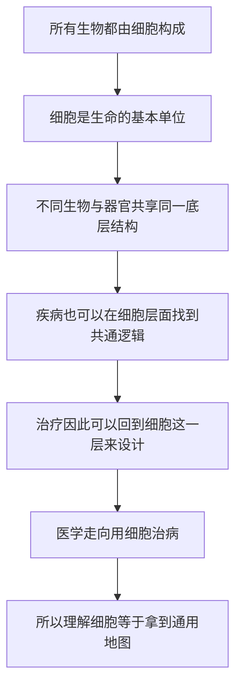

# 01｜为什么「细胞」是理解生命的关键？

> 为什么说「细胞」这个发现，比任何单一疾病的攻克都更重要？

---

## 一、先说结论

生物学界普遍认为，细胞是生命的基本单位：所有生物，无论是一棵大树、一只蜜蜂，还是一个人，都由细胞构成。

穆克吉在这本书里做了一件很特别的事：他把「细胞」当作整本书的主角。他的核心判断是——理解细胞，等于拿到了理解生命、疾病与医学的一张通用地图。因为在细胞这个尺度上，看似毫不相干的疾病，会显出共同的底层逻辑；而医学接下来的方向，正走向「用细胞治病」的细胞医学。

换句话说，这一篇要回答的不是「细胞长什么样」，而是：为什么它值得成为我们理解生命的起点。

---

## 二、我们先理解一个问题

我们习惯从「疾病」出发去理解医学。

心脏病研究心脏，肝病研究肝脏，癌症研究肿瘤。这种思路很自然，也很有效。但它有一个隐藏的麻烦：每一个器官、每一种病，看起来都像是一个独立的问题，都有一个专门的领域，彼此之间很难对话。

于是就有了一个问题：

> **有没有一个更底层的东西，能把这些看似分裂的领域重新连成一张网？**

如果有，那么它解答的就不只是某一种病，而是「生命本身是怎么运转的」。

穆克吉的答案是：有，那就是细胞。这一篇要做的，就是先把这个答案站稳。

---

## 三、作者到底提出了什么观点？

穆克吉的观点可以拆成三层。

第一层，是生物学界早已确立的事实：**细胞是生命的基本单位。** 这不是穆克吉的发明，而是现代生物学的基石。从细菌到蓝鲸，从真菌到人类，所有生命体都由细胞组成；最小的生命单位是一个细胞，而更大的生命，是许多细胞协作的结果。

第二层，是穆克吉自己的框架：**细胞是理解生命的通用语言。** 他认为，一旦你掌握了细胞这套「词汇」和「语法」，你就能读懂大量原本互不相干的生物学问题。

第三层，是这本书的落脚点：**医学正在走向「细胞医学」。** 穆克吉认为，过去一两百年，医学主要靠药物和手术；而在未来，越来越多的疗法会直接使用活着的细胞——移植细胞、改造细胞、把细胞本身当成药。理解细胞，因此不只是科学上的兴趣，而是理解医学未来的钥匙。

需要说清楚的是：第一层是学界的共识，第二、第三层是穆克吉的判断与主张，属于他的观点，而不是已被普遍接受的定论。

---

## 四、把这个观点翻译成人话

想象你要理解一座城市里所有的建筑。

有摩天大楼、有平房、有桥梁、有剧院。它们形状不同、功能不同、看起来毫不相干。但如果你知道一个事实——**它们都是用同一种基本单元砌出来的**——你对这些建筑的理解一下子就统一了。你会明白，它们的差别不在于「材料不同」，而在于这些基本单元如何排列、如何组织、规模有多大。

细胞之于生命，就是这块基本单元。

再换一个类比：字典与语言。人类说的话千差万别，但只要它们共享同一套字母或笔画，学语言就有了入口。细胞，就是生命这本书里那套共同的「字母表」。

所以「细胞是关键」，并不是因为细胞本身多么神秘，而是因为**它是一个能把所有生命现象连接起来的观察尺度**。往上，它能解释器官与个体；往下，它能接到基因与分子。

---

## 五、为什么会这样？

把穆克吉的逻辑整理成一条链：

这条链里，**C 是最关键的一环。**

如果每种生物、每个器官都各有各的构造规则，那么它们就是彼此孤立的谜题。可一旦发现它们共享同一套底层结构，知识就能互相迁移：在一种生物里学到的机制，往往能帮助理解另一种生物；从一个器官里发现的规律，常常能解释另一个器官的病变。

这正是「基本单位」这个词的真正价值。它带来的不是新知识，而是**知识的可迁移性**。穆克吉把细胞当作全书主角，正是因为他想借用这种可迁移性，把一整本书里的各种故事扣到同一个扣子上。

---

## 六、举一个现实生活中的例子

我们可以用建筑来想这件事。

假设你要理解一整个城市的建筑群。如果没有人告诉你它们的基本单元是什么，你会看到的是一堆彼此无关的庞然大物：住人的、办公的、看戏的、跨河的。你只能一栋一栋地去研究，经验无法推广。

可一旦你知道它们都是由砖块砌成的，情况就变了。你会开始问：同样一块砖，为什么这里砌成了拱门，那里砌成了墙？为什么有些建筑只有一层，有些能盖到几十层？——**你问的问题升级了。** 你不再满足于「这栋楼长什么样」，而是开始追问「它是怎么被组织起来的」。

细胞带来的正是这种升级。

一个人有几十万亿个细胞。同样一套细胞，被组织成了皮肤、神经、肌肉、血液。它们的差别不在于用了不同的材料，而在于细胞如何分工、如何排列、如何被调控。理解了这一点，你再看疾病就会有新的视角：很多病，本质上不是「身体里多了个异物」，而是**细胞层面的规则出了问题**。

这就是为什么穆克吉敢说：细胞不是众多知识点里的一个，而是理解生命的那把总钥匙。

---

## 七、回到书中重新理解

现在再回看这本书的副标题——它指向「医学与新人类」——就容易理解了。

穆克吉并不是想写一本细胞生物学教科书。他写这本书，是想说明一件事：**医学的重心正在发生移动。** 过去，医生面对的是一个「身体」；而现在，越来越多的技术让人能够直接面对「细胞」——把坏掉的细胞换掉，把失控的细胞纠正，把免疫细胞改造成武器。

要理解这些疗法为什么可能、为什么危险、边界在哪里，你就必须先理解细胞是什么、能做什么、受什么约束。所以这本书先从「认识细胞」讲起，再讲「细胞如何组成一个人」，然后才进入「用细胞治病」和「改造细胞」。

也就是说，细胞在书里不只是研究对象，它是**叙事的枢纽**。所有后面的故事——干细胞、克隆、CAR-T、基因编辑——都是从一个问题长出来的：我们能不能直接和细胞打交道？

这就是第一篇要立的那个地标。

---

## 八、这个观点背后还有什么？

这个观点背后，藏着一个更深的立场：**生命可以被理解为一种可以逐层拆解的结构。**

从个体，到器官，到组织，到细胞，再到分子——每一层都可以独立研究，又都能向上解释。生物学之所以能从一门描述性的学问，变成今天这样精确的科学，很大程度上依赖的就是这种「找到基本单位，再往上搭建」的思路。

但这里也埋着一个隐含前提：**基本单元本身，足以解释整体。**

这个前提并不自动成立。基本单元能告诉你「材料是什么」，却不一定能告诉你「整体会涌现出什么」。生命里有很多现象，恰恰是在细胞之间相互作用时才出现的，而不写在单个细胞里。这一点，我们在下一节会仔细看。

此外，这个观点还连接着这本书后面的一切：如果不承认细胞是基本单位，那么移植、重编程、基因编辑就都无从谈起。可以说，**第一篇是后面所有文章的地基**。

---

## 九、这个观点有问题吗？

有几处需要留心。

第一，**「细胞是生命的基本单位」有一个著名的边界。** 病毒没有细胞结构，却也能繁殖、演化、致病。它算不算生命？这个问题至今仍有争论，取决于你怎么定义「生命」。所以这句话更准确的说法是：细胞是**细胞生物**的基本单位，而不是所有「生命现象」的基本单位。

第二，**「把细胞当主角」是一种叙事选择，也是一种简化。** 穆克吉为了让全书有条主线，必须把细胞放在舞台中央。但真实的生命研究，同样依赖组织、器官、生态、甚至行为层面的分析。只强调细胞这一层，容易让人以为「只要搞懂细胞，就搞懂了一切」。这个推论是过头的。

第三，**从「细胞是基本单位」到「医学将走向细胞医学」，中间有一步跳跃。** 前者是学界共识，后者是穆克吉对趋势的判断。细胞医学确实在快速发展，但它是否真能成为与药物、手术并列的另一根支柱，还要看成本、安全性、监管与可及性这些现实条件。把「趋势」当成「既成事实」，是一种拔高。

所以更稳妥的说法是：**细胞是理解生命的重要尺度，而且可能是最有统摄力的那个尺度——但它不是唯一尺度。**

---

## 十、今天再看这个观点

（以下为现代延伸，非穆克吉原文）

在穆克吉写书之后，细胞层面的工具还在加速变化。

一方面，测序与成像技术让人可以**逐个**地观察细胞，而不是把一整块组织磨碎后取平均。这意味着研究者开始看到：即便是同一个组织，里面的细胞也可能千差万别。这种「单细胞」视角，正在修正过去很多笼统的结论。

另一方面，工程化的思路越来越强。除了改造细胞本身，人们还在尝试用细胞去搭建组织、用细胞做传感器、把细胞当成可编程的「活体装置」。这与穆克吉所说的「细胞成为药」是同一个方向上的延伸。

不过，这些延伸恰恰也提醒了一件事：**细胞不是孤立的零件。** 把它取出来、改造好、再放回去，它在体内会遇到什么、会不会失控、会不会被排斥，都是开放问题。细胞医学的难度，可能不在「改造细胞」，而在「让细胞在一个复杂的身体里好好工作」。

---

## 十一、这一篇真正应该记住什么？

1. **细胞是生命的基本单位。** 所有细胞生物都由细胞构成，这是现代生物学的基石，不是某位作者的个人主张。

2. **它的价值在于「可迁移」。** 因为共享同一底层结构，在一个生物、一个器官里学到的知识，往往可以推广到别处。

3. **穆克吉把细胞当作全书主角。** 这是一种框架选择：用细胞这一个尺度，把纷繁的生物学与医学问题串成一条线。

4. **医学正在向细胞医学移动。** 从移植到改造，疗法越来越直接地与活细胞打交道；但这是趋势判断，而非既成定论。

5. **细胞不是唯一的尺度。** 病毒、组织、整体层面的涌现现象提醒我们：基本单位很重要，但不能解释一切。

---

## 十二、留一个问题

到这里，我们只是从逻辑上相信了「细胞很重要」。

可是有一个更朴素的问题还没被回答：**在显微镜出现之前，人类其实从来不知道细胞存在。** 我们每天都活在自己的身体里，却对构成身体的最小单位一无所知，一知就是几千年。

> **那么，人类第一次「看见」细胞时，究竟看到了什么？一次工具的进步，为什么能带来一次认知的地震？**

下一篇，我们回到十七世纪的那片软木，看看「cell」这个词是怎么被偶然叫出来的。
