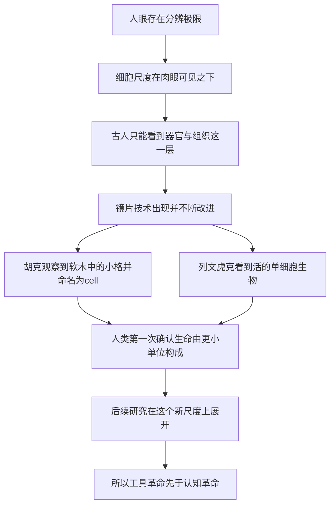

# 02｜人类第一次看见细胞，看到了什么？

> 在显微镜出现之前，人类为什么从不知道细胞的存在？

---

## 一、先说结论

据记载，十七世纪的显微镜，让人类第一次窥见了「生命的砖块」。

英国学者罗伯特·胡克在约 1665 年出版的《显微图谱》中，观察一片软木薄片，看到了一格格排列整齐的小空腔，于是把它们命名为「cell」——这个词源于拉丁文 cella，本意是「小房间」。

几乎同一时期，荷兰人安东尼·范·列文虎克用自制的显微镜，第一次看到了会游动的活细胞，他称它们为「微小动物」。

这一篇的核心不是谁先谁后，而是一句更重要的判断：**工具的革命，往往先于认知的革命。** 人类不是先想通了再去看见，而是先看见了，才被迫重新思考。

---

## 二、我们先理解一个问题

你有皮肤、有肌肉、有血液。你每天都和自己的身体相处。可如果你被问到「这些东西是由什么组成的」，在十七世纪之前，没有人能给出正确的回答。

不是古人不够聪明。是他们**没有能看见那个尺度的工具。**

人的眼睛有分辨率的极限。比这个极限更小的东西，不是「看不清」，而是根本不存在于我们的视野里。细胞恰恰就在这个极限之下。

所以这里有一个反直觉的问题：

> **如果没有显微镜，人类可能永远都发现不了细胞——哪怕细胞就在我们身上，日日夜夜地活着。**

这意味着，「发现细胞」这件事，本质上不是一个思想事件，而是一个**技术事件**。而技术事件一旦发生，思想就会跟着改变。

---

## 三、作者到底提出了什么观点？

穆克吉讲这段历史，重点并不在「谁第一个看见」，而在一个更深的主题：**观察工具决定了我们能看到什么，也决定了我们能想到什么。**

在他看来，细胞的故事从一开始就是一部「看」的历史：

- 先是有人造出了能放大微小物体的镜片；
- 然后有人把它对准了生物组织；
- 于是在人类面前，出现了一个此前完全未知的世界。

这里有一个细节很值得注意。胡克看到的，严格说是一片干枯的软木，里面剩下的其实是细胞死亡后留下的空壁。他看到的「小房间」，是**空房间**。而列文虎克看到的，是活着的、会动的细胞。两个人看到的东西不同，但都指向同一个事实：**生命的身体里，有更小的结构单位。**

「cell」这个名字，就这样被叫了出来。据记载，它取自拉丁文的「小房间」。有趣的是，这个名字后来一直沿用至今，尽管它对于细胞的真实样貌——活生生的、会活动的、会分裂的——其实并不十分贴切。

---

## 四、把这个观点翻译成人话

你可以先做一个很简单的想象。

拿起一块布料，用肉眼看，它是一整片颜色均匀的东西。但如果换一个放大镜去看，你会发现它其实是由一根根纤维交织出来的。再放大，纤维本身也是由更细的线拧成的。

布料没有变，变的是**你手上的工具**。而工具一变，你对「布料是什么」的理解就变了。

细胞的发现也是这个道理，只是放大倍数要大得多。

再换一个更贴近身体的体验：一个近视的人第一次戴上合适的眼镜。他之前以为世界就是模糊的，以为远处的树就是一团绿色的影子。戴上眼镜的那一刻，枝叶、鸟、远处的人脸全都显现出来。他没有移动到任何新的地方，但他「看见」了一个此前不存在的世界。

显微镜之于十七世纪的人，就是那副眼镜。**细胞一直都在那里，只是没有一副镜片把它带到人的眼前。**

---

## 五、为什么会这样？

把这段历史整理成一条链条：

这条链里，**D 是最关键的一环。**

在 D 之前，无论一个人多么善于思考，他的观察素材都只到「组织」这一层。他能摸到肿块，能看到伤口，能观察血液的颜色，但他无法知道血液里有细胞。他的理论再精巧，也只能建立在一个错误的、或者说过于粗糙的观察层上。

而 D 一旦发生，一切就不同了。研究者的目光被带到了一个全新的尺度。**新工具不是让旧的观察更清楚，而是打开了一个此前不存在的观察对象。**

这就是为什么穆克吉要花篇幅讲显微镜：它不是细胞故事的背景，而是细胞故事的前提。

---

## 六、举一个现实生活中的例子

我们可以用「换一副眼镜」来想这件事。

假设有个人从小就近视，但一直不知道。他以为世界本来就是朦胧的：黑板上的字是一团影子，远处的招牌是一块色块。他会发展出一套适应模糊世界的办法——靠猜、靠听、靠走近。他不会觉得自己「少了什么」，因为模糊对他来说就是「正常」。

直到有一天，他戴上了眼镜。

那一瞬间，他不会觉得「原来世界一直是这样，只是我没看清」；他会觉得「这是一个新世界」。因为对他而言，**可辨识的结构是第一次出现**，而不是第一次被看清。

显微镜带来的冲击是同一类型的。在它出现之前，人们研究的「最小单位」就是肉眼能分辨的东西：器官、组织、纤维、体液。没有人觉得自己漏掉了什么，因为「细胞」这个概念根本不在他们的可能性清单上。

所以，当胡克和列文虎克把镜片对准生物材料的那一刻，发生的不是「补上一块拼图」，而是**整幅图被换掉了**。此后三百多年，生物学的主线，基本都在这条被打开的新尺度上展开。

---

## 七、回到书中重新理解

现在再回看穆克吉为什么把「看见细胞」放在全书最前面，就明白了。

他这本书讲的是「用细胞治病」的医学新阶段。但任何一次医学革命，都要先有一次观察上的突破。**你要能看见一个东西，才可能去理解它、操纵它、治疗它。** 他先讲显微镜，等于在告诉读者：后面所有的细胞疗法，都站在这一刻的肩膀上。

这也是为什么他把胡克和列文虎克放在一起讲。一个看到了静止的空格，一个看到了活的生命。前者给了这个东西一个名字，后者证明了这个东西是**活的**。两件事合起来，才算真正打开了细胞世界的大门。

穆克吉真正想强调的，其实是一种谦逊：**我们的认知是有边界的，而边界往往由工具划定。** 今天的人以为自己已经看得很清楚了，可谁能保证，没有下一个尺度的结构，正藏在我们的视野之外呢？

---

## 八、这个观点背后还有什么？

这里藏着一个更大的主题：**科学的进步，常常不是「想出来」的，而是「看出来」的。**

很多时候，我们以为是理论推动了发现。但历史上不乏相反的例子：先有了新的仪器，才有了新的理论。望远镜之于天文学，显微镜之于生物学，粒子加速器之于粒子物理，都是如此。工具先打开一扇窗，理论再解释窗外的风景。

这个主题还有一个延伸：**命名本身，也会塑造后来的思路。**

胡克把这个小格叫作「cell」，即「小房间」。这个名字暗示了一种静态的、被墙隔开的结构。这个比喻很形象，但它也悄悄带偏了后来很多年的想象——好像细胞就是一格一格静止的容器。要等到人们真正看到细胞的运动、分裂与彼此沟通，「细胞是活的、动态的」这一点才慢慢被确立。

也就是说，**第一次看见，不仅决定了我们看见什么，也决定了我们用什么词去想它。** 而词的惯性，有时比观察的局限更难突破。

---

## 九、这个观点有问题吗？

有几处需要留心。

第一，**「胡克发现了细胞」这个说法，需要一点限定。** 他观察的是软木，是已经死亡的植物组织，他看到的其实是细胞留下的一层壁。他没有看到细胞核，也没有看到活细胞的内部活动。所以更准确的说法是：他第一次**描述并命名**了细胞这一结构。

第二，**发现者并非只有一两个人，而是很多人共同的成果。** 在十七世纪，欧洲有若干研究者都在用早期显微镜观察微小生物，镜片制作也在同步进步。把功劳完整地归于某一个人，是把一段集体探索压缩成了一个名字。至于「谁第一个看到」，记载之间也有出入，需要保留余地。

第三，**「工具先行」这个说法，也容易过度简化。** 不是只要造出显微镜，细胞就会发现。观察者必须知道往哪里看、怎么解释自己看到的东西，还得有一个共同体去传播和验证。技术、眼光、文化与交流，缺一不可。把一切都归于工具，是把复杂过程压成了一条直线。

所以更稳妥的说法是：**显微镜是细胞故事的必要条件，但不是全部条件。**

---

## 十、今天再看这个观点

（以下为现代延伸，非穆克吉原文）

今天，人类「看」细胞的方式，早已不是光学显微镜能概括的。

一方面，成像技术在不断突破分辨率的极限，让人们看到细胞内部更精细的结构；另一方面，研究者不再满足于看到形状，而是想在看到的同时知道**这个细胞在表达什么、在做什么**。因此，成像正在和数据结合：同一张图上，可以叠加上分子层面的信息。

更重要的变化是，观察的单位从「一群细胞」变成了「每一个细胞」。过去要研究一块组织，往往要把成千上万个细胞一起磨碎，得到的是一份平均值。而现在，人们可以在单个细胞的尺度上读出信息，看到原本被平均值掩盖的差异。

这与穆克吉所说的方向一致：**每一次能「看见」更多，都会带来一次理解上的跃迁。** 只是今天的门槛，已经从「造一副镜片」，变成了「造一套能同时观察和测量的系统」。

---

## 十一、这一篇真正应该记住什么？

1. **细胞一直在我们身上，只是过去看不见。** 人眼有分辨极限，细胞藏在这个极限之下，所以几千年来无人知晓。

2. **胡克命名了「cell」。** 他观察软木薄片时看到排列整齐的小格，用拉丁文「小房间」之意为其命名，这个词沿用至今。

3. **列文虎克看到了「活的」细胞。** 这位荷兰人用自制显微镜观察到会游动的单细胞生物，把它称作「微小动物」。

4. **工具革命先于认知革命。** 不是先想通再看见，而是先看见，才被迫重新理解生命。

5. **命名会反过来塑造思路。** 「小房间」这个比喻很形象，却也让后人一度低估了细胞的动态与活性。

---

## 十二、留一个问题

人类看到了细胞。可「看到」和「说清楚」是两回事。

胡克看到是一格格小房间，列文虎克看到是会动的小生物。但没有人回答一个更大的问题：

> **是不是所有生命——植物、动物、人——都由这样的单位构成？如果真是这样，那么差别如此巨大的生命，凭什么共享同一套底层结构？**

从「看见」到「归纳成一条普遍规律」，中间隔了将近两百年。下一篇，我们来看这条规律是怎么被提出来的：**细胞学说。**
