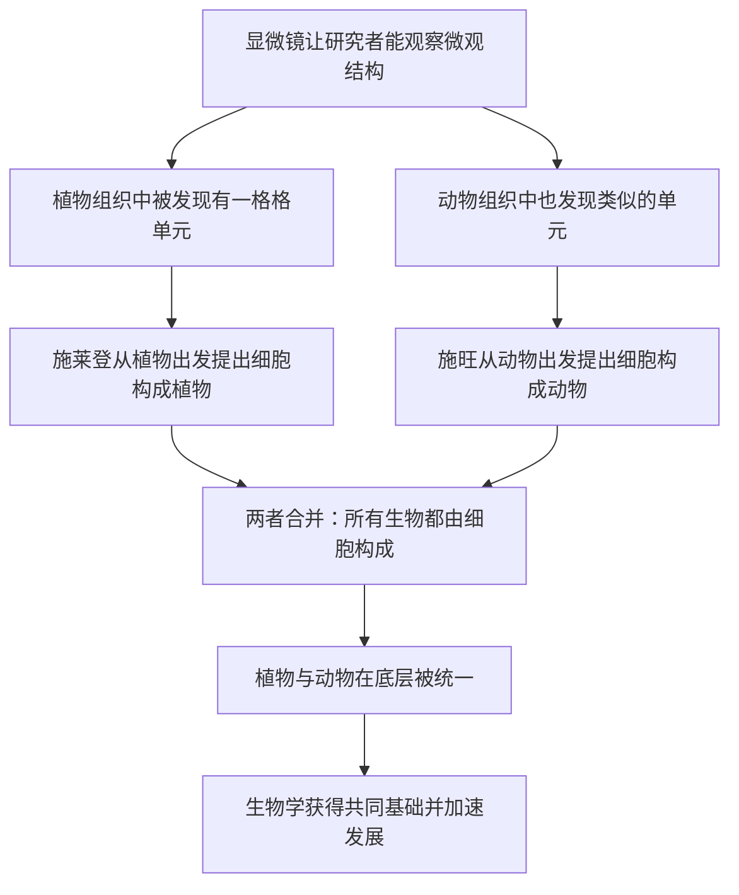

# 03｜细胞学说：所有生命都建立在同一块砖上吗？

> 为什么说「一切生物都由细胞构成」是生物学最深刻的统一？

---

## 一、先说结论

通常认为，十九世纪的两位德国研究者——马蒂亚斯·施莱登与特奥多尔·施旺——分别从植物和动物出发，提出了细胞学说：**所有生物都由细胞构成。**

这句话听起来平淡，分量却极重。它把千差万别的生命，统一到了同一个底层结构上。在它之前，植物学家和动物学家几乎是两套人马，研究的是两种世界；在它之后，人们才意识到，他们研究的其实是同一种东西的不同组织方式。

这就是生物学史上最深的一次「统一」。它让生命不再是无数个孤立的谜题，而变成了一门有共同基础的科学。穆克吉把它视为理解细胞的必经一步。

---

## 二、我们先理解一个问题

在细胞学说出现之前，人类对生命的分类，是**按外表**来的。

会动的、有毛有骨的，是动物；不动的、扎根的、绿的，是植物。这两大类的差别如此明显，以至于研究者默认它们是两套完全不同的东西，研究植物的人和研究动物的人，几乎各说各话。

可在显微镜下，这个分界开始变得可疑。研究者陆续发现：植物的组织里有一格格结构，动物的组织里也有类似的单元。那么问题就来了：

> **这些看起来一样的东西，是不是同一种东西？如果植物和动物在底层使用同一套「零件」，那我们关于生命的整个分类方式，是不是要重新想？**

这正是细胞学说要回答的问题。它要做的，是把「植物」和「动物」这两个世界，接到同一个底座上。

---

## 三、作者到底提出了什么观点？

一般认为，细胞学说的核心主张可以概括为两条：

第一，**所有生物都由细胞构成。** 一个生物可以只有一个细胞，也可以有亿万细胞，但基本单位是一样的。

第二，**细胞是这个基本单位。** 它不只是「一块材料」，而是一个能独立承担生命活动的最小单元。

需要说清楚的是：这两条里，第一条是当时研究者逐步确立、后来被广泛接受的观点；而关于细胞「怎么产生」的部分，早期版本其实包含了一些后来的研究证明并不正确的猜想。真正把后面的问题说清楚的人，是下一篇要讲的魏尔啸。

在穆克吉的叙述里，施莱登和施旺的意义，不在于两个人的名字，而在于**他们代表了一种新的提问方式**：不再问「它是什么生物」，而是问「它由什么构成」。一旦这样发问，植物与动物之间的墙就开始松动了。

---

## 四、把这个观点翻译成人话

你可以先想建筑。

一个城市里有住宅楼、有医院、有剧院、有桥梁。它们用途完全不同，样子也完全不同。可如果你知道它们都是用砖块砌成的，你就不会再觉得它们属于「完全不同的东西」。它们只是**同一块砖的不同组织方式**。

砖是基本单元；楼是组织结果。

细胞学说说的就是这件事：植物也好，动物也好，人也好，看起来天差地别，但它们都是用「细胞」这块基本单元搭建起来的。区别不在材料，而在**组织方式**——用了多少、怎么排列、如何分工。

再换一个类比：语言。世界上有很多语言，发音、词汇、语法都很不一样。但语言学家发现，很多语言在更深层共享某些结构规律。这种「底层的共同点」，不会让这些语言变得相同，却能让它们被同一种方法去理解。

细胞学说给生物学带来的，就是这样一个「底层共同点」。

---

## 五、为什么会这样？

把细胞学说的建立整理成一条逻辑链：

这条链里，**F 是最关键的一环。**

如果只有植物学家发现植物由细胞构成，或者只有动物学家发现动物由细胞构成，那么得到的是两条互不相干的结论。真正产生威力的是把它们**合起来**：一个关于「所有生命」的陈述。

这一步之所以重要，是因为它改变的不只是一个事实，而是**整个学科的组织方式**。有了共同的基本单位，研究者就有了共同的语言；一种生物上得出来的发现，才有可能迁移到另一种生物上。**统一，就是让知识可以互相借用。**

---

## 六、举一个现实生活中的例子

我们可以用砖块来设想两种完全不同的地方。

一个是乡村的老式宅院，墙厚、屋顶斜、有院子；另一个是城里的高层公寓，玻璃幕墙、钢筋骨架、有电梯。你一眼看去，会觉得这是两种完全不同的建筑，住在里面的人生活方式也不一样。

但如果有人告诉你，它们的墙体都是由砖块或砌块搭出来的，你对它们的理解就会发生一次重组。你会开始注意：原来砖块可以这样排，也可以那样排；原来墙的厚薄、建筑的形态，都是组织方式的差别，而不是材料本身的差别。

这个「重组」的过程，正是十九世纪生物学经历的事。

在此之前，研究植物的人把植物当作自成一类的东西，研究动物的人把动物当作另一类东西。他们的方法、术语、关注点都不一样。细胞学说之后，他们忽然发现：**大家研究的其实是同一块砖的不同搭法。**

这也解释了为什么细胞学说被视为「基石」。因为它不是增加了一条知识，而是**更换了整张地图的坐标系**。此后的遗传、发育、病理、免疫，都是在这张新地图上继续画的。

---

## 七、回到书中重新理解

现在再回看穆克吉安排这一篇的用意，就清楚了。

他要讲的，是「细胞如何成为医学的新前线」。可要让这个说法立得住，第一步必须先证明：**细胞不是某一类生物的特色，而是所有生命的共同基础。**

细胞学说完成的，正是这一步。它把细胞从一个「显微镜下有趣的小东西」，提升为「一切生命的基本单位」。有了这个身份，后面关于细胞的一整套讨论才成立——无论是研究细胞如何分化、如何沟通，还是讨论如何用细胞去治病。

穆克吉没有把这一篇写成人物传记，而是在强调一种**统一性带来的力量**：当所有生命共享同一个底层，医学才有可能把在一种生物里学到的原理，用到人身上。今天很多药物和疗法之所以能先在动物模型上试验，再推向临床，背后的假设，正是这种统一性。

---

## 八、这个观点背后还有什么？

这里藏着一个更深的观念：**生命的多样性，来自同一套底层规则的不同组合。**

这其实是一个很现代的想法。它告诉我们，自然界的丰富，并不需要无数种完全不同的机制；只需要一套基础单元，加上足够多的组合方式。DNA 的四种碱基能编码几乎所有生命，元素周期表上有限的元素能构成万物，都是同一种逻辑。

这个观念还有一层哲学意味：**统一性并不消灭差异，反而让差异变得更可理解。** 如果我们承认植物和动物共享同一个底座，那么它们之间的不同就不再是「本质不同」，而是「同一种东西的不同安排」。差异从此变成了一个可以被追问的问题，而不是一个无法跨越的鸿沟。

这也直接连向下一篇：既然所有细胞同源，那么新的细胞究竟从哪里来？是从无到有地「长出来」，还是只能由已有的细胞产生？这个问题的答案，会决定医学如何看待疾病。

---

## 九、这个观点有问题吗？

有几处需要留心。

第一，**细胞学说的早期版本并不完全正确。** 施旺等人当时对「细胞如何形成」有过一些猜想，倾向于认为细胞可以从某种非细胞物质中形成。这一部分后来被证明是错的，需要由魏尔啸的「细胞来自细胞」来修正。所以，学说本身是分阶段成熟的，不能把早期版本当成最终结论。

第二，**「所有生物都由细胞构成」存在边界情况。** 病毒没有细胞结构，却能繁殖和致病。它算不算「生物」，取决于定义。此外，像骨骼肌纤维这样的一些结构，是多个细胞融合成的多核体；成熟的红细胞则没有细胞核。这些都不推翻细胞学说，但说明它是**一条有例外的归纳，而不是毫无例外的铁律**。

第三，**「统一」这个叙事本身，也可能让历史变得过于顺滑。** 真实的科学进程往往充满犹豫、争论和反复，而不是两位研究者各写一篇论文，学说就应声成立。把一段漫长而混乱的历史，讲成一个干净的顿悟时刻，是一种叙述上的简化。

所以更稳妥的说法是：**细胞学说给了生命一个正确的共同底座，但这个底座是百年争论逐步校准出来的，而不是一次到位的。**

---

## 十、今天再看这个观点

（以下为现代延伸，非穆克吉原文）

今天，细胞学说依然成立，而且它的应用范围比十九世纪时想象的要广得多。

一个重要的延伸是：既然所有细胞共享同一套底层机制，那么**在一个物种身上验证的原理，就有机会推广到其他物种**。这正是现代生物医学研究依赖模式生物的逻辑基础——研究果蝇、线虫、小鼠，目的往往不是了解它们本身，而是借它们理解更普遍的生命规律。

另一个延伸是：随着对细胞的了解加深，人们发现「同一套底层」并不意味着「一模一样」。不同物种的细胞、甚至同一个体内不同组织的细胞，在细节上差异很大。统一的框架之下，是极为丰富的多样性。

这与穆克吉所强调的是同一件事：**先有统一，才谈得上差异。** 只有先承认大家用的是同一块砖，我们才能去问，为什么这一块搭成了皮肤，那一块搭成了神经。

---

## 十一、这一篇真正应该记住什么？

1. **细胞学说主张：所有生物都由细胞构成。** 这是生物学史上最重要的一次统一，把植物与动物接到同一个底座上。

2. **它通常归于施莱登与施旺。** 两人分别从植物和动物出发，得出了同一个结论，合起来才构成了关于「所有生命」的陈述。

3. **统一的真正价值是「可迁移」。** 有了共同的基本单位，一种生物上的发现才可能帮助理解另一种生物。

4. **这不是一道简单的归纳。** 病毒、多核结构、无核细胞都是边界情况，说明学说是强大但有例外的框架。

5. **早期版本并不完善。** 关于细胞如何产生，施莱登与施旺的猜想后来被修正——这正是下一篇要讲的问题。

---

## 十二、留一个问题

细胞学说告诉我们「生命由细胞构成」。可它没有回答一个同样基本的问题：

> **新的细胞，究竟是从哪里来的？**

是从某种没有结构的东西里凭空产生，还是只能由已经存在的细胞分裂而来？这看似只是一个细节，却牵动着整个医学的根基——因为如果答案是后者，那么疾病就必须回到细胞层面去理解。

下一篇，我们来看一句成为医学公理的口号：**「细胞来自细胞」。**
