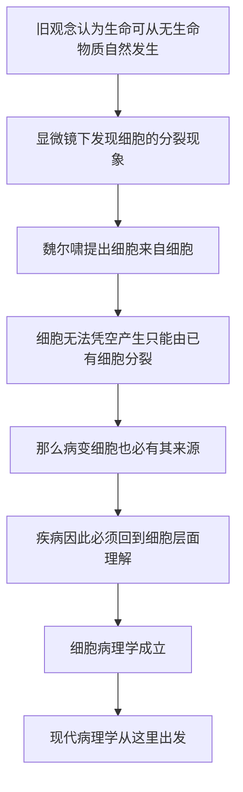

# 04｜「细胞来自细胞」：一句口号如何成为医学公理？

> 细胞究竟从哪里来？为什么这句话如此重要？

---

## 一、先说结论

大约在 1855 年，德国病理学家鲁道夫·魏尔啸提出了那句著名的拉丁文原则：**omnis cellula e cellula**——「细胞来自细胞」。

它的意思是：**新的细胞只能由已经存在的细胞分裂产生，不会凭空出现。**

这句话看起来只是一个关于繁殖的细节，实际上却完成了一件大事：它终结了「自然发生」的旧观念，也把医学的目光永久地拉到了细胞层面。魏尔啸由此开创了细胞病理学——他认为，疾病不是某种弥漫在全身的「坏气」，而是**某些细胞发生了改变**。

穆克吉把这句话视为现代病理学的起点，也是「细胞医学」这条长路的真正地基。

---

## 二、我们先理解一个问题

在魏尔啸之前，人们对「新东西从哪里来」有一个很自然的直觉：**从无到有。**

肉放久了会生蛆，水里会冒出微生物，腐烂的东西会「长出」新的生命。这种观念通常被称为「自然发生说」。它不荒谬，因为它符合肉眼所见——你确实没有看到蛆从哪来，它就好像凭空出现了。

问题在于，显微镜让人类看到了比肉眼更小的世界。当研究者发现水里充满了会动的微生物时，一个问题被推到了台前：

> **这些生命，到底是从无生命的物质里自己冒出来的，还是本来就来自别的生命？**

这个问题不只关乎生物学。如果生命能够自发产生，那么疾病也可能被想象成某种自发的、弥漫的东西；如果生命只能来自生命，那么「病变」就必须有一个具体的来源。医学往哪里看，取决于这个问题怎么回答。

---

## 三、作者到底提出了什么观点？

魏尔啸的主张，可以浓缩成一句话：**细胞只能来自细胞。**

据记载，他在大约 1855 年写下这句拉丁文格言。它针对的正是当时仍未彻底退场的「自然发生」观念：新细胞不是从某种无结构的原料里自发形成的，而是**由已有细胞分裂而来**。

这句话的医学含义，比它的生物学含义更深远。

魏尔啸进一步提出：**疾病发生在细胞里。** 一个器官之所以出问题，是因为组成它的细胞发生了变化。这被称为细胞病理学。在此之前，疾病常被理解为整个身体或某种体液的失衡；在此之后，疾病有了一个具体的、可观察的落点——**细胞**。

穆克吉把这一步看作全书的关键转折之一：当「细胞来自细胞」成为公理，医学才第一次拥有了可以追查病变源头的坐标。

需要说明的是：这句原则最初是一个科学命题，它的确立也经历了争论与验证；而把它推广为「所有疾病都能在细胞层面解释」，则是魏尔啸本人的理论主张，属于他的观点，而非人人公认的定论。

---

## 四、把这个观点翻译成人话

最直观的类比是复印件。

你手上的每一份复印件，都必须来自一份原件，或者来自另一份复印件。复印件**不会从空气里长出来**。你可以一直复印下去，但链条的头一定是一个「原件」，而每一环都是上一环的产物。

细胞就是这样。你身上现在正在分裂的细胞，都来自你体内早已存在的细胞；往上追溯，可以追溯到受精卵那一个细胞；再往上，则追溯到父母各自的细胞。

换一个角度，是家谱。

每个人的生命，都来自父母；父母来自祖父母。没有一个人是从石头里蹦出来的。生命的传递是一条连续不断的链，而不是一次次孤立的发生。

「细胞来自细胞」说的就是：**在细胞这个尺度上，生命也是一条不断的链。** 这条链一旦确立，医学就有了追根究底的路径——出了问题，就顺着链条去查是哪一环、哪一类细胞变了。

---

## 五、为什么会这样？

把这条逻辑整理成链条：

这条链里，**E 是最关键的一环。**

从「细胞来自细胞」到「疾病是细胞的问题」，中间靠的是这样一步推理：既然细胞不会凭空产生，那么任何一个异常的细胞，都不是从空气里冒出来的，而是从某个正常细胞变来的，或者由某个已经异常的细胞分裂而来。**既然有来源，就有迹可循。**

这一步把疾病从「一种模糊的状态」变成了「一个可以被定位的事件」。医生不再只能描述症状，而可以进一步追问：是哪一类细胞、在哪一个环节上出了问题？这个问题一旦问出来，病理学作为一门学科才真正成立。

---

## 六、举一个现实生活中的例子

我们可以用一份文件的流传来想这件事。

假设办公室里出现了一份内容错误的通知。如果这个错误文件可以「凭空出现」，那你就无从查起——谁都有可能，也可能谁都不是。可如果规则是「每一份文件都必须从上一份复制而来」，那么追查就变得可行：你顺着传阅链往回找，就能找到第一次出错的那一份，也能知道错误是如何被复制、扩散的。

这就是「细胞来自细胞」给医学带来的东西：**可追溯性。**

再换一个角度：一个家族里出现了某种遗传性的疾病。如果生命可以自发产生，那这种病的出现就无法解释。但因为我们知道生命只能来自既有生命，研究者就可以沿着家系、沿着细胞、沿着基因，去找这条链上到底哪一环出了问题。

魏尔啸的贡献，正是给医学装上了这样一条「追查链」。它让「病变从何而来」从一个哲学问题，变成了一个可以被具体研究的问题。

---

## 七、回到书中重新理解

现在再回看穆克吉为什么把这句话放在如此重要的位置，就明白了。

他这本书的主线，是「医学正在走向用细胞治病」。而这条主线的起点，恰恰是魏尔啸。因为只有当我们承认「细胞来自细胞」，我们才可能想到：**既然细胞能被替换、被改造，那么疗法也可以直接作用在细胞这一层。**

如果细胞是凭空产生的、不可追溯的，那么「替换一个坏细胞」「纠正一个细胞」这些想法就无从谈起。是魏尔啸先把细胞确立为一个**有来历、可追溯、可干预的单位**，后面的一切才有立足点。

穆克吉特别看重的，是这句话的「公理」地位。公理不需要每次都被证明，它是推理的起点。而「细胞来自细胞」正是医学推理的一个起点——它让整个现代病理学，有了一个稳定的出发点。

---

## 八、这个观点背后还有什么？

这里藏着一个更深的判断：**疾病可以被还原到细胞。**

魏尔啸的核心信念是，身体的异常，最终都对应着细胞层面的异常。这带来了一套极有生产力的研究纲领：想搞清一种病，就去比较病变细胞与正常细胞的差别。今天病理科医生在显微镜下看切片、判断肿瘤的类型与分级，延续的正是这个传统。

但这个信念也带出一个隐含前提：**细胞层面的改变，是疾病的「根因」，而不只是「表现」。** 这个前提在当时是有力的，却并不总是成立。有些疾病的第一现场可能在分子或基因层面，细胞的变化只是下游结果。

此外，这句话还悄悄改变了「生命」的图景：生命不再是一团可以随时自发生出的活力，而是一条**连续传递的链条**。这为后来的遗传学、发育生物学都埋下了伏笔——既然生命是连续传递的，那么传递的究竟是什么，就成了下一代研究者要回答的问题。

---

## 九、这个观点有问题吗？

有几处需要留心。

第一，**终结「自然发生说」并不是魏尔啸一个人的功劳。** 与他同时代的巴斯德等人，用实验更有力地否定了自然发生。科学史上，一个旧观念的退场，往往是多人、多条证据线共同作用的结果。把这一步单独归功于某一句口号，是叙述上的聚焦，而非完整的历史。

第二，**「细胞来自细胞」需要后续补充，才能解释有性生殖。** 如果新细胞只能来自细胞分裂，那么精子和卵子是怎么产生、又凭什么组合出一个新个体？这些问题要到后来的减数分裂与受精机制被发现，才被讲清楚。也就是说，这句格言是一个正确的起点，却不是完整的机制说明。

第三，**「疾病都能还原到细胞」是一种强主张，而非定论。** 有些病变最初发生在分子层面，有些疾病涉及细胞之间的相互作用乃至组织整体。把所有疾病都压缩到「某个细胞坏了」，会漏掉很多真实情况。更准确的说法是：细胞是一个极其重要的观察层，但不是唯一的一层。

所以更稳妥的说法是：**魏尔啸给了医学一个正确的坐标原点，但坐标原点不等于全部地图。**

---

## 十、今天再看这个观点

（以下为现代延伸，非穆克吉原文）

今天，「细胞来自细胞」这条原则不仅没有过时，反而在技术上被反复触碰边界。

一个有意思的延伸是**细胞重编程**：研究者发现，一个已经分化的成熟细胞，可以被重新「调回去」，变得像早期细胞那样具有多种分化潜能。这看上去像是在挑战「细胞只能按既有路线前进」，但仔细看会发现，它并没有推翻魏尔啸的原则——重编程依然是在**已有细胞**的基础上进行的，只是改变了它的状态，而不是凭空造出细胞。

另一个延伸是**合成生物学**。研究者尝试构建尽可能简单的细胞，用来理解「生命最少需要什么」。即便在这样的极限尝试里，出发点通常仍是已有的细胞结构，而不是从零到有地自发产生生命。

所以，一百多年后回头看，魏尔啸这句话依然站得住：**它划定的不是细胞的终点，而是细胞的起点。** 今天所有关于细胞治疗、细胞工程的想象，都是从这条起点线出发的。

---

## 十一、这一篇真正应该记住什么？

1. **细胞只能来自细胞。** 魏尔啸大约在 1855 年提出这条原则，新的细胞由已有细胞分裂产生，不会凭空出现。

2. **它终结了「自然发生」的旧观念。** 生命不再被理解为随时可以从无生命物质中自发产生，而是一条连续传递的链。

3. **它给医学带来了「可追溯性」。** 既然细胞必有来源，病变细胞也必有来源，疾病因此成为可以被定位、被追查的问题。

4. **细胞病理学由此成立。** 魏尔啸主张疾病发生在细胞层面，这成为现代病理学的起点。

5. **这是起点，不是终局。** 有性生殖、分子层面的病变都还需要后续补充；细胞的坐标很重要，但不是全部地图。

---

## 十二、留一个问题

我们已经确认：细胞是生命的基本单位，而且只能由已有细胞产生。

可这么小的一个东西——小到要显微镜才能看见——里面到底装了什么？它凭什么能承担「生命活动」这么复杂的事情？

> **一个肉眼看不见的细胞，内部为什么不是一团简单的胶状物，而更像一座高度组织化的「微型城市」？**

下一篇，我们走进细胞内部，看看里面究竟藏着哪些「部门」和「设施」。
