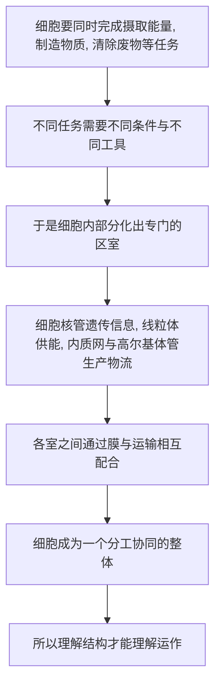

# 05｜细胞内部，究竟藏着一座怎样的「城市」？

> 一个肉眼看不见的细胞，内部为什么如此复杂？

---

## 一、先说结论

细胞不是一团简单的胶状物，而是一个高度组织化的「微型城市」。

它有控制中心——细胞核，据记载由罗伯特·布朗大约在 1831 年发现；有发电厂——线粒体，负责供应能量；有生产与物流系统——内质网和高尔基体，一个负责制造，一个负责分拣和运送；有边界与海关——细胞膜，决定什么能进来、什么能出去。此外还有承担清理与回收工作的结构，比如溶酶体，由克里斯蒂安·德·迪夫发现。

穆克吉认为，**理解这套结构，是理解细胞如何运作的前提**。你不可能在不知道城市里有哪些部门的情况下，搞懂这座城市靠什么运转。

---

## 二、我们先理解一个问题

我们已经知道细胞是生命的基本单位。但「基本单位」这个词容易造成一个误解：好像它很简单。

毕竟它小到肉眼看不见。很多人会顺势想象：这么小的东西，大概就是一团均匀的、类似胶质的东西吧？外面一层膜，里面装点液体，仅此而已。

可事实恰恰相反。**细胞越是小，它内部的组织程度反而越惊人。**

一个细胞要在极小的空间里完成摄取养分、产生能量、制造蛋白质、清除废物、对外界信号作出反应、乃至准备分裂——这是一整套复杂的生命活动。如果它真的只是一团胶状物，这些活动根本无法协调。

所以这里的问题就是：

> **一个肉眼看不见的单位，凭什么能同时承担这么多任务？它的内部，到底是怎么被组织起来的？**

---

## 三、作者到底提出了什么观点？

穆克吉的核心观点是：**细胞是一个在空间上高度分工的结构，而不是一锅均匀的「原生质」。**

他借助「城市」这个比喻，把细胞内部的主要「部门」和它们的分工讲清楚。用现代生物学的语言说，细胞内部有许多由膜或其他方式划分出的**区室**，每个区室承担专门的功能。

大致可以这样对应：

| 细胞结构 | 城市里的角色 | 主要功能 |
|---|---|---|
| 细胞核 | 指挥中心与档案室 | 存放遗传信息，指挥细胞活动 |
| 线粒体 | 发电厂 | 为细胞提供能量 |
| 内质网 | 生产车间 | 合成蛋白质与脂质 |
| 高尔基体 | 分拣与物流中心 | 加工、分装、运送产物 |
| 细胞膜 | 城墙与海关 | 划定边界，控制物质进出 |
| 溶酶体 | 回收与清运部门 | 分解废物与老化结构 |

需要说明的是：这些结构的发现史很长，是许多人共同努力的结果。据记载，细胞核由罗伯特·布朗大约在 1831 年发现；高尔基体由卡米洛·高尔基发现；溶酶体由克里斯蒂安·德·迪夫发现——后两位都因相关发现获得了诺贝尔奖。用「部门」来称呼它们，是一种便于理解的类比，而不是说细胞真的像政府一样自上而下地发号施令。

穆克吉的观点要点在于：**结构决定功能。** 想知道一个细胞能做什么，先得知道它由哪些部分构成、这些部分如何配合。

---

## 四、把这个观点翻译成人话

把细胞想成一座自给自足的小城。

城里有指挥中心，存放着这座城所有的「设计图纸」和「运行手册」。城市不会随意使用这些图纸，而是根据需要，挑选其中一部分来执行。

城里有发电厂。没有电，所有部门都得停摆。细胞里的线粒体就干这个——它把养分转化成细胞能用的能量。

城里有工厂。工厂按照图纸生产各种产品——这里的产品主要是蛋白质，它们既是建筑材料，也是干活的工具。工厂旁边连着物流网络——有的负责把原料运进来，有的负责把成品打包、贴标签、送到指定地点。细胞里的内质网和高尔基体，就承担这套生产物流的工作。

城里有城墙和海关。城墙把城市与外界隔开，但又不是完全封闭——海关决定谁能进、谁能出、什么东西要拦下。这就是细胞膜的角色。

城里还有清运和回收部门。废弃物、报废的零件、外来的有害物，都需要被处理掉，否则城市会被垃圾淹没。溶酶体承担的正是这项工作。

关键在于：**这些部门不是简单地堆在一起，而是各就各位、彼此配合。** 一座城市之所以能运转，靠的不是某种神秘的「活力」，而是分工与协调。细胞也是如此。

---

## 五、为什么会这样？

把「结构决定运作」的逻辑整理成链条：

这条链里，**C 是最关键的一环。**

细胞面临的困难是：很多生命活动需要的条件彼此冲突。有的反应需要在特定环境里进行，有的产物必须和别的物质隔离，有的工作不能同时进行。如果所有东西都混在一锅汤里，这些冲突就无法化解。

解决办法就是**分区**。用膜或其他结构把内部分隔成若干区域，让不同的工作在不同的地方、不同的条件下完成，再通过专门的通道互相交换。这样一来，复杂的活动就可以互不干扰地并行开展。

所以细胞内部的复杂，不是「多余」，而是**功能上的必然**。要办的事越多，就越需要分工；要分工，就越需要结构。**结构的复杂度，直接决定了细胞能承担多少工作。**

---

## 六、举一个现实生活中的例子

我们可以用一座港口城市来想这件事。

一个只做单一事务的小镇，可能不需要太多设施。但如果它要同时处理进出口、仓储、加工、维修、污水处理，就必须有清晰的区域划分：码头管装卸，仓库管存放，工厂管加工，污水处理厂管清运。各区之间还要有道路和管道相连，否则物资运不畅，整座城市就会瘫痪。

细胞正是这样一座「什么都要干」的城市。

以分泌为例：一个细胞要造出某种蛋白质并把它送到外面去，大致要经过一条流水线——先在生产车间里合成，再送到分拣中心加工打包，然后装进运输小泡，最后运到细胞膜、释放到外面。这条链上任何一环出问题，产品就到不了目的地。

这解释了为什么研究细胞结构如此重要。医学上很多疾病，恰恰不是「整个细胞坏掉」，而是**某一个部门出了问题**：某个环节的清理失灵，某些物质堆积起来；某个物流环节出错，产物运不到该去的地方。要在细胞这个尺度上理解疾病，就必须先能分辨出，究竟是哪个「部门」出了故障。

---

## 七、回到书中重新理解

现在再回看穆克吉为什么要在讲完「细胞来自细胞」之后，紧接着带读者走进细胞内部，就明白了。

前面几篇解决的是**身份问题**：细胞是生命的基本单位，而且只能由已有细胞产生。这一篇解决的是**运作问题**：这样一个单位，内部究竟靠什么运转。

这两步是连着的。如果只知道细胞是基本单位，你对它的理解还停留在「它很重要」这个层面；只有走进内部，知道它由哪些部分构成、各干什么，你才可能进一步去问——**它为什么会出错？能不能被修复？能不能被改造？**

这也为后面的一系列内容铺路。线粒体为什么会出问题、细胞为什么会主动死亡、干细胞为什么能变成别的细胞、免疫细胞如何识别敌我——这些问题的答案，都要建立在「细胞是一座分工协作的城」这个前提上。

穆克吉真正想让读者带走的，是一种视角的转变：**细胞不是「一小团生命」，而是「一套结构」。** 而结构，是可以被研究、被拆解、被重新理解的。

---

## 八、这个观点背后还有什么？

这里藏着一个更深的命题：**生命活动，可以被理解为空间上的组织问题。**

这听起来有点抽象，但不难理解。同样是一堆零件，散在地上什么也做不成；把它们按特定方式组装起来，就能产生功能。生命之所以能做到那么多事，很大程度上不是因为它的材料特殊，而是因为**材料被组织在了特定的位置上**。

这个命题还有一个延伸：**细胞内部并不是静态的。** 城市不是一张固定的地图，车流在动，物资在运，部门之间在持续沟通。细胞也是如此——内部的运输、膜的分裂与融合、各种结构之间的往来，始终在发生。把它比作城市，是为了理解分工；但要记住，这是一座时刻在运转的城市，而不是一张建筑平面图。

这也连向后面的内容：细胞之所以能对外界作出反应、能分化、能死亡，都是因为这套内部结构是**动态可调的**，而不是一成不变的。

---

## 九、这个观点有问题吗？

有几处需要留心。

第一，**「城市」这个比喻，容易让人以为细胞有一个自上而下的指挥系统。** 但其实细胞内部的协调，很大程度上是分布式的：靠大量局部反应、浓度变化和分子间的相互作用共同维持，而不是一个中央在发号施令。把「细胞核」叫作指挥中心是方便的，却可能让人高估它的控制程度。

第二，**把细胞描绘成一堆边界清晰的「部门」，是一种简化。** 现代研究越来越发现，细胞内部有很多结构并不是靠膜清晰隔开的，有些组织方式更为流动和动态。用「部门」来描述，有助于入门，但不能当成精确的解剖图。

第三，**不是所有细胞都有同样的内部配置。** 原核生物（如细菌）没有细胞核和多数膜性细胞器，它们的内部组织方式与真核细胞差别很大。所以「细胞内部是座城市」这句话，主要适用于真核细胞，不能一概而论。

所以更稳妥的说法是：**这个比喻是一把好用的入门钥匙，但它打开的门后面，是一座比任何城市都更流动、更去中心化的结构。**

---

## 十、今天再看这个观点

（以下为现代延伸，非穆克吉原文）

今天，人类「看」细胞内部的能力，早已远远超过早期显微镜。

一方面，成像与结构解析技术的进步，让人们能以极高的精细度观察细胞内部的结构，甚至看到单个分子的排布方式。这使「细胞是一座城」的比喻，获得了远比过去更细致的实证支撑。

另一方面，研究者开始意识到，细胞内部的组织并不总是「有膜的隔间」。有一些重要的功能组合，是靠分子自发聚集形成的、更为动态的聚集体。这意味着细胞的组织方式，可能比传统的「部门模型」更加灵活。

这也提醒我们：**比喻是用来入门的，不是用来定论的。** 城市这个模型帮我们抓住了「分工」这个要点，但真要做研究，就必须超越比喻，去看真实的结构与动力学。理解细胞的历史，某种意义上就是一部不断用新观察修正旧比喻的历史。

---

## 十一、这一篇真正应该记住什么？

1. **细胞内部高度组织化。** 它不是一锅均匀的胶状物，而是有明确分工的结构，这是它能承担复杂生命活动的前提。

2. **主要「部门」各有职能。** 细胞核管遗传信息，线粒体供能，内质网与高尔基体负责生产与物流，细胞膜是边界与海关，溶酶体负责清理回收。

3. **结构决定功能。** 想知道细胞能做什么，先要知道它由哪些部分构成、这些部分如何配合。

4. **很多疾病是「某个部门失灵」。** 不是整个细胞坏掉，而是某个环节出了问题——这正是细胞层面研究疾病的价值所在。

5. **比喻有用，但要超越比喻。** 「城市」帮我们理解分工，却可能高估中心控制、低估细胞的动态与去中心化。

---

## 十二、留一个问题

我们已经知道，细胞内部是一座分工协作的城市：有指挥中心、有发电厂、有物流系统、有清运部门。

可这座城市里藏着一个很奇怪的设计。

> **有些时候，细胞会主动、有序地把自己「关掉」——不是生病坏死，而是像执行一项计划一样，把自己拆解掉。死亡，为什么反而是生命必需的一部分？**

下一篇，我们来看细胞的主动死亡：**为什么一个健康的身体，需要细胞主动赴死？**
