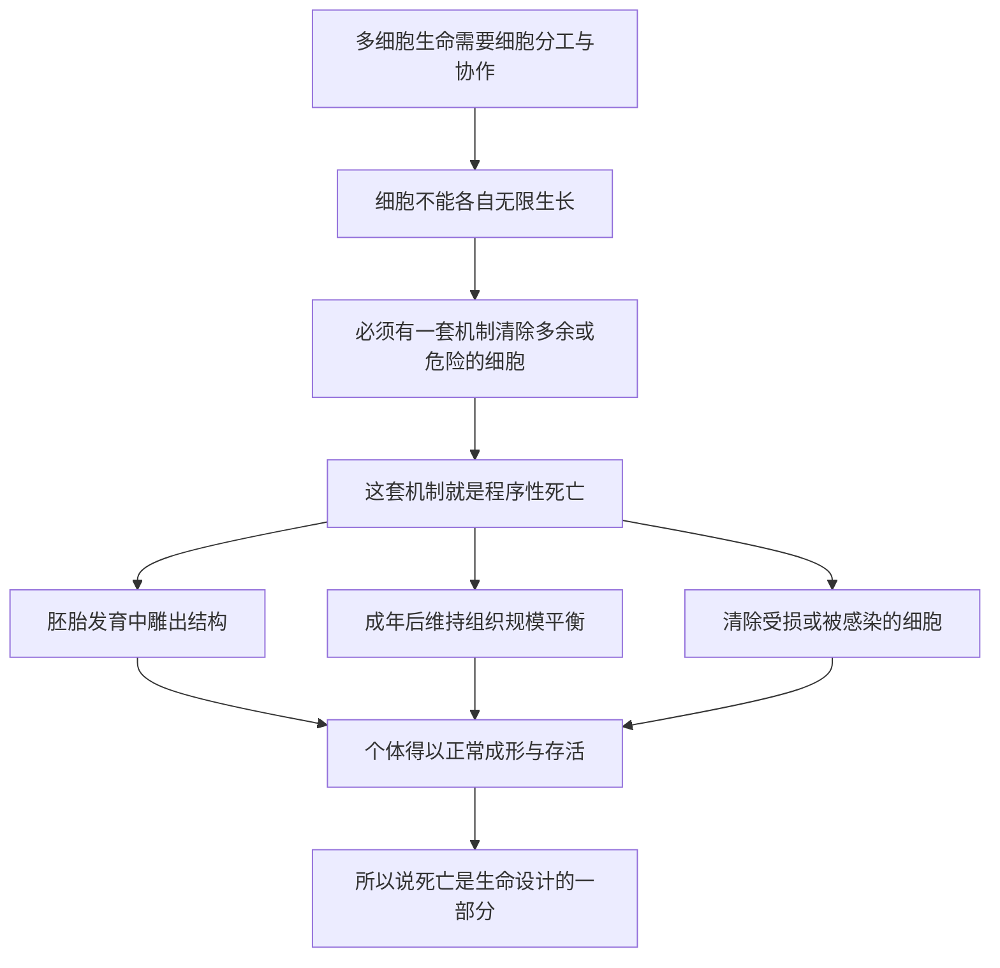

# 06｜细胞为什么会主动「赴死」？

> 如果死亡看起来是生命最大的敌人，为什么细胞反而会设计出一套主动去死的机制？

---

## 一、先说结论

穆克吉想让我们接受一个反直觉的事实：**细胞并不只是被动地活着、等着坏掉，它还会在收到特定信号时，主动地、有序地把自己拆解掉。** 这种死亡叫「程序性死亡」，最常被称作「凋亡」（apoptosis）。

它不是意外，不是故障，而是生命自带的程序。正是靠这套程序，胚胎才能长出手指、组织才能维持平衡、受损或危险的细胞才能被及时清走。

所以对穆克吉来说，**死亡不是生命的对立面，而是生命设计的一部分**——不会死的细胞世界，反而活不下去。

---

## 二、我们先理解一个问题

上一篇我们看了细胞内部，那里像一座分工严密的小城：有控制中心、有发电厂、有生产线、有物流系统。

可只要想一想真实的世界就会发现：任何一座运转中的城市，都不可能只有建设和扩张。旧楼要拆，设备要报废，不合格的工人要被清退。一个只会"增加"、从不"减少"的系统，很快就会撑爆自己。

于是问题来了：

> **如果细胞只会活、只会分裂，从不主动退场，身体会变成什么样？**

这个问题看起来很小，但它其实关系到"多细胞生命"能不能成立——也就不只是细胞的事，而是我们能不能作为一个人存在的事。

---

## 三、作者到底提出了什么观点？

穆克吉在书中反复强调：**细胞死亡的主动权，握在细胞自己手里。**

这里的"主动"不是修辞。它意味着细胞体内本来就装着一套随时可以启动的"自我拆解程序"。当外部的信号（或者细胞内部的损伤监测）触发它，细胞会按部就班地把自己收缩、切割、打包，最后变成一堆可以被邻居安静吞掉的小碎片，而不是爆裂开来、把内容物泼得四处都是。

需要区分两种说法：

- **穆克吉的观点**：这种"主动死亡"是生命的设计，而不是生命的失败。它和生长、分裂一样，是正常的生命活动。
- **生物学界的共识**：细胞死亡确实存在多种形式，其中有一类是由细胞自身程序驱动的。据记载，「凋亡」这个词大约在二十世纪七十年代初由研究者提出，后来才逐渐成为一门显学。至于这套程序具体由哪些基因执行，主要线索来自对一种叫线虫（学名秀丽隐杆线虫）的小生物的研究；据记载，正是这些工作让几位科学家获得了 2002 年的诺贝尔生理学或医学奖。

换句话说，穆克吉讲的是一个观念，而科学家们补上的是这套观念的分子证据。

---

## 四、把这个观点翻译成人话

我们习惯把"死"理解成"坏掉"。

但在细胞的世界里，"死"有两种很不一样的版本。

第一种是**意外死亡**。比如细胞被烫伤、被毒死、缺氧到撑不住，它会膨胀、破裂，把里面的东西全倒出来。周围的细胞被这些内容物刺激，会引发炎症——就像一栋楼突然倒塌，砸坏了邻居，还扬起满街灰尘。

第二种是**主动死亡**。细胞收到指令后，安安静静地把自己拆成小块，外面还包好"包装袋"，等着旁边的细胞来收走，整个过程干干净净，不惊动任何人。

打个比方：**前者是楼房炸塌，后者是有组织的拆迁。**

穆克吉想说的就是——身体里每天上演的，绝大多数是后者。不是出了事故，而是按计划在拆除。

---

## 五、为什么会这样？

把这条逻辑理清楚，其实是一个"为什么多细胞生命必须允许个体去死"的推理链：

这条链里最关键的一步是 **B**。

多细胞生命的本质，是无数细胞放弃"各自为政"，换取"整体存活"。既然要协作，就必须有规则：谁该长、谁该停、谁该走，都要有人管。而"谁该走"这一条，靠的正是程序性死亡。

如果每个细胞都只想着活下去，那么胚胎会长成一团没有形状的肉球，组织会不断堆积，受损细胞会赖着不走——个体反而活不成。**个体的"死"，是为了整体的"生"。**

---

## 六、举一个现实生活中的例子

想想雕塑家。

一尊大理石雕像，不是"加上去"的，而是"减出来"的。雕塑家拿到一块石头，真正的工作是凿掉那些不属于雕像的部分。最终呈现在你面前的手指、衣褶、面容，本质上都是"被删掉的材料留下的形状"。

如果雕塑家不忍心凿、不敢删，只想不断往上贴泥，他得到的只会是一块越来越大的疙瘩。

**胚胎发育也是这样。** 据研究，人类胚胎早期的手指之间本来是连着一层组织的，后来正是靠细胞主动死亡，把这层"多余的料"一点点凿掉，手指才彼此分开。如果这套程序不工作，手指就会被"蹼"连在一起。

所以"死"在这里不是事故，而是雕刻的凿子。

---

## 七、回到书中重新理解

现在再回看穆克吉为什么把细胞死亡单列一章来讲，就清楚了。

前面讲的是细胞"如何活着"——结构、能量、分裂。这一篇补上的是另一半：细胞"如何退场"。这两半合起来，才是完整的生命图景。

穆克吉其实是在拆掉我们头脑里一个根深蒂固的假设：**活着就是好的，死就是坏的。** 在细胞层面，这个假设不成立。一个不会主动死亡的细胞，往往恰恰是最危险的——它拒绝退场、无限增殖，正是后面要讲的癌症的核心特征之一。

也就是说，穆克吉讲的不是"死亡也可以是好事"这种安慰话，而是一个更硬的结构性判断：**秩序的维持，依赖定期的、有计划的删除。**

---

## 八、这个观点背后还有什么？

这里藏着一个更深的判断：**"个体愿意去死"，是复杂生命得以存在的前提。**

单细胞生物不必面对这个难题——它自己就是一个完整生命，死了就是死了，没有"整体"需要顾全。可多细胞生命不一样。它要成为"一个"生物，就必须让几十万亿个细胞承认：我不是终点，整体才是。

这就带来一个耐人寻味的张力：

- 从细胞的视角看，活着、分裂、扩张是本能；
- 从身体的视角看，某些细胞必须按时死掉才对。

**这两套逻辑天然冲突。** 身体靠信号、靠规则，把细胞的"自私本能"压住。而一旦压制失效，细胞就会退回单细胞式的活法——这正是后面讲癌症时的伏笔。

所以这一篇看似在讲"死"，其实也在为理解"失控"打地基。

---

## 九、这个观点有问题吗？

有几处需要留心。

第一，**"程序性死亡"和"凋亡"并不是完全等同的词。** 后来研究者发现，细胞还有很多种不同的死亡方式，有的带程序、有的更像意外，彼此之间的边界并不总是清晰。把"细胞主动死"一律叫作凋亡，是一种简化。

第二，**"主动死亡总是好事"也不对。** 程序性死亡如果过度启动，同样会造成伤害。例如在某些神经退行性疾病里，被怀疑存在的问题恰恰是细胞死得太多，而不是太少。同一套机制，在发育时是雕刻刀，在别的情境下可能变成一把伤人的刀。

第三，**关于"凋亡"这个概念的适用范围，学界仍有讨论。** 从线虫这种结构简单的生物里找到的基因机制，能不能原样推广到人类，是需要一步步验证的，而不是自动成立。

所以更稳妥的说法是：**穆克吉指出了一个大方向——死亡可以是设计的一部分；但"什么情况下该活、什么情况下该死"的具体边界，仍然是活跃的研究领域。**

---

## 十、今天再看这个观点

（以下为现代延伸，非穆克吉原文）

在穆克吉的框架之外，程序性死亡已经成为现代医学里一个重要的抓手。

一个最直接的应用方向是**癌症**。既然正常细胞会"按时死"，那么癌细胞的一项重要本领，就是设法躲开死亡指令、赖着不走。于是有研究者反过来思考：能不能想办法让癌细胞重新"听话地去死"？这成了不少抗癌药物的思路来源。

另一个方向是**保护不该死的细胞**。如果某些疾病是细胞死得太多造成的，那么研究"如何拦住死亡信号"，就成了一类保护性治疗的入口。

再往深一层，今天的生物学已经不再把细胞死亡看成单一事件，而是画出了一张由多种死亡方式组成的地图，并研究它们之间如何相互转化、如何被药物干预。

底层判断没有变：**死亡不是生命的故障，而是生命必须管理的一项功能。** 现代研究做的，是把"该谁死、什么时候死、怎么死"这件事，一条一条查清楚。

---

## 十一、这一篇真正应该记住什么？

1. **细胞会主动去死。** 它能在特定信号下有序地拆解自己，这种程序性死亡（凋亡）是正常的生命活动，不是故障。

2. **死亡是设计的一部分。** 没有主动删除，多细胞生命根本无法成形和维持，个体会被自己的细胞撑垮。

3. **它塑造了身体。** 胚胎靠它雕出手指，成年后靠它平衡组织规模、清除受损和被感染的细胞。

4. **有序死亡与意外死亡不同。** 前者安静、可控，不引发破坏；后者爆裂、混乱，会伤害周围组织。

5. **同一机制可以两面。** 死亡太多和死亡太少都会致病，它是一把需要被精确管理的刀。

---

## 十二、留一个问题

我们已经知道，细胞会按程序去死，而执行这套程序需要能量、需要信号、需要一整套内部协作。

这就引出一个更奇怪的问题：

> **细胞体内负责"供能"的那些结构，为什么自己带着一小份 DNA？**

它不像细胞核那样装着全套说明书，却偏偏有自己的遗传物质，还有自己的膜。一个细胞内部，为什么会出现一个"半独立"的房客？

下一篇，我们来看看生命史上最不可思议的一次合作——**线粒体，原来可能是一种细菌**。
