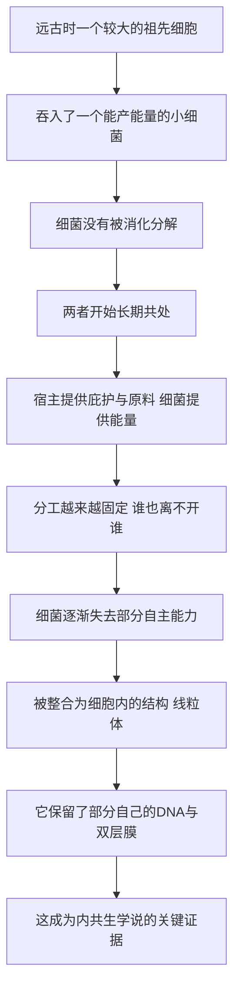

# 07｜线粒体原来是一种细菌？——内共生

> 一个细胞内部，为什么会住着一个「半独立」的结构，还带着自己的 DNA？

---

## 一、先说结论

穆克吉讲述的这一次发现，挑战了我们对"个体"的想象：**细胞里负责供能的线粒体，很可能原本是一种能独立生存的细菌。**

按照内共生学说，很久以前，一个较大的祖先细胞把一个小细菌"吞"了进来，却没有把它消化掉，反而和它长期共处。日子一久，双方形成分工：细菌负责产出能量，宿主细胞提供保护和原料。这场"收编"，最终把细菌变成了细胞的一部分——线粒体。植物的叶绿体，一般认为也来自类似的过程。

所以穆克吉真正想让我们看到的是：**细胞不一定是"一个"东西，它本身可能来自一场联合。**

---

## 二、我们先理解一个问题

上一篇讲的是细胞会主动去死。这一篇，我们要看一个更古怪的现象。

学过一点生物的人多半记得：细胞里的线粒体是"发电厂"。可如果把它拿到显微镜下细看，会发现几件说不通的事：

- 它有一层自己的膜，而且结构特殊；
- 它体内竟然有自己的遗传物质，形状和细菌的更像，而不是和细胞核的一样；
- 它可以自己分裂，不完全听细胞核的指挥。

这就好比检查一座大楼时发现，某个部门的办公室里放的是一套独立的账本，财务系统自己走自己的流程，还贴着别的公司的标签。

于是问题就出现了：

> **如果线粒体是细胞"自己长出来"的器官，它为什么处处透着"外来户"的特征？**

---

## 三、作者到底提出了什么观点？

穆克吉介绍的，是生物学史上一场著名观念的胜利：**内共生学说。**

它的主张可以概括成一句话：**线粒体（以及植物细胞的叶绿体）不是凭空进化出来的，而是被"吞并"的细菌。**

需要严格区分两种说法：

- **穆克吉的叙述与内共生学说的核心主张**：细胞内部某些带膜、带自己 DNA 的结构，来自一次古老的共生事件。
- **生物学界目前的共识**：内共生说已经被广泛接受为解释线粒体和叶绿体起源的主流框架，至于"具体是哪一类细菌、在什么时间、以什么方式被吞入"，学界仍有大量细节讨论。

据记载，内共生学说由美国生物学家琳恩·马古利斯在二十世纪六十年代前后系统提出。她当时的遭遇并不风光——有记载说，她的论文屡次被拒，观点一度被同行嘲笑。这也提醒我们：**一个后来被普遍接受的学说，最初很可能是少数派。**

---

## 四、把这个观点翻译成人话

我们可以把它想成一段"合住"的故事。

假设有一户人家，家里宽敞、安全，能挡风遮雨。有一天来了一个外人，个子小，但有一门手艺——特别会发电、特别会干活。这户人家本来是想把他赶走甚至吃掉，但不知什么原因没下手，结果这个人就留了下来，住在偏房里。

日子一长，双方发现：**一起过比分开过更划算。** 外来者有了稳定的庇护和食物，主人家有了源源不断的能量。于是他不再是"客人"，也不再是"仆人"，而是家庭的一员。

神奇的是，他搬进来之后再也没搬出去，以至于后来分家的时候，他的后代也一并传了下去。

但请注意：**这位家庭成员并没有完全交出自己的一切。** 他仍然保留着自己的小账本（自己的 DNA），保留着自己的一些习惯（自己的膜和分裂方式）。

线粒体的处境就是这样：它是细胞的一部分，却处处留着"独立祖先"的痕迹。

---

## 五、为什么会这样？

这场"合住"能成功，有一条可以被复述的推理链：

这条链里最关键的一环是 **F**：**共生必须"绑"得足够深，深到谁也离不开谁，才可能变成永久的一部分。**

如果只是偶尔互惠，那叫暂时的合作关系；只有当双方把彼此纳入自身存续的条件，这场联合才会稳定到可以被遗传、被继承。

而今天留下的那些"不协调"的证据——自己的 DNA、特殊的双层膜——恰恰是这次古老并购的**历史遗迹**。就像老房子保留的一面旧墙，说明它曾经是两栋分开的房子。

---

## 六、举一个现实生活中的例子

想一想两家小厂合并的过程。

一开始，它们各自有老板、有账本、有车间。合并之后，为了效率，很多资源会统一调度：共用一套管理、共享一条供应链、共用一个品牌。慢慢地，你几乎分不清哪台设备原本属于谁。

但总会留下一些痕迹。比如某个车间仍在使用自己那套旧账本、旧编码，上级管理系统并不完全覆盖它；比如老员工依旧按老厂的规矩办事。这些"不协调"不是故障，而是合并留下的历史证据。

线粒体就是这样一个"被合并进来的车间"：**它已经被整合，但没有被完全抹平。**

换一个更温情的比喻：一个寄居在你家的远亲，住着住着成了家人。你们同吃一桌饭、共享一个屋檐，可他还是会在某些事情上，保留自己那点私房钱和老习惯。

---

## 七、回到书中重新理解

现在再回看穆克吉为什么要专门讲内共生，就明白了。

前面几篇都在建立"细胞是生命的砖块"这个印象。内共生讲的却是：**这块"砖"自己，也是多块砖拼起来的。**

这是对"个体"概念的一次松动。我们习惯把生物想成边界清晰的独立单位——我是一个人，细胞是一个细胞。但内共生学说告诉我们，**合作可以深到把合作者变成自身的一部分**。

穆克吉把它放在结构与能量这一段，正是要提醒读者：细胞不是简单堆积的零件箱，它有历史、有来历、有"被收编的过去"。理解这一点，后面才能理解为什么细胞内部的运作如此精巧，也如此脆弱。

---

## 八、这个观点背后还有什么？

这里藏着一个比线粒体更大的判断：**生命的复杂，很大一部分来自"合并"，而不是"发明"。**

我们容易默认进化是缓慢累积、层层叠加的过程——先有小零件，再有更大的零件。但内共生提示了另一条路：**直接把另一个生命体"纳入"自身，让它成为自己的器官。**

这条路的意义在于：它跳过了一步步重新发明的时间，直接用一次合作，换来了巨大的能力跃迁。有研究认为，正是这一步，为后来复杂生命（包括我们）的出现提供了足够的能量基础。

它还悄悄改变了"我们是谁"的定义。如果我的每个细胞里都住着一种古老细菌的后代，那么"我"从来就不是一个纯粹单一的个体，而更像一个**由多方组成的联合体**。

---

## 九、这个观点有问题吗？

有几处需要留心。

第一，**学说的核心被接受，不等于所有细节都已解决。** "线粒体来自被吞入的细菌"这一点目前是主流看法，但具体是"先吞进来、后建立共生"，还是别的方式，仍有不同解释。把一张大框架当成完整的施工图，是一种拔高。

第二，**内共生学说的解释范围是有限的。** 它主要用来说明线粒体和叶绿体这类"带自己 DNA 的结构"的起源，并不意味着细胞里所有结构都来自这种合并。把它无限推广到"整个细胞都是拼出来的"，就超出了它本来的主张。

第三，**最初的激烈反对本身也是这段历史的一部分。** 马古利斯的观点长期受冷遇，直到更多证据累积才被广泛接受。这既说明科学界会犯错，也提醒我们：**今天被质疑的新想法，未必一定错；今天被接受的共识，也并非从无争议。** 更有意思的是，学界对"细节如何"的争论，至今并未完全停止。

---

## 十、今天再看这个观点

（以下为现代延伸，非穆克吉原文）

在内共生学说之后，这段"细胞里的外来户"故事，已经长出了许多现实分支。

一个方向是**追溯血缘**。由于线粒体的 DNA 只沿母系传递，研究者可以通过比较不同人群的线粒体 DNA，去推测人类共同的母系祖先与迁徙路线。这条线索已经成为研究人类起源的常用工具之一。

另一个方向是**疾病与治疗**。线粒体有自己的 DNA，就意味着它也可能带着自己的缺陷。有些疾病被认为与线粒体功能异常有关。近年来，有研究尝试通过"替换"有缺陷的线粒体来帮助特定患者，这也引发了新的伦理讨论——因为它牵涉到会传给后代的改变。

还有一个方向是**重新理解衰老与能量**。线粒体作为供能核心，它与身体机能衰退之间的关系，一直是活跃的研究领域。

这些应用已经不完全是穆克吉书中的内容，但它们都站在同一个观念的延长线上：**细胞内部的"房客"，深刻地影响着我们的健康与来历。**

---

## 十一、这一篇真正应该记住什么？

1. **线粒体可能曾是细菌。** 内共生学说认为，它是被祖先细胞收编的独立生命，而不是凭空长出的器官。

2. **合作可以深到融为一体。** 共生持续得足够久、绑得足够紧，就会变成自身的一部分，甚至被遗传下去。

3. **证据藏在"不协调"里。** 它有自己的环状 DNA、特殊的双层膜，这些"外来户痕迹"正是学说的关键支持。

4. **共识不等于没有争议。** 核心框架已被广泛接受，但具体过程与范围，学界仍有讨论，且它最初曾长期被排斥。

5. **"我"是一个联合体。** 每个细胞里都住着古老合作者的后代，个体的边界比我们想象的更松。

---

## 十二、留一个问题

我们已经看到，细胞可以来自一场联合，也可以主动安排自己的死亡。它既会合作，也会退场。

那么，真正让穆克吉着迷的那个谜题就来了：

> **一个受精卵，只有一个细胞、一套 DNA。它究竟是怎样变成几十万亿个细胞的？**

更奇怪的是，皮肤细胞、神经细胞、心肌细胞，看起来毫不相干，体内那套 DNA 却几乎一模一样。**同一份说明书，怎么可能造出这么多完全不同的角色？**

下一篇，我们进入全书真正的枢纽——**从一到万亿：细胞的分化与表观遗传。**
