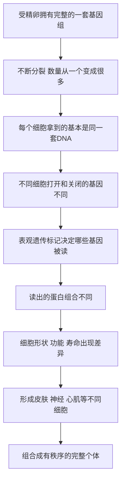

# 08｜一个受精卵，如何长成几十万亿个细胞？

> 同一个基因组，怎么可能造出皮肤、神经、肌肉这些完全不同的细胞？

---

## 一、先说结论

穆克吉把这一篇放在全书的枢纽位置，因为它回答的是"一个细胞如何成为一个人"。

答案的骨架是这样的：**一个受精卵通过不断分裂，数量从一变成几十万亿；但在数量增长的同时，真正的魔法是"分化"——细胞开始各司其职，变成皮肤、神经、心肌、血液。**

关键在于：这些细胞携带的 DNA 几乎完全相同。它们的差别不在于"有没有某段基因"，而在于**哪一段基因被打开、哪一段被关上**。

所以穆克吉的判断是：**生命的丰富，不是来自不同的说明书，而是来自同一份说明书的不同读法。**

---

## 二、我们先理解一个问题

前面几篇讲的，都是"一个细胞内部怎么运转"。这一篇要面对的，是数量与种类的双重跃迁。

一个受精卵，只是一个细胞。可成年人大约有**数十万亿**个细胞（不同来源的估算不完全一致，用约数比较稳妥），种类也有几百种之多。它们形状不同、寿命不同、工作不同：神经细胞负责传递信号，心肌细胞负责规律跳动，免疫细胞负责巡逻，肠道细胞负责吸收。

这里藏着一个极其刺眼的事实。科学家早就发现，**一个皮肤细胞和一个神经细胞，里面装的 DNA 几乎是同一套。** 它们不是拥有不同的基因，而是拥有同样的基因。

那么问题就变得尖锐了：

> **如果每个细胞拿到的都是同一本说明书，为什么最后长出来的，是完全不同的东西？**

这不是一个细节问题，而是整个发育生物学的核心谜题。

---

## 三、作者到底提出了什么观点？

穆克吉给出的核心观点可以概括为一句话：**细胞分化的关键，不是基因的"有无"，而是基因的"开与关"。**

他讲的其实是一层新的调控。传统印象里，基因像一串固定的指令，写在 DNA 里就定了。但穆克吉提醒我们：**写在书上的字，和实际读出来的内容，是两回事。**

- **穆克吉的框架**：同一个基因组，可以在不同细胞里被"读"出不同的结果；决定读法的，是基因表达层面的调控。
- **生物学界普遍认为**：细胞分化确实主要来自基因表达的差异，而不是基因组内容的差异。这种在 DNA 序列之外、却能影响基因开闭的调控，通常被归到"表观遗传"这个大类里，例如 DNA 甲基化、组蛋白修饰等机制。
- **仍在研究中的部分**：具体哪些标记、按什么顺序、如何稳定地"锁住"一个细胞的命运，仍有大量细节在争论中。

也就是说，"同一份说明书、不同读法"这个比喻，是理解分化的入口，而不是全部答案。

---

## 四、把这个观点翻译成人话

最贴切的类比，是**同一份乐谱，交给不同的乐器演奏**。

一份交响乐的总谱是固定的。可当它落到小提琴手里，出来的是高亢的旋律；落到大提琴手里，出来的是低沉的声部；落到定音鼓手里，出来的是节奏的骨架。乐谱一个字都没改，但听感完全不同。

细胞也是这样。**同一套 DNA 就是那份总谱，而"哪些段落被演奏、哪些段落被静音"，决定了这个细胞最终成为谁。**

另一个同样贴切的比方是**同一个剧本，交给不同的演员**。台词完全一样，但有人演成悲剧，有人演成喜剧，有人成了主角，有人成了背景。剧本没变，角色变了。

而"表观遗传"，可以理解成乐谱上的**铅笔标记**——哪一段要大声演奏，哪一段要轻轻带过。这些标记不改变乐谱本身，却实实在在地决定了每一次演奏的效果，而且能被传递下去。

---

## 五、为什么会这样？

从"一个细胞"到"几十万亿个细胞"，这条链条可以这样拆：

这条链里最关键的一环是 **D 与 E**：**数量增长只是"复制"，真正的"创造"发生在基因的开与关之间。**

为什么必须这样设计？因为如果每个细胞真的需要一套不同的 DNA，那么身体就无法从一个受精卵出发——卵子里只能装一套说明书。**共用一套基因组、靠"读法"分化，是唯一能让"一"变成"多"的办法。**

这也带来一个额外好处：这套读法是可逆的。后来的克隆和重编程技术之所以可能，正是因为分化细胞的基因组并没有丢，只是被"锁"上了。把锁打开，它就能重新变成别的细胞。

---

## 六、举一个现实生活中的例子

想想一支交响乐团。

同一个乐团、同一份总谱，在不同声部手里呈现出完全不同的东西。小提琴手只演奏自己的那几行，长笛手只演奏自己的那几行，没有一个人演奏"全部"。可当所有声部合在一起，得到的是一首完整的曲子。

现在假设乐团里有一位乐手出了状况——他本来该演奏低音，却把自己的谱子当成主旋律，抢着大声演奏。结果整首曲子就乱了。

**身体的秩序，靠的正是每个细胞"只读自己该读的那几行"。** 该开的时候开，该关的时候关。而"关"这件事，和上一篇讲的"主动死亡"一样，都是秩序的一部分。

细胞分化之所以了不起，不在于它让细胞变得多，而在于它让这些细胞**自愿只做一部分事**。

---

## 七、回到书中重新理解

现在再回看穆克吉为什么把这一篇当作枢纽，就明白了。

前面几篇讲的是"一个细胞"。这一篇开始讲"很多细胞如何组成一个人"。从这一篇往后，免疫、神经、干细胞、再生，全都建立在这个前提上——**身体里的每个细胞，都是同一套基因的不同读法。**

穆克吉讲分化，其实是在铺一条更长的路：

- 如果分化靠的是"读法"，那么读法就可能被改写——这通向后面的重编程与干细胞；
- 如果所有细胞共享基因组，那么一个已经分化的细胞理论上可以被"重置"——这通向克隆；
- 如果分化出的角色会出错，那么某些疾病就可以被理解为"读法出了问题"。

所以这一篇不只是讲发育，它是在为整本书后面的治疗与改造，提供最根本的合法性。

---

## 八、这个观点背后还有什么？

这里藏着两个更深的判断。

第一个是：**"身份"不是写死在基因里的，而是"读取状态"的产物。** 皮肤细胞之所以是皮肤细胞，不是因为它拥有一段"皮肤基因"，而是因为它运行着一套皮肤式的基因读取程序。身份是一种动态维持的状态，需要不断被打字、被加固。

第二个是：**这种"读取状态"会被环境和社会线索影响。** 一个细胞选择读哪几行，往往取决于它在什么位置、邻居是谁、收到了什么信号。这就自然把我们推向下一篇——**细胞之间如何"对话"**。

换句话说，分化不是每个细胞关起门来自己决定的，而是在一张信号网络里协商出来的。没有邻居，细胞甚至不知道自己该成为什么。

---

## 九、这个观点有问题吗？

有几处需要留心。

第一，**"同一份说明书"这个比喻虽然好用，但有代价。** 它容易让人以为基因是一份"蓝图"，照着建就行。可真实的发育过程远没有那么线性——细胞的位置、力学、随机涨落、邻近细胞的信号，都会参与决定命运。把发育完全归给"基因读取"，会忽略这些因素。

第二，**表观遗传容易被过度宣传。** 它确实重要，但"表观遗传决定一切""你的生活方式会改写后代的基因表达并稳定遗传"这类说法，常常超出了现有证据。有些标记确实能传递，有些则会在重编程中被清除。把复杂研究简化成口号，是常见的问题。

第三，**"几十万亿"这个数字本身只是个约数。** 不同研究给出的估算差别不小，有的数更低，有的更高。这里重要的不是精确数字，而是"从一到极多"的尺度感。

第四，**"一个受精卵决定了一切"也可能过度简化。** 现代研究越来越强调，发育是基因、环境、机会共同作用的过程，并不意味着人生轨迹在受精那一刻就被完全写定。

---

## 十、今天再看这个观点

（以下为现代延伸，非穆克吉原文）

在穆克吉的框架之外，分化的研究已经走得很远。

一个方向是**单细胞技术**。过去我们只能测"一堆细胞的平均状态"，今天可以逐个看每个细胞在表达什么。结果发现，即使同一类细胞，彼此之间也有惊人的差异——"细胞类型"的边界比想象中更模糊。

另一个方向是**改写分化状态**。研究者已经证明，通过引入少数关键因子，可以人为地把成熟细胞"重置"回具有多种潜能的状态。这不再是理论，而是真实的实验事实，也正是后面要讲的干细胞技术的核心。

第三个方向是**用表观遗传解释疾病与衰老**。有人尝试用表观遗传标记的变化来估算"生物学年龄"，也有人开发针对这些标记的药物，用于特定疾病的治疗。这些应用仍处在发展中，效果与边界都需要时间检验。

底层判断没有变：**一个细胞成为谁，取决于它打开和关闭了哪些基因。** 现代研究做的，是把"读法如何被写定、又能否被改写"这件事，一层层打开。

---

## 十一、这一篇真正应该记住什么？

1. **从一到几十万亿。** 一个受精卵靠不断分裂扩大数量，成年人体内约有数十万亿个细胞。

2. **同一套基因组，不同的读法。** 皮肤、神经、心肌细胞的 DNA 几乎相同，区别在于哪些基因被打开、哪些被关闭。

3. **分化就是"只读自己该读的几行"。** 细胞自愿只做一部分事，整体才形成秩序。

4. **表观遗传是那支笔。** DNA 甲基化、组蛋白修饰等标记，负责写下和擦除"该读哪一段"的指示。

5. **读法是可改写的。** 因为它不改变基因组本身，所以分化状态理论上可以被重置，这是后续干细胞与克隆的基础。

---

## 十二、留一个问题

我们已经知道，细胞靠打开和关闭基因，各自成为不同的角色。可这里还有一个关键问题被跳过了：

> **一个细胞，怎么知道自己在身体里的什么位置、该扮演哪个角色？**

它没有眼睛，看不见邻居；没有耳朵，听不到指令。可它偏偏能在正确的时间，做出正确的选择：该长的长，该迁移的迁移，该停的停。

这背后，一定存在某种"交流"。那么——

**细胞之间，究竟是如何"对话"的？** 它们用什么发消息，又靠什么收消息？下一节，我们就来拆解这套看不见的通信系统。
