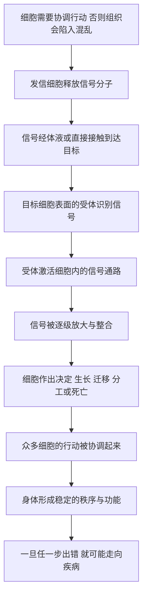

# 09｜细胞之间如何「对话」？

> 一个细胞没有眼睛也没有耳朵，它怎么知道旁边发生了什么，并做出正确的反应？

---

## 一、先说结论

穆克吉想让我们把视线从"单个细胞"挪到"细胞之间"：**细胞不是孤岛，它们一直在互相发消息。**

它们通过信号分子（例如激素、神经递质）把信息发出去，靠细胞表面的受体把信息收进来，再经由细胞内部的信号通路层层传递，最后决定自己的行为——长还是停、走还是留、活着还是死去。

**身体的秩序，来自这场持续不断的"交谈"。** 一旦沟通失灵，秩序就会崩塌；穆克吉认为，很多疾病——包括癌症——都可以从"通信出了问题"这个角度去理解。

---

## 二、我们先理解一个问题

上一篇讲分化时，我们已经碰到一个说不通的地方：细胞怎么知道自己该变成谁？

一个神经细胞在胚胎里该往哪里长、一个免疫细胞该去哪里巡逻、一个伤口旁的细胞该在什么时候停止分裂——这些决定都依赖信息。可细胞没有感官，它看不见、听不到、闻不着。

更麻烦的是，身体有几十万亿个细胞。如果每一个都各行其是，结果不会是一个生命，而是一团混乱。

于是我们的问题就是：

> **在没有中央指挥、没有感官的情况下，几十万亿个细胞靠什么协调出如此精密的秩序？**

答案听起来很朴素——**靠不停地互相通知。** 但要把这件事讲清楚，需要理解"消息是怎么发、怎么收、怎么被读懂的"。

---

## 三、作者到底提出了什么观点？

穆克吉的核心观点是：**细胞是有"社会性"的。**

具体来说，他讲的是三层结构：

1. **发信**：细胞会释放信号分子，把信息送出去；
2. **收信**：目标细胞的表面有专门识别这些分子的受体，就像门上的锁；
3. **转达与执行**：受体接住信号后，会在细胞内部引发一连串反应（常被称为信号转导或信号通路），最终改变细胞的行为。

需要区分：

- **穆克吉的框架**：细胞通过信号与受体构成一张通信网络，身体秩序建立在这张网络之上，疾病往往意味着网络出错。
- **生物学界普遍认为**：激素、神经递质等确实是重要的信号分子；细胞表面受体识别信号并激活胞内通路，是细胞生物学的基本机制；许多疾病（包括癌症）确实与这些通路的异常有关。
- **仍在研究中的部分**：同一条通路在不同细胞、不同情境下究竟如何被解读，信息如何被整合而非简单叠加，仍是活跃的研究领域。

换句话说，"细胞会对话"是一个准确的框架，但把它理解成"细胞像人一样有心意地交谈"，就滑向了比喻的陷阱。

---

## 四、把这个观点翻译成人话

最好懂的一套类比，是**快递物流系统**。

想象你要给远方的朋友寄一份重要文件。整个过程至少要三步：

- **发件**：你把文件打包，写上信息，交给快递；
- **运输**：包裹在路上移动，可能经过好几个中转站；
- **收件**：朋友家的门牌号和身份被核对，确认无误后签收，然后他才开始按文件内容行动。

细胞通信几乎一一对应：

- **信号分子就是包裹**，带着"内容"被释放出去；
- **血液或组织液就是运输网络**，把包裹送到各处；
- **受体就是门牌和签收系统**，只有形状匹配的细胞才能接住这份包裹；
- **细胞内部的信号通路就是朋友读完文件后的一连串动作**——他可能去开会、去取钱、去通知别人。

这套系统有一个关键特点：**包裹上写的是"给谁"，而不是"给所有人"。** 有受体的细胞才收得到，没受体的细胞即使包裹从旁边飘过也毫无反应。这就是为什么同一种激素能作用在某些器官上，却对另一些器官毫无影响。

---

## 五、为什么会这样？

从"细胞各自为政"到"身体形成秩序"，这条链条可以这样拆：

这条链里最关键的一环是 **D 与 E**：**"识别"决定了谁能收到消息，"转达"决定了消息会变成什么行动。**

为什么必须这么复杂？因为身体不能靠一个中央指挥部逐条下令——那样信息量会爆炸，速度也跟不上。**分布式通信**让每个细胞只需处理自己周围的信息，就能作出局部正确的决定，整体秩序于是"涌现"出来。

而这也正是它脆弱的地方。通信系统的每一个环节——信号发错、受体失灵、通路被劫持——都可能让局部决定变错，并且错误会在网络中扩散。

---

## 六、举一个现实生活中的例子

想一想公司里的内部邮件。

一家大公司不可能让老板每天给每个员工单独下指令。它依靠一套机制：项目组发出通知，通过系统分发；每个员工有权限、有邮箱、有职责，只能收到与自己相关的部分，并按照职责去执行。

这里有几个细节非常像细胞：

- **权限就是受体。** 没有权限的人，即使邮件群发到了，也读不到、办不了。
- **部门转发就是信号通路。** 一条通知从总部到项目组、再到个人，中间要经过好几层转达和确认。
- **越级或拦截会造成混乱。** 如果某个部门私自转发、伪造通知，或者干脆屏蔽了关键邮件，全公司就会步调不一。

**身体里的疾病，很多就长这样。** 比如某条本该只说"停止生长"的通知被无视了，或者某个部门伪造了"继续生长"的通知——这正是癌症常被描述的样子：通信系统被劫持，细胞开始按错误指令行事。

---

## 七、回到书中重新理解

现在再回看穆克吉为什么把"细胞通信"单列一篇，就明白了。

分化那篇留下了一个缺口：细胞怎么知道该成为谁？这一篇补上了答案——**答案不在单个细胞里，而在细胞之间。**

这代表着一种视角的转变。前面几篇都在看"细胞内部"，这一篇开始看"细胞之间"。穆克吉用这一篇告诉我们：**理解身体，不能只看零件，还要看零件之间的连线。**

更重要的是，这条线索贯穿了整本书。免疫细胞怎么知道该攻击谁（下一篇）、干细胞怎么知道该修复哪里、癌细胞怎么骗过周围环境——全都建立在"通信"之上。可以说，**通信是细胞社会的通用语言，也是理解几乎所有疾病的一把钥匙。**

---

## 八、这个观点背后还有什么？

这里藏着一个很深的判断：**秩序不是被"设计"出来的，而是被"协商"出来的。**

我们习惯想象身体有一个总指挥，像大脑指挥全身那样。但穆克吉描述的画面更接近一个**没有中心的自组织系统**：没有一个细胞知道全局，每个细胞只知道自己收到的那点信息，可整体却呈现出惊人的协调。

这带来两个推论。

第一，**"聪明"可以来自简单的规则与大量的互动。** 单个细胞并不聪明，但无数细胞按简单规则互相通知，就能涌现出复杂行为。这一点和很多复杂系统——市场、生态、蚁群——都有相似之处。

第二，**通信失灵往往比零件损坏更难修复。** 一个零件坏了，可以换；一条消息传错了，或一套规则被悄悄改写，却会影响一大片细胞，而且很难一眼看出问题出在哪。这解释了为什么很多疾病难以归因。

---

## 九、这个观点有问题吗？

有几处需要留心。

第一，**"对话"是一个比喻，用得过头会骗人。** 细胞没有意图、没有心意，它只是在化学规律的驱动下作出反应。说细胞"商量""决定"，读者容易误以为背后有一个微型大脑。比喻帮助理解，但不能替代机制。

第二，**同一个信号，在不同细胞里可能意味着完全不同的事。** 一种信号分子对 A 细胞可能是"生长"，对 B 细胞可能是"死亡"。所以"信号=命令"这种一对一的理解，是过度简化。信号的意义取决于**谁在听、在什么场合听**。

第三，**信号网络极其复杂，通路之间大量交叉。** 研究发现，不同通路常常互相影响、互相补偿，因此很难说"某个行为由某一条通路唯一决定"。这也让"靶向某条通路就能治好某种病"的想法，在实践中经常遇到挫折。

第四，**"癌症是通信被劫持"是有解释力的框架，但不是全部。** 基因突变、代谢改变、免疫逃逸等许多机制同样关键。把疾病全归到"通信问题"，只是众多视角之一。

---

## 十、今天再看这个观点

（以下为现代延伸，非穆克吉原文）

在穆克吉的框架之外，细胞通信已经成为一个巨大的研究与产业方向。

一个方向是**把通信网络画出来**。随着单细胞测序和空间技术的发展，研究者可以逐个细胞地测量它们表达哪些信号分子、哪些受体，再推断"谁在和谁说话"。这让我们第一次有条件系统性地绘制身体内部的通信地图。

另一个方向是**直接干预通信**。许多现代药物，本质上都是在"改消息"或"堵锁孔"：有的模仿信号分子，有的阻断受体，有的卡在通路中间的某一环。免疫治疗中的检查点抑制剂，也是通过松开免疫细胞身上的"刹车信号"来起作用。

第三个方向是**人工设计通信**。合成生物学尝试给细胞装上新的人工回路，让它们能感知特定信号并作出可预测的反应。这与后面要讲的工程化免疫细胞一脉相承。

底层判断没有变：**细胞的行为，取决于它收到了什么消息，以及它如何解读。** 现代研究做的，是把这张通信网越画越细，并学会在关键节点上"改写消息"。

---

## 十一、这一篇真正应该记住什么？

1. **细胞不是孤岛。** 它们持续地释放信号、接收信号，身体的秩序建立在这张通信网络之上。

2. **通信有三个环节。** 发信（信号分子）、收信（受体识别）、转达执行（胞内信号通路），缺一不可。

3. **识别决定一切。** 只有带相应受体的细胞才收得到消息，这解释了为什么同一种信号只作用于特定目标。

4. **秩序来自协商，而非中央指挥。** 每个细胞只处理局部信息，整体协调是大量简单互动的结果。

5. **疾病常是通信病。** 信号、受体、通路的任一处出错，都可能让细胞按错误指令行事，癌症就是典型例子。

---

## 十二、留一个问题

我们已经知道，细胞之间靠信号和受体互相通知。可这套系统还留下一个更尖锐的问题：

> **如果身体里每天都在传递各种信号，那么多细胞里面，谁来决定该对谁开火、该放过谁？**

身体里随时可能有病毒、细菌，也可能有出了问题的自身细胞。它们发出的大部分信号，和正常细胞并没有本质区别。可免疫系统偏偏能在大多数时候做到"该杀的杀、该留的留"。

它到底靠什么区分"自己人"和"入侵者"？而这套识别一旦认错，又会发生什么？

下一篇，我们来看身体里最像一支军队的系统——**免疫细胞，以及"自我"与"非我"的边界。**
