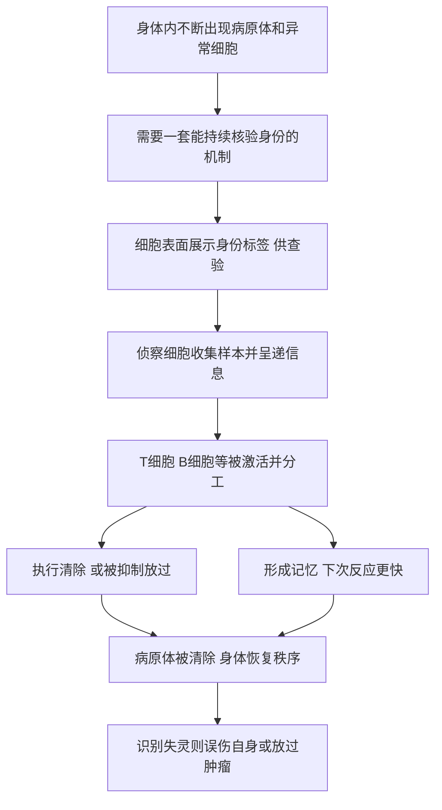

# 10｜免疫细胞如何分辨「自己人」和「入侵者」？

> 免疫系统如何在杀死入侵者的同时，不误伤自己的身体？

---

## 一、先说结论

穆克吉把免疫描述成一套**由细胞组成的识别与防御系统**。它的核心任务只有一句话：**区分"自我"与"非我"。**

身体里随时可能出现病毒、细菌，也随时可能出现出问题的自身细胞。免疫系统的绝大多数细胞（T 细胞、B 细胞、巨噬细胞、树突状细胞等）并不认识"敌人长什么样"，而是靠一套精密的身份核对机制，判断眼前的东西该不该被清除。

穆克吉强调：**这套识别一旦失灵，就会走向两个方向——要么误伤自己（自身免疫病），要么对危险视而不见（放过肿瘤）。** 而正因为免疫细胞有如此强大的识别能力，它今天也成了最有希望的一类抗癌武器。

---

## 二、我们先理解一个问题

上一篇讲了细胞之间如何通信。可通信带来一个新麻烦：**信息是开放共享的，那怎么保证不出错？**

想象一下，如果身体里的巡逻队只听"有可疑目标"这一句通知就行动，那它迟早会误伤正常细胞；如果它什么都不敢动，又会让真正的入侵者横行。更棘手的是，**肿瘤细胞原本就是"自己人"**——它们来自病人的身体，穿着和正常细胞几乎一样的外衣。

所以免疫系统面对的是一个极高难度的任务：

> **在几十万亿个细胞里，如何准确地找出该清除的那一小部分，同时不碰其他的？**

这不是"认不认识敌人"的问题，而是"如何在不停变化的世界里，持续地、可靠地核对身份"的问题。

---

## 三、作者到底提出了什么观点？

穆克吉的核心观点是：**免疫的本质，是一套建立在细胞之上的"身份识别"制度。**

他把这套制度讲成几个层次：

1. **有一支分工明确的细胞队伍**：T 细胞、B 细胞、巨噬细胞、树突状细胞等，各司其职，有的负责侦察，有的负责呈递信息，有的负责执行清除，有的负责记住敌人。
2. **识别依赖"身份标签"**：细胞会把内部的片段展示在表面，供免疫细胞查验。正常细胞展示的是"我是自己人"的信号，异常细胞展示的则可能触发攻击。
3. **识别需要被"教育"**：免疫细胞在发育过程中要经过筛选，学会不攻击自身，这被称为免疫耐受。

需要区分：

- **穆克吉的框架**：免疫是一套细胞层面的识别与防御系统，自我/非我的区分是其核心。
- **生物学界普遍认为**：T 细胞、B 细胞、巨噬细胞、树突状细胞确实是免疫系统的主要成员；树突状细胞由拉尔夫·斯坦曼发现，据记载他因此与其他几位科学家共同获得了 2011 年的诺贝尔生理学或医学奖；免疫系统对肿瘤存在"监视"作用，是免疫治疗的重要基础。
- **仍有争议的部分**：免疫究竟如何界定"自我"，是单靠"非我即敌"，还是同时依赖"危险信号"，学界长期存在不同模型。

也就是说，"区分自己人和入侵者"是一个好用的入口，但免疫系统的实际逻辑比"敌我二分"更微妙。

---

## 四、把这个观点翻译成人话

把它想成一个**边检站**。

每个入境的人都要出示证件。边检人员不看脸、不凭感觉，而是核对证件上的信息与系统记录是否匹配：匹配就放行，不匹配就拦下。这套流程之所以可靠，是因为它不依赖"这个人看着像不像坏人"，而依赖**可核验的身份信息**。

免疫系统几乎就是这样：

- **身份标签**：细胞表面展示的分子，相当于证件；
- **查验员**：T 细胞等免疫细胞，负责核对；
- **情报员**：树突状细胞把"嫌疑样本"带回去，交给免疫系统研究，相当于把可疑证件送去鉴定；
- **档案库**：B 细胞产生的抗体和记忆细胞，相当于把通缉名单长期保存，下次同类目标出现能迅速反应。

而免疫耐受，相当于边检系统事先拿到了一份"本国公民名单"。凡是名单上的，一律放行；这份名单不是天生就有的，而是系统在运行初期反复训练出来的。

---

## 五、为什么会这样？

从"识别"到"防御"，这条链条可以这样拆：

这条链里最关键的是 **C 与 D**：**身份必须被"展示出来"，才能被核验。**

为什么设计成这样？因为免疫细胞无法钻进每一个细胞内部去检查。既然如此，身体只能要求每个细胞把内部的样本"举到窗口前"，供巡逻队检查。这是一种"以展示换安全"的妥协——用一点信息暴露，换来整个系统的可监控。

而问题也恰恰出在这里：**任何能被展示、被识别的机制，也都有可能被欺骗。** 某些病原体会伪装证件，某些肿瘤会干脆把证件藏起来，让查验员无从下手。

---

## 六、举一个现实生活中的例子

想一想手机的门禁系统。

一个园区的门禁，靠的是每张卡里的身份信息。刷卡时，系统核对这张卡是否在授权名单里、权限等级够不够、是否过期。整个园区安全运转，靠的不是保安记住每个员工的长相，而是这套**可核验的凭证机制**。

这套系统有几个特点，和免疫系统高度一致：

- **只认凭证，不认长相。** 所以凭证一旦被复制或伪造，系统就会被骗。
- **名单需要被维护。** 有人离职了却忘了销卡，他就能继续进园区——这就是自身免疫病式的"误伤"，或者肿瘤式的"漏网"。
- **系统可以利用凭证做精细分级。** 不同权限能去不同区域，免疫细胞也有类似的分工与限制。

**肿瘤最常见的逃逸手段之一，就是让自己"看起来像正常员工"，或者干脆不出示任何可疑凭证。** 而现代免疫治疗的思路，往往不是给系统一份新的通缉名单，而是**拆掉肿瘤给免疫细胞设下的"刹车"**，让原本被压制的查验员重新动手。

---

## 七、回到书中重新理解

现在再回看穆克吉为什么在讲完"通信"之后立刻讲"免疫"，就明白了。

通信解决的是"细胞怎么协调"，免疫解决的是"在这张通信网络里，如何保证不出现破坏秩序的人"。**两者是同一枚硬币的两面。** 没有通信，细胞无法协作；没有免疫，协作就会被内部的叛徒或外部的入侵者瓦解。

穆克吉讲免疫，也是在为整本书的后半部分铺路。当后面讲到细胞治疗、免疫工程、抗癌新武器时，主角往往就是这些免疫细胞。**免疫系统的"识别能力"，既是身体的防线，也是可以被工程化的工具。** 这正是从"理解细胞"走向"改造细胞"的关键一步。

---

## 八、这个观点背后还有什么？

这里藏着几个更深的判断。

第一，**"自我"其实是一个免疫学概念。** 我们平常说的"我"，往往指身体、记忆、意识。但身体的"自我"边界的很大一部分，是免疫系统用"放行/攻击"的动作划出来的。这套边界并不是天生固定的，而是在发育和生活中被不断训练和维持的。

第二，**免疫系统做的不是"消灭一切异己"，而是"在可控范围内保持平衡"。** 过度攻击会伤到自己，放任不管又会失控。健康更像是一种动态的克制，而不是彻底的清除。

第三，**免疫系统记性很好，也很健忘。** 它能形成记忆、对同样的敌人反应更快，这是疫苗的原理；但它也可能被训练得过度容忍，或者反过来过度敏感。理解这套"记性与容忍"的平衡，是理解许多免疫相关疾病的关键。

---

## 九、这个观点有问题吗？

有几处需要留心。

第一，**"自我/非我"模型不是唯一解释。** 有研究者提出，免疫系统判断的关键也许不只是"是不是自己"，而是"有没有危险信号"。按这种观点，一个来自自身的异常分子，如果伴随危险信号，同样会引发攻击。两套模型各有解释力，"免疫系统究竟依据什么做决定"至今仍有讨论。

第二，**免疫系统并不总是能识别并消灭肿瘤。** "免疫监视"确实存在，但实践中，肿瘤往往能逃避免疫攻击，甚至反过来抑制免疫细胞。这也说明，"免疫系统会自动清除异常细胞"是一种过度乐观的想象。

第三，**免疫和自身并非界限分明。** 有一种值得一提的现象：母亲在怀孕时，体内携带着一个遗传上"半外来"的胎儿，免疫系统却没有把它排斥掉。这说明"非我就攻击"是一条被大量例外修正的规则，而不是铁律。

第四，**"免疫细胞是抗癌武器"的说法，容易让人忽略副作用。** 一旦松开免疫的刹车，免疫系统也可能攻击正常组织，导致严重的免疫相关不良反应。强大的力量一定伴随风险。

---

## 十、今天再看这个观点

（以下为现代延伸，非穆克吉原文）

在穆克吉的框架之外，免疫学已经深刻改变了癌症与其他疾病的治疗。

一个方向是**免疫检查点治疗**。研究发现，免疫细胞身上存在"刹车"机制，肿瘤会利用它来抑制免疫攻击。据记载，针对这些刹车机制的研究获得了 2018 年的诺贝尔生理学或医学奖，相关药物已经在一部分癌症中带来了显著的疗效。

另一个方向是**把免疫细胞改造成武器**。研究者从患者体内取出免疫细胞，用基因工程给它们装上能识别癌细胞的"导航装置"，再输回体内。这正是后面要讲的工程化免疫细胞。

第三个方向是**利用免疫的记忆来预防疾病**。疫苗的基本思路，就是让免疫系统在不真正患病的情况下建立起识别与记忆。

第四个方向是**重新理解免疫与慢性病、衰老、肠道菌群的关系**。免疫系统不只对抗感染，它也参与组织修复、代谢调节，甚至影响神经系统。这让免疫从"防御系统"变成了贯穿全身的调节者。

底层判断没有变：**免疫的核心，是识别与克制。** 现代医学做的，是把这套识别机制读懂，然后学会在关键处"松刹车"或"装导航"。

---

## 十一、这一篇真正应该记住什么？

1. **免疫是一套细胞制度。** T 细胞、B 细胞、巨噬细胞、树突状细胞分工协作，构成识别与防御系统。

2. **核心是身份核验。** 细胞把身份标签展示在表面供查验，免疫细胞核对后决定放行还是攻击。

3. **"自我"需要被训练。** 免疫耐受不是天生的，免疫细胞在发育中学会不攻击自身，这份"名单"会被不断维护和修正。

4. **失灵会走向两个极端。** 认错会误伤自身（自身免疫病），漏认会放过肿瘤，两者都源于识别或克制出了问题。

5. **它既是防线，也是武器。** 正因为免疫细胞有强大识别力，它成了今天最有希望的一类抗癌工具，但也带来新的副作用风险。

---

## 十二、留一个问题

我们已经看到，免疫系统靠一套身份核验机制维持秩序，而通信网络让细胞彼此协调。无论是通信、识别还是分工，都发生在一个个具体的细胞之间。

可还有一个系统，比它们都要神秘。它负责思考、记忆、感受，产生"我"这个意识。而我们一直被告知——**它也是由细胞构成的。**

那么：

> **如果思想和意识所在的大脑，也不过是细胞的集合，那"我"到底存在于哪里？**

一群彼此连接的神经细胞，怎么可能产生出感受、记忆和自我？这个系统究竟是如何用细胞来解释的？

下一篇，我们进入神经元学说——**大脑也是细胞构成的吗？**
