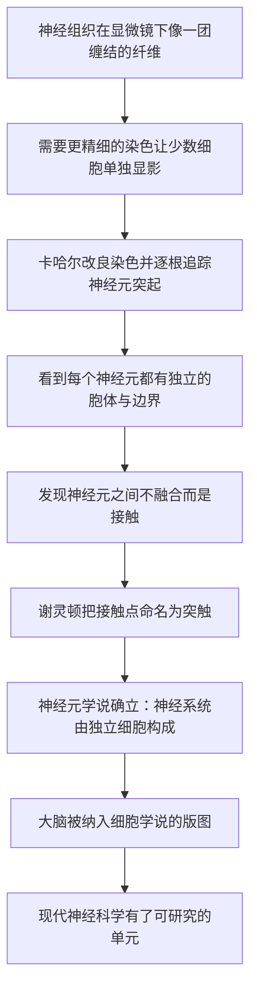

# 11｜大脑也是细胞构成的吗？——神经元学说

> 如果身体的其他部分都由细胞构成，那么思想、记忆与意识所在的大脑，是不是也一样？

---

## 一、先说结论

是的。生物学界普遍认为，神经系统和身体其他组织一样，是由一个个独立细胞构成的——这些细胞叫**神经元**。它们不是连成一片的整体，而是各自独立、又彼此相连，连接点叫**突触**。

西班牙科学家圣地亚哥·拉蒙·卡哈尔（Santiago Ramón y Cajal）大约在十九世纪末，用精湛的染色技术和绘画，第一次清楚地画出了神经元的独立轮廓，「神经元学说」由此确立。穆克吉在书中把这段历史当作一个重要转折：它意味着**大脑也被纳入了细胞学说的版图**——连思想和意识所在的器官，底层也是细胞。

---

## 二、我们先理解一个问题

在显微镜下看别的组织，细胞是比较好认的：肝里有肝细胞，皮肤里有上皮细胞，边界清清楚楚。

可大脑不一样。

把一块脑组织放在显微镜下，看到的往往是一团密密麻麻、缠在一起的纤维。十九世纪的解剖学家为它争论了很久：神经系统到底是一堆**各自独立的细胞**，还是一张**连成一片、没有缝的网**？

> **如果大脑是一整张连续的网，那「细胞学说」在神经系统里就失效了；如果它也是独立细胞组成的，那细胞学说就是真正普遍的。**

这个问题看起来只是解剖学上的细节，实际上决定了一件大事：我们能不能用「细胞」这把统一的钥匙，去打开大脑和意识的门。

---

## 三、作者到底提出了什么观点？

穆克吉站在卡哈尔这一边，认同**神经元学说**（neuron doctrine）。

这个学说可以概括成三句话：

- 神经系统由一个个**独立的细胞**——神经元——构成，每个神经元都有自己的胞体和边界；
- 神经元之间**并不融合成一片**，而是在特定的接触点相互连接、传递信号；
- 这个接触点，后来被生理学家查尔斯·谢灵顿（Charles Sherrington）命名为**突触**（synapse）。

在神经元学说出现之前，流行的是一种叫「网状学说」的观点，认为神经组织是一张连续贯通的网，信号像电流一样在整张网里流动。据记载，连发现神经组织可以用银盐染色的卡米洛·高尔基（Camillo Golgi），也倾向于这种「连成一片」的看法。

卡哈尔的贡献在于：他用改良的染色方法，让只有少数神经细胞被染色、彼此分离开，于是能在显微镜下一根根地追踪神经元的突起。他不仅看到了细胞，还把它们**画了下来**——那些图到今天仍然是神经科学的经典。**一般认为**，正是这种「看得见单个细胞」的证据，让神经元学说逐渐占了上风。1906 年，卡哈尔与高尔基共享了诺贝尔生理学或医学奖。

---

## 四、把这个观点翻译成人话

想象一块布料和一张渔网的区别。

「网状学说」想象的是**一块布**：无数纤维织在一起，你抽不出一根独立的线头，信号在这块布上连续地流过去。

「神经元学说」想象的是一张**渔网**：每个绳结是一个独立的单元，绳子把它们连起来，但每个结本身是分开的、有自己边界的。信号要从一个结传到下一个结，必须在连接处完成一次「交接」。

这个区别为什么重要？

因为如果大脑是「一块布」，那讨论「某个细胞出了什么问题」就没有意义；但如果大脑是「一张网」，我们就能像研究其他器官一样，去研究**一个个具体的神经元**——它们怎么生长、怎么连接、怎么老去、怎么死亡。

用一句更直白的话说：**神经元学说把大脑从「神秘的整体」，变成了「可以逐个研究的细胞集合」。**

---

## 五、为什么会这样？

把卡哈尔的逻辑整理成链条，是这样：

这条链里，**B 和 C 是关键的一环。**

科学史上常有这样的情形：结论本身早有人猜过，但缺少能让人「亲眼看见」的方法。神经元的独立性之所以长期争不清，不是因为大家不会想，而是因为**看不清**——组织太密，细胞边界糊成一团。卡哈尔的突破，一半是染色方法的改进，一半是他惊人的观察与绘画能力。

所以这一节真正的答案是：**不是先有理论再有证据，而是新工具让人第一次看清了本来就存在的事实。**

---

## 六、举一个现实生活中的例子

想想一张覆盖全国的电话网络，或者今天我们熟悉的互联网。

它由无数个节点组成——每一部电话、每一台服务器，都是独立的一台设备，有自己的地址和状态。可这些节点并不是孤立的，它们通过线路彼此连接。你打一通电话，信号要从你的手机出发，经过一站又一站的交换与转发，最后到达对方。

这里有两个关键点：

- **节点是独立的。** 每台设备有自己的身份，可以单独出故障、单独被替换。
- **连接是必需的。** 一台断网的电脑，本身还是完整的机器，却几乎什么也做不了。

神经元的关系，大致就是这样：每个神经元是一个独立的单元，但它的意义主要来自它和别的神经元的连接。据研究，一个神经元可以和成百上千个其他神经元形成连接，大脑里由此织出一张极其复杂的网络。

这也解释了神经元学说为什么那么重要：**只有先承认「一个个独立节点」的存在，我们才能开始研究「网络是怎么组织的」。**

---

## 七、回到书中重新理解

现在再回看穆克吉为什么要把卡哈尔写进这本书，就容易理解了。

前面几篇讲的是：细胞学说如何从植物、动物延伸到几乎所有生命；细胞如何分化、如何沟通。到了大脑这里，问题变成了一次「终极检验」——**如果连思想和意识所在的器官，都能被还原成细胞，那细胞学说的普遍性才算真正立住。**

穆克吉想说的，并不只是「神经也是细胞」这个解剖学结论。他更在意的是：**神经元学说把「研究大脑」变成了一件可以在细胞层面进行的事。** 此后的神经科学，无论研究学习、记忆还是疾病，走的都是这条路——先找到细胞，再看它们如何连接、如何传递信号。

可以说，卡哈尔给神经科学提供的不只是知识，而是一整套**工作方式**。

---

## 八、这个观点背后还有什么？

这里藏着一个更深的观念：**复杂的功能，未必需要复杂的「材料」。**

大脑做的事——感知、记忆、情绪、决策——看起来神秘得不像细胞能胜任。但神经元学说提醒我们：神秘的功能，可能来自**大量简单单元的复杂连接**。单个神经元并不聪明，它做的事情相对简单：接收信号，整合，再决定要不要往下传。

真正产生复杂性的，是连接的数量与方式。

这个思路后来影响极广：从神经网络的研究，到今天我们讨论的人工神经网络，背后都有类似的直觉——**不是每个单元有多复杂，而是它们如何连成网络。** 这并不意味着大脑等于计算机（这是一个需要谨慎对待的类比），但它确实说明：「用细胞解释大脑」这条路线，为什么能走得这么远。

---

## 九、这个观点有问题吗？

有几点需要留心，争议也正是在这里。

第一，**神经元学说并非一开始就被所有人接受。** 它与「网状学说」的争论持续了很多年，高尔基直到晚年仍持不同看法。据记载，两人在 1906 年同获诺贝尔奖时，立场其实并不一致。所以更准确的说法是：这是**一场逐渐分出胜负的学术争论**，而不是某一天被一举证明的定论。

第二，**「独立细胞」的图景后来也有补充与例外。** 神经元之间除了化学突触，还存在电突触等直接连接方式；有些神经元之间通过缝隙连接做快速、双向的沟通。这并不推翻神经元学说——细胞依然是独立的——但它提醒我们，细胞之间的「边界与连接」比最初的模型更丰富。

第三，**神经元学说回答了「大脑由什么构成」，却没有回答「意识从何而来」。** 知道大脑由一个个神经元组成，并不等于知道主观体验是怎么产生的。这个问题至今仍是科学和哲学上的难题。把这层结论当成「意识的谜底」，是一种拔高。

所以更稳妥的说法是：**神经元学说给大脑找到了正确的「基本单元」，但单元之上如何涌现出心智，仍是开放的问题。**

---

## 十、今天再看这个观点

（以下为现代延伸，非穆克吉原文）

在卡哈尔之后，「把大脑当作细胞网络来研究」这条路越走越远。

今天，研究者可以用各种手段标记、追踪、甚至人为激活或抑制单个神经元，观察它们和具体行为、记忆之间的关系。还有一个宏大的方向叫**连接组**——试图把神经系统里神经元之间的连接尽可能完整地测绘出来。它的思路，正是把卡哈尔那种「一根根追踪」的努力，放大到整个神经系统。

与医学的关系也很直接：许多神经退行性疾病，本质上都与特定神经元的损伤或死亡有关；理解神经元如何维持、如何连接、何时死亡，是寻找干预手段的前提。

但底层判断没有变，反而被反复印证：**大脑不是一团神秘的连续体，它是由亿万独立细胞以极其复杂的方式连接起来的器官。** 现代神经科学做的，是把这张网画得越来越清楚。

---

## 十一、这一篇真正应该记住什么？

1. **大脑也是细胞构成的。** 神经元学说证明神经系统由一个个独立细胞组成，细胞学说由此覆盖了大脑。

2. **关键在「独立」二字。** 神经元各有边界，不是连成一片；它们的意义来自相互连接，而不是融合。

3. **突触是细胞之间的「交接点」。** 谢灵顿为它命名，它让信号能从上一个细胞传给下一个细胞。

4. **新工具常常先于新认知。** 卡哈尔的胜利，一半靠染色与绘画技术——先看清，才可能想明白。

5. **它解决了「由什么构成」，没解决「意识从何而来」。** 单元找到了，但心智如何涌现仍是开放难题。

---

## 十二、留一个问题

到这里，我们已经把大脑也拉进了细胞的世界。

但这会引出一个新的疑问：

> **如果构成我们身体的细胞，在成年之后大部分都已经「定型」，那受损或耗尽的组织，还有机会被重新补充吗？**

传统观念一度认为，像神经、血液这样的细胞一旦成熟就不再更新。可如果身体里始终藏着一批「还没决定自己将来做什么」的细胞，那么「用细胞修复身体」就不只是幻想。

真有这样的细胞吗？它们最早又是在哪里被发现的？

下一篇，我们来看身体里的一批特殊细胞——**干细胞：身体里的「备用零件」是怎么被发现的？**
