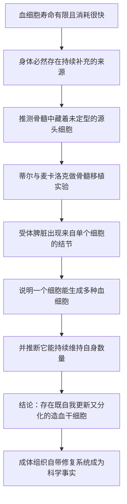

# 12｜干细胞：身体里的「备用零件」是怎么被发现的？

> 成年身体里，是否还存在能变成多种细胞的「万能细胞」？

---

## 一、先说结论

存在。生物学界普遍认为，成年身体的组织里，仍保留着一批特殊的细胞：它们既能**不断复制自己**，又能**变成多种不同类型的细胞**。这就是**干细胞**。

大约 1961 年，詹姆斯·蒂尔（James Till）与欧内斯特·麦卡洛克（Ernest McCulloch）在小鼠身上做实验，找到了最早的明确证据之一：骨髓里存在一类细胞，可以不断自我更新，并且能生成多种血细胞——**造血干细胞**。

穆克吉把这一发现看作一个分水岭：它证明「成体组织并非一潭死水」，身体自带一套修复系统。**「用细胞修复身体」从这一刻起，开始从想象走向可能。**

---

## 二、我们先理解一个问题

在干细胞被发现之前，人们对成体组织有一个相当朴素的印象。

成长时，细胞不断分裂、分化，把身体搭建起来；成年之后，大部分细胞就被认为「定型」了——皮肤细胞就是皮肤细胞，血细胞就是血细胞，不再回头。

这个印象有它的道理，也符合日常观察：成年之后，人不会再长出一条新手臂。

> **可是，如果成年身体里的细胞全都已经定型、不能再变，那每天大量消耗掉的血细胞，究竟是从哪里补充的？**

这是一个躲不开的问题。血液里的细胞寿命有限，更新又极快。如果没有任何「源头」，这套系统很快就会枯竭。一定有什么地方，在持续地生产它们。

问题于是变成：**身体里是不是藏着一种「还没决定自己将来做什么」的细胞？**

---

## 三、作者到底提出了什么观点？

穆克吉认同并强调的，是**干细胞的两大特征**：

- **自我更新**：它分裂产生的子细胞中，至少有一部分仍然是干细胞，从而让这个「库存」长期不被耗尽；
- **分化潜能**：它可以变成一种或多种更专门、更成熟的细胞。

同时具备这两点的细胞，才称得上干细胞。只满足其中一条是不够的——一个普通细胞分化一次就「用掉」了自己；而一个只会自我复制、却永远不变的细胞，也无法补充损耗。

据记载，大约 1961 年，蒂尔与麦卡洛克在实验中发现：把小鼠骨髓细胞移植到经过特殊处理的小鼠体内后，受体脾脏上会形成一些小结节，而这些结节来自单个细胞——也就是说，**一个细胞能够生成多种血细胞**。这一实验为「造血干细胞」的存在提供了关键证据，被**一般认为**是干细胞研究的开端。

重要的是：他们找到的不是胚胎里的细胞，而是**成体组织里的干细胞**。这一点尤其反直觉，也是穆克吉反复强调的地方。

---

## 四、把这个观点翻译成人话

想象一家工厂。

工厂里有各种专业工人：有人负责搬运，有人负责焊接，有人负责质检。他们都很熟练，但也都很「专一」——焊工不会突然去干质检。

现在设想，工厂里还保留着一小批特殊的**学徒工**。

这些学徒工有两个特点：

- 每一次培训后，其中一部分仍然是学徒，可以继续接受新培训（**自我更新**）；
- 一旦岗位缺人，他们就能被培养成搬运工、焊工或者质检员（**分化潜能**）。

这批学徒工，就是干细胞。因为他们的存在，工厂不必每次缺人都去外面重新招人，而是可以在内部不断补充。

关键区别在这里：**普通工人只能顶一个岗位；干细胞则是一批「随时可以改行、而且不会用完」的人。**

身体里的造血干细胞，大致就是这样的角色——它是所有血细胞的「总源头」。

---

## 五、为什么会这样？

把干细胞发现的逻辑整理成链条，是这样：

这条链里，**E 和 F 是关键的一环。**

这里用了一个很巧妙的推理：如果脾脏上的一个结节来自**一个细胞**，那么这一个细胞必然已经产生了多种不同的血细胞。既然一个细胞能「生出」这么多类型，它就不可能是已经定型的专门细胞，而只能是某种更原始的「源头」。这就是「分化潜能」的证据。

而「自我更新」的证据，则来自这样一个事实：即便反复移植，这样的细胞也不会耗尽——它们显然在持续地重建自己。

一句话概括：**一个既能变多种、又用不完的细胞，只能被称为「干细胞」。**

---

## 六、举一个现实生活中的例子

想想一支演出团队。

舞台上，大部分演员都演固定的角色，化妆、服装、台词都不一样。但后台始终留着一批「万能替补」：他们平时练习各种角色，随时能顶替任何一位缺席的演员。

替补的存在，让整个演出能长期稳定地演下去——今天演主角的演员病了，替补可以补上；明天管服装的人不够，还能再调配。

但如果换一种情况呢？

如果后台的替补全都「定型」了：每人只练一个角色，而且演一次就不能再演第二次。那么演出几场之后，人手就会逐渐耗尽，整台戏撑不下去。

造血干细胞在身体里的作用，正是那批「万能替补」。它不只是补一次、两次，而是**从你出生一直补到老**——这才是「自我更新」真正的分量。

这也解释了为什么它如此重要：**一个器官能不能长期自我维持，取决于它有没有这样的人。**

---

## 七、回到书中重新理解

现在再回看穆克吉为什么如此看重干细胞的发现，就明白了。

在此之前，「细胞」更多被理解为**已经定型的建筑材料**：心脏细胞是心脏细胞，神经细胞是神经细胞，各就各位。而干细胞的发现，打破了这层僵硬的图景——原来身体里还留着一批「没定型的细胞」，处于一种可以被引导、被使用的状态。

穆克吉认为，这一转变的意义有两层：

- 在**认识上**，它说明成年身体是一个持续更新的动态系统，而不是一个搭好就不再改变的成品；
- 在**医学上**，它提供了一个全新的思路：如果身体自带可以分化的源头细胞，那么我们或许不必只是「用药压制症状」，而是**去补充、去引导、去替换**。

这正是后面要讲的「细胞治疗」的前提。没有干细胞，所谓「用细胞修复身体」根本无从谈起。

---

## 八、这个观点背后还有什么？

这里藏着一个更值得琢磨的对比：**「分化」本来是单向的，干细胞却似乎保留了一条「回头路」。**

前面讲过，一个受精卵经过不断分化，变成几百种各司其职的细胞。常识告诉我们，这是一条越走越窄的路：越成熟，可能性越少。干细胞之所以特别，恰恰在于它没有把这条路走到底——它停在中间，保留着多种可能。

这带来两个深远的问题：

第一，**「命运」是不是真的不可逆？** 如果干细胞能保留多向分化的能力，那么一个已经分化的细胞，未来有没有可能被「拉回」到这种状态？这个问题，后来直接引出了克隆与诱导多能干细胞的故事。

第二，**身体的修复能力，为什么在有些组织里强、有些组织里弱？** 血液更新得很快，而神经系统、心脏的更新能力相对有限。理解干细胞在哪里、有多少、受什么控制，成了再生医学的核心课题。

---

## 九、这个观点有问题吗？

有几点需要留心。

第一，**「干细胞」这个概念，后来被用得越来越宽，也越来越容易被夸大。** 在科学上，它有着严格的定义（自我更新＋分化潜能）；但在商业宣传里，「干细胞」常常被用来包装各种没有充分验证的疗法。把一个严格的科学概念等同于「包治百病」，是一种典型的误用。穆克吉本人对这类炒作也保持着医生的警惕。

第二，**成体干细胞的分化能力，一般认为比胚胎干细胞要受限。** 造血干细胞主要生成血液系统的各种细胞，并不意味着它能随便变成神经或心肌。不同来源、不同类型的干细胞，能力边界并不相同。把它们混为一谈，是常见的误解。

第三，**早期实验的结论，是随着方法进步不断被修正的。** 蒂尔与麦卡洛克当年的实验，用今天更精细的手段去看，还可以进一步区分出更原始的细胞群。这说明科学发现往往是**逐步逼近**的，而不是一步到位。

所以更稳妥的说法是：**干细胞的存在被确立了下来，但「哪种干细胞能变成什么」这件事，至今仍在细化之中。**

---

## 十、今天再看这个观点

（以下为现代延伸，非穆克吉原文）

在蒂尔与麦卡洛克之后，干细胞研究扩展到了许多方向和多种组织。

今天，与干细胞相关的应用已经真实进入医学：比如**造血干细胞移植**用于重建血液与免疫系统，是临床上相对成熟的一类「细胞治疗」；再比如从患者自身细胞「重编程」得到的诱导多能干细胞，被用来研究疾病、筛选药物，甚至探索修复受损组织。研究者还在努力用干细胞在培养皿里培育出微型的组织与器官模型。

但同时，**「干细胞」也是被滥用的词之一**。面对各种打着干细胞旗号的疗法，科学界的共识是：需要严格的临床试验证据，而不是靠概念宣传。这一点，与穆克吉对「细胞医学」既抱有希望、又保持审慎的态度是一致的。

底层判断没有变：**身体里确实藏着一批能自我更新、又能分化的源头细胞。** 现代研究做的，是搞清楚它们能做什么、不能做什么，以及怎样安全地用起来。

---

## 十一、这一篇真正应该记住什么？

1. **干细胞有两个硬标准。** 能自我更新，又能分化成多种细胞；只满足一条都不算干细胞。

2. **它是在成体组织里被发现的。** 蒂尔与麦卡洛克大约 1961 年在小鼠骨髓中找到造血干细胞的证据，打破了「成年细胞全都定型」的印象。

3. **它意味着身体自带修复系统。** 血液之所以能长期更新，正是因为背后有这样一个「总源头」。

4. **它给医学打开了新思路。** 从「用药压制症状」到「补充和替换细胞」，干细胞是细胞治疗的前提。

5. **概念越有名，越容易被滥用。** 科学上的干细胞有严格定义，不等于宣传里的种种「干细胞疗法」。

---

## 十二、留一个问题

到这里我们知道：身体里确实存在能自我更新、能分化成多种血细胞的干细胞。

但这还只是一个「发现」。真正的考验是：

> **能不能把这种细胞，当成一种「药」输给病人？**

如果一个人的血液系统或免疫系统已经坏掉了，我们能不能用健康的造血干细胞去**重建它**，让整套系统重新运转起来？这在医学史上第一次做到时，又需要跨过哪些险关？

下一篇，我们来看人类第一次真正「把细胞当药」的尝试——**骨髓移植**。
