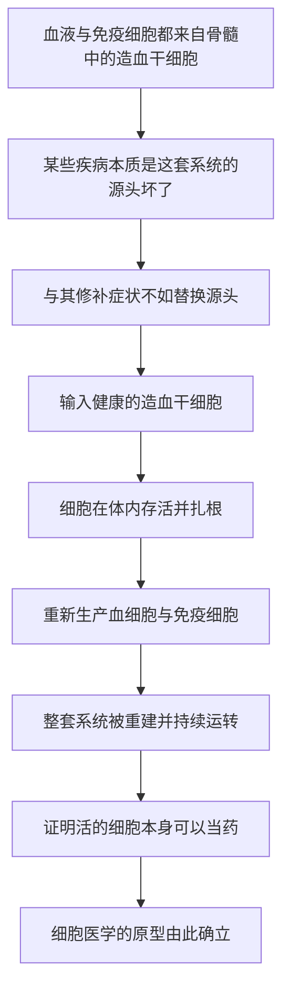

# 13｜骨髓移植：人类第一次把「细胞」当药

> 为什么骨髓移植被视为「细胞治疗」的开端？

---

## 一、先说结论

因为它是人类第一次证明：**活的细胞本身可以作为一种疗法**，去替换病人体内已经坏掉的系统。

在骨髓移植里，真正被移植的不是一片组织、一颗器官，而是**健康的造血干细胞**。它们进入病人体内后，能重新建立整套血液与免疫系统——也就是说，输入的细胞在病人体内**活了下来、并接管了工作**。

据记载，E. 唐纳尔·托马斯（E. Donnall Thomas）大约在二十世纪五十至七十年代推动这项技术用于治疗白血病与免疫缺陷，并因此在 1990 年获得诺贝尔生理学或医学奖（与约瑟夫·默里共享）。穆克吉把骨髓移植视为**细胞医学的原型**：它既证明了这条路走得通，也暴露了这条路上最棘手的风险。

---

## 二、我们先理解一个问题

在骨髓移植之前，「治疗重病」主要有两条路：**用药**和**手术**。

药是分子，进入身体后起作用，但会被代谢掉，需要反复服用；手术是切除或修补，处理的是结构，而不是功能。这两条路都很少能做到一件事——**让身体自己把坏掉的部分重新长好、重新运转。**

可是有些疾病的问题恰恰出在「系统」本身：

> **如果一个人制造血细胞的「源头」坏了，血细胞和免疫细胞都出了问题，我们能不能干脆换一套新的源头？**

这个想法很激进。因为它要移植的不是一个死的东西，而是**活的细胞**——它们必须在陌生的身体里存活、扎根、生长，还要恰好只做该做的事。

问题于是变成：**能不能找到这样一批细胞，并且让它们在病人体内长期接管工作？**

---

## 三、作者到底提出了什么观点？

穆克吉的核心判断是：**骨髓移植开创了「细胞作为药物」这一全新的治疗范式。**

他讲的逻辑大致是这样：

- 血液和免疫系统的细胞，都来自骨髓里的**造血干细胞**；
- 如果病人的这套系统坏了（比如某些白血病、严重的免疫缺陷），那治本的办法，不是只去压制症状，而是**替换源头**；
- 把健康的造血干细胞输给病人，它们可以在体内重新建立一个能造血的系统；
- 这意味着，用于治疗的东西本身是**活细胞**——它会在病人体内发挥作用，而不是被动地等着被代谢。

这也正是它与传统药物的根本区别：

| | 传统药物 | 细胞治疗（骨髓移植） |
|---|---|---|
| 治疗物 | 分子 | 活的细胞 |
| 在体内 | 被代谢、需要反复给药 | 可以存活、自我维持 |
| 作用方式 | 直接干预某个靶点 | 重建一整套功能系统 |
| 关键风险 | 毒性、耐受 | 排斥与免疫冲突 |

据记载，托马斯早期的尝试并不顺利。真正让这条路走通，需要同时解决好几个难题：**怎样取得合适的干细胞、怎样让它们在病人体内扎根、怎样避免它们反过来攻击病人。** 这些努力后来逐渐把骨髓移植从实验推向了临床。

---

## 四、把这个观点翻译成人话

想想一辆发动机已经报废的老车。

车壳、底盘、座椅都还好，就是发动机不行了。换零件没用，因为它坏的不是某个小部件，而是整个动力来源。比较彻底的办法是——**换一台能正常运转的发动机**，而且这台发动机要能自己启动、自己供油、自己维持运转。

骨髓移植就是这个思路，只不过换的不是机器，而是**造血系统**。

但有一个关键区别：发动机是死物，装上去能用就行；而造血干细胞是**活的**。把它们输进病人身体后，会发生三件事：

1. 它们得先在新的环境里**活下来**；
2. 然后**扎根**，开始生产各种血细胞和免疫细胞；
3. 最后还要**不出乱子**——既不能罢工，也不能反过来攻击宿主。

所以骨髓移植不像是「换发动机」，更像是**把一整套活的动力系统移植进去，还指望它自己长成、自己协调。** 这也是为什么它比换零件难得多。

---

## 五、为什么会这样？

把骨髓移植能成立的逻辑整理成链条，是这样：

这条链里，**E 是最关键的一环，也是最难的一环。**

要让输入的细胞存活扎根，往往需要先给病人做大剂量的放化疗，**清空原有的骨髓**，为新细胞腾出空间；同时还要让供者与受者的免疫系统「配得上」，否则两边会互相攻击。这些步骤彼此牵制：清除得不够，新细胞长不起来；清除得太狠，病人又承受不住。

更麻烦的是那条双向的免疫冲突：

- 病人的免疫系统可能排斥移植进来的细胞（**排斥反应**）；
- 移进来的免疫细胞也可能把病人的身体当成外来物来攻击（**移植物抗宿主病**）。

**一般认为**，正是这类免疫冲突，构成了骨髓移植最主要的风险之一。这也说明：细胞治疗的困难，往往不在「细胞本身」，而在**细胞与身体之间那套复杂的识别与相处**。

---

## 六、举一个现实生活中的例子

回到换发动机的比喻，但把它讲得更完整一点。

一台老发动机报废了，你弄来一台新的装上去。装好之后，它顺利启动，车又能跑了——这是最理想的结果。

但现实中还可能出状况。

一种情况是：新发动机和车子的其他系统**不兼容**。电路接不上，油路对不齐，装上去根本发动不了，甚至把别的部件也拖坏。

另一种情况更棘手：新发动机是「活」的，它有自己的一套逻辑。它不光驱动车子，还可能**自作主张**，去干扰车里其他部分——本来该它管的它管，不该它管的它也去动。这就是「移植物抗宿主病」那个方向的麻烦：移植进来的免疫细胞，把宿主的身体当成了要清除的对象。

这个例子想说明的是：**骨髓移植的价值和风险，来自同一件事——移植物是活的、会自我组织。** 正因为它能重建系统，它才可能反过来引发冲突；如果它只是死物，反而没有这么大的潜力，也没有这么大的麻烦。

---

## 七、回到书中重新理解

现在再回看穆克吉为什么把骨髓移植摆在如此关键的位置，就明白了。

它不是一个孤立的成功案例，而是整个「细胞医学」的**第一次完整演示**。在这之前，「用细胞治病」更像是一种设想；在这之后，它有了一个可以指认的历史事实：**活的细胞被输入人体，重建了一个系统，救回了病人。**

穆克吉想借它说明的，是医学重心的转移——从「用分子去干预」，走向「用活着的细胞去替换与重建」。这个转变的意义，不亚于当年从体液学说走向细胞病理学。

但同时，骨髓移植也把细胞医学的两面同时亮了出来：

- **它的力量**：能治本，能重建系统，而不是只压症状；
- **它的代价**：免疫冲突、并发症、需要大量配套条件。

**这正是「细胞当药」这件事的本来面目——潜力与风险同源。**

---

## 八、这个观点背后还有什么？

这里藏着一个更深的观念：**细胞疗法治疗的，其实是「系统」，而不只是「病灶」。**

传统意义上，我们习惯把疾病定位在某个地方——一个肿瘤、一段血管、一个器官。而骨髓移植处理的，是一个**分布全身的功能系统**：血液与免疫。它要修复的，是这个系统的「生产能力」，而不是某一块具体的组织。

这带来两个重要的延伸：

第一，**「什么是治疗的靶点」被重新定义了。** 靶点不必是一个分子或一个器官，它也可以是一整套细胞系统的源头。

第二，**「细胞与身体的关系」成了核心问题。** 输入的细胞能不能被身体接纳、会不会与身体冲突，决定了治疗的成败。这一点，后来所有的细胞疗法、器官移植，甚至免疫治疗，都要面对。

换句话说，骨髓移植真正开启的，是一种**以「活体系统」为对象**的医学思路。

---

## 九、这个观点有问题吗？

有几点需要留心。

第一，**骨髓移植的「成功」是逐步累积的，而不是某一次突然实现的。** 从早期几乎全部失败，到找到匹配、控制并发症、提高存活率，经历了很长一段摸索。把它简化成「某位科学家发明了骨髓移植」，会丢掉其中大量具体的困难与失败。据记载，托马斯本人早期的许多尝试都以失败告终。

第二，**它的适用性有限，并非万能。** 骨髓移植主要针对血液系统和免疫系统的疾病，不能直接治疗心脏、肝脏、神经等实体器官的病变。把它当作「细胞疗法无所不能」的证据，是过度推广。

第三，**移植物抗宿主病提醒我们：细胞疗法的风险有其特殊性。** 与药物的毒性不同，这种风险来自**活细胞之间的免疫对抗**，更难预测，也更难完全控制。所以「活体药物」这个说法虽然贴切，却也意味着监管和安全的难度更高。

第四，**供者短缺与匹配困难，是长期存在的现实约束。** 不是每个病人都能找到合适的供者。这一问题后来催生了别的技术路线，但那是后话。

所以更稳妥的说法是：**骨髓移植证明「细胞可以当药」，但它同时也证明，这条路要付的代价，和它的力量一样真实。**

---

## 十、今天再看这个观点

（以下为现代延伸，非穆克吉原文）

从骨髓移植出发，「用细胞治病」的思路被不断扩展。

今天，与骨髓移植同源的**造血干细胞移植**，仍是多种血液系统疾病的重要治疗手段。围绕它，研究者发展出了更精细的配型方法、更安全的预处理方案，以及降低免疫冲突的策略。

更重要的事，是它打开的那扇门：既然输入的细胞可以在体内执行功能，那么**能不能对细胞做改造，让它们更精准地去完成特定任务？** 后来的 CAR-T 疗法，就是从患者体内取出免疫细胞、给它们装上「识别癌细胞的导航装置」，再输回体内——本质上，仍是「把细胞当药」这一思路的延伸，只是加入了对细胞的设计与改造。

穆克吉把这条线索一路铺下去：骨髓移植是起点，往后是再生医学、细胞改造、基因编辑。而这条路走到最后，就必然要面对那个更难的问题——**当细胞可以被设计和改写，我们能走多远？**

---

## 十一、这一篇真正应该记住什么？

1. **骨髓移植是细胞医学的原型。** 它第一次证明，活的细胞本身可以作为一种疗法，去重建病人体内的系统。

2. **它移植的是「源头」，不只是「零件」。** 输进去的是造血干细胞，它们会在体内重新建立整套血液与免疫系统。

3. **力量与风险同源。** 正因为它移植的是活的、会自我组织的细胞，才既能重建系统，又可能引发免疫冲突。

4. **它把「治疗靶点」重新定义了。** 靶点可以是一整套细胞系统的源头，而不只是一个分子或一处器官。

5. **它的成功是长期累积的结果。** 从早期大量失败到逐步可控，靠的是配型、预处理与并发症管理等一连串进展。

---

## 十二、留一个问题

骨髓移植证明了一件事：**坏掉的血细胞系统，可以被健康的细胞替换。**

可是，血液系统之所以能被「替换」，是因为造血干细胞可以游离、可以输注、可以在身体里迁移扎根。那么——

> **像手臂、腿、心脏这样有固定形态的组织和器官，能不能也重新长出来？**

有些动物似乎天生就会这件事：据说蝾螈的肢体被切掉后还能再长一条，涡虫被切成几段也能各自长回完整的个体。为什么它们可以，而人类不行？我们离「让组织重新长出来」还有多远？

下一篇，我们来看再生医学——**我们能否像蝾螈一样重生肢体？**
