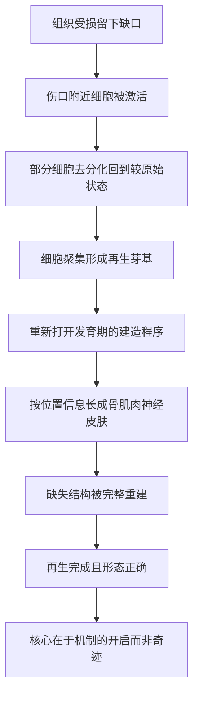

# 14｜再生医学：我们能否像蝾螈一样重生肢体？

> 为什么有些动物能再生器官，而人类不能？

---

## 一、先说结论

因为再生的能力，本质上是一套**细胞层面的机制**：受伤之后，身体能不能重新启动「生长与重建」的程序。

据研究，像墨西哥钝口螈（一种蝾螈）、斑马鱼，以及涡虫这样的动物，再生能力惊人——切掉的肢体、甚至被切成几段的身体，都能重新长出完整结构。一般认为，它们靠的是一批细胞**「去分化」**回到较原始的状态，聚成一个叫**再生芽基**的结构，再重新长成缺失的部分。

而人类的再生能力要有限得多（肝脏算是少有的例外，据研究有一定再生能力）。穆克吉关心的问题是：**如果这些机制原则上可以存在，我们能不能学会它，让受损的组织和器官重新长出来？** 这就是再生医学的核心目标。

---

## 二、我们先理解一个问题

「再生」这个想法，其实一点也不玄。

被剪掉的树枝会长出新芽，割过的草坪会重新变绿，壁虎据说能断开尾巴再长一条。生命似乎本来就带着某种「自我修复」的能力。

可轮到人身上，事情就变得很不对称：

- 皮肤破了能愈合，肝脏受损有相当程度的修复能力；
- 但手指断了不会重新长出手指，心脏受损后基本不会长回原本的心肌。

> **同样都是生命，为什么再生能力的差距如此之大？**

这个问题不只是好奇。它直接指向一个非常现实的期待：**如果人类也能调动这种能力，那些不可逆的损伤，是不是就有救？**

问题于是变成：**再生究竟在细胞层面发生了什么？为什么有些动物做得到，而我们做不到？**

---

## 三、作者到底提出了什么观点？

穆克吉的立场，是把再生**从「神奇现象」拉回到「细胞机制」**上来理解。

他认为，再生得以发生，关键在于几件事：

- **有可用的细胞来源**：组织里存在能够重新分裂、改变身份的细胞；
- **细胞能「去分化」**：已经比较专一的细胞，退回到更原始、更灵活的状态；
- **信号能重新被打开**：本该在发育完成后关闭的「建造程序」，被重新启动；
- **形成一个组织中心**：细胞聚集起来，先搭出一个类似「施工图纸」的雏形，再按顺序长成正确的结构。

据研究，蝾螈断肢再生时，伤口附近的细胞会去分化、聚集成**再生芽基**（blastema），芽基里的细胞再分别变成骨、肌肉、神经、皮肤等，把整条肢体重建出来。涡虫的再生能力更强，**一般认为**它与体内大量持续存在的干细胞有关。

于是，穆克吉式的判断可以概括为一句话：**再生不是「魔法」，而是把发育时期用过的程序，重新调用了一次。** 人类并非完全没有这套程序，只是它被限制得更严、打开得更少。

---

## 四、把这个观点翻译成人话

想象一座城市被台风损坏了一部分。

如果城市里保留着一支**万能的施工队**：他们既能临时改行去修路，也能去盖楼、接管网，而且手里还存着全套设计图纸——那台风过后，城市就能按原样一点点重建起来。

蝾螈的再生，大致就是这种情况：伤口附近的细胞愿意「改行」（去分化），聚成一个临时的施工指挥部（芽基），然后照着图纸把缺失的部分重新造出来。

人类的情况更像是一座**分工极其严格的成熟城市**：

- 大部分居民只干自己那一行，轻易不会改行；
- 设计图纸被锁进了保险柜，平时不再调用；
- 有些区域甚至被刻意设成「不许再施工」，以防乱长。

这套严格的分工，让成年身体保持稳定、不轻易失控；但也意味着，一旦大面积损坏，城市**很难按原样重建**。它能做的，往往是打补丁、留疤痕——也就是纤维化或瘢痕修复。

所以人类再生能力有限，不完全是「能力不够」，而是**在「修复」和「不乱长」之间，身体做了取舍**。

---

## 五、为什么会这样？

把再生机制整理成链条，是这样：

这条链里，**C 和 E 是关键的一环。**

「去分化」之所以关键，是因为成年细胞大多已经定型，定型意味着它只能干一件事。要重建一整条肢体，就必须先有一批**愿意改行、还能改行**的细胞。而「重新打开建造程序」之所以关键，是因为光有细胞还不够——还得知道**该从头长什么、按什么顺序长**，否则就会长成一团无用的组织，而不是一条完整的肢体。

这两个条件，恰好也是人类身上最难满足的地方：成熟细胞不太愿意回去，发育程序也不太容易被重新调用。于是，再生医学想做的，本质上就是**想办法把这两件事重新变成可能**。

---

## 六、举一个现实生活中的例子

看看一棵被修剪过的树。

园丁把一些枝条剪掉，过一段时间，剪口附近又冒出新芽，长成新的枝条，甚至整棵树看起来比之前更茂密。这是很多人熟悉的再生现象。

但要注意，树能做到这件事，靠的是**分生组织**——一类始终保留着分裂能力的细胞，分布在芽和根尖等地方。只要这些「生长点」还在，树就能不断长出新枝新叶。

而这恰恰说明了动物再生的特殊与困难：

- 树几乎处处留着「生长点」，随时可以继续长；
- 动物的组织则大多是**分化得很彻底的**，没有那么多现成的生长点；
- 更麻烦的是，动物的结构远比枝条复杂——一条腿里有骨、关节、肌肉、血管、神经，要按正确的空间关系一起重建，难度完全不是一个量级。

所以「树能重新长枝」这件事，给人的启发是有限的：**它说明再生依赖「可用的生长细胞」，但并不能说明动物也能轻松做到。** 动物再生不只要求细胞能长，还要求它们**长在对的位置、变成对的东西**。

---

## 七、回到书中重新理解

现在再回看穆克吉为什么把再生医学放在细胞医学这条线上，就明白了。

它并不是一个孤立的技术方向，而是前面几条线索的**自然延伸**：

- 讲干细胞时，我们知道身体里留着能自我更新、能分化的细胞；
- 讲骨髓移植时，我们知道输入活的细胞可以重建一个系统；
- 到了再生，问题升级为：**能不能不只是「补充」，而是让身体把缺掉的结构重新长出来？**

穆克吉想说的是，再生之所以诱人，是因为它触到了一个根本性的期待——**把「不可逆的损伤」变成「可以重新长好的伤」**。如果这件事成立，那么截肢、心梗后坏死的心肌、某些神经损伤，都可能被重新看待。

但与此同时，他也保持着医生式的审慎：再生不是把一个开关一按就完事，它涉及细胞状态、信号网络、空间组织，任何一环不对，都可能长不出东西、或者长出不该长的东西。

**希望的方向清楚了，但难点也同样清楚。**

---

## 八、这个观点背后还有什么？

这里藏着一个耐人寻味的对立：**再生与癌症，可能共用同一批「能力」。**

再生需要细胞去分化、重新分裂、大量增殖——而这些，恰恰也是癌细胞擅长的事。一个细胞如果能被随意「唤醒」去生长，那它离失控也许并不远。

换句话说，**身体限制再生，可能不只是因为做不到，而是因为不敢。** 频繁地重启生长程序，等于不断给失控留下机会。人类在演化中把再生能力收得比较紧，或许正是用「修复能力」换来了「较低的失控风险」。

这个张力的现实意义非常直接：任何试图增强再生能力的疗法，都必须同时回答一个问题——**怎样让它长够、又不让它长过头？** 这也解释了为什么再生医学的进展，往往伴随着对安全性的高度关注。

---

## 九、这个观点有问题吗？

有几点需要留心。

第一，**「像蝾螈一样重生肢体」目前仍主要是科学目标，而非已经实现的医学现实。** 据研究，研究者能在动物模型里观察到相当程度的再生，也在尝试理解其机制，但把它安全地搬到人身上，距离还很远。把它说成「即将实现」，是夸大的。

第二，**物种之间的差距，不能简单用「有机制 vs 没机制」来概括。** 更准确的看法是：不同动物、不同组织的再生能力，是**连续谱**上的不同位置。人类肝脏再生能力可观，说明我们并非完全没有这套能力；而中枢神经、心肌等组织则限制很大。笼统地说「人类不能再生」，并不准确。

第三，**创伤修复与再生是两回事。** 我们平时说的「愈合」，很多时候是**瘢痕修复**：把缺口用纤维组织补上，而不是长回原来的结构。看起来都叫「好了」，功能却可能差很远。把「伤口愈合」当成「再生」，是常见的混淆。

第四，**再生涉及的不只是细胞，还有位置与形态的「信息」。** 为什么长出来的是手而不是一团肉？这说明还存在一套决定「长成什么样」的机制。这部分目前仍在深入研究中，远未完全清楚。

所以更稳妥的说法是：**再生的细胞逻辑被揭示了一部分，但「如何让复杂结构正确地重新长出来」，仍是开放的难题。**

---

## 十、今天再看这个观点

（以下为现代延伸，非穆克吉原文）

在穆克吉写到的再生问题之后，这个领域仍在快速推进，也带来了更细的思考。

沿着「用细胞修复」的路线，研究者一方面继续研究蝾螈、斑马鱼等模式生物，试图找出控制再生的关键信号；另一方面，也在探索用干细胞、重编程技术去培育可移植的组织，甚至在培养皿里构建微型的组织模型，用来研究疾病与药物。

但近年更强调的一点是**审慎**：让细胞大量增殖、去分化，本身就带着失控的隐忧。因此，如何让再生「可控」，成了与「能不能再生」同等重要的问题。

底层判断没有变：**再生是一种可以被研究的细胞机制，而不是玄学。** 现代研究做的，是逐步弄清楚这套机制，并学会在安全的前提下调用它。

---

## 十一、这一篇真正应该记住什么？

1. **再生是一套细胞机制。** 它依赖可用的细胞、去分化、被重新打开的发育程序，以及一个组织中心。

2. **再生芽基是关键结构。** 蝾螈等动物靠伤口附近细胞聚集成的芽基，重新长出完整的缺失结构。

3. **人类的再生能力有限，但不是零。** 皮肤、肝脏等有一定修复能力；手指、心肌等则很难按原样再生。

4. **瘢痕修复不等于再生。** 很多「愈合」只是把缺口用纤维组织补上，并没有长回原来的结构。

5. **再生与癌症共用一批能力。** 因此真正的难点不只是「让它长」，还包括「让它长得刚好、不出乱子」。

---

## 十二、留一个问题

到目前为止，我们讨论的「用细胞治病」，大多发生在**已经出生的人身上**：替换坏掉的血细胞系统、试图让受损的组织重新长出来。

但还有一个更靠前的位置——**生命的起点本身**。

> **如果受精这件事，可以不在身体里发生，而是在体外的培养皿里完成，会发生什么？**

当卵子和精子在体外结合、胚胎在体外发育一小段、再被移植回母体，我们不只是治了一种病，而是第一次**直接介入了「生命的开始」**。这引出的问题，远比医学本身更深。

下一篇，我们来看体外受精与世界上第一个「试管婴儿」——**生命第一次在体外开始。**
