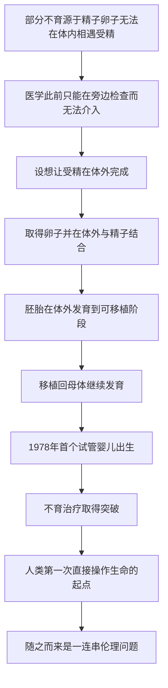

# 15｜试管婴儿：生命第一次在体外开始

> 当受精发生在培养皿里，我们对「生命起点」的理解发生了什么变化？

---

## 一、先说结论

体外受精（IVF）让卵子和精子在体外结合，形成胚胎，再移植回母体继续发育。

据记载，英国生理学家罗伯特·爱德华兹（Robert Edwards）与妇科医生帕特里克·斯特普托（Patrick Steptoe）推动了这项技术；1978 年，路易丝·布朗（Louise Brown）出生，成为世界上第一个「试管婴儿」。爱德华兹因此于 2010 年获得诺贝尔生理学或医学奖（斯特普托已于此前去世）。

穆克吉把这件事看得很重，因为它不只是不育治疗的突破，更意味着**人类第一次能够直接操作生命的起点**。技术一旦伸到这一步，后面就必然跟着一连串无法回避的伦理问题。**医学的手，第一次伸进了「人的由来」这件事本身。**

---

## 二、我们先理解一个问题

在体外受精出现之前，生命是怎么开始的，其实一直有一个默认答案：**在身体里，而且不受人干预。**

受精发生在输卵管里，是一个医生看不见、也无法插手的自然过程。不育的夫妇如果卡在这一步，医学能做的非常有限——它能检查原因，却很难在「受精」这个环节本身帮上忙。

> **如果问题恰好出在「相遇」这一刻——精子与卵子根本无法在体内顺利结合，那能不能让他们在别的地方相遇？**

这个想法在今天听起来不算惊人，在当时却越过了两条线：一条是**技术线**，要让受精和早期发育在体外也能完成；另一条是**观念线**，一旦把受精搬出身体，人就被迫要回答：**体外的那个胚胎，算什么？**

问题于是变成：**我们能不能让生命在体外开始，并且，我们是否应该这样做？**

---

## 三、作者到底提出了什么观点？

穆克吉的观点，可以分两层来理解。

**第一层是医学上的。** 体外受精把「受精」从一个无法介入的命运，变成了一个可以操作、可以观察、可以帮助的过程。据记载，爱德华兹与研究伙伴经过长期探索，解决了一系列具体难题：怎样在合适的时机取得成熟的卵子、怎样让它在体外与精子结合、怎样让胚胎在体外发育到可以移植的阶段，再妥当地放回母体。

**第二层是更深的一层。** 穆克吉认为，体外受精真正的分水岭不在于「治好了不育」，而在于**人类第一次能够在身体之外，掌控生命的开端**。一旦这道门被推开，后面的问题就不再纯粹是技术问题：

- 胚胎在体外，它有怎样的道德地位？
- 多出来的胚胎怎么处理？
- 谁有资格获得这项技术、它可不可以被买卖？

穆克吉的态度，不是简单的欢呼，也不是简单的反对，而是提醒：**这是一次能力的跃迁，能力越大，需要回答的问题就越重。**

---

## 四、把这个观点翻译成人话

想象一件原本**只能在家里完成**的工序，突然被搬到了车间里。

以前，这件事发生在私密的、看不见的空间，没人能插手，也谈不上「标准化」。现在，它被移到明亮的工作台上：可以被观察、被测量、被分成几个步骤，每一步都能调整。

好处很直接：原本卡在某个环节、再也做不下去的人，现在有可能绕过那个环节，把事情做成。

但麻烦也同时出现：

- 原本「在家里」发生的事，一旦进入车间，就难免要被**规则和流程**管起来；
- 工作台上会出现一些**「半成品」**——它们既不是最终产品，也不等于原材料，该怎么对待？
- 既然可以操作，就有人会问：**能不能不止「帮忙完成」，还要「按需要定制」？**

体外受精，就是把「生命的开始」从「家里」搬进了「车间」。它让不可能变成了可能，也让一群本来不需要回答的问题，第一次摆到了台面上。

**技术的每一步都合情合理，但合起来看，它改变的是「谁来决定生命如何开始」这件事。**

---

## 五、为什么会这样？

把体外受精的逻辑整理成链条，是这样：

这条链里，**I 是关键的一环。**

真正的转折不是「多了一种治疗方法」，而是**操作对象变了**。在此之前，医学治疗的是已经出生的人的身体；而体外受精处理的，是**受精与胚胎发育本身**。也就是说，医学的手伸到了「一个人成为人之前」的那段时间里。

这一步之所以重要，是因为它把原本属于「自然」「命运」「私密」的领域，变成了**可技术介入、可制度管理**的领域。从此以后，「生命的起点可以被人操作」不再是一种假想，而是一个已经发生的事实。后面所有关于生殖技术的争论，都建立在这个事实之上。

---

## 六、举一个现实生活中的例子

想想老照片的修复。

一张泛黄、破损、甚至缺失了一块的老照片，过去只能原样收着，缺掉的部分永远缺掉了。现在，有人可以用技术把它「补」回来：还原颜色、修补划痕、甚至把缺失的一角重建出来。

这让原本无法挽回的东西，重新变得完整——这是好的一面。

但也会引出新的问题：

- 补出来的那一部分，算不算「原照片」的一部分？
- 如果有人不是修补破损，而是把照片里根本不存在的人「加」进去，这还算修复吗？
- 修复到什么程度，是「还原」，超过哪条线，就变成了「伪造」？

体外受精的境遇很类似。它先解决的是「帮不上忙」的问题——让原本无法自然发生的受精得以完成，这本身是一件善事。但一旦有了这项能力，边界问题就随之而来：**哪些操作是为了「帮忙完成原本会发生的事」，哪些已经越界成「按设计制造」？**

这个例子想说的是：**技术的正当性，往往不在「能不能做」，而在「做到哪一步」。** 体外受精把这条本来模糊的线，第一次逼到了大家面前。

---

## 七、回到书中重新理解

现在再回看穆克吉为什么把体外受精写进《细胞传》，就明白了。

它看似是生殖医学的故事，其实是**细胞医学向「起点」延伸**的故事。前面几篇讲的是在已经成形的身体里替换细胞、修复组织；到了这里，干预的位置被推到了最早的一步——**受精卵**。

穆克吉想指出的，是这条线索的连续性：

- 既然我们能在体外让一个细胞开始分裂，那么在更晚的阶段，我们是否也能改变它的命运？
- 既然我们能操作受精，那么在受精之后、胚胎发育之中，我们是否也能介入？

这正是后面克隆与重编程故事的前奏。体外受精证明了「生命的早期阶段是可以被拿在手上操作的」；而下一步，自然会有人问：**那我们能不能重塑一个已经分化的细胞的命运？**

所以，这一篇不只是讲一项技术，更是在标注一个**新的起点**——从这一刻起，「生命可以被操作」成了医学无法撤回的前提。

---

## 八、这个观点背后还有什么？

这里藏着一个根本性的问题：**当生命可以被操作，「自然」与「人为」的界限就模糊了。**

在不育治疗的最初语境里，体外受精的目标很朴素：帮助一对夫妇拥有一个自己的孩子，去完成一件本来「自然」会发生、只是卡住了的事。在这个意义上，它更像「帮忙」。

但技术一旦存在，用途就不会只停在最初的目标上。它还可以用于筛选、用于研究、用于其他各种组合。于是问题从「帮谁完成」变成了：

- **谁来决定什么样的胚胎可以继续发育？**
- **操作生命的权限，应该掌握在谁手里？**
- **治疗的边界在哪里，从哪里开始就变成了「设计」？**

穆克吉并不给出简单答案，但他点出了关键：**技术能力不等于道德许可。** 能做，和该做，是两回事。这一条，在后面的基因编辑故事里会被推到极致。

---

## 九、这个观点有问题吗？

有几点需要留心，这也是争论真正发生的地方。

第一，**关于胚胎的道德地位，社会始终没有统一答案。** 有人认为早期胚胎已应受到保护，有人认为它在这一阶段还不具备相应的地位。这不是一个纯科学问题，而是价值问题。体外受精从诞生起就处在这场争论之中，多余的胚胎如何处置，至今在不同国家有不同规定。**关于这一问题仍存在争议。**

第二，**「试管婴儿」在早期的污名与恐惧，后来被证明大多缺乏根据。** 起初公众担心这样出生的孩子会有各种问题，而长期追踪研究总体上并未支持这些担忧。这段历史提醒我们：对新技术的恐慌，往往夹杂着想象，而非事实。

第三，**把体外受精简单等同于「设计婴儿」，是一种跨越式的误读。** 常规的体外受精主要是帮助受精与移植，并不涉及对后代的基因改造。真正涉及「设计」的，是后来的基因编辑等技术——把它们混为一谈，会让讨论失焦。

第四，**技术可及性并不平等。** 费用、地域、政策，都会影响谁能用上这项技术。它缓解了一部分人的困境，也可能在另一些地方制造新的差距。

所以更稳妥的说法是：**体外受精在医学上是一项真实的突破，但它同时打开了一个至今仍在争论的伦理空间。**

---

## 十、今天再看这个观点

（以下为现代延伸，非穆克吉原文）

从第一个试管婴儿算起，体外受精已经走过了几十年，并逐渐成为相对常规的辅助生殖手段。据记载，全球通过这类技术出生的人数不断增加。

它的后续发展，主要沿着两条线延伸：

一条是**技术线**：取卵、培养、移植等环节不断改进，成功率与安全性逐步提升；同时，胚胎的遗传学检测等技术也被用于特定情形，用于降低某些遗传病的风险。

另一条是**伦理与规则线**：围绕胚胎地位、胚胎处置、生殖技术商业化、以及后续基因编辑的边界，各国陆续形成了不同的法律与规范。2018 年引起广泛关注的基因编辑婴儿事件，就是在「生殖细胞可以被改动」这条更深的红线上，一次引起国际谴责的越界尝试。

穆克吉的提醒在今天依然成立：**当医学能够操作生命的起点，真正困难的部分就不再是「能不能做」，而是「由谁决定、做到哪里、为了什么」。**

---

## 十一、这一篇真正应该记住什么？

1. **体外受精让受精第一次发生在体外。** 卵子与精子在培养皿里结合，胚胎发育一小段后再移回母体。

2. **它是医学突破，但不只是医学事件。** 1978 年路易丝·布朗出生，标志着人类第一次直接操作生命的起点。

3. **爱德华兹与斯特普托是关键推动者。** 爱德华兹于 2010 年获诺贝尔奖，斯特普托在此前已去世。

4. **它把伦理问题一并打开了。** 胚胎的地位、多余胚胎的处置、技术的边界与公平，成了无法回避的问题。

5. **能做不等于该做。** 技术能力与道德许可是两回事，这是穆克吉一贯提醒的核心。

---

## 十二、留一个问题

体外受精证明了一件事：**生命的起点，可以被拿在手上操作。**

但它还没有回答另一个更彻底的问题：

> **既然我们能操作一个刚开始发育的胚胎，那能不能反过来——把一个已经成熟的、已经「定型」的细胞，重新变回生命的起点？**

如果被移植进卵子的，不是受精卵，而是一个成年个体身上已经分化了的细胞，它会怎样？它还能重新发育成一个完整的生命吗？如果答案是「能」，那么「一个细胞注定只能做什么」这条规则，就被彻底改写了。

下一篇，我们来看多莉羊与克隆——**一个已经分化的细胞，能否被「重置」回生命的起点？**
