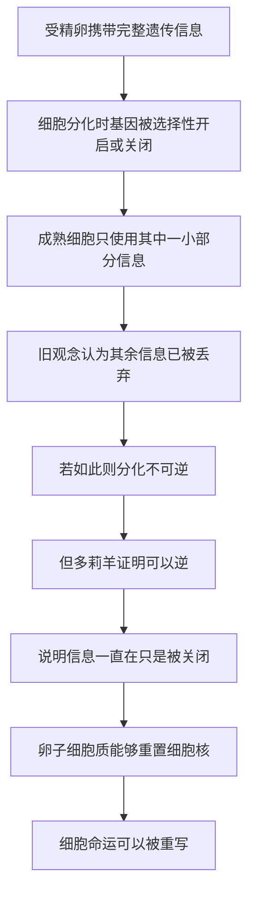

# 16｜克隆：多莉羊如何改写「细胞命运」？

> 一个已经「定型」的成熟细胞，还能不能回到生命的起点，重新长成一个完整的个体？

---

## 一、先说结论

先说结论：多莉羊的诞生，证明了**细胞的分化并非不可逆**。

按过去的常识，一个细胞一旦分化成皮肤、肌肉或乳腺细胞，就「认命」了——它只能做这一件事，再也不可能变回能发育成整只动物的状态。可据记载，1996 年诞生的多莉羊打破了这个常识：研究者把一只成年羊的体细胞核，放进一个去掉细胞核的卵子里，竟让它重新发育成了一只完整的羊。

穆克吉由此指出，细胞里那份「说明书」其实一直完整存在，只是被「锁」了起来。既然能重新打开，那么「命运」这两个字，就需要改写。

---

## 二、我们先理解一个问题

我们身体里有几百种细胞：神经细胞传信号，肌肉细胞会收缩，红细胞运送氧气。它们长得不同、干的事不同，却都来自同一个受精卵。

这就引出一个很深的困惑：**既然它们携带的遗传信息几乎一样，为什么会长成完全不同的样子？**

过去人们倾向于一个直观答案：细胞在分化的过程中，把用不上的那部分信息**丢掉了**。就像一个人只留下自己专业那几本书，把其余的烧掉——所以它再也不可能变成别的。

如果这个答案是对的，那么一个成熟细胞就永远回不去了。问题也就变成：

> **一个已经「当上」某种专职角色的细胞，还有没有可能被「免职」，重新变成当初那个什么都能做的细胞？**

多莉羊，就是冲着这个问题去的。

---

## 三、作者到底提出了什么观点？

穆克吉在书中指出，克隆实验的真正价值，不在于「复制了一只羊」，而在于它**改写了我们对细胞分化的理解**。

他讲的核心观点大致是这样：

- 成熟细胞的分化状态，并不是不可逆的终点；
- 卵子的细胞质里，似乎藏着某种能够「重置」细胞核的力量；
- 一个来自成体的细胞核，在被放进这样的环境后，可以重新获得发育成完整个体的能力。

这里必须说清楚三件事分别是谁说的：

**第一，这是实验结果。** 据记载，多莉羊由英国罗斯林研究所的伊恩·威尔穆特、基思·坎贝尔等人在 1996 年完成，采用的技术叫**体细胞核移植**。它是第一只由成年体细胞克隆出的哺乳动物。这是事实层面的记录。

**第二，这是穆克吉的解读。** 穆克吉认为，这项实验的意义远超「克隆」本身，它证明了细胞的「命运」可以被重写。这是他给出的判断。

**第三，这是生物学界的共识方向。** 生物学界普遍认为，多莉的诞生说明分化的细胞核仍保有完整的遗传潜力——信息没有丢，只是暂时被关掉了。

---

## 四、把这个观点翻译成人话

你可以把「一个细胞的分化」理解成一份文件被「另存为定稿」。

想象你打开一份模板文件，填入具体内容，保存成「合同终稿.docx」。从打上「终稿」这两个字开始，它就再也不能变成简历、变成报价单了——它的用途被固定下来了。

过去的人认为，细胞也是这样：一旦分化，就被「另存为定稿」，失去了通用性。

克隆实验做的，是把这个「终稿」里的**内容和格式**，整个搬进一个全新的、空白的模板环境里。奇怪的事发生了：在这个新环境里，它居然又变回了「模板」——可以重新被启用、重新填成任何一种文件。

换句话说，**文件的原稿一直都在，只是「定稿」这两个字被擦掉了。**

穆克吉想强调的正是这一点：细胞的「身份」不是刻死在信息里的，而是**由信息被如何读取决定的**。

---

## 五、为什么会这样？

把这条逻辑整理成链条，是这样的：

这条链里，**F 那一环是转折点。**

关键推理是这样的：如果分化真的把信息丢掉了，那么一个乳腺细胞里就不可能还留着「长出一整只羊」所需的全部指令。可多莉确实长出来了，而且还生育了后代。这就反推出：**指令从来没有消失，只是被「关掉」了。**

那么卵子里到底有什么，能把「关掉」的开关重新打开？这一点，据记载在当时并没有被完全讲清楚。穆克吉的叙述更偏向指出它的意义，而不是提供分子层面的完整机制。这也正是为什么，这个发现会把整个领域推向后面更大的问题——**我们能不能不需要卵子，也做到同样的「重置」？**

---

## 六、举一个现实生活中的例子

用办公软件里的「另存为模板」来类比，会更直观一些。

假设你所在的小组用同一套资料反复出方案。每次都是从 template 出发，填上不同项目的信息，最后另存成一份具体的「项目方案.pdf」。这就是一次分化的过程：从一个通用模板，变成一个专职的具体文件。

过去大家以为，一旦另存成了具体文件，通用模板就没了。后来发现一个办法：把这份具体文件整个「拷」进一个干净的环境，它居然又变回了模板，能再次被填成完全不同的方案。

克隆实验在细胞层面做的，就是这件事。

**重要的不是「复制」这个动作，而是它揭示了一个反直觉的事实：看起来已经定型的角色，并没有失去变成别的东西的可能。**

---

## 七、回到书中重新理解

现在回看穆克吉为什么要在讲完试管婴儿、生殖技术之后，紧接着讲克隆，就说得通了。

试管婴儿证明的是：**生命的起点可以在体外被操作。** 它打开了一扇门，但操作对象还是受精卵——一个本来就「什么都能做」的起点。

克隆往前走了一大步：它操作的对象不再是起点，而是一个**已经走远、已经定型**的细胞。它证明的是，连「走远的人」都能被叫回起点。

这两件事连在一起，才构成了穆克吉真正想铺的路：**如果细胞的命运可以被重置，那么细胞就不再只是身体里被安排好的零件，而是一种可以被重新编程的东西。**

穆克吉在书里把这条线一直拉到了后面的诱导多能干细胞——那是一个把「重置」做得更干净、更不依赖卵子的版本。克隆是这条路上的第一块里程碑。

---

## 八、这个观点背后还有什么？

这个观点背后，藏着一个更深的判断：**「身份」不等于「信息」。**

我们习惯把人或细胞的身份理解成一种本质——你就是你，改不了。但克隆实验提示，身份更像是一种**状态的维持**：同样的信息，在不同的环境、不同的开关组合下，可以表现为完全不同的角色。

这个想法一旦成立，影响就不止于羊。

它意味着，身体的「零件」原则上是可以被重新指定用途的；也意味着，所谓「不可逆」，有时候只是我们还没有找到逆转的条件。穆克吉由此把细胞理解成一种**可以被改写的活的语言**，而不只是一堆固定的结构。

当然，这里有一个必须保留的界限：信息「一直在」不等于「随便怎么改都行」。可以重置，不代表可以无代价地重置。这一点，后面讲重编程和基因编辑时会越来越突出。

---

## 九、这个观点有问题吗？

有几处需要留心。

**第一，「分化可逆」在多大程度上普遍成立，是有条件的。** 多莉羊是一项成功，但据记载，当时的克隆效率很低，许多胚胎在发育过程中失败，成功的个体也出现过健康问题。所以「可逆」更像是**在特定条件下可以发生**，而不是「随时都能轻松做到」。把一次成功夸大成一条通则，是不准确的。

**第二，围绕克隆的伦理争议从来不只是技术问题。** 克隆一只羊是一回事，克隆人完全是另一回事。关于生殖性克隆人类，国际科学界普遍持反对态度，这正是争议的核心所在——争议不在于「能不能」，而在于「该不该」。穆克吉本人在书中也把克隆放在伦理光谱中考量，而不是当成纯粹的技术胜利。

**第三，功劳归属与细节在科学史上本身也有讨论。** 关于这项研究的具体贡献与团队角色，学界和公众有过不同的说法。这不是要否定成果，而是提醒我们：科学史里的「谁发现了什么」，往往比故事版本更复杂。

所以更稳妥的说法是：**多莉证明了细胞命运不是铁板一块，但它同时也把「可逆」和「可操作」之间的巨大距离，摊在了所有人面前。**

---

## 十、今天再看这个观点

（以下为现代延伸，非穆克吉原文）

从克隆出发，后来真正改变医学的，并不是「复制动物」这条路，而是它引出的那个问题：**能不能不依赖卵子，就把成熟细胞变回「万能」状态？**

据记载，在克隆羊之后，有研究者在其他哺乳动物上也实现了体细胞核移植。但克隆效率低、伦理争议大，使它难以成为主流医疗手段。真正把「重置」这条线推向普及的，是后面讲到的诱导多能干细胞技术——它用几个关键因子替代了卵子的角色。

今天回看，多莉更像一个「证明概念可行」的起点，而不是终点。它真正留下来的遗产，是一个被打开的问题：**如果细胞的身份可以被重写，那么医学能重写的边界在哪里？**

而这个问题的下一站，就是：能不能不用卵子、不用克隆，直接把一个成熟细胞「恢复出厂设置」？

---

## 十一、这一篇真正应该记住什么？

1. **分化不是不可逆的终点。** 多莉羊证明，成熟细胞的细胞核仍保有发育成完整个体的潜力。

2. **信息没有丢，只是被关掉了。** 同一个基因组在不同开关组合下，可以表现为完全不同的细胞角色。

3. **卵子细胞质有「重置」能力。** 是它把已经定型的细胞核，重新拉回了起点状态。

4. **研究价值不在复制，而在改写认知。** 克隆真正的意义，是让「细胞命运可以被重写」成为可讨论的问题。

5. **技术与伦理必须分开谈。** 可逆是一回事，该不该做是另一回事；克隆人的争议正落在这条红线上。

---

## 十二、留一个问题

多莉羊告诉我们，细胞可以被「放回起点」。

可它用到了一个几乎无法回避的条件：**卵子**。卵子的来源有限，而且涉及一整套伦理问题。如果重编程必须依赖卵子，那「返老还童」这件事，就永远被卡在伦理的门槛上。

于是就有了一个更激进的问题：

> **如果不用胚胎、不用卵子，能不能只靠几个简单的因子，就把一个成熟细胞直接变回「万能细胞」？**

下一篇，我们来看一个真正把这句话变成现实的人——**山中伸弥与诱导多能干细胞**。
