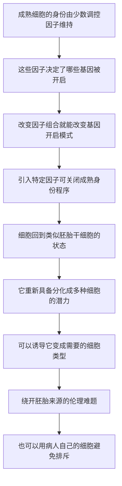

# 17｜返老还童：如何把成熟细胞变回干细胞？

> 如果不依赖胚胎、不依赖卵子，一个普通细胞还能不能自己「回到从前」？

---

## 一、先说结论

先说结论：**能。**

山中伸弥发现，只要向一个成熟细胞里引入少数几个关键因子，就能把它「重编程」回一种类似胚胎干细胞的状态——这就是**诱导多能干细胞（iPSC）**。它重新拥有了分化成多种细胞的潜力，可以长成神经、心肌、皮肤等不同组织。

这项发现为什么重要？因为它绕开了一个长期卡住再生医学的死结：**胚胎干细胞**的来源涉及胚胎，伦理争议极大。iPSC 用的却是病人自己的普通细胞——既避开了伦理问题，也让细胞治疗有可能做到「用你自己的细胞，治你自己的病」。

穆克吉把它视为细胞医学的一个转折点。

---

## 二、我们先理解一个问题

上一篇讲克隆，我们留下了一个难题：**重编程需要卵子。**

多莉羊的成功，靠的是把一个成熟细胞核放进卵子的细胞质里，被卵子里的某种力量「重置」。可卵子不好拿，而且一旦涉及人类卵子与胚胎，伦理争议立刻扑面而来。

于是问题变得非常具体：

> **有没有可能，不用卵子，不靠胚胎，只用一些化学或生物学的手段，就把一个成熟细胞「劝回」它当初什么都能做的状态？**

这不是一个纯技术问题。它问的是：**「回到从前」这件事，到底是由什么东西控制的？** 如果我们能找到那个控制开关，重置细胞就不再需要稀有原料。

---

## 三、作者到底提出了什么观点？

穆克吉在书中指出：细胞的身份，是**由少数关键调控因子维持的**；改变这些因子，就能改变细胞的命运。

这里必须分清三层：

**第一，这是实验发现。** 据记载，约 2006 年，山中伸弥和他的团队用少数几个转录因子（常被概括为四种因子），把成体细胞重编程成了诱导多能干细胞。这是事实层面的记录。

**第二，这是穆克吉的解读。** 穆克吉认为，iPSC 代表了一种全新的可能：细胞不必被「锁死」在它被分配的角色里，而可以被重新指派。他还强调，这项技术把再生医学从「依赖他人或胚胎的细胞」，推向了「用病人自己的细胞」。

**第三，这是诺贝尔奖所确认的学界评价。** 山中伸弥于 2012 年获诺贝尔生理学或医学奖，与他共享这一奖项的约翰·格登，早年用核移植实验证明「分化可以是可逆的」。这被普遍认为是生物学界对「细胞命运可被重写」这一方向的正式确认。

值得注意的是：穆克吉讲的不是某一项实验的技术细节，而是一个观念的转向——**成熟细胞的身份，是「可维护的」，因而也是「可改变的」。**

---

## 四、把这个观点翻译成人话

这里有一个特别贴切的类比：**给一台已经装好系统和一堆软件的电脑，恢复出厂设置。**

想象你有一台用了好几年的电脑：装满了办公软件、设计工具、各种个人配置，开机就自动打开一堆东西。按老观念，这台电脑「就是一台干活的机器」，它的用途已经固定了。

恢复出厂设置做的事情，是把这些配置**清空**，让它回到刚出厂、什么都还没装的那一天。于是它又变成了一台什么都能装的机器——你可以把它配置成一台剪辑工作站，也可以配置成一台服务器。

iPSC 做的事，本质上就是这个：**不是换掉电脑的硬盘，而是重置它的「启动配置」。**

关键的洞察在于：**硬盘里的信息从头到尾都在，变的是「开机时先加载什么」。** 转录因子，就是那几个决定「开机先加载什么」的开关。

所以「返老还童」这个说法，严格讲并不准确——它并不是让细胞变年轻，而是**让细胞重新变得「不预设用途」**。这就是「多能性」的意思。

---

## 五、为什么会这样？

把这条逻辑整理成链条：

这条链里，**A 是最关键的前提。**

它回答了一个长期困扰生物学的问题：几百种细胞，凭什么差别这么大？答案是——它们的信息基本相同，差别在于**哪些基因被打开**。而决定开与关的，正是那些调控因子。

一旦承认「身份由开关维持」，那么「改变开关就能改变身份」就成了自然推论。山中伸弥做的事情，正是找到了足够少、又足够关键的那几个开关。

这也解释了为什么这项技术如此有分量：**它把「重编程」从一种依赖稀有材料（卵子）的技巧，变成了一种可以被标准化的操作。**

---

## 六、举一个现实生活中的例子

继续用那台电脑。

假设公司有一批旧笔记本，性能其实还好，只是配置成了客服专用机——开机自动进客服系统，连文件夹都锁死了。过去大家觉得这批机器只能干这个。

后来 IT 部门发现一个办法：不改硬件，只重装系统，清掉那些预设配置。这批量产机立刻又能被配置成各种用途，哪里缺人补哪里。

这里有几个要点值得注意：

- **硬件没换，信息没丢**，变的只是「默认加载什么」；
- 重置后的机器**还没有具体用途**，它需要下一步的诱导才能变成某种专用机；
- 重置本身是**有代价的**，重装系统会丢配置、耗时，还可能出问题。

iPSC 的状态，正像重置之后、还没配置用途的那台机器。它不是终点，而是一个**新的起点**——真正的价值在于，从这里出发，你可以把它引导成你想要的细胞类型。

---

## 七、回到书中重新理解

现在回看穆克吉为什么把 iPSC 放在这条技术线的关键位置，就清楚了。

克隆证明了「可逆」，但用错了工具——它依赖卵子，因而被卡在伦理与可及性上。iPSC 证明了同一件事，却换了一套工具：**只用几个因子。**

这个替换带来的变化是决定性的：

| 维度 | 克隆（核移植） | 诱导多能干细胞 |
|---|---|---|
| 是否需要卵子 | 需要 | 不需要 |
| 是否需要胚胎 | 涉及伦理争议 | 不涉及 |
| 细胞来源 | 需供体卵子 | 可用病人自身细胞 |
| 免疫排斥风险 | 视方案而定 | 自体细胞可规避 |
| 可及性 | 受限 | 相对高 |

穆克吉想表达的是：**真正的突破，往往不是「能做」，而是「能安全、方便、大规模地做」。** iPSC 把重编程从稀有走向普通，这才让再生医学第一次有了工程化的可能。

---

## 八、这个观点背后还有什么？

这个观点背后，是一个关于「身份」的哲学判断。

如果细胞的角色不是刻在骨子里的本质，而只是**一组被维持的开关状态**，那么「你是什么」就不再是一道单选题，而更像一道可以重选的选择题。这对医学是巨大的解放，对「人」这个概念却是一种冲击。

它还隐含一个前提：**「回到从前」和「变成别的」是同一件事的两面。** 能回到多能状态，意味着也能被引导成任何方向。技术上的自由度，天然带着被误用的风险。

再往深一层看，iPSC 也提醒我们：**细胞的可塑性不等于无限可塑。** 重置得越彻底，失控的风险也可能越大——因为「什么都还没决定」的状态，离开「不该决定的事」只有一步之遥。这一点在后面讲癌症时会重新出现。

---

## 九、这个观点有问题吗？

有几处需要留心。

**第一，安全性仍是长期议题。** 据研究，重编程过程可能带来基因组不稳定、以及形成肿瘤（畸胎瘤）的风险。也就是说，一个「什么都能长」的细胞，万一在错误的地方开始乱长，本身就是危险。所以「能用」和「安全到可用于病人」之间，还有很长的路。

**第二，efficiency（效率）问题曾长期存在。** 早期把普通细胞变成 iPSC 的成功率并不高，这也限制了它立刻大规模应用。后来的研究一直在改进方法，但「简单高效」更像是一个持续追求的目标，而不是一开始就达成的状态。

**第三，伦理争议并没有完全消失，只是移位了。** iPSC 绕开了胚胎来源的问题，却带来了新的问题：如果可以用皮肤细胞造出精子、卵子甚至胚胎样结构，那么界限又该划在哪里？争议并没有消失，只是换了位置。

所以更稳妥的说法是：**iPSC 解决了一个具体的伦理与技术死结，但它同时也打开了新的、尚未有共识的问题。**

---

## 十、今天再看这个观点

（以下为现代延伸，非穆克吉原文）

iPSC 提出后，它最大的影响未必是直接治病，而是**改变了研究的材料来源**。

过去研究人类疾病，要么依赖动物模型（与人有差异），要么依赖难以获得的病人组织。有了 iPSC，研究者可以从病人的普通细胞出发，造出带有这个病人遗传背景的细胞，用来观察疾病如何发生、药物是否有效。这被称为「疾病模型」和「药物筛选」上的一个实用转变。

在再生医学方向上，据研究，基于 iPSC 的细胞治疗一直在推进，目标包括视网膜、心肌、神经等方向。同时，直接「在体内重编程」的思路也在探索中——如果不需要把细胞取出、改造、再输回，而是就地重置，医学的操作方式又会不同。

与此同时，关于「人造配子」「胚胎样结构」的伦理讨论，也随着技术能力一起升温。技术跑在前面，规则在后面追，这几乎是细胞医学的常态。

---

## 十一、这一篇真正应该记住什么？

1. **成熟细胞可以被「重编程」回多能状态。** 引入少数关键因子，就能让细胞重新获得分化潜力。

2. **关键在开关，不在信息。** 细胞身份由哪些基因被开启决定；改变开关，就能改变身份。

3. **它绕开了胚胎干细胞的伦理死结。** 细胞可以来自病人自身，既避免伦理争议，也可能规避免疫排斥。

4. **「返老还童」严格说是「重获可塑性」。** 重置后的细胞还没有用途，需要下一步诱导才能变成目标细胞。

5. **自由度带来新风险。** 什么都能长的细胞，也可能长成不该长的东西；安全性与伦理边界仍在讨论中。

---

## 十二、留一个问题

到这里，我们已经能让细胞「回到起点」，也能把它「引导成」想要的类型。

那么下一步的野心就变得很自然：**如果我能拿到病人的免疫细胞，在体外给它做一次改造，让它专门认出并追杀癌细胞，再输回病人体内——那会怎样？**

这不再是「修复零件」，而是把细胞直接变成一种会自己行动的**药**。

下一篇，我们来看把这件事做成现实的技术——**CAR-T，与「活体药物」的诞生**。
