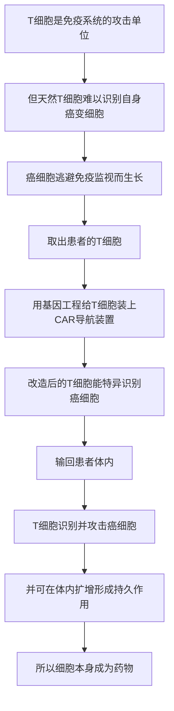

# 18｜CAR-T：把免疫细胞改造成「活体药物」

> 能不能把病人自己的免疫细胞，改造成专门追杀癌细胞的武器？

---

## 一、先说结论

先说结论：CAR-T 让「细胞即药物」第一次从概念变成了现实。

它的做法并不复杂：从患者体内取出 T 细胞（免疫系统里负责攻击的细胞），用基因工程给它们装上一个能识别癌细胞的「导航装置」——这个装置叫**嵌合抗原受体（CAR）**，然后把改造好的细胞输回病人体内。

结果是，一部分血液癌症获得了前所未有的缓解。穆克吉把这件事看得很重：**药不再是一颗分子，而是一群会自己增殖、自己巡逻、自己记住目标的活细胞。** 这标志着医学从「用药治身体」，真正迈向了「用细胞治身体」。

---

## 二、我们先理解一个问题

要理解 CAR-T，得先理解一个矛盾。

免疫系统本来就有能力杀死癌细胞——它每天在体内巡逻，清除异常的细胞。可癌症之所以还能长起来，往往是因为癌细胞会「伪装」或「压制」免疫反应，让 T 细胞认不出它，或者认出了却提不起劲。

于是问题来了：

> **既然身体里本来就有能杀癌的士兵，为什么不多给它们装上「瞄准镜」，让它们只认癌细胞、追着它打？**

这个问题的困难之处在于：T 细胞天生认的是「外来入侵者」的标记，而癌细胞是自己人。要让它去杀自己人，就必须**改造它的识别系统**。而这是基因工程才能做到的事。

---

## 三、作者到底提出了什么观点？

穆克吉的核心观点是：**细胞可以成为药，而且是比分子药更「活」的药。**

这里必须分清三层：

**第一，这是临床发现。** CAR-T 即「嵌合抗原受体 T 细胞」技术。据记载，卡尔·琼（Carl June）等人推动了它的临床突破，大约在 2011 年前后报道了令人瞩目的病例；2017 年，美国 FDA 批准了首个 CAR-T 疗法，用于儿童急性淋巴细胞白血病。这些是事实层面的记录。

**第二，这是穆克吉的解读。** 穆克吉认为，CAR-T 是「细胞医学」最有说服力的样本之一：它把细胞从「被治疗的对象」变成了「治疗的工具」。他还强调，这类疗法的逻辑与化学药完全不同——它不是一个固定剂量、按代谢衰减的分子，而是一支**会扩增、会存活、会持续作战的活体部队**。

**第三，这是生物学界普遍认同的判断。** 学界普遍认为，CAR-T 证明了「工程化免疫细胞」这条路是可行的，并且它在某些血液肿瘤上取得了传统疗法难以达到的效果。

穆克吉没有说 CAR-T 是万能药。他真正的论点是：**它改变的不是某一种病的治法，而是我们理解「什么叫药物」的方式。**

---

## 四、把这个观点翻译成人话

把它想成一支安保队伍。

普通的化学药，像给大楼装一台固定的监控设备：它挂在那里，浓度会随时间下降，过一阵就得补充。它不会自己移动，也不会自己增加数量。

CAR-T 更像一支**经过专门训练、带着人脸识别和导航的安保小队**：

- 从楼里现有的保安中抽调一批人（取出患者自己的 T 细胞）；
- 给他们做一次专门的训练，装上能认出某个特定目标的设备和追踪导航（基因工程导入 CAR）；
- 再把他们放回大楼（输回患者体内）；
- 之后他们会**自己巡逻、自己识别目标、自己追捕，甚至自己扩编**。

这里最反直觉的一点是：**药本身是有生命的。** 它不需要每天按时服用，因为它会在体内自己待着、自己工作、自己增殖。这也是为什么穆克吉用「活体药物」（living drug）这个词来形容它。

---

## 五、为什么会这样？

把逻辑整理成链条：

这条链里，**E 是决定性的环节。**

它把「识别」这件事**外包**给了工程设计的受体。天然的 T 细胞受体认的是复杂的人体组织相容性标记，而 CAR 可以直接认癌细胞表面某个特定分子——这样就不再依赖免疫系统原本那套复杂、容易被绕过的识别机制。

**H 和 I 一起，构成了「活体药物」的独特性。** 一次输入，细胞继续工作；它们能扩增，也可能长期留存。这与「给药—代谢—再给药」的循环完全不同。穆克吉由此指出：**我们面对的已经不是一个化学问题，而是一个生态问题——你把一支新的物种放进了身体这个生态系统里。**

---

## 六、举一个现实生活中的例子

再往细里看一层安保小队的类比。

假设一栋大楼里屡屡发生某类盗窃，常规安保认不出这些窃贼——因为他们看上去和普通员工没区别。于是安保主管想了个办法：

从现有保安里挑一批人，送去做专项训练，给他们配上能识别特定面孔的设备和实时导航。训练完成后，这些人回到大楼，只盯这一批目标，其他一概不管。

效果可能非常显著：目标被精准清除。

但麻烦也随之而来：

- 如果那个「特定面孔」不只是窃贼有，**某个正常员工也有**，误伤就会发生；
- 训练强度太高，保安可能**过度激活**，把整层楼都搅乱；
- 如果这栋楼和另一栋楼结构相似，**换一栋楼就得重新训练**。

CAR-T 在现实中遇到的正是这几类问题——所以才说它是「强大的工具」，而不是「通用的解药」。

---

## 七、回到书中重新理解

现在回看穆克吉为什么把 CAR-T 当作全书的标志性案例，就明白了。

前面几篇讲的细胞治疗，本质上都是**替换**：用健康的干细胞替换坏掉的系统。骨髓移植是这样，再生医学也是这个方向。它们补的是「零件」。

CAR-T 不一样。它做的不是替换，而是**改造**：把一个本来就在体内的细胞，重新设计成一种新的武器。这是从「用细胞补身体」，走向「用细胞改造身体」的关键一步。

穆克吉在书中反复强调的，是这件事代表的方向性：**一旦细胞可以被工程化，医学的想象力就被彻底打开了。** 今天改的是识别癌细胞的受体，明天可以改的是别的功能——而这正是后面讲基因编辑时，伦理问题会急剧升温的原因。

---

## 八、这个观点背后还有什么？

这个观点背后，是一个范式级别的变化：**药物从「死的」变成「活的」。**

- 化学药是死的：固定的分子结构，按浓度和作用时间工作；
- 细胞药是活的：会扩增、会移动、会适应、会持久存在，甚至可能「记住」目标。

这个变化带来的连锁反应很多：

**监管上**，药物的定义被打乱了。传统药物可以测纯度、测半衰期，一支活细胞却不能只靠这些指标衡量。**个体化**也成为必然——每个病人的细胞药其实都是「定制」的。

**成本上**，活体药物的制备流程复杂、周期长，这直接影响到可及性：技术能救人，但能不能让需要的人用上，是另一个问题。

更深一层，它还改变了人与药物的关系：**你输入的东西，在你体内是一个会变化的系统，而不是一个被动的工具。** 这意味着效果和风险都不完全可控——而这，是「活体」这个词真正的分量所在。

---

## 九、这个观点有问题吗？

有几处需要留心。

**第一，它对实体瘤的效果与血液癌差别很大。** 据研究，CAR-T 在某些血液肿瘤上表现出色，但在实体瘤上进展困难得多。原因是实体瘤内部的微环境更复杂，会主动抑制免疫细胞。所以「CAR-T 治愈癌症」是一个过度简化的说法，穆克吉本人也没有这样讲。

**第二，副作用可能非常严重。** 被激活的免疫细胞会大量释放细胞因子，可能引发「细胞因子风暴」；它们也可能攻击带有同类标记的正常细胞。这些都是临床上需要严密处理的真实风险。「精准」并不等于「无误」。

**第三，成本和可及性是一个现实争议。** 这种个体化、流程复杂的疗法价格高昂，且需要专门的中心才能实施。于是「技术已经可行」和「病人能公平地用上」之间，存在明显落差。这正是穆克吉在讲细胞医学时反复提醒的问题：**能力与可及性不是同一个问题。**

所以更稳妥的说法是：**CAR-T 证明了「细胞即药物」这条路成立，但它证明的是一个方向，而不是一个终局。**

---

## 十、今天再看这个观点

（以下为现代延伸，非穆克吉原文）

从 CAR-T 出发，一个明显的趋势是「活得更大范围地工业化和标准化」。

据研究，一方面，研究者一直在尝试把 CAR-T 推向实体瘤、以及更早期的治疗线；另一方面，通用型（异体）CAR 细胞的思路也在探索——如果能用现成的细胞而非每位患者定制，成本和等待时间都可能下降，但免疫排斥也随之而来。

与此同时，CAR-T 的思想已经外溢到其他领域：比如用类似的工程思路改造免疫细胞去应对自身免疫病、感染性疾病等。这背后的共同逻辑是：**把「细胞」当作一个可编程的平台，而不再只是一个被动的零件。**

如果说 CAR-T 是第一把「活体药物」的钥匙，那么真正让改写变得随取随用的，是下一件工具——**能精确修改基因的分子剪刀**。

---

## 十一、这一篇真正应该记住什么？

1. **CAR-T 的本质是「改造识别系统」。** 给 T 细胞装上 CAR，让它能特异认出并攻击癌细胞。

2. **它是「活体药物」。** 与化学药不同，它会在体内扩增、巡逻、持续工作，甚至长期留存。

3. **它在血液癌症上取得突破。** 据记载，其临床病例推动了 2017 年首个 CAR-T 疗法获批。

4. **它的局限同样真实。** 实体瘤效果有限、副作用可能严重、成本与可及性仍是难题。

5. **它的意义在于方向。** 细胞第一次从「治疗对象」变成了「治疗工具」，医学范式由此改变。

---

## 十二、留一个问题

CAR-T 是「改造细胞的能力」。它已经很强了，但它的改造方式仍然是在细胞外面加装一个装置——就像给士兵配一件新装备。

可如果连细胞里那份最底层的**说明书**都能被直接改写呢？

如果致病的根源是一个具体的基因错误，我们能不能像改文档一样，精确地找到那一处、替换掉那一处？

下一篇，我们来看把这件事变成可能的工具——**CRISPR，与「改写生命说明书」的分子剪刀**。
