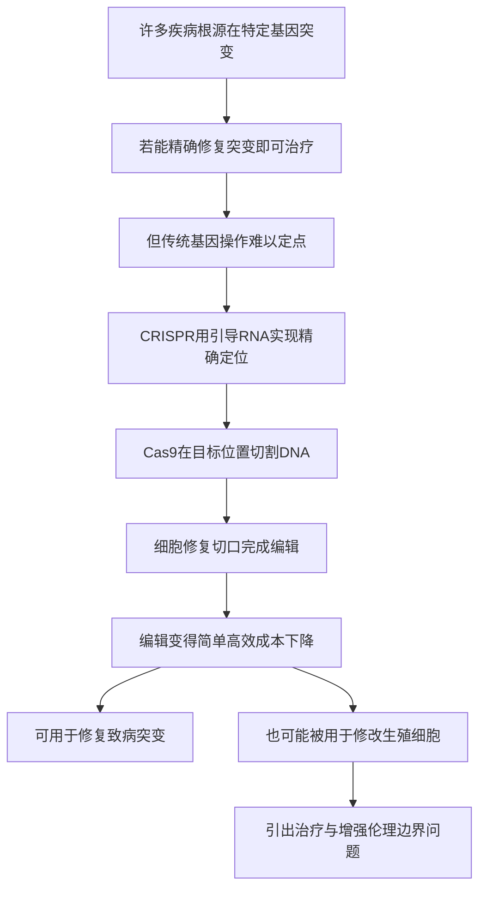

# 19｜CRISPR：改写生命说明书的分子剪刀

> 如果基因是一份说明书，我们能不能精确地找到错误的那一行，并把它改掉？

---

## 一、先说结论

先说结论：CRISPR 让「定点修改基因」从一件极难、极贵、极慢的事，变成了一件可以相对简单高效完成的事。

它的工作方式，可以粗略理解为**在一个极长的文本里做「查找并替换」**。据记载，詹妮弗·杜德纳与埃玛纽埃勒·沙尔庞捷在约 2012 年证明，CRISPR-Cas9 可以被用来精确编辑基因，两人因此获得 2020 年诺贝尔化学奖。

这一工具带来了两条截然不同的路：一条是修复致病的突变——已有基于基因编辑的血液病疗法获批；另一条是修改生殖细胞、去「设计」后代。穆克吉真正想追问的正是后者：**技术越强大，人类越必须回答，哪些修改可以做，哪些绝对不行。**

---

## 二、我们先理解一个问题

先说清楚一件容易被混淆的事：改一个细胞的基因，和改一个人的基因，完全不是一回事。

我们身体里绝大多数细胞是**体细胞**——改它们，影响的是这个人自己，不会传给下一代。而**生殖细胞**（精子、卵子，以及早期的胚胎细胞）一旦被修改，改动就会沿着血脉传下去，影响的是还没出生、也无法同意的人。

于是真正棘手的问题不是「能不能改」，而是：

> **当修改可以精确到单个字母的时候，我们凭什么标准决定——哪一处错误该修，哪一处「不同」该留，哪一处「不同」又会被当成「缺陷」而被抹掉？**

这就是穆克吉在书里反复回到的伦理核心：**能力问题，可以被技术解决；边界问题，只能被人类自己回答。**

---

## 三、作者到底提出了什么观点？

穆克吉的观点可以概括成一句：**CRISPR 把「改写生命」从理论推到了日常操作，因此它逼出了医学史上最严肃的伦理问题。**

这里必须分清三层：

**第一，这是科学发现。** 据记载，杜德纳与沙尔庞捷在约 2012 年证明 CRISPR-Cas9 可用于精确基因编辑，2020 年获诺贝尔化学奖。CRISPR 系统原本是细菌用来抵御病毒的免疫机制，被研究者改造成了通用的基因编辑工具。这是事实层面的记录。

**第二，这是穆克吉的判断。** 穆克吉认为，这项技术不仅是一种新疗法，更是一次权力的转移：**改写生命的能力，第一次从少数专业实验室，扩散到更多研究者手中。** 门槛降低，既是好事，也是风险。

**第三，这是生物学界与伦理学界共同的关切。** 关于「治疗」与「增强」的界限、关于是否应该修改生殖细胞，**学界存在明显分歧**。这不是一个已有定论的问题，而是一个仍在争论、且争论非常激烈的领域。

穆克吉没有简单站队说「该」或「不该」。他做的是把问题的两面同时摊开：**它能救命，也可能被滥用；而这两件事用的是同一套工具。** 这正是他所说的「细胞医学」必须面对的部分。

---

## 四、把这个观点翻译成人话

把基因想成一份很长很长的说明书，长到几乎没有人在意错别字。

过去修改基因，像是在这本厚厚的册子里找一个错字，却没有目录、没有页码，只能靠运气翻——大多数时候改不准，也容易改错地方。

CRISPR 带来的变化是：**你可以直接搜索「关键词」，系统带你定位到那一行，然后在那里做替换。**

- 你给它一段「地址」（一段引导 RNA），它去匹配；
- 匹配上了，剪刀（Cas9）就在那里切一刀；
- 细胞自己修复这个切口，从而完成「替换」。

这就是为什么它被称为「分子剪刀」。它的强大，在于**定位精确、操作通用、成本大幅下降**。

但这里藏着那个致命的类比：**在一份几十亿字的说明书里做查找替换，如果没有改对，或者改到了相似的别处，后果不是错别字，而可能是一整段功能的失效。** 这就是所谓的「脱靶」。

---

## 五、为什么会这样？

把逻辑整理成链条：

这条链里，**D 是关键突破。**

CRISPR 的定位靠的是碱基配对——一段引导序列和 DNA 上对应的序列互相匹配。这让「找位置」这件事不再依赖昂贵的定制蛋白，而变成可以设计的通用操作。门槛一降，能做的事就多了。

而 **I 是真正引发争议的那一环。** 前面每一步都在说「能力」，只有到这一步，问题从「能不能」变成了「该不该」。穆克吉的写法正是把这条岔路标出来：**同一个技术，走向治疗是救赎，走向设计后代则是另一种性质。**

---

## 六、举一个现实生活中的例子

用「查找替换」来理解 CRISPR，是最贴切的。

假设你在修一份几千页的规范文件，里面有一处关键参数写错了。用查找替换：

1. 输入要找的内容；
2. 系统定位到那一处；
3. 替换成正确内容；
4. 全文保存。

CRISPR 的流程几乎一模一样，只不过文本是 DNA，替换的是碱基。

但这个类比也暴露了它最危险的地方：

- 如果文件里有**多处相似**的内容，替换可能改错地方（脱靶）；
- 如果替换的**只有一个字符**，肉眼几乎看不出，却可能改变整段的意思（点突变）；
- 如果改的是**母版**（生殖细胞），那么之后从这个母版复制出去的每一份文件，都会带着这个改动，且无法撤回。

最后一条尤其关键：**改动越根本，可逆性越低。** 修一份复印件，错了可以重印；改一份母版，错了就是永久的。

---

## 七、回到书中重新理解

现在回看穆克吉为什么把 CRISPR 放在讨论伦理的前一站，就明白了。

前面讲的 CAR-T，改造的是体细胞，而且是病人自己的细胞——影响范围限于本人，且大多是可监控、可讨论的临床行为。

CRISPR 把两件事同时推进了：

- **精度**：修改可以细到单个碱基；
- **范围**：修改的对象既可以是体细胞，也可以是生殖细胞。

穆克吉想强调的是这个组合带来的质变：**当「精确」和「可遗传」叠加在一起，医学第一次拥有了改变人类基因库的可能性。** 这不是某一种病的治疗问题，而是一个关于「人类要不要自己决定自己的演化」的问题。

他讲技术史，最终是为了讲这个价值问题。这也是《细胞传》与其前作《癌症传》的差别所在——前者问的是「怎么治」，后者开始问「要不要改」。

---

## 八、这个观点背后还有什么？

这个观点背后，有一个被低估的事实：**强大技术的门槛降低，本身就是一个伦理事件。**

在 CRISPR 之前，想做基因编辑非常困难，这本身就构成一道天然的护栏——不是靠规定，而是靠能力限制。CRISPR 把这道理所当然的护栏拆掉了。于是保护不再来自「做不到」，只能来自「约定不做」。

这引出一个更深的问题：**当技术上「能」和「不能」的界限消失后，靠什么维持「该」与「不该」？**

还有一个隐含前提值得注意：治疗和增强的界线，听起来清楚，实际上模糊。一个降低疾病风险的修改，同时可能也提升了某项能力；一个为了「正常」的修改，可能同时抹掉了一种多样性。**界限之所以难划，不是因为没有标准，而是因为标准本身会移动。**

---

## 九、这个观点有问题吗？

有几处需要留心。

**第一，脱靶风险是真实且仍在被研究的。** 有研究显示，编辑可能发生在非目标位置，带来意想不到的后果。随着技术迭代，这类风险在被持续改进，但「绝对安全」这一说法并不成立。说 CRISPR「像修文档一样精准」是一种简化，真实的生物系统要复杂得多。

**第二，争议不止在技术，而在价值判断。** 关于是否应当修改生殖细胞，学界存在明显分歧：支持者强调可预防严重遗传病，反对者强调不可逆、不可同意、以及通往「设计婴儿」的滑坡。这里没有「技术专家说了算」的答案，因为**技术本身回答不了价值问题**。把争议描述成「保守派 vs 科学派」，是对双方立场的双重简化。

**第三，成果归属和伦理事件都提醒我们：科学的现实比故事复杂。** 关于 CRISPR 的发现权，围绕专利与优先权有过长期争论；而生殖细胞编辑被实际用于人类的事件（如基因编辑婴儿事件）也表明，规则一旦被越过，后果会落在真实的、无法同意的孩子身上。穆克吉在书中正是把这些当作警示，而非猎奇。

所以更稳妥的说法是：**CRISPR 给我们的是能力，没有顺便给出使用说明书；那份说明书，只能由社会自己写。**

---

## 十、今天再看这个观点

（以下为现代延伸，非穆克吉原文）

CRISPR 之后，基因编辑沿着两条线继续发展。

第一条是**应用线**。据研究，基于基因编辑的疗法已经在一些血液病上获得批准，从「实验室工具」变成了「临床选择」。同时，编辑的精度也在提升——研究者发展出了不切断双链、直接改写单个碱基的方式，试图降低出错概率。

第二条是**治理线**。围绕生殖细胞编辑，国际上形成了相当广泛的共识：在安全性与伦理问题未解决前，不应将其用于人类生殖。但共识不等于全球统一的法律，各国监管差异明显，这正是风险所在。

还有一个趋势值得注意：随着工具越来越便宜、越来越易得，**「谁能改」这个问题正在从科学问题变成治理问题。** 技术民主化带来创新，也带来监管难题。这与互联网、AI 经历过的路径，其实非常相似。

---

## 十一、这一篇真正应该记住什么？

1. **CRISPR 是「查找替换」式的基因定点编辑。** 它用引导序列定位、用 Cas9 切割，让改基因变得简单高效。

2. **它有两条相反的路。** 修复致病突变可以救人；修改生殖细胞则可能滑向「设计后代」。

3. **体细胞与生殖细胞的区别是关键。** 改前者影响本人，改后者会传给后代，且无法征得同意。

4. **脱靶风险真实存在。** 「精确」是方向而非保证，生物系统的复杂远超文档类比。

5. **技术给能力，不给边界。** 治疗与增强的分界、生殖细胞编辑是否可行，仍是未完的争论。

---

## 十二、留一个问题

到目前为止，我们讲的都是「单个细胞」层面的事：改一个基因、做一次编辑、改造一批免疫细胞。

可是人体组织是由无数细胞**有组织**地构成的。如果我们想在实验室里真正研究一种病、测试一种药，靠单个细胞是远远不够的——我们需要的是**有结构、有分工的组织本身**。

于是问题来了：

> **能不能让细胞自己「组织起来」，在培养皿里长出一个微型的器官？**

下一篇，我们来看一个有点科幻、却已经在实验室里发生的事——**类器官：在培养皿里「长」出迷你器官**。
